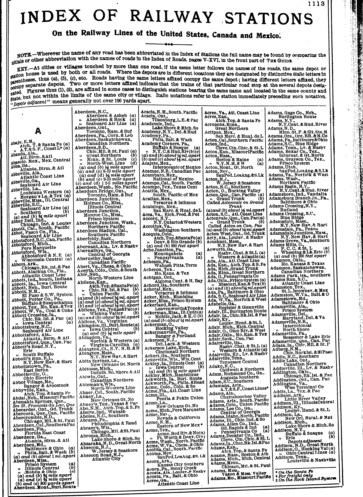

```{r setup, include=FALSE}
require(knitr)
require(magrittr)
knitr::opts_chunk$set(echo = TRUE)
```

<style type="text/css">
  .reveal h2,h3,h4,h5,h6 {
    text-align: left;
  }
  .reveal p {
    text-align: left;
  }
  .reveal ul {
    display: block;
  }
  .reveal ol {
    display: block;
  }
</style>

## Using Digital Archives in Political Science

## Outline

1. Accessing archives

2. Using archives

3. "Validating" archival data

4. Acquiring Skills

## Themes

1. What are common problems that arise? (And solutions)

2. What are tools that are valuable?

    - familiarity with a programming language
    - automating tasks

3. Trade-off between "breadth" and "depth" in use of archives

# Examples

---

### Example 1:

**["Judge Lynch" in the Court of Public Opinion: Publicity and the De-legitimation of Lynching](https://www.cambridge.org/core/journals/american-political-science-review/article/judge-lynch-in-the-court-of-public-opinion-publicity-and-the-delegitimation-of-lynching/738A37CE759089D9FD15C2B57E21F13E)**

- Why did discourse about lynching change and how did it happen?
- Transformations in publicity $\xrightarrow{}$ criticism
- Design: uneven expansion of transportation/communication networks
- How do we measure lynching coverage/discourse across space and time?

>- **Digital archives of historical newspapers**

---

### Example 2:

**"Let our ballots secure what our bullets have won:" Union Veterans and Voting for Radical Reconstruction and Black Suffrage.**


- Post-Civil War Reconstruction as second "revolution"
- Radical Republicans but racially conservative electorate
- How do Radicals win large (super-)majorities they need?

>- **Wartime experiences turned Union Army veterans into Republicans, supporters of civil rights**

---

### Example 2:

**Identifying effects of wartime experience: **

- Design 1: Effect of enlistment rates on voting for Republicans, Civil Rights (Difference in Difference)
- Design 2: Effect of individual war-time experiences on post-war partisanship (Natural Experiment)
- How do we obtain enlistment rates? Individual war experiences and partisanship?

>- Digital archives of soldiers compiled for genealogy; 
>- digitized full count censuses; 
>- books on archive.org

# A few notes

--- 

### "Big Data"

A popular phrase

- what is "big" for political science?
- often not even close to what is "big" for computer science
- methods/tools easily applicable to data "big" and "small"

The key is finding a way to make use of large archives/text corpora that are too large to read


---

### Automation

Skills needed for "big" data help in other areas of research:

1. Make a project **feasible** by access to necessary data
2. Make a project **feasible** by reducing time/cost of data collection
3. **Multiply** the return on your labor (work smarter, not harder)

Even with limited financial support, PhD/MA students can produce more high-quality, unique research. (my experience)


# Accessing Archives

## Research Questions lead to a search for data ...

## Historical newspaper content

> How and why did public discourse about lynching change over time?

>- Need a way of measuring discourse:
>- Full text of historical newspapers.

## Historical newspaper content

[Article on Sam Hose](https://www.newspapers.com/newspage/26956751/){target="_blank"}

## Historical newspaper content

But there are nearly [1 million hits](https://www.newspapers.com/search/#dr_year=1880-1920&query=lynching&oquery=lynching+1880+to+1920){target="_blank"} for "lynching" from 1880 to 1920.

There are 600 million newspaper pages on this site alone.

How can we access all of this text?

## Voting for Black Suffrage

How did white Northerners come to support black suffrage after the US Civil War?

>- Look at military service and voting for black suffrage in state referenda, like those held in Minnesota.

## Voting for Black Suffrage

Historians have collected data on county votes for and against black suffrage.

But how do we get county-level estimates of military service?

[This random dude's website.](http://www.dalbydata.com/user.php?action=civwarsearch){target="_blank"}

There are lots of results (more than 20 thousand men); we could copy and paste...?

## Civil War and Partisanship

What are the effects of wartime experience during the American Civil War on post-war political beliefs?

>- We need individual data on partisanship in the 19th century... Good luck finding that!!!


---

**People's Guides** from 1874 Indiana


## Civil War and Partisanship

There are 70,000+ names across a few thousand pages.

How do we access this data? Hire undergrads or data entry workers?

## Accessing data

What do these examples have in common?

- Data that is useful is available in digital format (online databases, online search tools, scans of text/tables)
- It is impossible/prohibitively expensive to collect this data manually
- Data can be obtained (relatively) easily using a programming language to automate the process.

## Options for access:

1. "Scraping" 
2. Ask for permission 
3. Digitize it yourself

Discuss each in turn, then talk about lessons

## Scraping

"Scraping" refers to using some programming tools to **automate** the process of 

- accessing some website/service that is hosted on the internet (wide variety of possibilities)
- extracting the data we desire
- and processing that data to make it useful

Lots of online resources, but for a primer I've made [see here](http://mdweaver.github.io/ubc_scraping)


## Scraping: Process

1. Find that data/tool you want
2. Figure out how to use programming language to access that data.
3. Use programming to structure the data for your needs
4. Scale up: automate the rest of the data collection

---

### Ways of Scraping

Usually, I scrape in one of three ways:

1. API: a request that directly interacts with some database or tool and returns data in a friendly format (usually JSON). (59%)
    - E.g. pass image to Google Cloud Vision; Geolocating.
2. HTML: a request for an HTML page that contains some data. Data is unfriendly to use, because it is in markup language for visual display (40%)
3. Webdriver: Websites wanting to protect proprietary data have more layers of protection. May need to code a "robot" using a browser. (1%) 

---

### Scraping: Examples

**Download online database**:  [American Civil War Database](http://www.civilwardata.com/) 

- relational database of soldiers, units, battles, etc.
- With subscription, entire database is easily browsable online

--- 

### Scraping: Examples

**Download online database**: full count 1860 US Census (Fold3)

- Subscription geneaology site. 
- Access to census **images** is behind a paywall.
- But page metadata (including all personal data transcribed) is exposed behind the scenes
- Data is hidden in background requests (explain)


---

### Scraping: Examples

**Searching a database**: Historical Newspaper Archives for lynching discourse

- First pass: submitted search queries to find which newspapers matched on which dates
- Second pass: which newspapers are NOT talking about lynching? Download an index of what newspapers were available on each date.


---

### Scraping: Lessons Learned

1. Need to understand how internet works (requests, responses)
2. Learn a programming language to automate sending requests, processing responses 
3. Think about how to save data (relational databases are best)
4. Be a sleuth (find where data is exposed)
5. People protect proprietary data, you need to be careful
6. Need a "denominator": index of all items being searched

## Asking for Access

When data is proprietary and well-protected, scraping may be impossible or get your IP address blocked.

Sometimes you can request access to the full database in an offline format:

- CWDB (Yale)
- ProQuest Newspapers (Yale)
- [HathiTrust](https://analytics.hathitrust.org/) (full text of lots and lots of books)


## Asking for Access

How do you request access from faceless corporation?

Lessons Learned: 

- Librarians are your friend
- Librarians can request subscriptions to archives, negotiate full data dumps to be held offline
- Better positioned to sort out legal issues over copyright
- If an archive is run through a non-profit, contact them directly (Indiana 1862 Draft)

--- 

### Digitizing Archives Yourself

Sometimes you find digital scans of books/documents with usable text or tables. But you have images, not data.

If the amount of pages is large, then automation may be a good option (upfront costs worthwhile) 

---

### Digitizing Archives: Examples

Historical railroad/telegraph stations:

- scanned thousands of pages of tables listing stations


---



---

### Digitizing Archives: Examples

Historical railroad/telegraph stations:

- tried to use software like ABBYY FineReader
- Ultimately, too many errors, needed [human transcription](https://www.zooniverse.org/projects/mdweaver/wires-and-rails)

---

## Digitizing Archives: Examples

Indiana **People's Guides** list partisanship of 30,000 people in 1874


---

### Digitizing Archives: Examples

Indiana **People's Guides**

- Thousands of pages, lots of names
- [Google Vision](https://cloud.google.com/vision/docs/drag-and-drop) reads very well
- Python script: send images to Google, letters to word, words to lines, lines to biographical entries.
- regular expressions to extract data.
- ~1 week of work to learn this the first time

## Digitizing Archives: Lessons Learned

1. "Out-of-the-box" solutions rarely work for historical archives
2. Archives with regular structure easier to use
3. [Crowdsourcing can work, but is time consuming](https://www.zooniverse.org/projects/usct/african-american-civil-war-soldiers)


# Using Archives

---

### How to use large digital archives?

**Trade off between "breadth" and "depth"**

- cannot actually read all of the content carefully
- have to decide how to synoptically "read" the content
- options that more easily "read" more data may be too simplistic (limit depth)
- options that more carefully "read" the archive may be too costly (limit breadth)

---

### Depth/Breadth Trade Off

When deciding, think about:

1. measurement error: 
    - is archive providing DV or IV or control?
    - is measurement error likely to be random or not?
2. your research design:
    - do you need variation across all/most of the archive?
    - or can you use a narrow subset, or even random samples?
3. what does the archive actually contain?
    - you need to manually inspect the archives
  
---

### Manual Inspection

Before choosing how to use the archive, you need to see what it contains.

---

### Manual Inspection: Lynching discourse

1. Searched for all articles on 30+ specific lynching events
    - specific event keywords
    - read hundreds/thousands of articles
2. Read historiography of lynching newspaper coverage
    - generated lists of keywords
    - added keywords derived from searching for specific lynchings

---

### Manual Inspection: Lynching discourse

Lessons learned:

- huge variation in how much space given to lynching coverage: informed analysis decisions
- attempting to manually code too slow/costly. Showed breadth > depth for my research design
- randomly sample in time with new projects

---

## Choices to make

#### Text archives

If archives are documents to be "read" and classified, can use these methods.

(in order from least to most depth, most to least breadth)

(most to least measurement error)

1. Keyword dictionaries
2. Machine learning classifiers
3. Hand Coding

---

### Text Archives: Keyword Dictionary

[What is it?](https://web.stanford.edu/~jgrimmer/tad2.pdf)

- lists of keywords that correspond to specific meanings/content in the text
- count up the number of keywords present

---

### Text Archives: Keyword Dictionary


Pros:

- easy to implement
- easy computation

Cons:

- words have meaning in context
- words meaning changes over time
- i.e., keywords may not capture what you intend

---

### Text Archives: Keyword Dictionary

Think about:

- size of dictionary
- underlying text quality (fewer matches if noisy)
- how will you validate it?

---

### Text Archives: Machine Learning

What is it?

- Statistical algorithms that learn to classify texts based on their features (usually words, maybe meta-data)
- So many varieties, but important distinction between "supervised" (you must label some data) and "unsupervised".

---

### Text Archives: Machine Learning

Pros:

- potentially uses more information and word context to classify documents
- lots of work done on how to make these algorithms work well (thanks, tech monopolies)

---

### Text Archives: Machine Learning

Cons:

- Requires baseline data (can be costly to obtain)
- Only as good as the training data (available $\neq$ good)
- Risk of overfitting
- Models may be uninterpretable black box
- How will you validate predictions?

---

### Text Archives: Machine Learning

Think about:

- How do you generate a representative sample to train on?
- Many methods developed for use with clean natively digital text
- May need to address issues with spelling errors, transcription errors with historical archives
- Options like Word2Vec, FastText may help
- What is the unit of classification: example, newspaper pages vs. blocks of text

---

### Text Archives: Hand Coding

What is it?

Hire research assistants to classify a sample of documents using a codebook.

---

### Text Archives: Hand Coding

Pros:

- You probably need to do this anyway to validate keywords/machine learning
- Humans can follow clear coding guidelines 
- Random sampling for inference

Cons:

- Costly in both time and money
- May generate insufficient data for research design (lynching coverage)


---

## Choices to make

#### Record Linkage

If archives are contain records of people/organizations to be linked:

1. Deterministic rules [(APSR civil war)](https://static.cambridge.org/content/id/urn:cambridge.org:id:article:S0003055419000170/resource/name/S0003055419000170sup001.pdf)
2. Probabilistic Models [(FastLink)](https://github.com/kosukeimai/fastLink)
3. Machine Learning [(Feigenbaum)](https://scholar.harvard.edu/files/jfeigenbaum/files/feigenbaum-censuslink.pdf)

---

### Record Linkage: 

Things to think about:

- historical data have more errors:
    - unknown birth years; 
    - name spellings are weird; 
    - lots of abbreviated names/initials only
- hand matching to get a "ground truth" is hard to do
- what do you do about non-matches?

---

### Record Linkage: Applications

Matching soldiers to hometowns:

- Township-level returns on votes for black suffrage in 1857/1865 for Iowa and Wisconsin
- Iowa and Wisconsin enlistment data, including place of residence
- If not uniquely linked to township by name, link soldier to 1860 census records using FastLink
- Distribute unmatched among possible communities, weighting by population

---


---

### Record Linkage: Applications

Matching Indiana soldiers to post-war partisanship

- link soldiers to 1860 Census using FastLink ("findable" and verify residence)
- link soldiers to 1874 People's Guide (deterministic)

# Validating

---

### Need to validate 

We need to show that our synoptic reading of archive is valid

1. Are the measures capturing what we intend?
    - What kind of measurement error?
2. Are there possible issues of inclusion/exclusion?
3. Think about addressing measurement error/sample problems using research design

---

### Validating Measures

Need to evaluate whether measures from archive align with another data source:

1. Hand-coded data
2. Another, authoritative database (Adjutant General Reports)
3. "Out of sample" predictions

---

### Validation Metrics

**Continuous Measures**:

- Usually some kind of correlation

**Binary/Categorical Classification**:

- "recall" or true positive rate: fraction of true members of category that are identified as matches by an algorithm
- "precision" or PPV: fraction of cases identified as matches by an algorithm that are correct matches.

---

### Validation: Example 1

When measuring "coverage" of lynching, I count any mention of "lynching" within 7 days of a lynching event as "coverage".

- How well does that definition do when applied to hand-coded coverage of lynching?

---


---

### Validation: Example 2

When measuring lynching discourse, I generated a dictionary of pro- and anti-lynching keywords. The overall score was the anti-lynching minus pro-lynching keyword count.

How does this compare to hand-coded lynching discourse?

---


---

### Validation: Example 3

When estimating effects of wartime experience on post-war partisanship, I only match ~30% of soldiers after the war. 

- Is there attrition bias?
- If there were, would expect people who are likely Democrats and likely Republicans have different rates of attrition
- Use machine learning to predict partisanship based on name, birth year, place of birth for 1874 respondents not matched to veterans

---

Predictions for veterans identified in 1874


---

Predictions of 1860 Presidential Vote in 9 counties


---

Predictions of 1860 Presidential Vote in townships


---

### Validating Measures

Lessons learned:

- Need a "ground truth" data set: find one or make one
- Helpful to have a "standard candle" to give meaning to effect sizes (e.g. black newspapers and lynching keywords)
- Think about whether measurement error is a problem:
    - is it increasing standard errors (DV), attenuation bias (IV), or inducing unknown bias (control variables)
- If there are problems, address in analysis:
    - some anti-lynching keywords performed poorly
    - lynching discourse measure sensitive to number of keywords found

--- 

### Checking the Sample

You need to see whether the archive you have systematically excludes data

- unknown unknowns
- you don't always have a record of what is missing

Best advice:

- Find "full" record for all or subset of objects in archive
- Compare what is available to what isn't (for the possible set)

---

### Checking the Sample: Example

Historical Newspaper Digitization:

- Compare digitized newspapers to list of KNOWN newspapers in library catalogs, identified by Library of Congress
- Uneven digitization rates across states
- A function of state government funding priorities


---


---

### Checking the Sample: Example

Attrition in effects of wartime experience on partisanship:

- Matched soldiers to 1860 census to focus on people who are "findable" pre-treatment
- Gives  baseline attributes of those who are missing post-treatment
- Check for imbalance in attrition

Bonus: heterogeneous effects by "latent partisanship"

- effects should be stronger on those who demographically look like Democrats

---


---

### What to do about unrepresentative archives:

1. Research design that accounts for unrepresentativeness
    - Lynching coverage analysis uses newspaper fixed effects to account for changing composition of sample
2. Make claims about the sample, not the population


# Skills/Tools

---

### Skills I use:

1. Webscraping (mostly **Python**)
  - `requests` module to extract data
  - save to SQLite database (easy to restart scraping if interrupted)
  - learned to handle errors, interruptions without restart
  - dodging blocked IPs
  - sending data through useful online tools: geocoding, OCR, etc.
  
---

### Skills I use:

2. Data processing:
  - R/Python skills to clean up messy data
  - **fuzzy matching**, clustering
  - **SQL databases**
  - record linkage tools (FastLink is good)
  - machine learning algorithms for classification

---

### Skills I use:
  
3. Handcoding with RAs
  - generate URL to find tasks to complete
  - split up hand-coding work into discrete tasks
  - random sampling of tasks to improve codebook
  - google forms for them to complete coding

--- 

### How to acquire skills:

- Workshops (Yale Statlab?) to start
- Data Science bootcamps not a bad idea
- Start a project that requires the skill
- Troubleshooting with StackOverflow, Google


