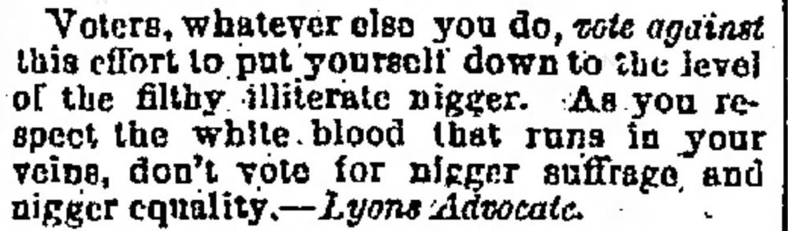
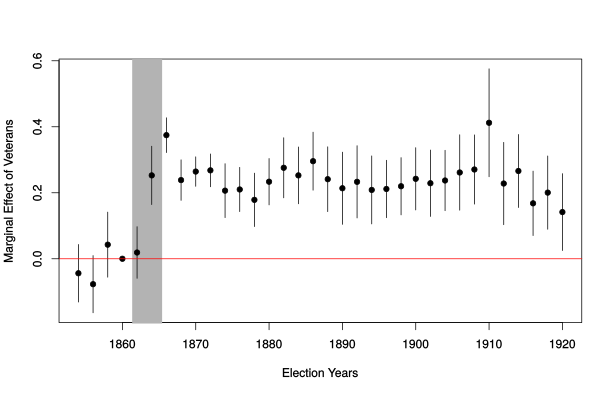
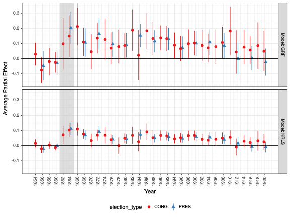
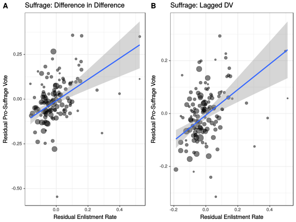
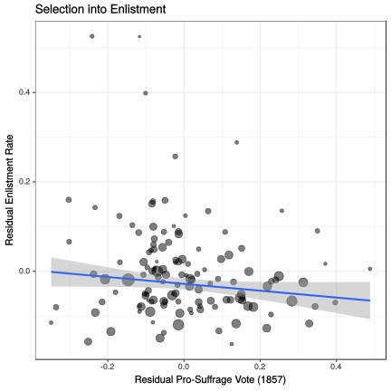
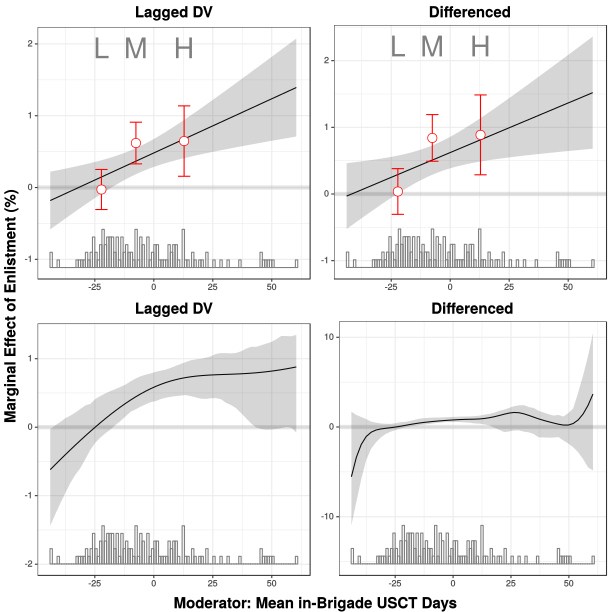
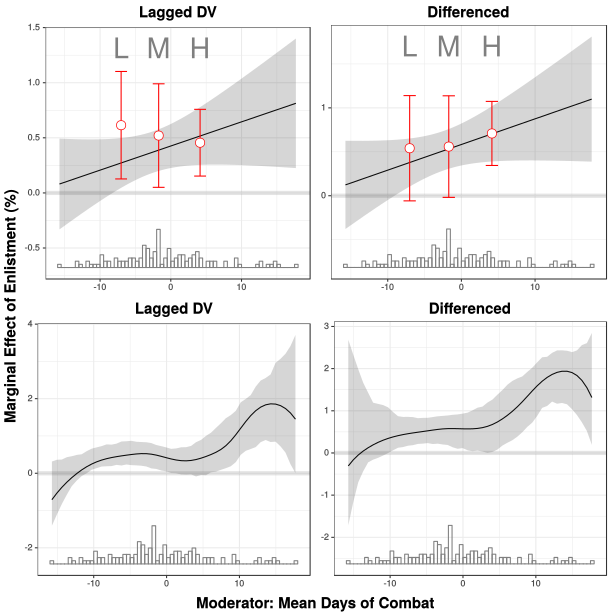

```{r setup, include=FALSE}
knitr::opts_chunk$set(echo = FALSE)
```

## Outline

### 1) Puzzle of Reconstruction

### 2) Veterans

### 3) Data/Design

### 4) Results

### 5) Mechanisms?

# The Puzzle of Radical Reconstruction

## America's "Second Revolution"

### **Radical Reconstruction**

- Military occupation and martial law
- Freedmen's Bureau: education, labor contracts
- Civil Rights Amendments
- Civil Rights Enforcement Acts
    - investigations, prosecutions, martial law, habeas corpus


## Transformative

(*while it lasted*)

### Army occupation 

**increased** access to voting, election of black politicians, reduced racial violence (Chacon and Jensen)

### Freedman's Bureau

**increased** literacy, earnings, voting (Stewart and Kitchens; Rogowski)

### Election of Black Politicians 

**increased** local tax collection, literacy, and earnings (Logan; Suryanarayan and White)

# To enforce new Civil and Political Rights

### Massive increase in federal power

# Why did this happen?

## One obvious answer

### Republicans and Electoral competition

- An all-white southern electorate a major problem 

Expand the electorate to include new, supportive voters 

- (e.g. Teele 2018, Ansell and Samuels 2015, etc.)

Republicans are **explicit** about this (Vallely 2004)

- Is there a risk of alienating the *existing electorate*?

## Nevertheless, surprising

### Republicans were *not* eager to expand voting rights

**Party leaders on suffrage expansion:**

> "political suicide"

## Nevertheless, surprising

### Racially Conservative Electorate

- abolitionism politically weak antebellum
- power of "white republicanism"
- erosion of African American rights in the North
- Democrats use racist appeals

Radical agenda key issue of 1866 and 1868 elections

# {.centering}



<p>During 1868 election campaign in Iowa</p>

## Reluctant Republicans

**Attorney General Edward Bates:**

> "That the great principle of the Republicans [was] negro
equality [is] a down-right falsehood"

**Abolitionist critics:**

> Republican party was a party for "white men, not for all men"

# How did Republicans get the votes?

<h3> Given a racially conservative electorate... </h3>

<h3> and a revolutionary agenda... </h3>

# Veterans

## Veterans...

### **are politically active**

(Blattman 2009, Parker 2009)

### **have new organizational skills**

(Jha and Wilkinson 2012)

### **acquire new political commitments**

(Koenig 2016; Grossman, Manekin and Miodownik 2015)

## Union Veterans

### **2.1 million servicemen**

~24 percent of 1870 electorate

### **Young men**

new, intense experience with large consequences (e.g. Costa and Kahn)


### **Known mobilization around pensions**

(Skocpol 1993)

# Why would veterans vote Republican?

## Mechanisms

### **Contact** (Allport 1954, Mo and Conn 2017)

Interaction $\xrightarrow{}$ reduced prejudice; "earned" citizenship

### **Anti-Slavery**

Exposure to slavery $\xrightarrow{}$ moral, strategic need for abolition (Manning 2007). 

### **Sacrifice**

Combat and loss experience $\xrightarrow{}$ commitment to cause (Union and **Liberty**); antipathy toward enemy (Grossman, Manekin and Miodownik 2015, Koenig:2016)

## Mechanisms

### **Patronage?** (Skocpol 1993)

Undoubtedly true by the 1880s; unlikely in 1860s

## Implications

Absent individual-level data...

### Places with more veterans should have

- increased votes for **Republicans**
- increased votes for **Black Suffrage**

### Effects should be larger when veterans

- served alongside African Americans (contact)
- served in slave-holding areas (anti-slavery)
- experienced more combat (sacrifice)


# Testing

## Data

### **Civil War Database**

relational database of soldiers, units, combat

- Residence county for CT, IA, IL, IN, ME, MA, VT, WI
- (with census) fraction of military-age males enlisted

### **Dyer's Compendium**

geographic location of regiments over time

### **Voting**

- County-level Republican voteshare in federal elections
- County-level votes on black suffrage in referenda in IA and WI

## Design: GOP Votes

### **Difference-in-Difference**

$$\begin{aligned}
  GOPVoteshare_{ie} & = \alpha_{i} + \alpha_{e} +  \\
  &   \beta Enlistment_i * CivilWar_e + \epsilon_i + \epsilon_t
\end{aligned}$$

**To inspect parallel trends**
$$\begin{aligned}
  GOPVoteshare_{ie} & = \alpha_{i} + \alpha_{e} +  \\
  &   \sum_{y = 1854}^{1920} \beta_y Enlistment_i * Year_y + \epsilon_i + \epsilon_t
\end{aligned}$$


## Design: Suffrage Referenda

### **Difference-in-Difference**

$$\Delta Suffrage_{i} = \alpha_{state} + \beta Enlistment_i + \epsilon_i$$


### **Lagged Dependent Variables**

$$PostSuffrage_{i} = \alpha_{state} + \gamma PreSuffrage_{i} +  \beta Enlistment_i + \epsilon_i$$

# Results

##Enlistment and Republican Voteshare {.centered}



##Relaxing Parallel Trends {.centered}




## Enlistment and Suffrage Votes {.centered}



## Enlistment and Suffrage Votes 

<div align='center' style="font-size:75%">
<table style="text-align:center"><caption><strong>Effect of Enlistment on Support for Black Suffrage (IA and WI Referenda)</strong></caption>
<tr><td colspan="5" style="border-bottom: 1px solid black"></td></tr><tr><td style="text-align:left"></td><td colspan="4"><em>Dependent variable:</em></td></tr>
<tr><td></td><td colspan="4" style="border-bottom: 1px solid black"></td></tr>
<tr><td style="text-align:left"></td><td>(Vote %)</td><td>(Elig. %)</td><td>(Vote %)</td><td>(Elig. %)</td></tr>
<tr><td style="text-align:left"></td><td colspan="2">Pro-Suffrage</td><td colspan="2">&Delta; Pro-Suffrage</td></tr>
<tr><td style="text-align:left"></td><td>(1)</td><td>(2)</td><td>(3)</td><td>(4)</td></tr>
<tr><td colspan="5" style="border-bottom: 1px solid black"></td></tr><tr><td style="text-align:left">Enlistment (%)</td><td>0.320<sup>***</sup></td><td>0.173<sup>***</sup></td><td>0.433<sup>***</sup></td><td>0.258<sup>***</sup></td></tr>
<tr><td style="text-align:left"></td><td>(0.098)</td><td>(0.064)</td><td>(0.118)</td><td>(0.081)</td></tr>
<tr><td style="text-align:left"></td><td></td><td></td><td></td><td></td></tr>
<tr><td style="text-align:left">Constant</td><td>0.394<sup>***</sup></td><td>0.424<sup>***</sup></td><td>0.306<sup>***</sup></td><td>0.354<sup>***</sup></td></tr>
<tr><td style="text-align:left"></td><td>(0.035)</td><td>(0.022)</td><td>(0.037)</td><td>(0.026)</td></tr>
<tr><td style="text-align:left"></td><td></td><td></td><td></td><td></td></tr>
<tr><td colspan="5" style="border-bottom: 1px solid black"></td></tr><tr><td style="text-align:left">Lagged DV</td><td>Yes</td><td>Yes</td><td>No</td><td>No</td></tr>
<tr><td style="text-align:left">Differenced</td><td>No</td><td>No</td><td>Yes</td><td>Yes</td></tr>
<tr><td style="text-align:left">Observations</td><td>131</td><td>131</td><td>131</td><td>131</td></tr>
<tr><td colspan="5" style="border-bottom: 1px solid black"></td></tr><tr><td style="text-align:left"><em>Note:</em></td><td colspan="4" style="text-align:right"><sup>&#42;</sup>p<0.1; <sup>&#42;&#42;</sup>p<0.05; <sup>&#42;&#42;&#42;</sup>p<0.01</td></tr>
<tr><td style="text-align:left" colspan='5'>Data from state constitutional referenda across 131 counties in IA and WI. All models include state fixed effects. Robust Standard Errors</td></tr>
</table>
</div>

# Interpretation?

## Interpretation: Selection Bias?

### 1) Parallel trends assumption 

- apparently valid
- robust to pre-war trends

### 2) Something correlated with enlistment, affected by the war?

## Interpretation: Selection Bias? {.centered}



## Interpretation: Ecological Inference?

### 1) Soldiers' diaries

- Opposition to slavery; Republican voting (Manning 2007)

### 2) Republican Veterans Groups

### 3) Democratic/Anti-Suffrage Veterans Groups

# Mechanisms?

## Caution:

Wartime experiences likely as-if-random, conditional on enlistment timing, but...

- conditioning with aggregate data?
- smaller counties, higher variances
- units often recruited geographically

## Contact: Days in mixed-race brigades {.centered}



## Sacrifice: Days of Combat Experience {.centered}
 


# Conclusion

## What did we learn?

### **Wartime service** gave GOP voters in **critical elections**

### **Reduction in prejudice?**

- Probably not. (White 2016)
- Meaning of the war: Union *and* **Liberty**

### When did this wear off?

## Next Steps

### Better Tests of Mechanisms?

- Township-level election results $N \approx 1000$
- Appropriate design?

### More states, more elections

- Match enlistees to census (ML)
- Instrument for enlistment?

# Thank You

#

## GRF

Estimates local partial effect of $W_i$ in neighborhood weighted by similarity to $X_i$, where weights are obtained using random forests to find cases in same part of regression trees.

$$\hat{\theta}(x_i) =  \frac{\sum_{j=1}^n \alpha_j(x_i) (W_j - (\sum \alpha_j(x_i)W_j)) (Y_j - (\sum \alpha_j(x_i) Y_j))}{\sum_{j=1}^n \alpha_j(x_i) (W_j - (\sum \alpha_j(x_i)W_j))^2}$$

We can obtain the conditional average partial effect:
$$APE = \frac{1}{n} \sum_{i = 1}^n \frac{Cov(W_i, Y_i | X = X_i)}{Var(W_i | X = X_i)}$$


