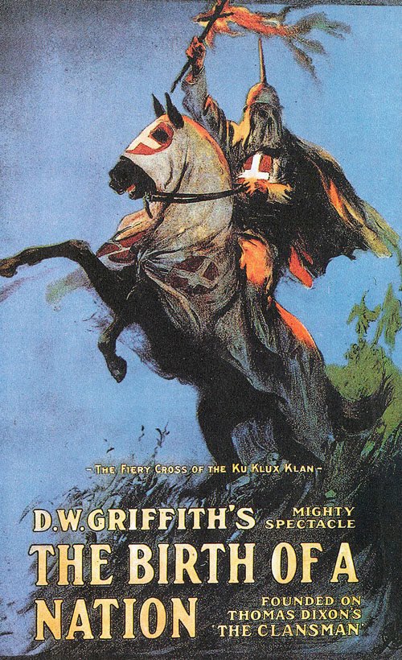

  
```{r setup, include=FALSE}
require(knitr)
require(magrittr)
knitr::opts_chunk$set(echo = TRUE)
```

<style type="text/css">
  .reveal h2,h3,h4,h5,h6 {
    text-align: left;
  }
.reveal p {
  text-align: left;
}
.reveal ul {
  display: block;
}
.reveal ol {
  display: block;
}

 .center {
  display: block;
  margin-left: auto;
  margin-right: auto;
  text-align: center;
  width: 50%;
}
</style>
  

### **US Civil War was Deeply Partisan**


---

### **US Civil War Deeply Partisan**


Kalmoe (2020), Weaver (2022)

---

### **Reconstruction was Violent and Partisan**


**Republican "revolution"** for biracial democracy

- military occupation
- disenfranchisement of rebels
- Constitutional Amendments
- new federal enforcement powers 

**Democratic resistance**

- violence against federal agents, Republicans, African Americans
- voter suppression, assassinations, violent overthrow of local/state gov'ts

---  

<br>


<h1>Is history written by the victors?</h1>

---


Republican "Won Cause" narrative praised political rights ...

---


... and condemned white supremacist violence

---

Within 50 years, "Lost Cause" narrative of war and Reconstruction triumphant



---

### **How did this happen?**

More broadly...

**How are discourses that justify or prohibit violence transformed?**

- particularly relevant to partisan violence and claims to (il)legitimacy of regimes

**Changing discourses about violence is *consequential* **

- (Yanagizawa-Drott 2014; Adena et al. 2015; Mueller and Schwarz 2021, 2019; Weaver 2019)
- May enable or constrain political violence.

---

### **Publicity as a Mechanism**

#### **Reach**

*Geographic scope of audience*

- alter scope of conflict (consequences of discourse)
- censor/reveal events or details that align with discourse

<br> 

#### **Inclusivity**

*Inclusion of different voices in public debate*


- determines whether frames/narratives are un/contested
- determines which events are reported
- particularly relevant if victims of violence are included

---

### **Publicity as a Mechanism**

<br> 

Changes in publicity may endogenous or exogenous:

- Rapid changes in communication technology; unanticipated consequences
- During Reconstruction, changes in publicity endogenous and **strategic**

<br>

Republican narratives of Reconstruction facilitated by increased reach and inclusivity

Democrats successful by reversing this: contracting reach and excluding Black and Republican voices.

---

### **Republicans and Publicity**

**Increasing reach**

  - Northern audiences invested in southern events
  - military occupation, federal agents, new telegraph/rail
  - northern reporters went south
  - Congressional investigations

**Increasing inclusivity**

  - Voices of freed people in government reports
  - Republican newspapers (gov't, army printing contracts)
  - Republican and Black elected and appointed officials
  - Testimony in Congressional hearings
      
--- 

### **Democrats and Publicity**

**Limiting Reach**

- use of clandestine violence
- Klan costumes/pageantry 
- Ignore/deny reports of violence against Black/Republicans
- Control over telegraph lines/press associations/wire service contracts

**Limiting Inclusivity**

- Targeted violence against Republican leaders
- Efforts to weaken Republican, strengthen Democratic newspapers
- Cultivate relationships with Northern reporters
- Attack credibility of Republican/Black testimony (false flag, paid witnesses)

--- 

### **Democratic Consolidation**

After reducing Republican/Black voices in the South:

- Paid lip service to Northern demands for Black civil and political rights
- Controlled news headed North: suppressed, reframed violence that might trigger Northern intervention


In the long run, re-wrote narrative of Reconstruction:

- By 1890s, Southern members of Congress openly admit violent voter suppression. Able to frame it as 'legitimate' and 'necessary'

--- 

### **Next Steps**

Empirically, did changes in reach/inclusivity alter Northern press coverage of Reconstruction? 

Data on violence is suspect, but...

- data on newspaper partisanship, wire service membership, Army occupation, black office-holders
- content coding newspapers for coverage of civil rights, Reconstruction gov'ts, racial/political violence

