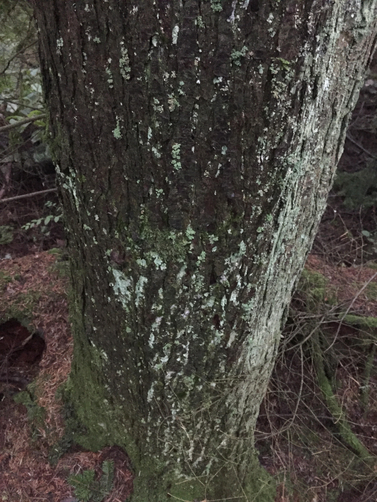

```{r setup, include=FALSE}
knitr::opts_chunk$set(echo = FALSE)
```

##  {data-background=images/bg.jpg data-background-size=cover .centered}

<div class="red" >
<font size="10">How to recognize trees</font>
</div>


## {.centered}


## {.centered} 

  

## Objective for Today:

### While walking in local forests, you will be able to correctly identify **douglas-fir**, **western hemlock**, and **western red cedar** trees using visual clues.

## 

|                   | Cones                                   | Leaves                         | Bark                                        |
|-------------------|-----------------------------------------|--------------------------------|---------------------------------------------|
| Douglas-fir       | Large w/ "tails"                        | Longer needles<br>in 3D arr'gt     | {width=40%}        |
| Western Hemlock   | Small, round scales                     | Shorter needles<br>flat arr'gt | {width=40%}     |
| Western Red Cedar | Small, pointed scales,<br> floret shape | Scaly leaves                   | {width=40%}  |

# How do we recognize these trees?


# Let's practice

## What is this tree? {.centered}

 

## What is this tree? {.centered}

 

## What is this tree? {.centered}

 

## Now you know the names, cones, and needles {.centered} 

  


