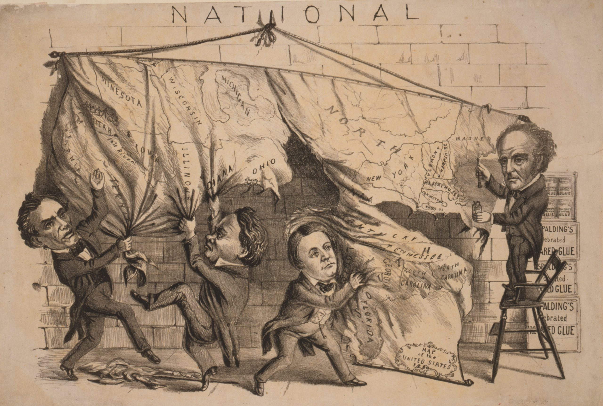
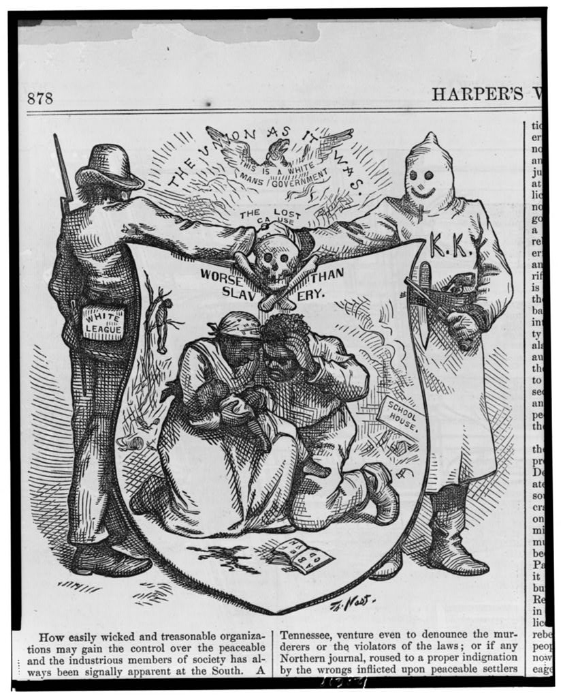

  
```{r setup, include=FALSE}
require(knitr)
require(magrittr)
require(data.table)
require(ggplot2)
knitr::opts_chunk$set(echo = TRUE)
```

<style type="text/css">
  .reveal h2,h3,h4,h5,h6 {
    text-align: left;
  }
.reveal p {
  text-align: left;
}
.reveal ul {
  display: block;
}
.reveal ol {
  display: block;
}

 .center {
  display: block;
  margin-left: auto;
  margin-right: auto;
  text-align: center;
  width: 50%;
}
</style>
  

### **US Civil War was Deeply Partisan**



---

### **US Civil War Deeply Partisan**


Kalmoe (2020), Weaver (2022)

---

### **Reconstruction was Violent and Partisan**


**Republican "revolution"** for biracial democracy

- military occupation
- disenfranchisement of rebels
- Constitutional Amendments
- new federal enforcement powers 

**Democratic resistance**

- violence against federal agents, Republicans, African Americans
- voter suppression, assassinations, violent overthrow of local/state gov'ts

---  

<br>


<h1>Is history written by the victors?</h1>

---


Republican "Won Cause" narrative praised political rights ...

---




... and condemned white supremacist violence

---

In only a few decades, "Lost Cause" narrative of war and Reconstruction triumphant


---

### **How did this happen?**

More broadly...

**How are discourses that justify or prohibit violence transformed?**

- particularly relevant to partisan violence and claims to (il)legitimacy of regimes

**Changing discourses about violence is *consequential* **

- (Yanagizawa-Drott 2014; Adena et al. 2015; Mueller and Schwarz 2021, 2019; Weaver 2019)
- May enable or constrain political violence.


---

### **Klan as a Case Study**

Klan an interesting case:

- emerges early in Reconstruction
- a huge media phenomenon
- drove major Reconstruction legislation
- pushback against Klan "Enforcement" $\to$ declining support for Reconstruction

---

### **Publicity as a Mechanism**

#### **Reach**

*Geographic scope of audience*

- alter scope of conflict (consequences of discourse)
- censor/reveal events or details that align with discourse

<br> 

#### **Inclusivity**

*Inclusion of different voices in public debate*


- determines whether frames/narratives are un/contested
- determines which events are reported
- particularly relevant if victims of violence are included

---

### **Publicity as a Mechanism**

<br> 

Changes in publicity may endogenous or exogenous:

- Rapid changes in communication technology; unanticipated consequences
- During Reconstruction, changes in publicity endogenous and **strategic**

<br>

Republican narratives of Reconstruction facilitated by increased reach and inclusivity

Democrats successful by reversing this: contracting reach and excluding Black and Republican voices.

---

### **Republicans and Publicity**

**Increasing reach**

  - War $\to$ Northern audiences invested in southern events
  - military occupation, federal agents, new telegraph/rail
  - Northern reporters went south
  - Congressional investigations

**Increasing inclusivity**

  - Voices of freed people in government reports
  - Republican newspapers (gov't, army printing contracts)
  - Republican and Black elected and appointed officials
  - Testimony in Congressional hearings
      
--- 

### **Democrats and Publicity**

**Limiting Reach**

- use of *clandestine* violence
- Klan costumes/pageantry $\to$ "fabricated"
- Ignore/deny reports of violence against Black/Republicans
- Control over telegraph lines/press associations/wire service contracts

**Limiting Inclusivity**

- Targeted violence against Republican leaders
- Efforts to weaken Republican, strengthen Democratic newspapers
- Cultivate relationships with Northern reporters
- Attack credibility of Republican/Black testimony (false flag, paid witnesses)

---

### **Empirical Tests**

Empirically, did changes in **reach**/**inclusivity** alter Northern press coverage of Reconstruction? 

- **reach**: railroad/telegraph b/t Northern papers and communities with Army Occupation
- **inclusivity**: access to Southern communities with Rep. papers, Rep./Black legislators
- **design**: changing *exposure* of Northern papers to reach/inclusivity
- **Klan Coverage**: content coding of Newspaper coverage
    - 92K + mentions of Klan between 1868-1874. How to code this content reliably?
    
---

### Measuring Klan Coverage

* [x] Search for "Klan" related keywords on Newspapers.com. (92k newspaper pages matched)
* [x] Hand-coded random sample of articles (2500) stratified by newspaper state.
* [ ] LLM to "read" and code **all** articles

---

### GPT Coding

1. "Clean" OCR:

> (&apos;JR,ecoii8triictiii Tyrnny&quot; Com-&quot;Tparcdt -with JEnglUIt Tyrany. &apos;ft&apos;il&apos;habitiial with the prens and speakers of the opponents&apos; Eo the Reconstruction poli-i clor&apos;CopgreBB to cry down, its actions as &quot;jy ranical&apos; and oppressive, add .many even go sp fai&apos; as to.sigh, for the wise and stable government of England to take the place of-voiir iEepublican&apos;&apos;inkUutiotia.:, Like the frogaia the rabje&quot;, they want &quot;.a king to rule over them&quot; a queen would suit them still better .perhaps; .They have &apos; one in England, and it is said by our discontented, disu MtiKfiefl pe&apos;mo6iats, that Great&apos; Biitnin is the .host governed country .on the globe. Some of the recent legislation of the English Parliament has lately come to our notice, and we desire to call the attention of pur malcontents&apos; to a&apos; sample of it. England( as is well known, bus been troubled from lime, to time: with Utile rebellions in a pari of her realm namely, in Ireland; and she has from lime to time attempted to reconstruct&apos; her rebellious subjects. The last act of &quot;reconstruction is no act to provide for the preservation of the peace of Ireland, Wihich has just been signed by the Quean and is now a law. Those who think they would enjoy the Queen&apos;s reconstruction bet ter .thari&apos; .Congress, will take notice. Section 13. of the act above mentioned, provides &quot;That in the event of any felony or mis. demeanor being committed within a pro claimed district, any justice of the peace may summon any person before him whom he &quot;believes can give irjaterinl evidence, and. although lio person be actually accused of &apos;, vie crime examine htm concerning it and in tlte event of his refusing to give evidence com mit&apos;him?&apos; If we had this law in Alabama, any juss tice of the peace could call upon any citis zen.to give evidence concerning the recent Ku Klux outrage?, and, on refusing to give such 6vidence,-could tend him to jail indefi nitely. How would the K-K. Democracy like that ? Section 20 makes it lawful for any jus tice of the pence &quot;Or for any constable, peace officer, or oiner person to arrest and bring before anv justice of the peace, any pereon who within dj district specially proclaimed and under suspicious circumstances, 6hall be in the fit-Id, streets, highw8T8, or etawbere outofl nis aweuing or peace of aooae, at any lime from one hour after sunset until sunrise. and unless it is proved to their satisfaction tlmt such person was out of his house &quot;upon his lawful occasion or business, such justices may commit him to jail, there 10 be inipnsi.ned with or without hard la bor for any pisriod not exceeding .six caleo dar months.&quot; If we had English reconstruction ia the South, our Democratic friends would have to stay at home after sunaet or go to jail. Another section provides that &quot;No person in. Ireland shall be allowed to carry arms unless ho hes a license granted uins ior iuri purpose ; nnq any person carrying or &quot; having &quot; arms without such lioense shall be imprisoned for t&quot;vo years. The effect of this will be that any mngis trftle may grant license to his own party to go armed with guns and revolvers, and may disarm everybody else in his district, send ing whoever may guilty of having a gun or pistol to the penitentiary for two years. How would our K.&apos;K. Democrats like suoh a provision in the reconstruction laws Again : &quot;If any person sells minpowder to one not having license, he is to be fine I 5 for every sale; and if he sells or renaiis h con or pistol for a person not having ibis license, he is to be fined 50&apos; If English laws ore wise, Congress may learn wisdom by this, Section 21 is as follows : &quot;Where any newspaper printed in Ireland bvuiaiiio ouv bignnuuflum ur BeUIUOUS 6n grnving, matter, or expression, or any in citements to the committing of anv felony, or any engraving, mawr or expression haii ing a tendency id foster encourage, or vropa gate treason of sedition, or to incite to the committing of any felony &apos;f all printing pres- tiues, machinery, type, implements, uiensus, paper, ana otner plant and materials used or employed or intended to he used or employed in or for the purpose of pnuung or piiousning suon newB mper, or found in or about any premises where such newspaper i printed or published, together with all copies of such oewspaper, where, ever found, shall be forfeited&quot; to her Ma jesty. Where any newspaper printed else-, where than in Ireland is circulated in Ireland, and contains any such engraving, uinuer, cAfirtuaiuiib, or lucuemeniB as a I ore aid, all copies of such newsnaner where- ever found shall be forfeited to her Majesty.&quot; If this section was to be put in force in Alabama how, every Democratic newspaper in the State, with all their presses, type and material would be forfeited to the government within a week It might be a good thing if this were done, but we fancy they would not like it any better than Congressional reconstruction, which allows them in every Issue fo vomit forth treason and incite to murder and arson atjjpleasure. Pet iapi English reconstruction is the wisest sd besli We wiH leave life subject with our Unriconktrucied &apos;brtfnrefif and H (hem decide. &apos;

---

### GPT Coding

1. "Clean" OCR:

> "Reconstruction Tyranny" Compared with English Tyranny
>
> It has become habitual for the press and speakers of the opponents of the Reconstruction policy in Congress to cry down its actions as "tyrannical" and oppressive. Many even go so far as to sigh for the wise and stable government of England to take the place of our Republican institutions. Like the frogs in the fable, they want "a king to rule over them"; a queen would suit them even better, perhaps. They have one in England, and it is said by our discontented, dissatisfied Democrats that Great Britain is the best-governed country on the globe.
>
> Some of the recent legislation of the English Parliament has come to our notice, and we desire to call the attention of our malcontents to a sample of it. England, as is well known, has been troubled from time to time with little rebellions in a part of her realm, namely, in Ireland; and she has, from time to time, attempted to reconstruct her rebellious subjects. The last act of "reconstruction" is no act to provide for the preservation of the peace of Ireland, which has just been signed by the Queen and is now law. Those who think they would enjoy the Queen's reconstruction better than Congress will take notice.
>
> Section 13 of the act above mentioned provides: "That in the event of any felony or misdemeanor being committed within a proclaimed district, any justice of the peace may summon any person before him whom he believes can give material evidence, and although no person be actually accused of the crime, examine him concerning it; and in the event of his refusing to give evidence, commit him." If we had this law in Alabama, any justice of the peace could call upon any citizen to give evidence concerning the recent Ku Klux outrages, and upon refusing to give such evidence, could send him to jail indefinitely. How would the Ku Klux Democrats like that?
>
> Section 20 makes it lawful for any justice of the peace or for any constable, peace officer, or other person to arrest and bring before any justice of the peace any person who, within a district specially proclaimed and under suspicious circumstances, shall be in the fields, streets, highways, or elsewhere out of his dwelling or peaceable abode, at any time from one hour after sunset until sunrise. Unless it is proved to their satisfaction that such person was out of his house upon his lawful occasion or business, such justices may commit him to jail, there to be imprisoned with or without hard labor for any period not exceeding six calendar months. If we had English reconstruction in the South, our Democratic friends would have to stay at home after sunset or go to jail.
>
> Another section provides that "No person in Ireland shall be allowed to carry arms unless he has a license granted for that purpose; and any person carrying or having arms without such license shall be imprisoned for two years." The effect of this will be that any magistrate may grant licenses to his own party to go armed with guns and revolvers, and may disarm everybody else in his district, sending whoever may be guilty of having a gun or pistol to the penitentiary for two years. How would our Ku Klux Democrats like such a provision in the reconstruction laws?
>
> Again: "If any person sells gunpowder to one not having a license, he is to be fined £5 for every sale; and if he sells or repairs a gun or pistol for a person not having this license, he is to be fined £50." If English laws are wise, Congress may learn wisdom from this.

Section 21 is as follows: "Where any newspaper printed in Ireland contains any seditious or treasonous matter, or any incitements to the committing of any felony, all printing presses, machinery, type, implements, paper, and other plant and materials used or employed or intended to be used or employed in or for the purpose of printing or publishing such newspaper, or found in or about any premises where such newspaper is printed or published, together with all copies of such newspaper, wherever found, shall be forfeited to Her Majesty." Where any newspaper printed elsewhere than in Ireland is circulated in Ireland and contains any such matter, all copies of such newspaper, wherever found, shall be forfeited to Her Majesty.

If this section were to be put in force in Alabama, every Democratic newspaper in the state, with all their presses, type, and material, would be forfeited to the government within a week. It might be a good thing if this were done, but we fancy they would not like it any better than Congressional reconstruction, which allows them in every issue to vomit forth treason and incite to murder and arson at pleasure. Perhaps English reconstruction is the wisest and best. We will leave the subject with our un-reconstructed brethren and let them decide.

---

### GPT Coding

Topics in each article:

<small>

1. Does this article mention or describe the Ku Klux Klan attacking or threatening people?
2. Does this article mention or describe violence perpetrated by Black people or militias?
3. Does this article mention or describe Congressional hearings about the Ku Klux Klan or Klan Acts?
4. Does this article debate the merits of Klan Law or enforcement of the law against the Klan?
5. Does this article discuss or mention the arrest, imprisonment, or trial of alleged Klan members?
6. Does this article discuss or mention a link between the Klan and party politics (Democrats and Republicans/Radicals)?
7. Does this article discuss or mention the Klan in relation to the continuation of the Civil War/War of Rebellion (e.g. references Union, Rebels, Confederates)?
8. Does this article discuss whether reports about the Klan and its actions are true or fabricated?
9. Does this article discuss or mention the origins of the name "Ku Klux Klan"?
10. Does this article mention the Klan in a humorous context?
11. Does this article use the Klan as analogy or metaphor?

</small>


---

### GPT Coding: Validation

```{r, echo = F, message=F, warning=F}
plot_data = fread("./plot_data_metrics.csv")
plot_data[, var := factor(var, levels = paste0('q', 1:11))]

ggplot(plot_data, aes(x = var, y = score, group = model, colour = model, fill = model)) +
  geom_bar(stat  = 'identity', position = position_dodge()) + 
  facet_wrap(vars(metric)) +
  theme_bw()

```

