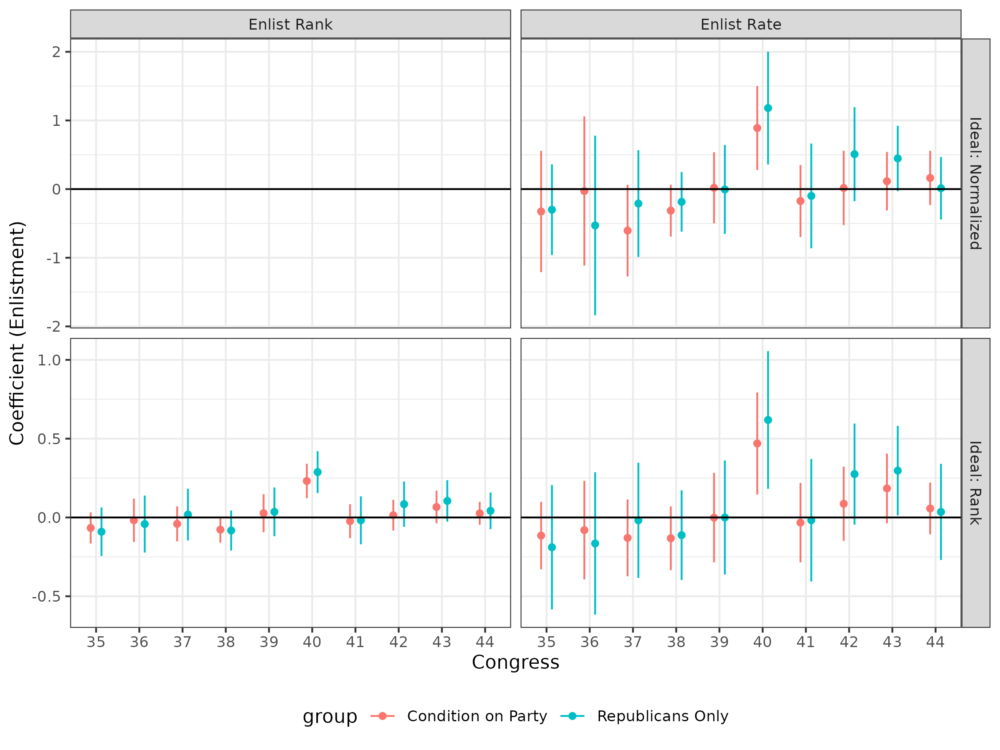
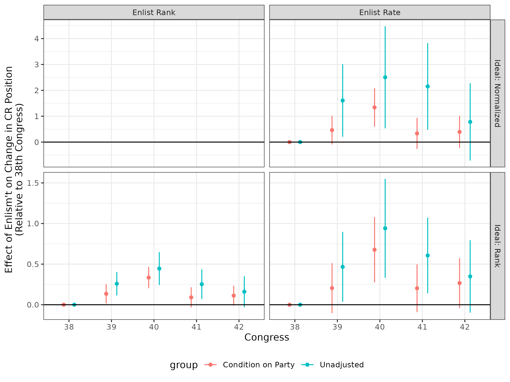

  
```{r setup, include=FALSE}
require(knitr)
require(magrittr)
require(data.table)
require(ggplot2)
knitr::opts_chunk$set(echo = TRUE)
```

<style type="text/css">
  .reveal h2,h3,h4,h5,h6 {
    text-align: left;
  }
.reveal p {
  text-align: left;
}
.reveal ul {
  display: block;
}
.reveal ol {
  display: block;
}

 .center {
  display: block;
  margin-left: auto;
  margin-right: auto;
  text-align: center;
  width: 50%;
}
</style>
  
### **Why was Reconstruction "Radical"?**


- Revolutionary moment (Foner 1988)
- Increasing evidence of effects (Stewart and Kitchens
2021; Logan 2020; Chacon and Jensen 2020; Rogowski 2018)
- Not obvious that it would happen

<br>

>- Understanding *why* legislation passed helps understand weakening
>- **Question**: Why did **Congress** adopt these policies?

---

### **Why?:** *(i) Electoral Incentives*

Vallely (2004) and others suggest:

- Republicans faced strategic dilemma with South rejoining the Union
- Democrats would gain seats; need for Republican voters in the South
- Enfranchisement of African Americans provided an answer
- Changing electoral incentives weakened Reconstruction


---

### **Why?:** *(ii) Factions and Public Opinion*

- Republican party was new, composed of factions that disagreed on Slavery and Civil Rights
- Republican factions backed Black suffrage before the war (Bateman 2020)
- Factional politics determined trajectory of Civil Rights Legislation (Jenkins and Peck 2021)
- Party sensitive to public opinion, unfolding events (Wang 1997)

---

### **Three Major Questions**

Truth to both *(i)* and *(ii)*...

1. Where did public support among Northern voters come from?

2. Why did state parties move faster than Congressional Republicans?

3. Were Republican factions persistent over time? (Abolitionists like Horace Greeley $\to$ Liberal Republicans)

---

### **Argument:**  Union Veterans, Activism from Below

Union Veterans...

1. Formed a large vote bloc (~25% of eligible voters in the North)
2. **Became** Republican voters
3. Interpreted "Won Cause" as linked to ending slavery, gaining Civil Rights

$\to$ Veterans provided *public support* and *votes* for Republicans during Reconstruction  (Weaver 2022)

---

### **Argument:**  Union Veterans, Activism from Below

Union veterans formed **organizations** (like the Grand Army of the Republic) that

1. Mobilized votes during elections (1866, 1868)
2. Had strong connections to Radical Republicans
3. Took strong stances on Reconstruction politics

$\to$ Veterans organizations could push Radical policies from the bottom up

---

### **Testing:** Implications

1. Members of Congress with more veteran constituents should take more pro-Civil Rights positions, *after the war* (public support)
2. **Republicans** in Congress from districts with more veterans should take increasingly pro-Civil Rights positions, *after the war* (organizational pressure)

---

### **Testing:** Data


1. Enlistment Rates:  enlistment rate for military aged males in 1860 by Congressional District (Dippel and Heblich 2021)
2. Civil Rights Ideal Points: 
  - House Roll Calls from 35th (pre-war) to 44th (last "Reconstruction") Congresses
  - Identified civil rights related votes (Bateman and Lapinski 2016)
  - Slavery, Prosecution of the War (as pertains to African Americans and former slaves), Civil Rights, Civil Rights Enforcement, and Reconstruction (votes on Federal Powers over the South, etc.)
  - Estimate ideal points in each Congress

---

### **Testing:** Ideal Points

Two problems:

1. Radicals voted against moderate proposals

    - normal scaling techniques mislabel Radical legislators (Thaddeus Stevens)
    - use "Ends against the Middle" estimator from (Duck-Mayr and Montgomery 2023)

2. Policy spaces in successive Congresses not comparable

    - Raw scores cannot be meaningfully compared
    - **Rankings** in policy space are meaningful 


>- Congress shifting toward "Progressive" civil rights positions; did legislators from districts with more enlistment increase their **ranking** on civil rights issues?


---

### **Testing:** Design

A kind of continuous differences-in-differences:

- Did relationship between enlistment rates and civil rights voting **change** after veterans returned home?
- Did civil rights rankings *within districts* change more in places with more enlistment?

<small>
$$\text{Civil Rights Rank}_{dc} = \alpha_{d} + \alpha_{c} + \sum_{c = 39 \neq 38}^{42} \beta_c  \text{Enlistment}_d * \mathrm{Congress}_c + \epsilon_d$$
</small>

---

Enlistment-Civil Rights Voting Correlation by Year



---

Change in Civil Rights Voting by Enlistment (Panel)



---

### **Interpretation**

Districts with **higher enlistment** saw legislators **increase their ranking** in pro-Civil Rights voting after the Civil War

- these legislators **moved more** even as Congress as a whole adopted more Radical policies
- these changes are not ONLY due to Republican seat gains
- effects persist when looking at seats held by Republicans; same legislator over time 

---

### **Next Steps**

- Look at specific votes: which issue areas drive this change?
- A common policy space (?): ranking pairs of votes
- Tracing the mechanisms: GAR posts/activities, activism in state houses, data on veterans in state/county conventions(?)
- Durability of Reconstruction coalition: do these effects persist later? (Bateman 2023)
