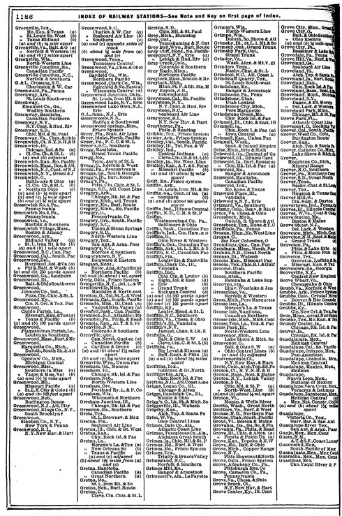

```{r setup, include=FALSE}
knitr::opts_chunk$set(echo = FALSE)
```

# Digitizing Railroad and Telegraph Systems

### Michael Weaver

### Aaron Honsowetz

# Telegraph Data

# Railroad Data

# Railroad Data

### Has this been done before?

## Why do we need this?

### We already have...

- Maps of railroad lines, canals, etc.
- Over time

##  {.centered}


## Why do we need this?

### **... but we can do more**

### Limited points in time
  - Dependent on reliable line maps
  - Rate of growth from 1870 and 1910
  - Limits research designs

### Lines vs. points
  - Where does access to rail network happen?
  - Do lines actually intersect? 

## Why do we need this?

### **... but we can do more**

### Owners and operators
  - Politics and economics of largest companies in 19th century
  - Who owns and operates these railroads?


# Where can we find this information? 

# *Official Guide of the Railways*

## *Official Guide of the Railways*

### What is it?

- Trade publication 
    - frequently updated, for booking travel/freight
- Monthly/quarterly updates
- Years: 1868 through entire 20th century.

> - (We start with 1880 to 1910, but more is possible)

## *Official Guide of the Railways*

### What does it include?

## Timetables {.centered}


## Telegraph service {.centered}


## Lists of Companies {.centered}


## Index of railway stations {.centered}




## Index of railway stations


## *Official Guide of the Railways*

|                   | Source       | Freq.             | Years         |
|-------------------|--------------|-------------------|---------------|
| Station Locations | Index        | Monthly/Quarterly | 1868-1930+    |
| Companies         | Company List | Monthly/Quarterly | 1880(?)-1930+    |
| Station Proximity | Index        | Monthly/Quarterly | 1868-1930+ |

# How do we make this data usable?

## Manual Transcription

- Hire RAs/firm to transcribe each page

### Drawbacks

- Expensive, even more for multiple transcribers
- Cumbersome task: densely packed text
- Many errors requiring cleaning

    
## Machine Reading (OCR)

- Train machine to read text
- Extract data by parsing text
- Automatic, cheap, fast

### Drawbacks

- Even with custom training, performance is poor
    - small fonts, cheap printing
- Required extensive manual cleaning 
- Automated Parsing is tricky

# A different option

## Why Zooniverse?

###  **Making user interface is flexible/easy**
  - Combine images with a custom set of tasks (easier than MTurk/Google Form)
  - Can customize many of the tasks

### **Discretize tasks:**
  - Divide labor across tasks/workers
  - Less complexity $\xrightarrow{}$ fewer errors, less training required, greater speed
  

## Why Zooniverse?

### **Multiple workers:**
  - By default, multiple users classify/transcribe the same image
  - Improved quality
  - Volunteers can keep costs down


### **Community:** 
  - Develop community of users committed to the project
  - Interest in taking on more tasks related to the project
  - Adding more ambitious goals over time

# Our project

## Common Zooniverse Tasks

- Classification of items in an image
- Transcription of text
    - Limited data fields (forms)
    - Irregular format (telegraphs, letters, diaries)
    
## A different problem:

Like many social scientists: 

- Our data is tabular and dense
- Hundreds of items per page
- Same "fields" repeated

### Task is overwhelming

- One page might take an hour or more

## A different problem:

### **How can we ...**

1. Make transcription task simpler 
2. But keep the work engaging for volunteers


## Our solution:

### 1. Built custom tool for segmenting images
### 2. Interactive maps to make transcription work exciting

#

## Custom image splitting

### Automatic splitting?

- Splitting columns: Errors a problem
- Splitting rows: performs well 

## Custom image splitting

### Procedure

1. [Users identify page type](https://www.zooniverse.org/projects/mdweaver/wires-and-rails/)
2. Users mark columns on the page
3. After $n$ users classify
4. K-means clustering for column boundaries
5. Split page into columns
6. Automatic splitting of rows into columns

## Custom image splitting


### Key details

- Each resulting "cell" retains its page, its column index, and its row index
- "Cell" images automatically uploaded to Zooniverse
- Users see one row of data at a time

## Custom image splitting {.centered}


## Custom image splitting 

### At work

[Result of splitting](https://www.zooniverse.org/projects/mdweaver/wires-and-rails/)


## Limitations

### Multi-line station/telegraph entries
- How to aggregate data back to station/office?


## Limitations

### Multi-line station/telegraph entries

### Solution

Column indices, row indices, and row classification workflow

## Limitations

### Lack of Context

What do these mean?


## Limitations

### Lack of Context


### Solution:

Tutorials/explanations

[https://www.zooniverse.org/projects/mdweaver/wires-and-rails](https://www.zooniverse.org/projects/mdweaver/wires-and-rails)


## Limitations

### Alienation from Labor

Volunteers do not follow a single station through

- split across rows
- different transcription tasks

### Solution:

Interactive visualization:

- Map completed stations
- Searchable by user name
- Highlight/summarize contributions
- Ranking?

#

[Map](http://mdweaver.github.io/station_search/)

# Lessons for other projects


## When to use Zooniverse?

### Larger projects
  
1. higher upfront cost
2. greater return when the scale is large

## When to use Zooniverse?

### "Sparse" data 

1. Easy to use when less data per image


## When to use Zooniverse?

### "Dense" data

- Can build on our image segmentation 
    - customization needed, but path is easier
- Requires planning to:
    - retain image metadata
    - eliminate redundancies in workflows
- Helpful with irregular formatting

## When to use Zooniverse?

Even when crowdsourcing seems too much...

- Workflow tools, discrete tasks, multiple users can be simplify work of paid RAs
  
# Going forward

## Priorities

| Priorities | **Railroad** | **Telegraph** |
|------------|--------------|---------------|
| 1          | Locations    | Locations     |
| 2          | Companies    | Prices        |
| 3          | Station Info | Etc.          |

## New tasks

Once transcriptions are completed, volunteers can:

- check quality of geocoding
- match company names and abbreviations

## Longer term

New data for the project:

- Time Tables (what kind of service, how frequent)

## Time Tables {.centered}


## Longer term

New data for the project:

- Time Tables (what kind of service, how frequent)
- Rail Postal Roads

## Rail Post Roads {.centered}


## Rail Post Roads {.centered}


# 

