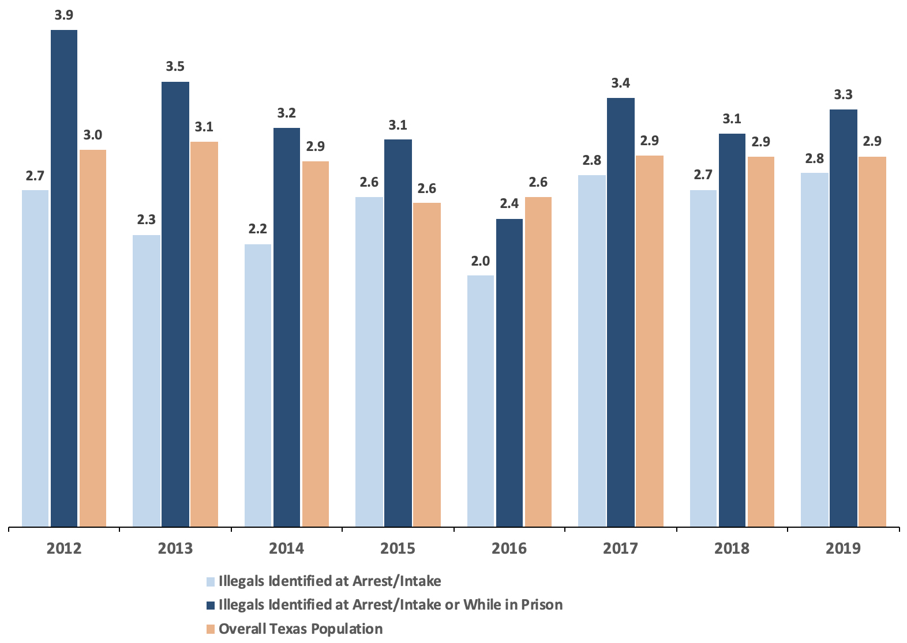
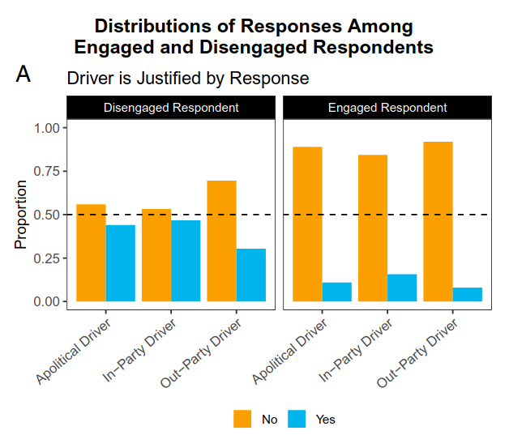

```{r setup, include=FALSE}
knitr::opts_chunk$set(echo = FALSE)
require(stringr)
require(data.table)
require(ggplot2)
require(magrittr)
```

<script type="text/x-mathjax-config">
MathJax.Hub.Config({
TeX: {extensions: ["cancel.js"]}
});
</script> 

## Objectives


### (1) Recap

- **bias**/**systematic error**
- **random** measurement error
- Reading Histograms


### (2) **Measurement Error**

- Why does it happen?
- What are the consequences?


# Example

---


<iframe width="560" height="315" src="https://www.youtube.com/embed/7PPRvTF12qc" title="YouTube video player" frameborder="0" allow="accelerometer; autoplay; clipboard-write; encrypted-media; gyroscope; picture-in-picture; web-share" referrerpolicy="strict-origin-when-cross-origin" allowfullscreen></iframe>

--- 


--- 


---

### Practice

```{r, echo = F, message=F}
require(ggplot2)
n = 10000
x1 = rnorm(n, 0, 0.5) - 1
x2 = rnorm(n, 4, 3)
x3 = rnorm(n, 0, 3)
plot_data = data.frame(Measure = rep(paste0("X",1:3), each = n), value = c(x1, x2, x3))
xlims = range(c(x1,x2, x3))
ggplot(plot_data, aes(value, fill = Measure)) + 
  geom_histogram(bins = 100, alpha = 0.5, position = 'identity') +
  labs(title = 'Measurement errors for different measures of variable:\n\"% Support for Political Violence" (X)') + xlab("Support for Violence (Observed) - Support for Violence (Actual)\nMeasurement Error Values") + ylab("# of Measurements") + 
  theme_bw() +
  geom_vline(xintercept = 0, colour = 'red') +
  geom_text(aes(x=-0.5, label="No Error", y=2000), colour="red", angle=90, size = 4, fontface = "plain") 
```

## Measurement Error: Random

**random measurement error**: errors that occur due to *random* features of measurement process. Even if observed values are sometimes wrong, they are, **on average**, correct

- Due to chance, we get values that are too high or too low
- There is no tilt one way or another (no bias): errors are only "noise"
- **random** here means: errors **unrelated** to true value; errors **equally likely** to be over- or under- estimate.
- In aggregate, values that are "too high" are balanced out by values that are "too low" compared to the truth

## Measurement Error: Bias

**bias** or **systematic measurement error**: error produced when our measurement procedure obtains values that are, **on average**, too high or too low (or incorrectly labelled) compared to the truth. 

- Key phrase is **"on average"**: error is not a one-off fluke, will happen **systematically** even if you repeat the measurement procedure.
- can have an *upward* (observed value too high) or *downward* (observed value too low) bias
- can occur for nominal/categorical values: e.g., systematically misclassifying undocumented migrants as legal
- **not** "politically" biased
- bias might not be the same for all cases/ may differ across subgroups


# Dealing with Measurement Error

## How do we know...

...if there is measurement error?

We only observe what we observe, rarely the **true value**. We often only can imagine a *story* about why there would be measurement error.

How do we know procedure does not return the **true** value? 

1. we understand **process** of observation to identify limitations and incentives that might lead to errors. $\to story$ 
2. comparison with known quantities or different measurement procedures (e.g., comparing scales) $\to ground \ truth$
3. we can do a new test that lets us see if *story* about measurement error is wrong $\to test \ story$

## What do we do...

...if there is measurement error?

Measurement error is everywhere. Does not mean we can say nothing about descriptive claims.

1. Depending on the descriptive claim, some types of measurement error are tolerable.
2. Depending on the **direction** of the measurement error, we may still be able to evaluate claims with **weak severity**
3. Depending on the **magnitude** of the measurement error, errors may be irrelevant to **weak severity**

## Goals:

1. Understand **reasons** measurement error occurs, so we can recognize it.
2. Recognize what the **pattern** of errors are: so we can identify the **type**, **direction** (if biased), and  **magnitude** of the error.
3. Guidelines for **how errors** affect **severity** of evidence.


# Why measurement error?

## Why bias happens:

Systematic Measurement Error (bias) arises from observations made by and of people:

- humans involved in observation process have misperceptions
- humans who are being observed have motives/incentives to misrepresent things
- humans use measurement tools for purposes other than intended

---

### Systematic Measurement Error/Bias Common Causes

**($1$) Subjectivity/Perspective**: Researcher/data collector/"witness" systematically perceives and evaluates cases incorrectly

Examples:

- Resume experiments show HR professionals exhibit gender, racial bias in evaluating "professionalism" for job.
- Perceptions of "objective threat" written in police reports.
- Little and Meng (2024) on democracy scores.
- Government reports on anti-Black violence after the American Civil War

---

### Systematic Measurement Error/Bias Common Causes

**($2$) Motives/Incentives to mis-represent**: beyond researchers, people *generating* the data

- **social norms** may discourage revelation of information; downward bias in "undesirable" phenomena
    - e.g. survey measure of racism or drug use $\xrightarrow{}$ **social desirability bias**
    - e.g. values in society about what is important/interesting affects news reporting
- **incentives to hide/misrepresent**: political actors have strategic reasons to conceal information from each other
    - e.g. police use-of-force encounter reports on "objective threat" of black suspects [(Fryer 2019)](https://scholar.harvard.edu/files/fryer/files/empirical_analysis_tables_figures.pdf) (upward bias)
    - e.g. wealthy people may misrepresent assets to avoid taxation (downward bias)
    
## Example: Immigration

If we surveyed Canadians and asked them:
    
**"Do you support stopping all immigration into Canada?"**

They can choose "oppose", "support", "neither support nor oppose"

> **Do you think this survey response would suffer from measurement bias?**

>- What **direction** of measurement bias?

## Example: Immigration

When discussing crime rates for natural-born citizens, legal immigrants, and undocumented immigrants, need to get the **number of undocumented immigrants**.

Why might it be difficult to correctly count?

What is the **direction** of the bias?

---

### Systematic Measurement Error/Bias Common Causes

**($3$) Use of data beyond its intended purposes**: without knowing how data is produced, unanticipated errors can arise.


- Example: crime rates for undocumented migrants in Texas.


---

[Kennedy et al](https://cis.org/Report/Misuse-Texas-Data-Understates-Illegal-Immigrant-Criminality), argue:

- It takes time for undocumented immigrants in custody to be identified. 

    - $\to$ **undercounting** of arrested undocumented
    - $\to$ more **undercounting** in recently arrested

- Only people in custody for longer periods of time for serious crimes likely to be thoroughly checked:

    - $\to$ undercounting is lower/minimal for **homicide convictions**
    - $\to$ need to use DHS **and** Texas prison (TDCJ) checks on migration status

---




>- Argue that "fixing" measurement problems, conclusions reversed.

---

[Alex Nowsrateh](https://www.alexnowrasteh.com/p/illegal-immigrants-have-a-low-homicide) shows that these conclusions came from misunderstanding of the Texas data:

- people labelled as undocumented by DHS also labeled as undocumented by TDCJ
- some people labelled as undocumented by DHS later discovered to be legal by TDCJ

Kennedy et al takes **count** of all incidents where people labelled as undocumented from DHS and TDCJ. May **double count** individuals.

---

> "We can supply the number uniquely identified by TDCJ (Prison category) and the total number of Illegals identified through PEP (*this can include illegals also identified by TDCJ*). Please note, if someone was uniquely identified through TDCJ, but at a later time is identified through PEP, the individual would no longer be in the Prison category and would reflect the PEP identification" [emphasis added].


---


---

### Random Measurement Error Common Causes

- Imperfect memory (approximate guesses in survey/interviews)
- Mistakes (mis-click on a survey)
- "Arbitrary" changes in mood/concerns (for surveys)
    - e.g. rain might make you more angry and support government less
- Researcher interpretation 
    - e.g. flipping a coin when you can't tell how to classify country as a Democracy

Anything  that is **unrelated** to the actual values for the cases, and  **equally** likely to over-/under-estimate.

Unless the error is literally generated at random, e.g. rolling dice, we only *assume*/*argue* that it is random


## Example: Political Violence

Kalmoe and Mason measure "Support for Political Violence" by surveying people

**Variable**: Percent of people who believe it is justified for people with similar political beliefs to use violence in politics.

**Measure**: 

Administered on online survey of a national stratified sample of Americans. Ask respondents the following question:

> "How much do you feel it is justified for [respondent's own party] to use violence in advancing their political goals these days?"

Respondents can choose from "Not at all", "a little", "a moderate amount", "a lot", "a great deal"

Code "support" for political violence as answering "a little", "a moderate amount", "a lot", "a great deal"


## Example: Political Violence

**Measure**: 

Administered on online survey of a national stratified sample of Americans. Ask respondents the following question:

> "How much do you feel it is justified for [respondent's own party] to use violence in advancing their political goals these days?"

Respondents can choose from "Not at all", "a little", "a moderate amount", "a lot", "a great deal"

Code "support" for political violence as answering "a little", "a moderate amount", "a lot", "a great deal">

> They find that ~30% of Americans "supported" political violence

Discuss: Likely to suffer from measurement error? (Are people answering with their *true belief*?) What type? Why?

## Example: Political Violence

In online surveys, many respondents are:

- **not paying attention**: e.g 12 percent of online survey respondents (age 18-29) said they were licensed to operate a nuclear submarine $\to$ click choice at random
- **unsure of how to answer**: people are unsure what question means by 'violence', 'justified', or 'political goals'. $\to$ pick an answer at random

On this question: random click leads to indicating "support for political violence" 80% of the time: random error or bias?

## Example: Political Violence

Just a story... is this measurement bias **real**? 

>- Don't know what is in people's hearts.
>- We can **observe** whether people who appear to be **not paying attention** answer differently than those **paying attention**


## Example: Political Violence

[Westwood et al (2022)](https://www.pnas.org/doi/pdf/10.1073/pnas.2116870119) ask similar questions on a survey:

- Participants read a short story about political violence
- Asked about support for political violence
- Asked to recall the **state** in which the story took place (paying attention or not)

>- this examines the *story* about measurement bias

## Example: Political Violence



## Example: Political Violence

If the claim is that "At least one in three Americans think political violence is justified"...

How would the bias we've uncovered affect our interpretation of the surveys finding ~30% support for political violence?

- is there a risk of **weak severity**?
- are we are risk of concluding the claim is correct when it is wrong?


# Measurement Error and Severity

---

### If errors, then need to ask...

1. Is the descriptive claim about absolute or relative amounts?
1. Does the **source** of the error suggest a **systematic**  or **random** error?
2. Does the evidence using this measure appear to support or reject the claim?
4. If the error is a bias, what is the **direction** of the bias?  (upward?, downward?) 
3. Is the **magnitude** of the error (random OR bias) likely to be large or small?

---

### Systematic Measurement Error

Not **always a problem**. When is it a problem?

$1.$ **Evidence** and **bias** are in the **same direction**:

Evidence **supports** the claim and bias is **toward supporting** the claim. (Kennedy et al and violent crime by undocumented migrants)

or

Evidence **rejects** the claim and bias is **toward rejecting** the claim.

---

### Systematic Measurement Error

Not **always a problem**. When is it a problem?

If the bias makes **harder** to support the claim, and we nevertheless find evidence in favor of the claim, this is **strong severity**.

We claim that "At least 10 percent of Canadians support stopping immigration" and we observe using this survey question

> **"Do you support stopping all immigration into Canada?"**

that 11 percent of Canadians answer yes.

>- Claim is still supported by evidence if this question has a **downward bias**

---

### Systematic Measurement Error

Not **always a problem**. When is it a problem?

$2.$ When the **magnitude** of the bias is **large** enough to change the conclusion from the evidence

Nowsrateh pointed out that Kennedy et al **double counted** undocumented migrants in prison for violent crimes.

- whether this leads measure to lack **weak severity** to test claims about violent crime rates among migrants depends on **how much** double counting
- Kennedy et al measure found "more violent crime by undocumented"; correcting double counting found "less violent crime by undocumented". measurement bias $\to$ lack of weak severity


---

### Systematic Measurement Error

Not **always a problem**. When is it a problem?

$3.$ If claims are about **absolute** levels

Claims about absolute levels of, e.g. support for political violence, crime, sexual misconduct

Any measurement bias can lead to under/over-count

---

### Systematic Measurement Error

**Claim**: Beliefs that "political violence is never justified" have declined.


Using same question as above: could measurement bias $\to$ accept claim even when it is wrong?

---

### Systematic Measurement Error

Not **always a problem**. When is it a problem?

**No problem** If claims are about **relative** levels (across cases, over time) and measurement bias is **the same** (across cases, over time)

- measurement bias that is **the same** does not lead to problems for claims about **trends** over time or **comparisons** across cases.


---

### Random Error: When is it a problem?

**Claim**: "Support for political violence in the US is higher than 20%."

We a run a survey:

- We find that 21% of Americans support political violence
- One data point.
- **random errors** of $> \pm1\%$ occur 90% the time

>- 45% chance that true support for political violence $< 20\%$. We could **easily** find support for claim when it is false.

---

### Random Error: When is it a problem?

$4.$ Random errors are a problem when **magnitude** is **large** and we make **few observations**

- less of a concern when random errors as **small** $\to$ random errors not big enough to change conclusion
- less of a concern when we have data on **many cases** $\to$ errors cancel out on average

## Conclusion:

**Measurement Error**

- know how to recognize both types
- what are the sources of these errors
- when are they a problem for **weak severity**?


