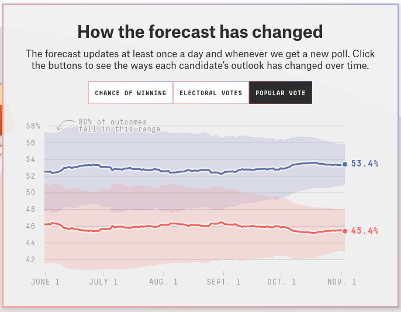
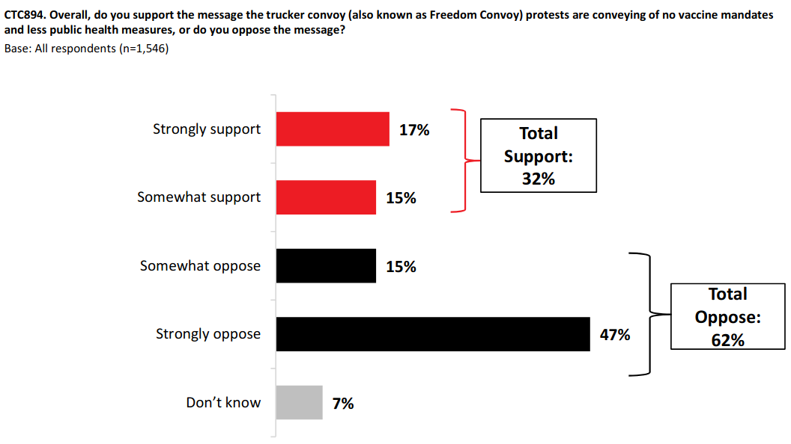
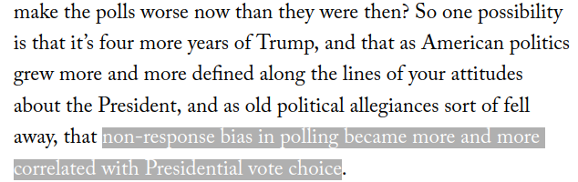
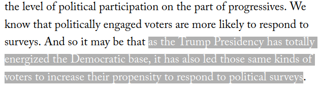
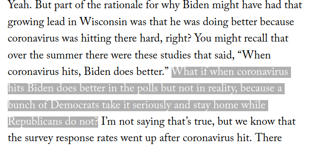
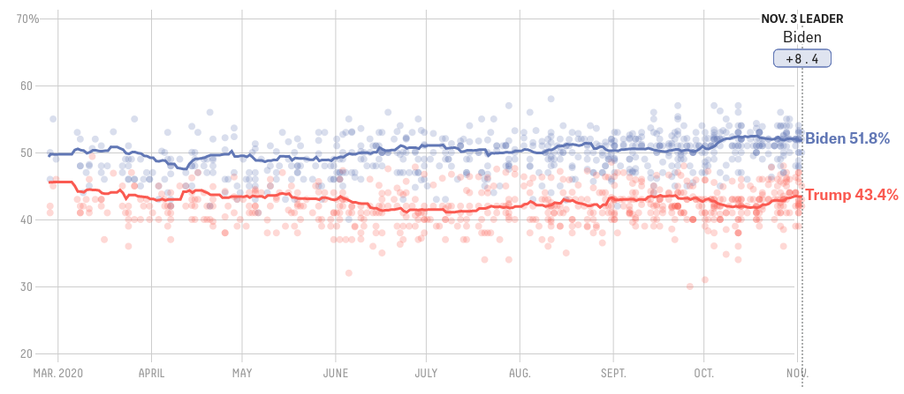

```{r setup, include=FALSE}
knitr::opts_chunk$set(echo = FALSE)
require(haven)
require(data.table)
require(ggplot2)
require(magrittr)
```

## Objectives

### (1) **Measurement Error**

- **Bias/Systematic**
- **Random**
- **Sources** and **Solutions**

### (2) **Sampling Error**

- **Population, Sample, Inference**
- **Sampling Bias**
- **Random Sampling Error**


# Measurement Error

## Measurement Error

### **measurement error**

is a **difference** between the **true** value of a variable for a case and the **observed value** of the variable for that case produced by the measurement procedure.

$$\mathrm{Value}_{observed} - \mathrm{Value}_{true} \neq 0 \xrightarrow{then} \mathrm{measurement \ error}$$

## Measurement Bias

measurement **bias** or **systematic measurement error**: error produced when our measurement procedure obtains values that are, **on average**, too high or too low (or, incorrect) compared to the truth. 

- Key phrase is "on average": error is not a one-off fluke, will happen **systematically** even if you repeat the measurement procedure.
- can have an *upward* (observed value too high) or *downward* (observed value too low) bias
- **not** "politically" biased
- bias might not be the same for all cases or different across subgroups
    - example: economic evaluations and partisanship in surveys


## Random Measurement Error

**random measurement error**: errors that occur due to *random* features of measurement process or phenomenon and the values that we measure are, **on average**, correct

- Due to chance, we get values that are too high or too low
- May be lots of errors
- But, if no systematic tilt one way or another (no bias)
- In aggregate, values that are "too high" are balanced out by values that are "too low"

## Example: Facebook and Hate Crime

### [**Mueller and Schwarz (2021)**](https://doi.org/10.1093/jeea/jvaa045) ask:

<br>

#### **Is social-media hate speech related to real-world violence?**

<br>

- Are there higher levels of **anti-refugee** violence in places with more social media access in weeks with more social media anti-refugee hate speech?
- Address this question in the context of Germany (2015-2017)

## Example: Facebook and Hate Crime

Need three concepts/variables/measures:

2. Anti-refugee violence
1. Anti-refugee rhetoric on Facebook
3. Exposure to Facebook

<br>

For each one, what are possible kinds of measurement error?

## Example: Facebook and Hate Crime

**concept**: Anti-refugee Violence

<br>

**variable**: Attacks against refugee persons and property per 10k refugees

<br>


**measure**: (for each week in each municipality)

<br>


## Example: Facebook and Hate Crime

**concept**: Anti-refugee rhetoric on social media

<br>

**variable**: Number of anti-refugee posts on Facebook per week

<br>

**measure**:

<br>


## Example: Facebook and Hate Crime

Example Facebook posts:

<br>


<br>


## Example: Facebook and Hate Crime


**concept**: "Exposure to Facebook": persons who have an active Facebook account

<br>

**variable:** Active facebook users in a municipality per 10k people.

<br>

**measure:** Followers of Nutella Germany on Facebook (who share their location information) per capita

- out of ~$63,000$ Nutella followers, only ~$22,000$ shared their location


---


---

## Example: Facebook and Hate Crime

If we are not concerned about the measures, then we can say:

**descriptively**, anti-refugee hate-crimes are more common when there is more anti-refugee hate speech on Facebook.

>- We cannot yet say anything about causality

## Systematic Measurement Error/Bias

### Causes

**($1$) Researcher subjectivity/interpretation**: Researcher systematically biased in how she evaluates cases

- e.g.: Resume experiments show HR professionals exhibit gender, racial bias.
- explicit or implicit stereotyping
- e.g. perceptions of "objective threat" to police

## Systematic Measurement Error/Bias

### Causes

**($2$) Obstacles to observation** 

- **social norms** may discourage revelation of information; downward bias in "undesirable" phenomena
    - e.g. survey measure of racism or drug use $\xrightarrow{}$ **social desirability bias**
- **incentives to hide/misrepresent**: political actors have strategic reasons to conceal information from each other
    - e.g. police use-of-force encounter reports on "objective threat" of black suspects [(Fryer 2019)](https://scholar.harvard.edu/files/fryer/files/empirical_analysis_tables_figures.pdf) (upward bias)
    - e.g. wealthy people may misrepresent assets to avoid taxation (downward bias)
    
## Example: Immigration

If we surveyed Canadians and asked them:
    
**"And would you support or oppose stopping all immigration into Canada?"**

They can choose "oppose", "support", "neither support nor oppose"

> **Do you think this survey response would suffer from measurement bias?**

>- What kind of measurement bias?

## Example: Immigration

**List experiments**


(board)

## Example: Immigration

**List experiments** in US vs Canada


How many people are **opposed** to **stopping** immigration?

## Random Measurement Error

### Causes

- Imperfect memory (survey/interviews)
- Mistakes
- "Random" changes in mood/concerns (for surveys)
    - e.g. rain might make you more angry and support government less
- Researcher interpretation 
    - e.g. random differences in classifying cases (like flipping a coin when you can't tell how to classify case)
    
##  Solutions?

1. **Researcher subjectivity**:
    
    - More precise, clear rules for measurement procedure
    
2. **Obstacles to observation**:

    - Social norms: Protect anonymity, subtler measurement
    - Incentives to hide/misrepresent: use private records, behavior not statements, interview after incentives gone

3. **Random errors**: more data

## Measurement Error

|  | **Systematic/Bias** | **Random Error** |
|-----------------------|-------------------------------------------|-------------------------------------------------------------|
| **Pattern** | Errors are systematic<br>(deviate from truth, on average) | Errors are random<br>(correspond to truth, on average) |
| **When it's OK** | If it is UNIFORM across cases <br> and we want relative values | If  false negative better<br>than false positive |
| **When it's Not OK** | If it is different across cases/ <br>or we want absolute values | If we need precision/<br> observe few cases|
| **Solved by more data?** | No, bias persists. | Yes, random errors "wash out" |

(Board)

# An Example

## Polling the US 2020 Election

Multiple "poll aggregators":



## Polling the US 2020 Election

But polls underestimated votes for Trump


## Polling the US 2020 Election


What are some reasons that polling in the US 2020 Presidential Election (and in general) was so wrong?


# Sampling Error

## Sampling

### **Sometimes we cannot answer descriptive claims directly**

We would have to observe **too many** cases.

### Example:

**"How many Canadians support the "Freedom Convoy" protests?"**

<br>

We can't interview **all Canadians**...

## Sampling

### Survey $1546$ Canadian adults (2/4-2/6)



## Sampling

### Key terms:

**population**: full set of cases (countries, individuals, etc.) we're interested in describing

**sample**: a *subset* of the population that we observe and measure

**inference**: description of the (unmeasured) **population** we make *based on the (measured) **sample***

and there is **uncertainty** about what is true about the population, because we **only measure a sample**

## Example:

[Measuring support for the "Freedom Convoy"](https://2g2ckk18vixp3neolz4b6605-wpengine.netdna-ssl.com/wp-content/uploads/2022/02/Legers-North-American-Tracker-February-7th-2022.pdf)

The **population**:

- All Canadian adults

The **sample**: 

- $1546$ Canadians chosen **at random** from pool of 400k possible survey respondents recruited at random using cell and landline calls

The **inference**:

- 62% of Canadians oppose, 32% support the convoy ($\pm$ 2.5%: uncertainty due to sampling)


---

### **sampling error**:

The difference between the value of the measure for the sample and the true value of the measure for the population

$$\mathrm{Value}_{sample} - \mathrm{Value}_{population} \neq 0 \xrightarrow{then} \mathrm{sampling \ error}$$

>- Just like **measurement error**, there are two types: one that is **bias** and one that is **random**

---

### **sampling error**:

$1$. **sampling bias**: cases in the sample are not representative of the population: not every member of population has equal chance of being in sample. Error is consistently in the same direction.

>- What might be examples of sampling bias in the survey on the "Freedom Convoy"?

## Example



## Example



## Example



---

### **sampling error**:

$2$. **random sampling error**: when choosing samples, by chance, we will get samples where the average is **too high** or **too low** compared to the population, but these errors would cancel out. (captured by **margin of error**)

## Example



With **random** samples, sometimes we get a sample with too many Biden supporters, sometimes we get a sample with too many Trump supporters. This uncertainty is mathematically known.


## Sampling

For **sampling** to be work, we want to

1. Ensure the sample is **representative** of the population (does not differ systematically from the population): *eliminate **sampling bias***
2. Know the level of **uncertainty** associated with our inference: *quantify **random sampling error***

To do get both we need:

**random sampling**: sampling cases from the population in a manner that gives **all cases an equal probability** of being chosen.

## Conclusion:

**Measurement Error**

- know how to recognize both types
- what are the sources of these errors
- when are they a problem/not

**Sampling**

- what is it? (population, sample, inference)
- random sampling
- recognize sampling bias vs. random sampling error
