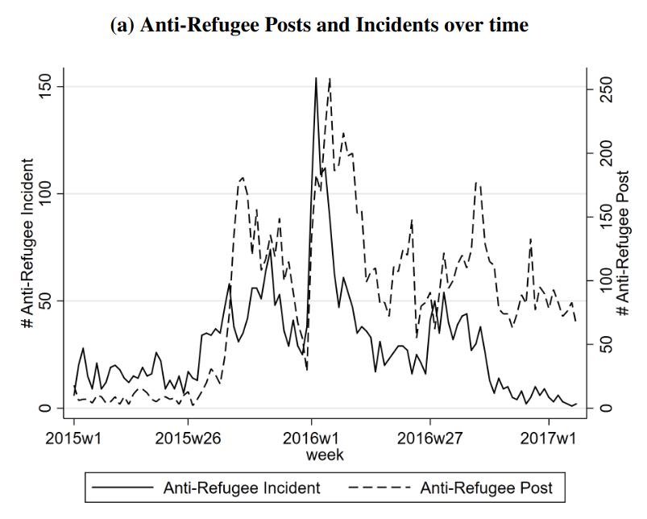

```{r setup, include=FALSE}
knitr::opts_chunk$set(echo = FALSE)
require(haven)
require(data.table)
require(ggplot2)
require(magrittr)
```

<script type="text/x-mathjax-config">
MathJax.Hub.Config({
TeX: {extensions: ["cancel.js"]}
});
</script> 


## Objectives

### (1) **Measurement Error**

- **Bias/Systematic**
- **Random**
- **Sources** and **Solutions**


# Measurement Error

---

### Descriptive Claim

**Concepts not transparent/systematic** $\xrightarrow{\xcancel{weak \ severity}}$


Variable does not map onto concept **(lack of validity)** $\xrightarrow{\xcancel{weak \ severity}}$ or $\xrightarrow{\xcancel{pass \ severe \ test}}$

Procedure does not return the true value **(measurement error)** $\xrightarrow{\xcancel{pass \ severe \ test}}$ 


### $\xcancel{\to}$ "Answer"

## Measurement Error

### **measurement error**

is a **difference** between the **true** value of a variable for a case and the **observed value** of the variable for that case produced by the measurement procedure.

$$\mathrm{Value}_{observed} - \mathrm{Value}_{true} \neq 0 \xrightarrow{then} \mathrm{measurement \ error}$$

## Measurement Bias

measurement **bias** or **systematic measurement error**: error produced when our measurement procedure obtains values that are, **on average**, too high or too low (or, incorrect) compared to the truth. 

- Key phrase is "on average": error is not a one-off fluke, will happen **systematically** even if you repeat the measurement procedure.
- can have an *upward* (observed value too high) or *downward* (observed value too low) bias
- **not** "politically" biased
- bias might not be the same for all cases or different across subgroups

## Random Measurement Error

**random measurement error**: errors that occur due to *random* features of measurement process or phenomenon and the values that we measure are, **on average**, correct

- Due to chance, we get values that are too high or too low
- May be lots of errors
- But, if no systematic tilt one way or another (no bias)
- In aggregate, values that are "too high" are balanced out by values that are "too low"

## Practice

```{r, echo = F, message=F}
require(ggplot2)
n = 10000
x1 = rnorm(n, 0, 0.5) + 1
x2 = rnorm(n, 0, 3)
x3 = rnorm(n, -7, 3)
plot_data = data.frame(Measure = rep(paste0("X",1:3), each = n), value = c(x1, x2, x3))
xlims = range(c(x1,x2, x3))
ggplot(plot_data, aes(value, fill = Measure)) + 
  geom_histogram(bins = 100, alpha = 0.5, position = 'identity') +
  labs(title = 'Measurement error for\ndifferent measures of variable X') + xlab("Observed Value X - True Value X") + ylab("# of Cases") + 
  theme_bw() +
  geom_vline(xintercept = 0, colour = 'red')
```

Go to [menti.com/](https://www.menti.com/) and enter the code $3484 \ 7512$

---

<div style='position: relative; padding-bottom: 56.25%; padding-top: 35px; height: 0; overflow: hidden;'><iframe sandbox='allow-scripts allow-same-origin allow-presentation' allowfullscreen='true' allowtransparency='true' frameborder='0' height='315' src='https://www.mentimeter.com/embed/69e188f2c79c30b9ccf182ae7859563a/e5831669bcd0' style='position: absolute; top: 0; left: 0; width: 100%; height: 100%;' width='420'></iframe></div>

## How do we know...

...if there is measurement error?

We only observe what we observe, how do we know procedure does not return the **true** value?

1. comparison with known quantities or better measurement procedures (e.g., comparing scales)
2. we understand **process** of observation to identify limitations and incentives that might lead to errors.

## What do we do...

...if there is measurement error?

Measurement error is everywhere. Does not mean we can say nothing about descriptive claims.

1. Depending on the descriptive claim, some types of measurement error are tolerable.
2. Depending on the **direction** of the measurement error, we may still be able to evaluate claims
3. Depending on the **magnitude** of the measurement error, errors may be irrelevant

## Goals:

1. Understand **reasons** measurement error occurs, so we can recognize it.
2. Know what the **pattern** of errors are: so we can identify the **type**, **direction** (if biased), and  **magnitude** of the error.
3. Guidelines for how errors affect evidence for claims.


## Example: Facebook and Hate Crime

### [**Mueller and Schwarz (2021)**](https://doi.org/10.1093/jeea/jvaa045) ask:

<br>

#### **Do hate-crimes occur more frequently at times when there is more social-media hate speech?**

<br>

- Are there higher levels of **anti-refugee** violence in weeks with more social media anti-refugee hate speech?
- Is anti-refugee violence higher in places with more social media users?
- Address this question in the context of Germany (2015-2017)

## Example: Facebook and Hate Crime

Need two concepts/variables/measures:

1. Anti-refugee violence
2. Anti-refugee rhetoric on Facebook
3. Facebook users

<br>

For each one, what are possible kinds of measurement error?

## Example: Facebook and Hate Crime

**concept**: Anti-refugee Violence

<br>

**variable**: Number of attacks against refugee persons and property

<br>

**measure**: (for each week)

<br>


## Example: Facebook and Hate Crime

**concept**: Anti-refugee speech on social media

<br>

**variable**: Number of anti-refugee posts on Facebook per week

<br>

**measure**:

<br>


## Example: Facebook and Hate Crime

Example Facebook posts:

<br>


<br>


---

**concept**: "Exposure to Facebook": persons who have an active Facebook account

<br>

**variable:** Active facebook users in a municipality per 10k people.

<br>

**measure:** Followers of Nutella Germany on Facebook (who share their location information) divided by population

- out of ~$63,000$ Nutella followers, only ~$22,000$ shared their location

---

In groups, discuss possible sources of measurement error in the following:


* Followers of Nutella Germany on Facebook (who share their location information) divided by population


---

What pattern do we see here between anti-refugee Facebook posts and anti-refugee violence over time?




---

Could the sources of measurement error we discussed alter our conclusions?


# Why measurement error?

## Why it happens:

Unlike in hard sciences, not usually a calibration error.

Errors arise from the fact that observations are made by and of people:

- humans involved in observation process may have mis-perceptions
- humans who are being observed have motives/incentives to mis-represent things
- humans use measurement tools for purposes other than intended

## Systematic Measurement Error/Bias

### Causes

**($1$) Subjectivity/Perspective**: Researcher/data collector systematically perceives and evaluates cases incorrectly

Examples:

- Resume experiments show HR professionals exhibit gender, racial bias in evaluating "professionalism" for job
- Perceptions of "objective threat" written in police reports
- Little and Meng (2024) on democracy scores.

---

### Systematic Measurement Error/Bias Causes

**($2$) Motives/Incentives to mis-represent**: beyond researchers, people *generating* the data

- **social norms** may discourage revelation of information; downward bias in "undesirable" phenomena
    - e.g. survey measure of racism or drug use $\xrightarrow{}$ **social desirability bias**
    - e.g. values in society about what is important/interesting affects news reporting
- **incentives to hide/misrepresent**: political actors have strategic reasons to conceal information from each other
    - e.g. police use-of-force encounter reports on "objective threat" of black suspects [(Fryer 2019)](https://scholar.harvard.edu/files/fryer/files/empirical_analysis_tables_figures.pdf) (upward bias)
    - e.g. wealthy people may misrepresent assets to avoid taxation (downward bias)
    
## Example: Immigration

If we surveyed Canadians and asked them:
    
**"And would you oppose stopping all immigration into Canada?"**

They can choose "oppose", "support", "neither support nor oppose"

> **Do you think this survey response would suffer from measurement bias?**

>- What **direction** of measurement bias?

## Example: Immigration

**List experiments**


(board)

## Example: Immigration

**List experiments** in US vs Canada


How many people are **opposed** to **stopping** immigration?

## Example: Immigration

When discussing crime rates for natural-born citizens, legal immigrants, and undocumented immigrants, need to get the **number of undocumented immigrants**.

Why might it be difficult to correctly count?

## Example: Immigration


## Systematic Measurement Error/Bias

### Causes

**($3$) Use of data beyond its intended purposes**: without knowing how data is produced, unanticipated errors can arise.


- Example: crime rates for undocumented migrants in Texas.


---

[Kennedy et al](https://cis.org/Report/Misuse-Texas-Data-Understates-Illegal-Immigrant-Criminality), argue:

- It takes time for undocumented immigrants in custody to be identified. 

    - $\to$ **undercounting** of arrested undocumented
    - $\to$ more **undercounting** in recently arrested

- Only people in custody for longer periods of time for serious crimes likely to be thoroughly checked:

    - $\to$ undercounting is lower/minimal for **homicide convictions**
    - $\to$ need to use DHS **and** Texas prison (TDCJ) checks on migration status

---


>- Argue that "fixing" measurement problems, conclusions reversed.

---

[Alex Nowsrateh](https://www.alexnowrasteh.com/p/illegal-immigrants-have-a-low-homicide) shows that these conclusions came from misunderstanding of the Texas data:

- people labelled as undocumented by DHS also labeled as undocumented by TDCJ
- some people labelled as undocumented by DHS later discovered to be legal by TDCJ

Kennedy et al takes **sum** of undocumented from DHS and TDCJ

---

> "We can supply the number uniquely identified by TDCJ (Prison category) and the total number of Illegals identified through PEP (*this can include illegals also identified by TDCJ*). Please note, if someone was uniquely identified through TDCJ, but at a later time is identified through PEP, the individual would no longer be in the Prison category and would reflect the PEP identification" [emphasis added].


---


---

## Random Measurement Error

### Causes

- Imperfect memory (survey/interviews)
- Mistakes
- "Arbitrary" changes in mood/concerns (for surveys)
    - e.g. rain might make you more angry and support government less
- Researcher interpretation 
    - e.g. random differences in classifying cases (like flipping a coin when you can't tell how to classify case)
    
Anything that affects the values we observe that is **unrelated** to the actual values for the cases we want to observe.    
    
## If errors, then...

1. We need to distinguish between **random** and **systematic** errors. Does the **source** of the error suggest a **systematic** direction to the error?

2. Is the **magnitude** of the error likely to be large or small? Is it possible to assess how wrong it could be?

3. If the error is a **bias**, what is the systematic pattern that is produced? (upward?, downward?)
    
    
## Is it a problem?

- **what is the type of a specific phenomenon**: **bias** and **random** error a problem.
- **amount/frequency of phenomena**: **bias**/**random error** is a problem.
- **relative amount/frequency of phenomena across different places/times**: **bias** is ok if it is *constant*. **random error** is a problem
- **what patterns are there between two different phenomena**: **bias** is ok if it is *constant*. **random error** a problem

    
    
## Measurement Error

|  | **Systematic/Bias** | **Random Error** |
|-----------------------|-------------------------------------------|-------------------------------------------------------------|
| **Pattern** | Errors are systematic<br>(deviate from truth, on average) | Errors are random<br>(correspond to truth, on average) |
| **When it's OK** | If it is UNIFORM across cases <br> and we want relative values | If  false negative better<br>than false positive |
| **When it's Not OK** | If it is different across cases/ <br>or we want absolute values | If we need precision/<br> observe few cases|
| **Solved by more data?** | No, bias persists. | Yes, random errors "wash out" |

## Conclusion:

**Measurement Error**

- know how to recognize both types
- what are the sources of these errors
- when are they a problem/not

