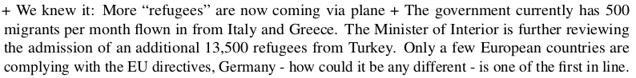

```{r setup, include=FALSE}
knitr::opts_chunk$set(echo = FALSE)
require(haven)
require(data.table)
require(ggplot2)
require(magrittr)
```

## Objectives

### (1) **Measurement Error**

- **Bias/Systematic**
- **Random**
- **Sources** and **Solutions**

### (2) **Sampling Error**

- **Sampling Bias**
- **Random Sampling Error**


# Measurement Error

## Measurement Error

### **measurement error**

is a **difference** between the **true** value of a variable for a case and the **observed value** of the variable for that case produced by the measurement procedure.

$$\mathrm{Value}_{observed} - \mathrm{Value}_{true} \neq 0 \xrightarrow{then} \mathrm{measurement \ error}$$

## Measurement Bias

measurement **bias** or **systematic measurement error**: error produced when our measurement procedure obtains values that are, **on average**, too high or too low (or, incorrect) compared to the truth. 

- Key phrase is "on average": error is not a one-off fluke, will happen **systematically** even if you repeat the measurement procedure.
- can have an *upward* (observed value too high) or *downward* (observed value too low) bias
- **not** "politically" biased
- bias might not be the same for all cases or different across subgroups
    - example: economic evaluations and partisanship in surveys


## Random Measurement Error

**random measurement error**: errors that occur due to *random* features of measurement process or phenomenon and the values that we measure are, **on average**, correct

- Due to chance, we get values that are too high or too low
- May be lots of errors
- There is no systematic tilt one way or another (no bias)
- In aggregate, values that are "too high" are balanced out by values that are "too low" compared to the truth

## Example: Facebook and Hate Crime

### **Mueller and Schwarz (2018)** ask:

<br>

#### **Is social-media hate speech related to real-world violence?**

<br>

- Are there higher levels of **anti-refugee** violence in places with higher exposure to **anti-refugee** rhetoric via Facebook?
- Address this question in the context of Germany (2015-2017)

## Example: Facebook and Hate Crime

Need three concepts/variables/measures:

1. Anti-refugee rhetoric on Facebook
2. Anti-refugee violence
3. Exposure to Facebook

## Example: Facebook and Hate Crime

**concept**: Anti-refugee Violence

<br>

**variable**: Attacks against refugee persons and property per 10k refugees

<br>


**measure**: (for each week in each municipality)

<br>


## Example: Facebook and Hate Crime

**concept**: Anti-refugee rhetoric on Facebook

<br>

**variable**: Number of anti-refugee posts on Facebook per week

<br>

**measure**:

<br>


## Example: Facebook and Hate Crime

Example Facebook posts:

<br>


<br>




## Example: Facebook and Hate Crime

**concept**: "Exposure to Facebook": persons who have an active Facebook account

<br>

**variable**: Active facebook users in a municipality per 10k people.

<br>

**measure**: With your neighbors, propose a measure for this variable (it can be imperfect).

<br>

**One team member submits at `menti.com 65 80 01`**

---

<div style='position: relative; padding-bottom: 56.25%; padding-top: 35px; height: 0; overflow: hidden;'><iframe sandbox='allow-scripts allow-same-origin' allowfullscreen='true' allowtransparency='true' frameborder='0' height='315' src='https://www.mentimeter.com/embed/c70c86d50d064abd92bc2d1c2bec1f75/6f295982d7d8' style='position: absolute; top: 0; left: 0; width: 100%; height: 100%;' width='420'></iframe></div>

#


## Example: Facebook and Hate Crime


**concept**: "Exposure to Facebook": persons who have an active Facebook account

<br>

**variable:** Active facebook users in a municipality per 10k people.

<br>

**measure:** Followers of Nutella Germany on Facebook (who share their location information) per capita

- out of ~$63,000$ Nutella followers, only ~$22,000$ shared their location
- measurement bias? random measurement error?


## Systematic Measurement Error/Bias

### Sources

**($1$) Researcher subjectivity/interpretation**: Researcher systematically over-weights, under-weights dimension of concept

- e.g.: Expert interviews to assess "political knowledge" may inform assessment using visual/language cues 
- e.g.: Resume experiments: HR professionals exhibit gender, racial bias.

## Systematic Measurement Error/Bias

### Sources

**($2$) Obstacles to observation** 

- **social norms** may discourage revelation of information; downward bias in "undesirable" phenomena
    - e.g. survey measure of racism or drug use $\xrightarrow{}$ **social desirability bias**
- **incentives to hide/misrepresent**: political actors have strategic reasons to conceal information from each other
    - e.g. states may present their military capacity to be better than it is (upward bias)
    - e.g. wealthy people may present themselves as less wealthy to avoid negative attention (downward bias)
    
## Example: Immigration

If we surveyed Canadians and asked them:
    
**"And would you support or oppose stopping all immigration into Canada?"**

They can choose "oppose", "support", "neither support nor oppose"

> **Do you think this survey response would suffer from measurement bias?**

## Example: Immigration

**List experiments**


## Example: Immigration

**List experiments** in US vs Canada


## Random Measurement Error

### Sources

- Imperfect memory (survey/interviews)
- "Random" changes in mood/concerns (for surveys)
    - e.g. rain might make you more angry and support government less
- Researcher interpretation 
    - e.g. random differences in classifying cases (like flipping a coin when you can't tell how to classify case)
    
##  Solutions?

1. **Researcher subjectivity**:
    
    - More precise, clear rules for measurement procedure
    
2. **Obstacles to observation**:

    - Social norms: Protect anonymity, subtler measurement
    - Incentives to hide/misrepresent: use private records, behavior not statements, interview after incentives gone

3. **Random errors**: more data

## Measurement Error

|  | **Systematic/Bias** | **Random Error** |
|-----------------------|-------------------------------------------|-------------------------------------------------------------|
| **Pattern** | Errors are systematic<br>(deviate from truth, on average) | Errors are random<br>(correspond to truth, on average) |
| **When it's OK** | If it is UNIFORM across cases <br> and we want relative values | If  false negative better<br>than false positive |
| **When it's Not OK** | If it is different across cases/ <br>or we want absolute values | If we need precision/<br> observe few cases|
| **Solved by more data?** | No, bias persists. | Yes, random errors "wash out" |

## False negatives/False positives:

**claim**: "German communities with more Facebook users have more anti-refugree violence."

a **false negative** is incorrectly concluding that this claim is wrong. Might be preferable to make this mistake than to incorrectly conclude that the claim is right (**false positive**).

<br>

In **social science**, we usually prefer false negatives (no difference when there is a difference) to false positives when making comparisons. Random measurement error makes differences in groups harder to detect.

<br>

When might **false negatives** be a **bad thing**?

# Sampling Error

## Sampling

### **Sometimes we cannot answer descriptive claims directly**

We would have to observe **too many** cases.

### Example:

**"Most Americans prefer a ban on semi-automatic firearms."**

<br>

We can't interview **all Americans**...

## Sampling

### Survey with $1500$ people


## Sampling

### Key terms:

**population**: full set of cases (countries, individuals, etc.) we're interested in describing

**sample**: a *subset* of the population that we observe and measure

**inference**: description of the (unmeasured) **population** we make *based on a (measured) **sample***

## Example:

Measuring attitudes on gun control in the US:

The **population**:

- All adults in the US

The **sample**: 

- 1500 people chosen **at random**

The **inference**:

- 57% of Americans want ban on semi-automatic weapons, with some **uncertainty** due to sampling


## Sampling

For **sampling** to work, we need to 

1. Ensure the sample is **representative** of the population (does not differ from the population)
2. Know the level of **uncertainty** associated with our inference

To do get both we need:

**random sampling**: sampling cases from the population in a manner that gives **all cases an equal probability** of being chosen

---

### **sampling error**:

The difference between the value of the measure for the sample and the true value of the measure for the population

$$\mathrm{Value}_{sample} - \mathrm{Value}_{population} \neq 0 \xrightarrow{then} \mathrm{sampling \ error}$$

### Two varieties

1. **sampling bias**: cases in the sample are not representative of the population: not every member of population has equal chance of being in sample. Error is consistently in the same direction
2. **random sampling error**: with random sampling, by chance, we get samples where the average is **too high** or **too low** compared to the population, but these errors would cancel out.

## Example: Commuting

### **How long does it take for you to get from home to UBC (in minutes)?**

<br>

go to `menti.com` and use code 12 31 09 to respond

---

Take as the "population": students in class today

<div style='position: relative; padding-bottom: 56.25%; padding-top: 35px; height: 0; overflow: hidden;'><iframe sandbox='allow-scripts allow-same-origin' allowfullscreen='true' allowtransparency='true' frameborder='0' height='315' src='https://www.mentimeter.com/embed/f944d685e9a8a2b1ed3a5897b970de4d/b4f00f1e7f44' style='position: absolute; top: 0; left: 0; width: 100%; height: 100%;' width='420'></iframe></div>


## Example: Commuting

### **Random Sampling**

We will take $5$ random samples of those in class today by using the last digit of your phone number.

### **How long does it take for you to get from home to UBC (in minutes)?**

<br>

go to `menti.com` and use code 67 33 97 to respond. **only respond to the item corresponding to the last last digit of your phone number**

---

**5 random samples**

<div style='position: relative; padding-bottom: 56.25%; padding-top: 35px; height: 0; overflow: hidden;'><iframe sandbox='allow-scripts allow-same-origin' allowfullscreen='true' allowtransparency='true' frameborder='0' height='315' src='https://www.mentimeter.com/embed/cfe30601a9ffb36c76aba5cde4727a51/dca96accd7d7' style='position: absolute; top: 0; left: 0; width: 100%; height: 100%;' width='420'></iframe></div>

## Example: Commuting

- What if our **population** were "**students enrolled in this course**"

- What if our **sample** were "**students in lecture on Tuesday (Feb 4, 2020)**" 

<br>

> **Would this sample <u>underestimate</u>, <u>overestimate</u>, or (approx.) <u>correctly estimate</u> commute times for all students in enrolled in the course**

## Conclusion:

1. **Measurement Error**

- know how to recognize both types
- what are the sources of these errors
- when are they a problem/not

2. **Sampling**

- what is it? (population, sample, inference)
- random sampling
- recognize sampling bias vs. random sampling error
