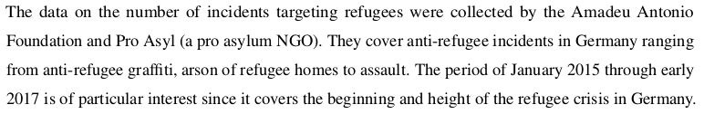

```{r setup, include=FALSE}
knitr::opts_chunk$set(echo = FALSE)
require(haven)
require(data.table)
require(ggplot2)
require(magrittr)
```

## Objectives

### (1) **Measurement Error**

- **Bias/Systematic**
- **Random**
- **Sources** and **Solutions**

### (2) **Sampling Error**

- **Population, Sample, Inference**
- **Sampling Bias**
- **Random Sampling Error**


# Measurement Error

## Measurement Error

### **measurement error**

is a **difference** between the **true** value of a variable for a case and the **observed value** of the variable for that case produced by the measurement procedure.

$$\mathrm{Value}_{observed} - \mathrm{Value}_{true} \neq 0 \xrightarrow{then} \mathrm{measurement \ error}$$

## Measurement Bias

measurement **bias** or **systematic measurement error**: error produced when our measurement procedure obtains values that are, **on average**, too high or too low (or, incorrect) compared to the truth. 

- Key phrase is "on average": error is not a one-off fluke, will happen **systematically** even if you repeat the measurement procedure.
- can have an *upward* (observed value too high) or *downward* (observed value too low) bias
- **not** "politically" biased
- bias might not be the same for all cases or different across subgroups
    - example: economic evaluations and partisanship in surveys


## Random Measurement Error

**random measurement error**: errors that occur due to *random* features of measurement process or phenomenon and the values that we measure are, **on average**, correct

- Due to chance, we get values that are too high or too low
- May be lots of errors
- But, if no systematic tilt one way or another (no bias)
- In aggregate, values that are "too high" are balanced out by values that are "too low"

## Practice

```{r, echo = F, message=F}
require(ggplot2)
n = 10000
x1 = rnorm(n, 0, 0.5) + 1
x2 = rnorm(n, 0, 3)
x3 = rnorm(n, -7, 3)
plot_data = data.frame(Measure = rep(paste0("X",1:3), each = n), value = c(x1, x2, x3))
xlims = range(c(x1,x2, x3))
ggplot(plot_data, aes(value, fill = Measure)) + 
  geom_histogram(bins = 100, alpha = 0.5, position = 'identity') +
  labs(title = 'Measurement error for\ndifferent measures of variable X') + xlab("Observed Value X - True Value X") + ylab("# of Cases") + 
  theme_bw() +
  geom_vline(xintercept = 0, colour = 'red')
```

Go to [menti.com/](https://www.menti.com/) and enter the code $3484 \ 7512$

---

<div style='position: relative; padding-bottom: 56.25%; padding-top: 35px; height: 0; overflow: hidden;'><iframe sandbox='allow-scripts allow-same-origin allow-presentation' allowfullscreen='true' allowtransparency='true' frameborder='0' height='315' src='https://www.mentimeter.com/embed/69e188f2c79c30b9ccf182ae7859563a/e5831669bcd0' style='position: absolute; top: 0; left: 0; width: 100%; height: 100%;' width='420'></iframe></div>

## Example: Facebook and Hate Crime

### [**Mueller and Schwarz (2021)**](https://doi.org/10.1093/jeea/jvaa045) ask:

<br>

#### **Do hate-crimes occur more frequently at times when there is more social-media hate speech?**

<br>

- Are there higher levels of **anti-refugee** violence in weeks with more social media anti-refugee hate speech?
- Address this question in the context of Germany (2015-2017)

## Example: Facebook and Hate Crime

Need two concepts/variables/measures:

1. Anti-refugee violence
2. Anti-refugee rhetoric on Facebook

<br>

For each one, what are possible kinds of measurement error?

## Example: Facebook and Hate Crime

**concept**: Anti-refugee Violence

<br>

**variable**: Number of attacks against refugee persons and property

<br>

**measure**: (for each week)

<br>


## Example: Facebook and Hate Crime

**concept**: Anti-refugee speech on social media

<br>

**variable**: Number of anti-refugee posts on Facebook per week

<br>

**measure**:

<br>


## Example: Facebook and Hate Crime

Example Facebook posts:

<br>


<br>


---


In groups: what conclusions can we draw based on this figure? What concerns, if any, do you have about measurement error?

---

## Example: Facebook and Hate Crime

Undoubtedly, these measures likely suffer from measurement bias...

If we wanted to know the **absolute number** of anti-refugee hate incidents, this is a problem.

If we wanted to know the **absolute number** of anti-refugee hate posts on social media, this is a problem.

If we want to compare **relative** frequency of hate crimes and hate speech, measurement bias is tolerable **IF the bias is unchanging**


---

What about **random measurement error**?

Later, same authors want to see if this pattern b/t social media hate speech and hate crimes is **stronger** in places with more exposure to Facebook:

**concept**: "Exposure to Facebook": persons who have an active Facebook account

<br>

**variable:** Active facebook users in a municipality per 10k people.

<br>

**measure:** Followers of Nutella Germany on Facebook (who share their location information) per capita

- out of ~$63,000$ Nutella followers, only ~$22,000$ shared their location


## Systematic Measurement Error/Bias

### Causes

**($1$) Researcher subjectivity/interpretation**: Researcher systematically biased in how she evaluates cases

- e.g.: Resume experiments show HR professionals exhibit gender, racial bias.
- explicit or implicit stereotyping
- e.g. perceptions of "objective threat" to police

## Systematic Measurement Error/Bias

### Causes

**($2$) Obstacles to observation** 

- **social norms** may discourage revelation of information; downward bias in "undesirable" phenomena
    - e.g. survey measure of racism or drug use $\xrightarrow{}$ **social desirability bias**
- **incentives to hide/misrepresent**: political actors have strategic reasons to conceal information from each other
    - e.g. police use-of-force encounter reports on "objective threat" of black suspects [(Fryer 2019)](https://scholar.harvard.edu/files/fryer/files/empirical_analysis_tables_figures.pdf) (upward bias)
    - e.g. wealthy people may misrepresent assets to avoid taxation (downward bias)
    
## Example: Immigration

If we surveyed Canadians and asked them:
    
**"And would you support or oppose stopping all immigration into Canada?"**

They can choose "oppose", "support", "neither support nor oppose"

> **Do you think this survey response would suffer from measurement bias?**

>- What kind of measurement bias?

## Example: Immigration

**List experiments**


(board)

## Example: Immigration

**List experiments** in US vs Canada


How many people are **opposed** to **stopping** immigration?

## Random Measurement Error

### Causes

- Imperfect memory (survey/interviews)
- Mistakes
- "Random" changes in mood/concerns (for surveys)
    - e.g. rain might make you more angry and support government less
- Researcher interpretation 
    - e.g. random differences in classifying cases (like flipping a coin when you can't tell how to classify case)
    
Anything that affects the values we observe that is **unrelated** to the actual values for the cases we want to observe.    
    
##  Solutions?

1. **Researcher subjectivity**:
    
    - More precise, clear rules for measurement procedure
    
2. **Obstacles to observation**:

    - Social norms: Protect anonymity, subtler measurement
    - Incentives to hide/misrepresent: use private records, behavior not statements, interview after incentives gone

3. **Random errors**: more data

## Measurement Error

|  | **Systematic/Bias** | **Random Error** |
|-----------------------|-------------------------------------------|-------------------------------------------------------------|
| **Pattern** | Errors are systematic<br>(deviate from truth, on average) | Errors are random<br>(correspond to truth, on average) |
| **When it's OK** | If it is UNIFORM across cases <br> and we want relative values | If  false negative better<br>than false positive |
| **When it's Not OK** | If it is different across cases/ <br>or we want absolute values | If we need precision/<br> observe few cases|
| **Solved by more data?** | No, bias persists. | Yes, random errors "wash out" |

(Board)

# Another Example

## Emergencies Act

Last year, the Federal Government invoked the Emergencies Act to disperse protests associated with the "Freedom Convoy" movement.

As part of a government inquiry into this event, a key question has been "Were the protests a 'threat to the security of Canada'?"

## Emergencies Act

Canadian Law defines a "threat to the security of Canada" as: 

> "espionage or sabotage of Canada’s interests, foreign influence, acts of serious violence against people or property with political, religious or ideological objectives, or the violent overthrow of the Canadian government"

What proportion of Canadians think the convoy protest was a "threat to the security of Canada" by this definition?

>- We can't ask **all Canadians**. We **can** ask **some**.

---

### Survey of  $5030$ Canadian adults (11/28-12/3 2022)


## Sampling

### Key terms:

**population**: full set of cases (countries, individuals, etc.) we're interested in describing (get a *value* for some *variable*)

**sample**: a *subset* of the population that we observe and measure

**inference**: description of the (unmeasured) **population** we make *based on the (measured) **sample***

and there is **uncertainty** about what is true about the population, because we **only measure a sample**

## Sampling

[Measuring beliefs about the "Freedom Convoy" and security threats](https://angusreid.org/wp-content/uploads/2023/01/2023.02.02_Federal_Emergencies.pdf)

The **population**:

- All Canadian adults (what fraction believe the protests were a "security threat")

The **sample**: 

- $5030$ Canadians chosen **at random** from pool of "hundreds of thousands" of possible survey respondents recruited to join the "Angus Reid Forum", weighted according to the current demographic data.

The **inference**:

- 51% of Canadians say protests a threat, 40% say not ($\pm$ 1%: uncertainty due to sampling)

---

### Survey of  $5030$ Canadian adults (11/28-12/3 2022)


Is this inference correct? Why or why not?

## Sampling

### **sampling error**:

The difference between the value of the variable measured for the sample and the true value of the variable for the population:

$$\mathrm{Value}_{sample} - \mathrm{Value}_{population} \neq 0 \xrightarrow{then} \mathrm{sampling \ error}$$

>- Just like **measurement error**, there are two types: one that is **bias** and one that is **random**


## Sampling

### **sampling error**:

$1$. **sampling bias**: the procedure of selecting cases for the sample consistently produces samples not representative of the population

- Not every member of population has equal chance of being in sample. 
- Errors are consistently in the same direction.

>- What might be examples of **sampling bias** in the survey on the "Freedom Convoy"?

## Sampling

### **sampling error**:

$2$. **random sampling error**: when choosing cases for a sample, **by chance**, we can get samples where the average is **too high** or **too low** compared to the population, but these errors would cancel out. 

>- What would be random sampling error in this example of the survey on the "Freedom Convoy"?
>- captured by **margin of error**

## Sampling

For **sampling** to work, we want to

1. Ensure the sample is **representative** of the population (does not differ systematically from the population): *eliminate **sampling bias***
2. Know the level of **uncertainty** associated with our inference: *quantify **random sampling error***

To do get both we need:

**random sampling**: sampling cases from the population in a manner that gives **all cases an equal probability** of being chosen. 

## Sampling Error vs Measurement Error

These are not entirely distinct.

Sometimes sampling error *is* measurement error.

Sometimes measurement error $\to$ sampling error

We will look again next week.

## Conclusion:

**Measurement Error**

- know how to recognize both types
- what are the sources of these errors
- when are they a problem/not

**Sampling**

- what is it? (population, sample, inference)
- recognize sampling bias vs. random sampling error
- random sampling

