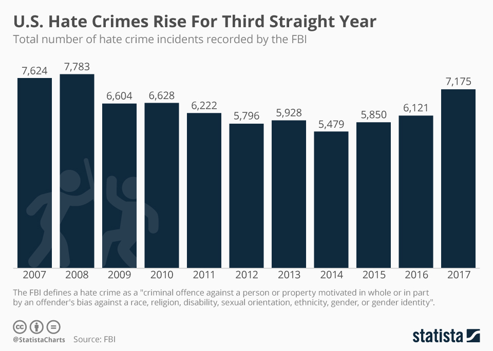
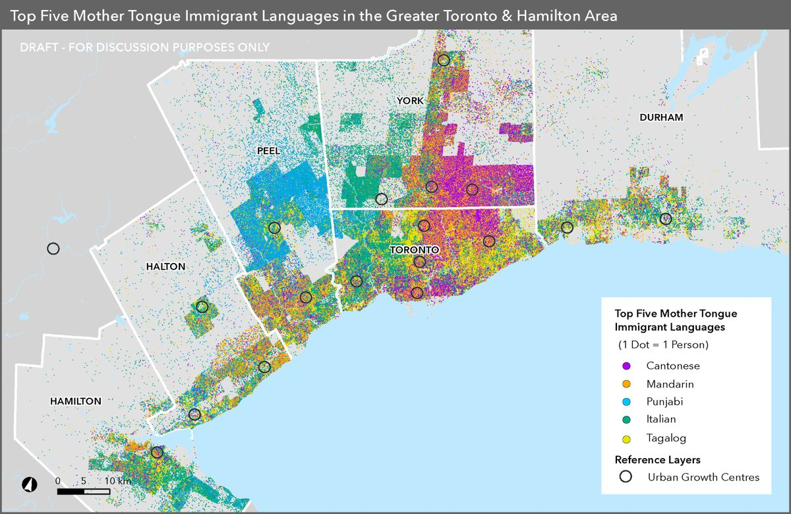
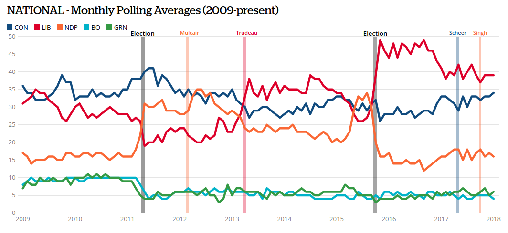

```{r setup, include=FALSE}
knitr::opts_chunk$set(echo = FALSE)
```

# Evaluating Descriptive Claims

## Plan for Today:

### (1) Recap: Concepts, Variables, Measures

### (2) Levels of Measurement

### (3) Problems with Variables

# Recap

## Concepts, Variables, Measures.

## Concepts to Measurement:

### **Concept** (and dimensions)

### $\xrightarrow{}$

### **Variable**(s)

- measurable properties of cases that map onto a concept

### $\xrightarrow{}$

### **Measure**(s)

- procedure to find the values variables take for *specific* cases

### $\xrightarrow{}$

### "Answer"

## Concepts to Measurement:

### **variable**(s):

A **measurable property** of a case (phenomena, group, or individual) that corresponds to a **concept** or one of the concept's **dimensions** and can *potentially* take on different **values** across cases and time (it *vari*es) across units.

- Derived to capture a concept
- Variables take on values for each case at a specific point in time
- *Vari*ation across **cases** or over **time**.
- General (e.g., "number of deaths in a civil war", not "number of deaths in the Syrian Civil War between 2011 and today")

## Concepts to Measurement:

### **Measure**(s)

A **procedure** for determining the value of a variable for **specific cases** based on **observation**.

- Measures are proposed to determine the **value** a variable takes for some cases
- They are always for some specific cases want to know about


## Concepts to Measurement:

### Question/Claim

### $\not\xrightarrow{}$ Concepts not scientific/irrelevant

### **Concept** (and dimensions)

### $\not\xrightarrow{}$ Variable does not map onto concept

### **Variable**(s)

### $\not\xrightarrow{}$ Procedure does not produce the true value

### **Measure**(s)

### "Answer"


## A Trivial Example:

### A descriptive question:

#### "Is West Lion taller than Seymour?"

### We need to:

- define a the concept of "height"
- create a variable that captures "height" and is measurable
- develop a measure to obtain values of that variable for West Lion and Seymour

## Concept to Measurement: {.build}

### Concept: Height (of a mountain)

Elevation of peak from the earth's surface

### $\xrightarrow{}$

### Variable: Vertical distance from sea level to the top of the peak

### $\xrightarrow{}$ 

### Measure:

Use difference in barometric pressure to calculate difference in elevation

## A Trivial Example:


Are you going to climb the mountain? Prominence might be a better concept of height.

## A Less Trivial Example

### Descriptive Claim:

"Societies that are ethnically diverse are less likely to be democracies"

### What do we need to know to evaluate this claim?

## A Less Trivial Example

> "Societies that are ethnically diverse are less likely to be democracies"

### Let's move from concept to measure with "ethnically diverse"

- What is the concept of "ethnic diversity"?
  - what is it to be "ethnically diverse"
  - observable traits?
  - traits/dimensions linked to causal story?

## A Less Trivial Example

> "Societies that are ethnically diverse are less likely to be democracies"

## A Less Trivial Example

### Ethnic diversity: a concept

- Presence of many different ethnic groups?
- Presence of many distinct and large ethnic groups?

## A Less Trivial Example

### Ethnic diversity: a variable:

Propose a variable that could map onto the concept of "ethnic diversity"

## A Less Trivial Example

### Ethnic diversity: a variable

#### Probability that any two random individuals belong to different ethnic groups

"Ethno-linguistic fractionalization": "ELF"

### $$ELF = 1 - \sum_{i=1}^{n} s_i^2$$ 

Where $s_i$ is fraction of population for group $i \in \lbrace 1 \ldots n \rbrace$


## A Less Trivial Example

### Ethnic diversity: a measure

Propose a measure that would assign a value for "Ethno-linguistic fractionalization" in a specific country

## A Less Trivial Example

### Ethnic diversity: a measure

Measure size of ethnic groups using *Atlas Narodov Mira*:
  
Soviet anthropological text from 1964 

- lists ethnic groups in each country
- lists the size of these groups

### Anything wrong here?

## Ethnic diversity: problems

### Concept:

- Different dimensions of ethnicity (e.g. language, religion, race, caste, tribe)
- Maybe **political relevance** matters (maybe differences between Greek, Italian, German, Irish, Scottish immigrant descendants in Canada are not relevant today)

### Variable:

- Country A: Group 1 50%, Group 2 50%
    - $ELF = 0.5$
- Country B: Group 1 66.6%, Group 2 16.6%, Group 3 16.6%
    - $ELF = 0.5$

## Ethnic diversity: revisions
    
### Measure:

Soviet anthropologists: 

- Are group sizes from 1964 correct?
- Distinct ethnic groups treated as the same, unified ethnic groups treated as different
- Rwanda: Hutus and Tutsis coded as one ethnic group.

# Variables

## Variables

We defined variables above... but it is important to note that

#### variables take on **values** for each case.

#### variables take different **kinds of values**

### In practice:

Variables take on values for each specific case at a specific point in time

- "Annual number of hate crimes"
- Case is a country/province/city, time is a year
- Can vary between countries/provinces/cities in year
- Can vary across years within a country/province/city


## Number of Hate Crimes

This is a variable. What values does it take?

>- Numeric values
>- Range: 0 to ?

Variations:

- Hate Crimes Per Capita
- Hate Crime Victimization Rate (number of hate crimes against a group $g$ per persons in group $g$)

## Number of Hate Crimes



## Languages



## Language spoken: {.build}

This is a variable: what values does it take?

>- Categories
>- No numeric range
>- One language is not "higher"/"lower" than another.

### But what if we counted the fraction of people?

## Another example:



## Variables

### The kinds of **values** taken by a **variable** is called its **level of measurement**

#### We consider four **levels of measurement**

- Nominal
- Ordinal
- Interval
- Ratio

#### Not to be confused with **measures**

## Levels of measurement: *nominal*

#### **nominal** levels of measurement place cases into unranked categories

- cases put into discrete groups based on presence/absence of attribute(s)
- No category is ranked higher or lower than another
- categories are exhaustive (every case can fit in a category)
    - sometimes we just have "other"

### Examples:

- Religion
- Pastisan affiliation
- Regime type (e.g. minimalist democracy vs non-democracy)
- Type of crime (e.g.  hate vs. economic vs. personal etc.)

## Levels of measurement: *ordinal*


#### **ordinal** levels of measurement place cases into categories that are ranked in some way
 
- Categories are **ranked**, may have a number attached (or not)
- Cases can be said to have **more** or **less** of something
- Intervals between categories **not meaningful**
- **relative** levels, **not absolute** levels

### Examples:

- University rankings
- Test score percentiles
- Education (on a survey: elementary or less, high school or less, some university, university degree, post-graduate)
- Ideology (very liberal, somewhat liberal, neither, somewhat conservative, very conservative)


## Levels of measurement: *interval*

#### **interval** levels of measurement assign cases numbers that both rank the cases and have consistent intervals

- intervals between values are meaningful and consistent(1 unit change is the same size each time)
- difference in values indicates **how much** more or less of something one case is from another
- no meaningful zero point, ratios not meaningful

### Examples

- Years (but not years since some event)
- Current Events quiz score
- Temperature (in Celsius, but not Kelvin)

## Levels of measurement: *ratio*

#### ratio levels of measurement assign cases numbers that rank the cases, have consistent intervals, and give a meaning to values of 0.

- intervals between values are meaningful and consistent
- difference in values indicates **how much** more or less of something one case is from another
- **zero indicates absence**
- ratios meaningful (something can be twice as much as something else, for instance)

### Examples

- Years since some event
- Age
- Counts of events
- Rates (unemployment, language spoken, political party preference)

## Example: Gun Violence

What is the level of measurement?

1. Cause of death?
1. Number of gun deaths?
2. Number of gun deaths per 10,000
3. Change over time in number of gun deaths
4. Proportion of all deaths that involve guns
5. Proportion of all murders that involve guns

## Example: Gun Violence

What questions might you use these for?

1. Cause of death? (**nominal**)
1. Number of gun deaths? (**ratio**)
2. Number of gun deaths per 10,000 (**ratio**)
3. Change over time in number of gun deaths (**ratio**)
4. Proportion of all deaths that involve guns (**ratio**)
5. Proportion of all murders that involve guns (**ratio**)
