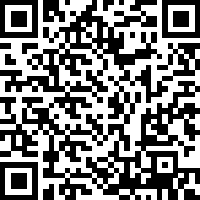
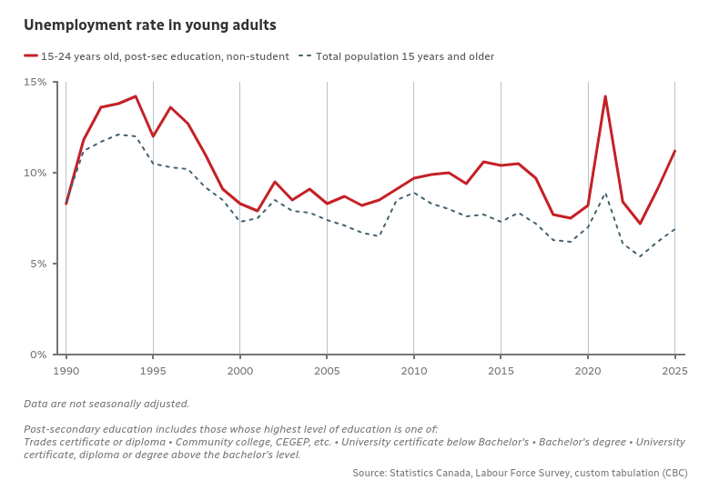
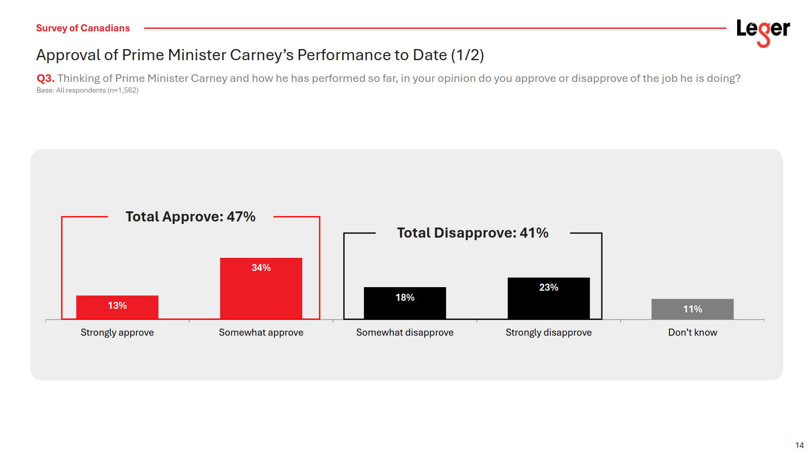
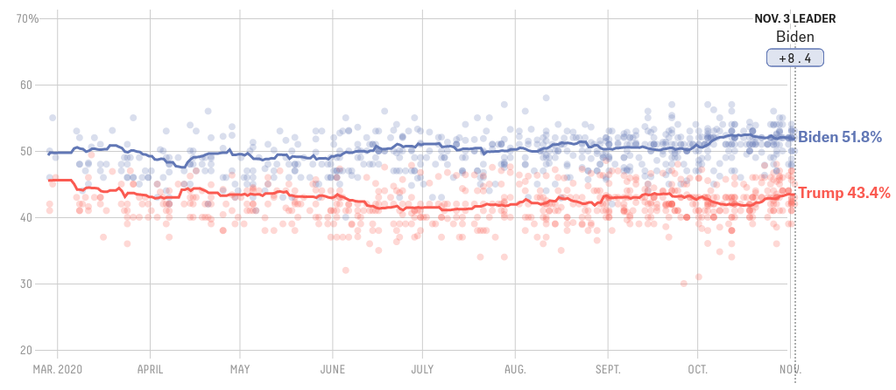
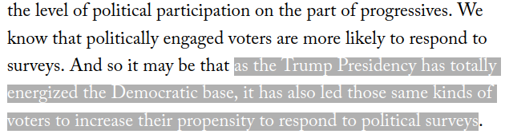

```{r setup, include=FALSE}
knitr::opts_chunk$set(echo = FALSE)
require(haven)
require(data.table)
require(ggplot2)
require(magrittr)
```

<script type="text/x-mathjax-config">
MathJax.Hub.Config({
TeX: {extensions: ["cancel.js"]}
});
</script> 


## Objectives


### (1) **Sampling Error**

- **Sampling** key ideas
- **Sampling Bias** vs **Random Sampling Error**
- **Random Sampling**
- **Random Sampling** and **Severity**

# Example

---

### Are you concerned about your employment prospects upon graduations?

---

Take this survey on your current work status



[https://tinyurl.com/UBCPOLI110](https://tinyurl.com/UBCPOLI110)

---

<iframe src="https://www.cbc.ca/i/phoenix/player/syndicate/?sourceId=9.6794378" width="640" height="360" frameborder="0" allowfullscreen></iframe>

---

### How can we know that unemployment is higher for young adults?

---

### Example

Unemployment rates:

**"What proportion of Canadians who are in the labour force are unable to find a job?"**

<br>

We can't interview **all Canadians**. Can't interview **all Canadians ages 20-24**

---

### Example

How do we know about unemployment rates?

>- Labour Force Survey

---


---

### Example

Survey ~ 65,000 households across Canada

Surveyed household member reports employment information on all household members

Conducted via: in person interview, telephone interview, or online survey

---



---

### Example

How might this procedure go wrong?


# Sampling and Sampling Error

## Sampling

### **Sometimes we cannot answer descriptive claims directly**

We would have to observe **too many** cases.

Can we say something about **all cases** based on **a few cases**?


## Sampling

### Key terms:

**population**: full set of cases (countries, individuals, etc.) we're interested in describing

**sample**: a *subset* of the population that actually we observe and measure

**inference**: description of the (unmeasured) **population** we make *based on the (measured) **sample***

and there is **uncertainty** about what is true about the population, because we **only measure a sample**

---

### Example:

Since the Federal elections earlier this year:

**"What proportion of Canadians approve of Mark Carney's performance as PM?"**

<br>

We can't interview **all Canadians**...

## Sampling

Survey of  $1562$ Canadian adults (October 3-5 2025)




## Example:

[Measuring PM approval](https://leger360.com/wp-content/uploads/2025/10/Fed_Pol_September2025.pdf)

The **population**:

- All Canadian adults (18 years of age or older)

The **sample**: 

- $1562$ Canadians interviewed online. Randomly chosen from online panel of Canadians recruited to participate in online surveys through random invitation. Weighted according to age, gender, education, mother tongue, children in the household, and geographic region, as per 2021 Census.

The **inference**:

- 47% ($\pm 2.5\%$, 19 times out of 20) of Canadians say they approve of the job Mark Carney has done as PM. 41% disapprove. 11% don't know.

---

### **sampling error**:

The difference between the value of the measure for the sample and the true value of the measure for the population

$$\mathrm{Value}_{sample} - \mathrm{Value}_{population} \neq 0 \xrightarrow{then} \mathrm{sampling \ error}$$

>- With surveys, it is the answer we got in the sample vs. if we could survey EVERYONE
>- Just like **measurement error**, there are two types: one that is **bias** and one that is **random**
>- Sampling error is a **kind of measurement error**


---

### **sampling error**:

$1$. **sampling bias**: cases in the sample are not representative of the population: not every member of population has equal chance of being in sample. Error is consistently in the same direction.

---

### **sampling error**:

$2$. **random sampling error**: in choosing cases for a sample, by chance, we get samples where the average is **too high** or **too low** compared to the population average

- sampling errors due to a known **random process**
- but these errors would cancel out (if we repeated the sampling procedure). 
- this produces the **uncertainty** of sampling (e.g., margin of error).


---

### What might drive **sampling bias** here? **random sampling error**?

The **population**:

- All Canadian adults (18 years of age or older)

The **sample**: 

- $1562$ Canadians interviewed online. Randomly chosen from online panel of Canadians recruited to participate in online surveys through random invitation. Weighted according to age, gender, education, mother tongue, children in the household, and geographic region, as per 2021 Census.

The **inference**:

- 47% ($\pm 2.5\%$, 19 times out of 20) of Canadians say they approve of the job Mark Carney has done as PM. 41% disapprove. 11% don't know.


---

### **sampling error**:

To understand **random sampling error** and **sampling bias**, need to understand...

the **sampling distribution**:

- the results (e.g., sample average) from all possible samples we **could have gotten**, using a given sampling procedure.
- we only ever get the result from the **one sample** we draw, but can **imagine** the results could have been different (counterfactually)
- it is **not** something we actually know, except in simulations

(e.g., the percent of survey respondents who approve of PM Carney in every possible sample of $1562$ drawn from online survey pool)

---

We can visualize a **sampling distribution** using a **histogram** to illustrate:

- what generates **sampling bias**
- what influences the **random sampling error**


## Random Sampling

**random sampling**: sampling cases from the population in a manner that gives **all cases** an **equal probability** of being chosen.

This procedure creates **samples** that:

- on average, give **unbiased** inferences about the population (**regardless of sample size**) (no sampling bias)
    - **unbiased** in that, across all samples, on average the sample average are the same as the population average
- come from knowable **sampling distribution**: produces **known uncertainty** (described by the field of statistics)

(board: intuitions as to *why*)


## Example: {.build}

Let's say we want to understand employment among students in this course.

The **population** is students registered in this course

Students in lecture hall, responding to poll are the **sample**


## Example: Employment

When we take the average hours worked for the **sample** (people taking poll in class today)...

<br>

and use it as our estimate of the average hours worked of the **population** (all students registered in this course)...

<br>

we are making an **inference**.

## Example: Employment

Was this **sample** a **random sample** of the students in the course? 

<br>

Can you think of any reasons this **sample** (students in lecture) would suffer from **sampling bias**?

## Example: Employment

When samples are  **not random** they may suffer from sampling **bias** and the **random sampling errors** are of unknown size

>- students attending lecture in person may differ in their hours worked from those who do not (e.g., the latter may miss class due to work)

>- we don't know the random element in sampling process $\to$ unknown sampling distribution

---

### **Random Sampling**

Let's now imagine that the **population** is students in class today who completed the survey...

To illustrate random sampling error: We can simulate taking **random samples** of students in class and plot the **sampling distribution**

[See here](https://mdweaver.shinyapps.io/shiny_sampling_110/)

histogram = Sampling distribution (the averages of different random samples)

Blue line = Population Mean (true in-class average)

Red line = Sampling Distribution Mean (average of SAMPLE averages)

---

### **Random Sampling**

Takeaways:

1. With random sampling, **random sampling errors** balance out, sampling procedure returns true population values *on average* $\to$  **no sampling bias!**
2. If sampling is not random, we get **sampling bias**, errors do not cancel out
2. **Random sampling errors** get smaller as the sample size increases $\to$ **known uncertainty**
3. Sampling distributions are **often** "bell curves" ([normal distribution, due to CLT](https://www.youtube.com/watch?v=zeJD6dqJ5lo)) $\to$ **known uncertainty**/**can estimate sampling distribution**


## Random Sampling Error and Severity

Random sampling **always** involves **random sampling error** $\to$ uncertainty

How might interpretation of evidence for claims be changed due to this random sampling error?

>- We want to know whether we find evidence in support of some claim, EVEN IF THAT CLAIM WERE FALSE, due to **random sampling error** (by chance).
>- We want to know "how severe" is this evidence? **How likely** could it lead us to wrong conclusions, **due to chance**?

## Random Sampling Error and Severity

Random sampling **always** involves **random sampling error**.

How might our conclusions be changed due to this random sampling error?


- We want to know: what fraction of Canadian adults approve of  Carney as PM? 
- We observe 47% approval in the sample.
- Based on this sample and known random sampling errors: what **range of values** are likely to contain the **true** approval rate for the population?

>- **Margin of error/Confidence Interval**: range of values that have some **advertised probability** of containing the truth.

---

**inference**: 47% ($\pm 2.5\%$, 19 times out of 20) approve of Carney as PM. 

This implies that true population approval of Carney is in:

- the range between 44.5% and 49.5%
- the advertised probability that this is correct 95%; 5% chance truth is **outside** this range

## Random Sampling Error and Severity

Random sampling **always** involves **random sampling error**.

How might our conclusions be changed due to this random sampling error?

- We want to test claim: "Unemployment among Canadian young adults greater now than it was for millenials."
- We observe 11.2% unemployment now vs 8.3% for young adults in 2005.
- Based on this sample and known random sampling errors: what is the **probability** of observing this difference if the **true** unemployment rate for young adults today **were the same or less** than it was in 2005?


## Random Sampling Error and Severity

**hypothesis tests**: compare an "alternative" (claim is correct) versus a "null" hypothesis (claim is not correct). Tell us probability of observing data for a claim **by chance**, if the claim were false. (**error probability**)

**alternative hypothesis**: young adult unemployment in 2025 $>$ young adult unemployment in 2005

**null hypothesis**: young adult unemployment in 2025 $\leq$ young adult unemployment in 2005

>- Asks: what is the **probability** of observing, e.g. 2.9% higher unemployment in 2025 vs 2005, in survey samples, *assuming* **null hypothesis** were true.
>- this probability is the **$p$-value**: probability of accepting claim due to chance, if it were false

## Random Sampling Error and Severity

**confidence intervals**/**margins of error**; **$p$ values**/**hypothesis tests** only work as advertised **if assumptions are correct**.

- what is the random sampling procedure?
- was this random sampling actually followed?
- is there non-response/missingness? 

## Random Sampling Error?



Each dot is the result of a survey of voters during the 2020 US Presidential Election. These surveys suggested that by election day voters preferred Biden to Trump by $8.4$ percent. Biden **actually** won by only $4.5$ points.

Is this **sampling error**? Is this a **random error** or a **bias**? 

## Random Sampling Error?



## Random Sampling Error?


>- These examples point to **sampling bias**

# Conclusion

## Conclusion:

- Sample, Population, Inference
- Recognize **Sampling Bias** vs **Random Sampling Error**
- **Random Sampling**:
  - solves sampling bias
  - lets us quantify random uncertainty/error probabilities
- **Random Sampling** and Severity
  - hypothesis tests/$p$ values


