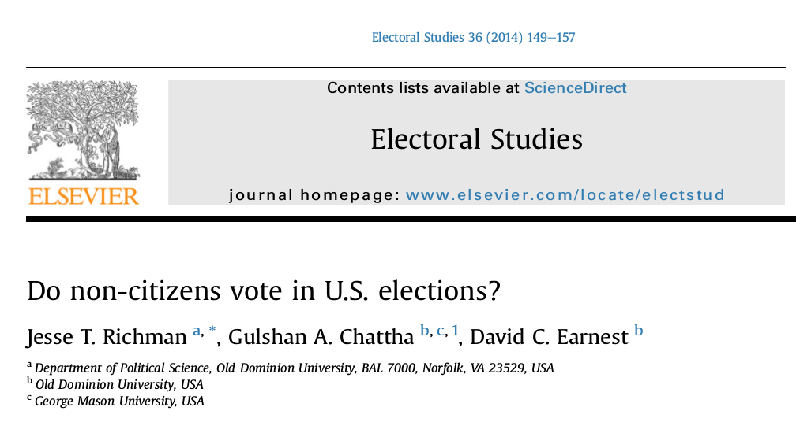

```{r setup, include=FALSE}
knitr::opts_chunk$set(echo = FALSE)
require(haven)
require(data.table)
require(ggplot2)
require(magrittr)
```

## Objectives

### (1) **Sampling Error**

- **Sampling Bias** vs **Random Sampling Error**
- **Random Sampling**

### (2) **Sampling** vs **Measurement Error**

# Sampling Error

## Sampling

### **Sometimes we cannot answer descriptive claims directly**

We would have to observe **too many** cases.

### Example:

**How many registered voters in the United States approve of Donald Trump's performance as president?**

<br>

We can't interview **all 153 million registered voters**...

## Sampling

### Key terms:

**population**: full set of cases (countries, individuals, etc.) we're interested in describing

**sample**: a *subset* of the population that we observe and measure

**inference**: description of the (unmeasured) **population** we make *based on a (measured) **sample***

## Example:

Measuring Trump's approval rating

The **population**:

- All registered voters in the US

The **sample**: 

- A subset of those registered voters we interview.

The **inference**:

- What we say is the approval rate among all registered voters (unobserved) based on the sample we interview  (observed)

---

### **sampling error**:

The difference between the value of the measure for the sample and the true value of the measure for the population

$$\mathrm{Value}_{sample} - \mathrm{Value}_{population} \neq 0 \xrightarrow{then} \mathrm{sampling \ error}$$

### Two varieties

## Sampling Error

**sampling bias**: 

the procedure by which cases are chosen for the sample does not give every member of population an equal chance of being in sample. 

Sample **consistently includes/excludes** certain types of cases/people: value of the measure for the sample **consistently different** from the value of measure in the population.

## Sampling Error

**random sampling error**: 

**by chance** we get samples where there are too many/few of certain types of people (compared to the population).

Because the sample **randomly** excludes/includes certain types of people, values measured from the sample differ **at random** from the value of measure in the population. (Errors would cancel out)


## Sampling Error: Example

The **week before** Trump was acquitted in the impeachment trial, a telephone survey of registered voters in the US finds that $41\%$ of them "approve" of Trump's performance in office.

The **week after** Trump was acquitted, a telephone survey of registered voters finds that $49\%$ of them "approve" of Trump's performance.

- If approval of Trump did **not actually change in the population**
- After the acquittal: **Democrats** were depressed and less likely to answer the phone;  **Republicans** were elated and more likely to answer the phone:
- **what kind of sampling error does the second survey suffer from?**

#

## Random Sampling:

To manage **sampling error**, we need to 

1. Ensure the sample is **representative** of the population (does not suffer from **sampling bias**)
2. Know the level of **uncertainty** associated with our inference (due to **random sampling error**)

**random sampling**: sampling cases from the population in a manner that gives **all cases an equal probability** of being chosen

---

Take as the "population": students in class last Thursday

<div style='position: relative; padding-bottom: 56.25%; padding-top: 35px; height: 0; overflow: hidden;'><iframe sandbox='allow-scripts allow-same-origin' allowfullscreen='true' allowtransparency='true' frameborder='0' height='315' src='https://www.mentimeter.com/embed/f944d685e9a8a2b1ed3a5897b970de4d/b4f00f1e7f44' style='position: absolute; top: 0; left: 0; width: 100%; height: 100%;' width='420'></iframe></div>


## Example: Commuting

### **Random Sampling**

We will take random samples of those in class last Thursday.

---

```{r, include = T, echo = F, warning= F, message = F}

get_data = function(group) {
  vals = group$score %>% names %>% as.numeric
  reps = group$score %>% unlist
  data = rep(vals, times = reps)
  return(data)
}

require(httr)

#Get class mean
resp = GET("https://api.mentimeter.com/questions/b4f00f1e7f44/result")
json =content(resp, "parsed")
c_values = json$results %>% lapply(function(i) get_data(i)) %>% unlist

#sample
n = 10
#sample vec
s = rep(NA, 10000)

#loop samples
for (i in seq_along(s)) {
  s[i] = sample(c_values, size = n) %>% mean
}

ggplot() + geom_histogram(aes(x = s[1:10]), col = "white", bins = 50) + theme_bw() + geom_vline(xintercept = mean(c_values), col = 'blue', linetype = 2) + xlab("Sample Average Commute Time (min.)") + ylab("# of Samples") + ggtitle("10 random samples of size 10") 
```

Blue line is population average.

---

```{r}
ggplot() + geom_histogram(aes(x = s[1:100]), col = "white", bins = 50) + theme_bw() + geom_vline(xintercept = mean(c_values), col = 'blue', linetype = 2) + xlab("Sample Average Commute Time (min.)") + ylab("# of Samples") + ggtitle("100 random samples of size 10") 

```

Blue line is population average.

---

```{r}
ggplot() + geom_histogram(aes(x = s[1:1000]), col = "white", bins = 50) + theme_bw() + geom_vline(xintercept = mean(c_values), col = 'blue', linetype = 2) + xlab("Sample Average Commute Time (min.)") + ylab("# of Samples") + ggtitle("1000 random samples of size 10") 

```

Blue line is population average.

---

```{r}
ggplot() + geom_histogram(aes(x = s), col = "white", bins = 50) + theme_bw() + geom_vline(xintercept = mean(c_values), col = 'blue', linetype = 2) + xlab("Sample Average Commute Time (min.)") + ylab("# of Samples") + ggtitle("10000 random samples of size 10") 

```

Blue line is population average.


## Random Sampling

**random sampling**: sampling cases from the population in a manner that gives **all cases** an **equal probability** of being chosen creates **samples** that:

- on average, give **unbiased** inferences about the population (**regardless of sample size**)
    - **unbiased** means that, across all possible samples, the the average of all sample means is the same as the population mean.
- has **random sampling errors** with a known **size**: produces **known uncertainty**)

## Random Sampling:

Let's say we want to make an inference about registered voters' approval for Trump. We randomly sample from the 153 million registered voters.

> If we want to describe Trump's approval rate in the population with a margin of error $\pm 0.5\%$ (95% of samples would include the true approval rate in the range of the sample approval $\pm$ 0.5%)... about how many registered voters do you think we'd need?

`menti.com  16 03 17`

---

<div style='position: relative; padding-bottom: 56.25%; padding-top: 35px; height: 0; overflow: hidden;'><iframe sandbox='allow-scripts allow-same-origin' allowfullscreen='true' allowtransparency='true' frameborder='0' height='315' src='https://www.mentimeter.com/embed/1082f747087e7c002c8eabf0af5a24f9/a9670b400424' style='position: absolute; top: 0; left: 0; width: 100%; height: 100%;' width='420'></iframe></div>

>- In truth: $\approx 38000$: only $0.02\%$ of registered voters

# Sampling Error vs. Measurement Error:

## Sampling Error vs. Measurement Error

**sampling error** can **sometimes** produce **measurement error** ...

... but it may not **always** be **measurement error**.

## Sampling Error vs. Measurement Error

**Measurement Error**: 

- Incorrectly describe the world because you **incorrectly** observe values for the **case(s)** you study

$$\mathrm{Value_{Case \ Truth}} - \mathrm{Value_{Case \ Obs.}} \neq 0 \xrightarrow{then} \mathrm{measurement \ error}$$

**Sampling Error**:

- Incorrectly describe the world because you sample **cases that are different** from the population you want to learn about

$$\mathrm{Value_{Population}} - \mathrm{Value_{Sample}} \neq 0 \xrightarrow{then} \mathrm{sampling \ error}$$

## Sampling Error vs. Measurement Error

**Sampling error** is **measurement error** when you are evaluating descriptive claims **about the <u>population</u>** that you sample. (the case we measure *is the population*)

- e.g. Sampling students on snowy day about commute times

**Sampling error** is not **measurement error** when you are evaluating claims **about the <u>cases</u>** that you sample. (the cases we measure are, e.g. *the survey respondents*) 

- e.g. effect of contact with transgender person on transgender attitudes among those surveyed

## Sampling Error vs. Measurement Error

**Measurement Error** can lead to incorrect inferences about a population **even if there is no sampling bias**

- e.g., Large, random sample survey about racism


## Sampling Error vs. Measurement Error

<blockquote class="twitter-tweet" data-lang="en"><p lang="en" dir="ltr">In addition to winning the Electoral College in a landslide, I won the popular vote if you deduct the millions of people who voted illegally</p>&mdash; Donald J. Trump (@realDonaldTrump) <a href="https://twitter.com/realDonaldTrump/status/802972944532209664?ref_src=twsrc%5Etfw">November 27, 2016</a></blockquote>
  <script async src="https://platform.twitter.com/widgets.js" charset="utf-8"></script>
    
# {.centered}

<blockquote class="twitter-tweet"><p lang="en" dir="ltr">White House senior advisor doubles down on voter fraud claims: “Voter fraud is a serious problem in this country” <a href="https://t.co/DC6lVPQznz">pic.twitter.com/DC6lVPQznz</a></p>&mdash; ABC News (@ABC) <a href="https://twitter.com/ABC/status/830787890309369856?ref_src=twsrc%5Etfw">February 12, 2017</a></blockquote> <script async src="https://platform.twitter.com/widgets.js" charset="utf-8"></script>
    
## Sampling Error vs. Measurement Error



## Sampling Error vs. Measurement Error

### Using an election survey...

- a large, random sample of adult Americans in 2010 (~**55,400 people**)
- Select a **sample of non-citizens**: respondents who indicate they are non-citizens ($N = 489$, or about $1\%$ of people) 
- They then count who among the "non-citizen sample" voted ($13$) 
- Conclude that 3.5% of non-citizens voted in 2010 (~700k), up to 14.7% in 2008 (~2.8 million people)

### So, wait, is Trump right?

**Discuss: Do you find this persuasive? Why or why not?**

#

## Two Big Problems:

### Problem One: Measurement Error

The political scientists who run the survey point out:

- Citizenship question suffers from (low) measurement error. 
- Those surveyed in 2010 and 2012: $99.7\%$ gave the same answer on citizenship, $0.19\%$ went from "non-citizen" to "citizen" (maybe true), $0.11\%$ went from **"citizen" to "non-citizen" (definitely false)**
- **measurement error:** misclassifies $0.1\%$ of people.

# To the board

## Two Big Problems:

### Problem Two: Sampling Error

**measurement error** of individuals as citizens/non-citizens, leads to sample of "non-citizens" that include **citizens** and non-citizens:

- citizens $\gg$ non-citizens $\to$ many more **citizens** who are **misclassified** as **"non-citizens"**
- We have **sampling error**... the sample does not reflect the population Richman et al/ Trump want to make inferences about.
- It could be that the "non-citizen" voting is driven entirely by voting among misclassified citizens.

## Two Big Problems:


## Two Big Problems:

### Overall Problem:

1. Richman et al/ Trump want to make claims about the **population**  of all non-citizens. They use a **sample**.
2. The **sample** is generated based on individual survey responses to a questions that are **wrong** for $0.1\%$ of individuals (**measurement error**)
3. This generates **sampling bias** as the sample systematically includes **citizens** who are treated as representative of "non-citizens"
4. Because Richman et al/ Trump are using the sample to make claims about the **population** of non-citizens, the **sampling bias** produces as **systematic measurement error**: systematically over-estimating noncitizen voting.


