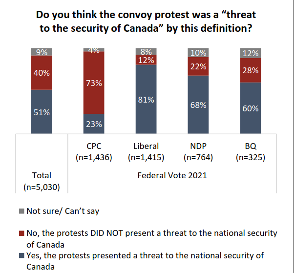

```{r setup, include=FALSE}
knitr::opts_chunk$set(echo = FALSE)
require(haven)
require(data.table)
require(ggplot2)
require(magrittr)
```

## Objectives

### (1) **Sampling Error**

- **Sampling Bias** vs **Random Sampling Error**
- **Random Sampling**

### (2) **Sampling Error** vs **Measurement Error**

# Sampling Error

## Sampling

### **Sometimes we cannot answer descriptive claims directly**

We would have to observe **too many** cases.

### Example:

**"What proportion of Canadians think the convoy protest was a 'threat to the security of Canada'?"**

<br>

We can't interview **all Canadians**...

## Sampling

### Survey of  $5030$ Canadian adults (11/28-12/3 2022)



## Sampling

### Key terms:

**population**: full set of cases (countries, individuals, etc.) we're interested in describing

**sample**: a *subset* of the population that we observe and measure

**inference**: description of the (unmeasured) **population** we make *based on the (measured) **sample***

and there is **uncertainty** about what is true about the population, because we **only measure a sample**

## Example:

[Measuring beliefs about the "Freedom Convoy" and security threats](https://angusreid.org/wp-content/uploads/2023/01/2023.02.02_Federal_Emergencies.pdf)

The **population**:

- All Canadian adults (what fraction believe the protests were a "security threat")

The **sample**: 

- $5030$ Canadians chosen **at random** from pool of "hundreds of thousands" of possible survey respondents recruited to join the "Angus Reid Forum", weighted according to the current demographic data.

The **inference**:

- 51% of Canadians say protests a threat, 40% say not ($\pm$ 1%: uncertainty due to sampling)


---

### **sampling error**:

The difference between the value of the measure for the sample and the true value of the measure for the population

$$\mathrm{Value}_{sample} - \mathrm{Value}_{population} \neq 0 \xrightarrow{then} \mathrm{sampling \ error}$$

>- Just like **measurement error**, there are two types: one that is **bias** and one that is **random**

---

### **sampling error**:

$1$. **sampling bias**: cases in the sample are not representative of the population: not every member of population has equal chance of being in sample. Error is consistently in the same direction.

---

### **sampling error**:

$2$. **random sampling error**: in choosing cases for a sample, by chance, we get samples where the average is **too high** or **too low** compared to the population average

- but these errors would cancel out (if we repeated the sampling procedure). 
- produces the **uncertainty** of sampling (e.g., margin of error).


---

### **sampling error**:

To understand **random sampling error** and **sampling bias**, it can be useful to understand...

the **sampling distribution**:

- the results from all possible samples we could get, using a given sampling procedure.
- we only ever get the result from the one sample we draw, but can **imagine** the results could have been different
- it is **not** actually knowable, except in simulations

(e.g., the percent of survey respondents who consider the "Freedom Convoy" a "security threat" each of every possible samples of $5030$ drawn from the survey pool at random)


---

We can visualize a **sampling distribution** using a **histogram** and then assess:

- is the sampling procedure **biased**?
- **how much random error is there**?


## Random Sampling

**random sampling**: sampling cases from the population in a manner that gives **all cases** an **equal probability** of being chosen.

This procedure creates **samples** that:

- on average, give **unbiased** inferences about the population (**regardless of sample size**) (no sampling bias)
    - **unbiased** in that, across all samples, on average the sample average are the same as the population average
- has **random sampling errors** with a known **size**: produces **known uncertainty** (described by the field of statistics)

(board: intuitions as to *why*)

---

Food insecurity among student:

How much of your monthly budget do you spend on food? (Answer ALL questions - you have to click through)

Go here: [https://www.menti.com/gdezmsmxkn](https://www.menti.com/gdezmsmxkn)

Or go to [menti.com](https://menti.com) and enter: $1557 \ 1602$

## Example: {.build}

Let's say we want to understand food insecurity among students in this course.

The **population** is students registered in this course

Students in lecture hall, responding to poll are the **sample**

---

<div style='position: relative; padding-bottom: 56.25%; padding-top: 35px; height: 0; overflow: hidden;'><iframe sandbox='allow-scripts allow-same-origin allow-presentation' allowfullscreen='true' allowtransparency='true' frameborder='0' height='315' src='https://www.mentimeter.com/app/presentation/f944d685e9a8a2b1ed3a5897b970de4d/embed' style='position: absolute; top: 0; left: 0; width: 100%; height: 100%;' width='420'></iframe></div>

## Example: Contacts

When we take the average food budget the **sample** (people taking poll in class today)...

<br>

and use it as our estimate of the average food budget of the **population** (all students registered in this course)...

<br>

we are making an **inference**.

## Example: Contacts

Was this **sample** a **random sample** of the students in the course? 

<br>

Can you think of any reasons this **sample** (students in lecture) would suffer from **sampling bias**?

## Example: Contacts

When samples are  **not random** they may suffer from sampling **bias** and the **random errors** are of unknown size

>- students attending lecture in person may differ in their food expenditures from those who do not (e.g., the latter may have extra jobs, have to save money on transit, higher levels of stress)

---

### **Random Sampling**

Let's now imagine that the **population** is students in class today who completed the survey...

To illustrate random sampling error: We can simulate taking **random samples** of students in class and plot the **sampling distribution**

[See here](https://mdweaver.shinyapps.io/shiny/)

histogram = Sampling distribution (the averages of different random samples)

Blue line = Population Mean (true in-class average)

Red line = Sampling Distribution Mean (average of SAMPLE averages)


## Random Sampling Error

We want to know what fraction of Canadian adults think the Convoys were a "security threat"?

There are ~31 million Canadians over the age of 18: assuming our sample is random, **about how many people ($n$) do you think we'd have to survey** to come up with sample mean and margin of error of $\pm 1$ points that includes the **population mean** with a probability of 99%?

>- $n \approx 16000$. It doesn't matter how many Canadians there are. The size of the random error in the sampling distribution gets smaller by a factor of $\sqrt{n}$


## Sampling Error?

If people who think Convoy was **not a security threat**, but feel social pressure to answer that the convoy *was a threat* or that they "did not know"...

<br>

Is this **sampling error**? Is this a **random error** or a **bias**? 

## Sampling Error?


Each dot is the result of a survey of voters during the 2020 US Presidential Election. These surveys suggested that by election day voters preferred Biden to Trump by $8.4$ percent. Biden **actually** won by only $4.5$ points.

Is this **sampling error**? Is this a **random error** or a **bias**? 

## Sampling Error?

It depends: if this is going on, then sampling bias


## Sampling Error?

It depends: if this is going on, then sampling bias


## Sampling Error?

It depends: if there are "shy" Trump voters, then measurement bias.


# Conclusion

## Conclusion:

- Recognize **Sampling Bias** vs **Random Sampling Error**
- **Random Sampling** a solution for both 
- Distinguish between **sampling bias** and **measurement bias**


Next class:

- Wrapping up descriptive claims
- More on 