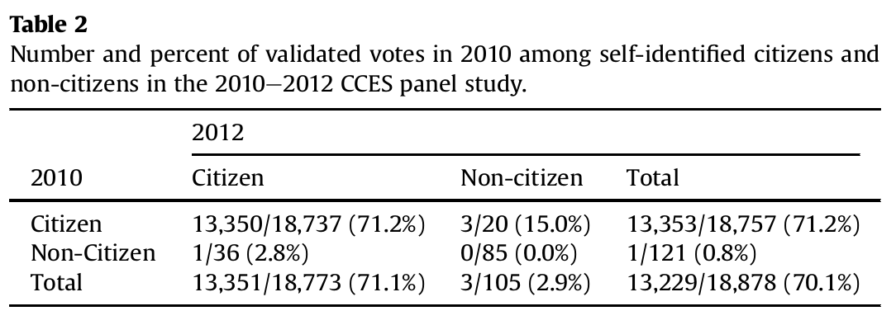

```{r setup, include=FALSE}
knitr::opts_chunk$set(echo = FALSE)
require(haven)
require(data.table)
require(ggplot2)
require(magrittr)
```

## Objectives

### (1) **Sampling Error**

- **Sampling Bias** vs **Random Sampling Error**
- **Random Sampling**

### (2) **Sampling** vs **Measurement Error**

# Sampling Error

## Sampling

### **Sometimes we cannot answer descriptive claims directly**

We would have to observe **too many** cases.

### Example:

**"How many Canadians support the "Freedom Convoy" protests?"**

<br>

We can't interview **all Canadians**...

## Sampling

### Survey $1546$ Canadian adults (2/4-2/6)


## Sampling

### Key terms:

**population**: full set of cases (countries, individuals, etc.) we're interested in describing

**sample**: a *subset* of the population that we observe and measure

**inference**: description of the (unmeasured) **population** we make *based on the (measured) **sample***

and there is **uncertainty** about what is true about the population, because we **only measure a sample**

## Example:

[Measuring support for the "Freedom Convoy"](https://2g2ckk18vixp3neolz4b6605-wpengine.netdna-ssl.com/wp-content/uploads/2022/02/Legers-North-American-Tracker-February-7th-2022.pdf)

The **population**:

- All Canadian adults

The **sample**: 

- $1546$ Canadians chosen **at random** from pool of 400k possible survey respondents recruited at random using cell and landline calls

The **inference**:

- 62% of Canadians oppose, 32% support the convoy ($\pm$ 2.5%: uncertainty due to sampling)


---

### **sampling error**:

The difference between the value of the measure for the sample and the true value of the measure for the population

$$\mathrm{Value}_{sample} - \mathrm{Value}_{population} \neq 0 \xrightarrow{then} \mathrm{sampling \ error}$$

>- Just like **measurement error**, there are two types: one that is **bias** and one that is **random**

---

### **sampling error**:

$1$. **sampling bias**: cases in the sample are not representative of the population: not every member of population has equal chance of being in sample. Error is consistently in the same direction.

>- What might be examples of sampling bias in the survey on the "Freedom Convoy"?

## Not Sampling Error:

If people who actually supported Convoy/blockades incorrectly reported that they opposed them or "did not know"...

<br>

...that is purely measurement bias, **not** sampling bias

---

### **sampling error**:

$2$. **random sampling error**: in choosing cases for a sample, by chance, we get samples where the average is **too high** or **too low** compared to the population average

- but these errors would cancel out (if we repeated the sampling procedure). 
- produces the **uncertainty** of sampling (e.g., margin of error).

---

### **sampling error**:

To understand **random sampling error**, useful to understand...

**sampling distribution**:

- the results from all possible samples we could get, using a given sampling procedure.
- we only ever get the result from the one sample we draw, but can **imagine** the results could have been different

(e.g., the percent of survey respondents supporting the "Freedom Convoy" across all possible samples of $1546$ drawn from the survey pool at random)

(board)

## Example


With **random** samples, sometimes we get a sample with too many Biden supporters, sometimes we get a sample with too many Trump supporters.

## Random Sampling

**random sampling**: sampling cases from the population in a manner that gives **all cases** an **equal probability** of being chosen.

This procedure creates **samples** that:

- on average, give **unbiased** inferences about the population (**regardless of sample size**) (no sampling bias)
    - **unbiased** in that, across all samples, on average the sample average are the same as the population average
- has **random sampling errors** with a known **size**: produces **known uncertainty** (described by the field of statistics)

---

How much social contact do we have right now?

How many people, approximately, do you come into close contact with (<= 2m) each day?

Go here: [https://www.menti.com/gdezmsmxkn](https://www.menti.com/gdezmsmxkn)

Or go to [menti.com](menti.com) and enter: $1106 \ 0561$

## Example: {.build}

Let's say we want to understand COVID transmission risks. So we set out to learn how many close contacts students in this course have daily on average...

The **population** is students registered in this course

Students in lecture hall, responding to poll are the **sample**

---

<div style='position: relative; padding-bottom: 56.25%; padding-top: 35px; height: 0; overflow: hidden;'><iframe sandbox='allow-scripts allow-same-origin' allowfullscreen='true' allowtransparency='true' frameborder='0' height='315' src='https://www.mentimeter.com/embed/f944d685e9a8a2b1ed3a5897b970de4d/b4f00f1e7f44' style='position: absolute; top: 0; left: 0; width: 100%; height: 100%;' width='420'></iframe></div>

## Example: Contacts

When we take the average number of close contacts of the **sample** (people taking poll in class today)...

<br>

and use it as our estimate of the average close contacts of the **population** (all students registered in this course)...

<br>

we are making an **inference**.

## Example: Contacts

Was this **sample** a **random sample** of the students in the course? 

<br>

Can you think of any reasons this **sample** (students in lecture) would suffer from **sampling bias**?


## Example: Contacts

When samples are  **not random** they may suffer from sampling **bias** and the **random errors** are of unknown size

>- students participating in the course remotely differ in their social contact systematically from those coming to campus

### **Random Sampling**

Let's now imagine that the **population** is students in class today who completed the survey...

To illustrate random sampling error: We can simulate taking **random samples** of students in class and plot the **sampling distribution**

[See here](https://mdweaver.shinyapps.io/shiny/)

Blue line = Population Mean; Red line = average of ALL sample means; histogram = sampling distribution (means from many possible samples)


# Sampling Error vs. Measurement Error:

## Sampling Error vs. Measurement Error

**sampling error** can **sometimes** produce **measurement error** ...

... but it may not **always** be **measurement error**.

## Sampling Error vs. Measurement Error

**Measurement Error**: 

- Incorrectly describe the world because you **incorrectly** observe values for the **case(s)** you study

$$\mathrm{Value_{Case \ Truth}} - \mathrm{Value_{Case \ Obs.}} \neq 0 \xrightarrow{then} \mathrm{measurement \ error}$$

**Sampling Error**:

- Incorrectly describe the world because you sample **cases that are different** from the population you want to learn about

$$\mathrm{Value_{Population}} - \mathrm{Value_{Sample}} \neq 0 \xrightarrow{then} \mathrm{sampling \ error}$$

## Sampling Error vs. Measurement Error

**Sampling error** produces **measurement error** when you are making descriptive claims **about the <u>population</u>** that you sample. (the case we want to measure *is the population*)

- e.g. Sampling Canadians to find out how **everyone** feels about the "Freedom Convoy".

**Sampling error** does **not** produce **measurement error** when you are evaluating claims **about the <u>cases you sample</u>**. (the cases we want to measure are, e.g. *the survey respondents*) 

- e.g. surveying a group of people about transgender attitudes after randomly exposing half of them to contact with transgender rights canvasser [Broockman and Kalla 2016](http://statmodeling.stat.columbia.edu/wp-content/uploads/2016/04/transphobia-and-canvassing.pdf)


## Sampling Error vs. Measurement Error

**Measurement Error** can lead to incorrect inferences about a population **even if there is no sampling bias**

- If we want to find how pervasive negative racial stereotypes are
- If we run a large random sample survey and are able to question everyone we try to contact (no non-response)
- People may still **incorrectly report** their true beliefs about negative racial stereotypes.

# Last Example

## Example: Non-citizen Voting

<blockquote class="twitter-tweet" data-lang="en"><p lang="en" dir="ltr">In addition to winning the Electoral College in a landslide, I won the popular vote if you deduct the millions of people who voted illegally</p>&mdash; Donald J. Trump (@realDonaldTrump) <a href="https://twitter.com/realDonaldTrump/status/802972944532209664?ref_src=twsrc%5Etfw">November 27, 2016</a></blockquote>
  <script async src="https://platform.twitter.com/widgets.js" charset="utf-8"></script>
    
# {.centered}

<blockquote class="twitter-tweet"><p lang="en" dir="ltr">White House senior advisor doubles down on voter fraud claims: “Voter fraud is a serious problem in this country” <a href="https://t.co/DC6lVPQznz">pic.twitter.com/DC6lVPQznz</a></p>&mdash; ABC News (@ABC) <a href="https://twitter.com/ABC/status/830787890309369856?ref_src=twsrc%5Etfw">February 12, 2017</a></blockquote> <script async src="https://platform.twitter.com/widgets.js" charset="utf-8"></script>
    
## Example: Non-citizen Voting


## Example: Non-citizen Voting

### Using an election survey...

- a large, random sample of adult Americans in 2010 (~**55,400 people**)
- identify a **sample of non-citizens**: respondents who indicate they are non-citizens ($N = 489$, or about $1\%$ of people) 
- count who among the "non-citizen sample" voted ($13$) 
- conclude that 3.5% of non-citizens voted in 2010 (~700k), up to 14.7% in 2008 (~2.8 million people)

### So, wait, was Trump right?

**Discuss: Do you find this persuasive? Why or why not?**

#

## Two Big Problems:

### Problem One: Measurement Error

The political scientists who run the survey point out: 

- Citizenship question suffers from (low) measurement error. 
- Those surveyed in 2010 and 2012: $99.7\%$ gave the same answer on citizenship, $0.19\%$ went from "non-citizen" to "citizen" (maybe true), $0.11\%$ went from **"citizen" to "non-citizen" (definitely false)**
- **measurement error:** misclassifies $0.1\%$ of people.

>- to the board

## Two Big Problems:

### Problem Two: Sampling Error

**measurement error** of individuals as citizens/non-citizens, leads to sample of "non-citizens" that include **citizens** and non-citizens:

- citizens $\gg$ non-citizens $\to$ many more **citizens** who are **misclassified** as **"non-citizens"**
- We have **sampling error**... the sample does not reflect the population Richman et al/ Trump want to make inferences about.
- It could be that the "non-citizen" voting is driven entirely by voting among misclassified citizens.

## Two Big Problems:



Nobody who consistently reports being non-citizen votes.

## Two Big Problems:

**Measurement Error** (of individuals' citizenship) 

$\Downarrow produces$

**Sampling Error** (sample that should represent **non-citizens** includes **citizens**) 

$\Downarrow produces$

**Measurement Error** (about the *population of non-citizens*)

$\Downarrow$

authors make incorrect claims that hundreds of thousands of non-citizens vote illegally.

#

## In more detail

### Overall Problem:

1. Richman et al/ Trump want to make claims about the **population**  of all non-citizens. They use a **sample**.
2. The **sample** is generated based on individual survey responses to a questions that are **wrong** for $0.1\%$ of individuals (**measurement error**)
3. This generates **sampling bias** as the sample systematically includes **citizens** who are treated as representative of "non-citizens"
4. Because Richman et al/ Trump are using the sample to make inferences about the **population** of non-citizens, the **sampling bias** produces **measurement bias**: systematically over-estimating noncitizen voting.