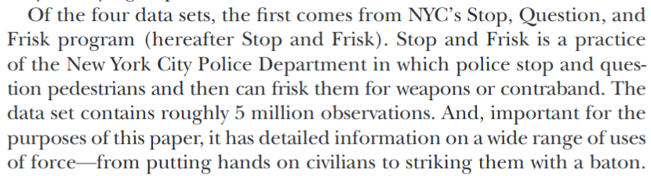
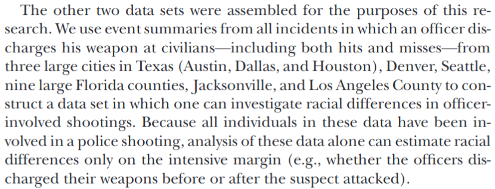
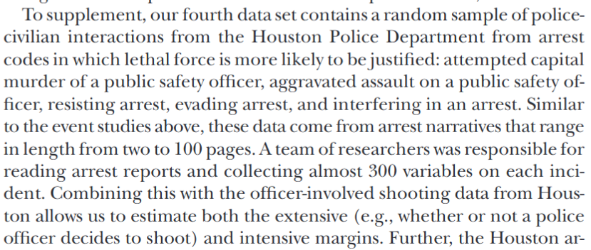

```{r setup, include=FALSE}
knitr::opts_chunk$set(echo = FALSE)
require(haven)
require(data.table)
require(ggplot2)
require(magrittr)
```

## Objectives

### Review:

- Concept
- Validity
- Measure

# Racial Bias in Policing

---

<iframe loading="lazy" width="560" height="315" src="https://www.msnbc.com/msnbc/embedded-video/mmvo44060741959" scrolling="no" frameborder="0" allowfullscreen></iframe>

---

### **Do you find this evidence persuasive?**

Why or why not?

Discuss and share

---

### Question/Claim $\xrightarrow{}$

### **Concept**

- transparent **definition**; which **observable** traits makes something an "X" $\xrightarrow{}$


### **Variable**(s)

- **observable** properties of cases that correspond to the concept $\xrightarrow{}$

### **Measure**(s)

- **procedure** to find the **values** variables take for *specific* cases  $\xrightarrow{}$

### "Answer"

---

Is there racial bias in police use of force? $\xrightarrow{}$

### **Concept**

- how do we define "racial bias"? $\xrightarrow{}$

### **Variable**(s)

- what are observable indicators of racial bias? $\xrightarrow{}$

### **Measure**(s)

- how do we measure these observable indicators of racial bias?  $\xrightarrow{}$

### Answer?

## Concept:

### How should we define of racial bias?

[Fryer (2019)](https://doi.org/10.1086/701423) defines racial bias as differential treatment attributable to "taste-based" (as opposed to "statistical") discrimination.

## Concept:

**statistical discrimination:**

inequality that exists between demographic groups even though police are rational and non-prejudiced. Discrimination can be "rational" if individual attributes are hard to observe (e.g. criminality, violence) while group membership is observable and different groups have different behaviors on average.

**taste-based discrimination:**

discrimination based on a preference to treat groups differently based  solely based on their membership in those groups

## Concept:

A focus on racial bias as **taste-based discrimination** leads social scientists to conceive of racial bias in policing as:

- when two people who are different races but have "all else equal" are treated differently by the police.


>- Do you agree with this conceptual definition of racial bias? Can you think of other definitions?

## Concept:

[Lily Hu](https://www.phenomenalworld.org/analysis/direct-effects/) questions whether it makes sense to think of racial bias in this way:

Does it make sense to say: "x% of killings of black people by the police are explained by racial differences in wealth; so those x% are not part of 'racial bias'."?

>- "Why would we expect the way race 'causes' police killings to stay the same in a world in which Black people and white people had the exact same income or wealth distribution?" 

---

Is there racial bias in police use of force? $\xrightarrow{}$

### **Concept**

- "taste based discrimination" $\xrightarrow{\mathrm{problems!}}$

### **Variable**(s)

- what are observable indicators of racial bias? $\xrightarrow{}$

### **Measure**(s)

- how do we measure these observable indicators of racial bias?  $\xrightarrow{}$

### Answer?

## Variable

Fryer (2019) proposes two variables to capture taste-based discrimination:


1. **differences in stop outcome**: racial bias is observed if there are differences by race in use of force among people **stopped by the police**, who, are otherwise similar on other attributes (demographics, circumstances of the stop). 

2. **differences in 'hit rate'**: racial bias is observed if the fraction of suspects **shot at by police** found to be carrying weapons is different across races. 

Discuss: Do these variables have validity (capture "taste-based" discrimination)

## Validity?

[Knox et al (2020)](https://www.cambridge.org/core/journals/american-political-science-review/article/administrative-records-mask-racially-biased-policing/66BC0F9998543868BB20F241796B79B8) raise concerns that these variables lack validity:

- When comparing use of force in police stops across different racial groups ... are those who are stopped comparable?
- When comparing people of different races who are shot at by police, are they comparable?

## Validity?

Racial discrimination in police **stops** means that we end up with incomparable samples of people of different races:

Imagine:

- police observe black and white civilians at the same rates
- racial discrimination leads police to stop white civilians for serious crimes (bank robbery), stop black civilians at random
- we ignore who police observed, and compare use of force against white bank robbers, black civilians
- If we then no disparity in use of force against black/white civilians, that should be alarming!
- Does no disparity mean "no racial bias?"

## Validity?

Sampling Bias:

Implicitly, variables capturing racial bias occurring in police stops assume that stops for different racial groups work the same way... generate comparable samples of people (with respect to criminality)

- if there is racial bias in police stops, then there is sampling bias: for racial groups that suffer from discriminatory targeting, innocent people more likely to be "sampled" compared to other racial groups.

## Validity?

It turns out, ignoring this validity problem **underestimates** racial bias in use of force:


---

Is there racial bias in police use of force? $\xrightarrow{}$

### **Concept**

- "taste based discrimination" $\xrightarrow{\mathrm{problems!}}$

### **Variable**(s)

- racial disparity in use of force among those who are stopped $\xrightarrow{\mathrm{underestimates \ bias}}$

### **Measure**(s)

- how do we measure these observable indicators of racial bias?  $\xrightarrow{}$

### Answer?

## Measure:

use of force in stops



## Measure:

possession of weapon in shooting



## Measure:

shootings in "stops"



## Measure

Can you think of any possible sources of:

- measurement bias?
- (large) random measurement error?
- sampling bias?

## Measure

**Police reports as a source**:

- attributes of police encounter may be misreported
- incentive to misrepresent to justify use of force
- prejudiced perceptions recorded in police reports
- e.g. police may search some groups for weapons/drugs more than others (may mis-measure "possession of a weapon")


## Measure

**Sampling bias**:

- which cities share data on police shootings with researchers?
- which shooting reports do cities share?

Insofar as Fryer is interested in describing racial bias in policing in the United States, sample of cities may suffer from sampling bias.

---

Is there racial bias in police use of force? $\xrightarrow{}$

### **Concept**

- "taste based discrimination" $\xrightarrow{\mathrm{problems!}}$

### **Variable**(s)

- racial disparity in use of force among those who are stopped $\xrightarrow{\mathrm{underestimates \ bias}}$

### **Measure**(s)

- police-generated data $\xrightarrow{\mathrm{possible \ measurement \ bias}}$

### Answer?

# Answer?

---

Is there racial bias in police use of force? $\xrightarrow{}$

### **Concept**

- "taste based discrimination" $\xrightarrow{\mathrm{problems!}}$

### **Variable**(s)

- racial disparity in use of force among those who are stopped $\xrightarrow{\mathrm{underestimates \ bias}}$

### **Measure**(s)

- police-generated data $\xrightarrow{\mathrm{possible \ measurement \ bias}}$

There is **considerable** racial bias in use of force and (probably) shootings

# Conclusion

## Conclusion:

- Concept
- Variable/validity
- Measure/measurement error

<br>

- Causality