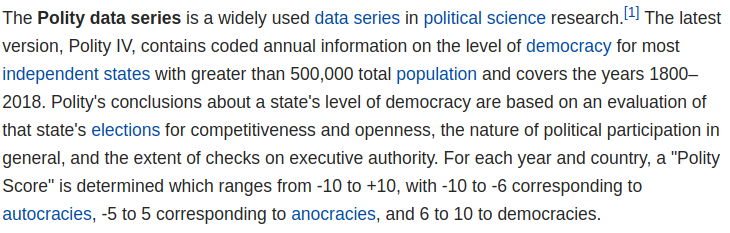
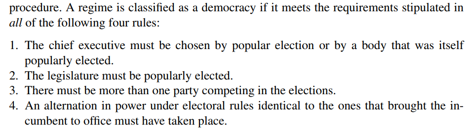

```{r setup, include=FALSE}
knitr::opts_chunk$set(echo = FALSE)
```

# Evaluating Descriptive Claims

## Plan for Today:

### **(1) Recap: Levels of Measurement**

### **(2) Validity**

# Recap

## Levels of Measurement

### The kinds of **values** taken by a **variable** is called its **level of measurement**

#### We consider four **levels of measurement**

- Nominal
- Ordinal
- Interval
- Ratio

#### Not to be confused with **measures**

## Levels of measurement

#### **nominal:** values place cases into unranked categories

- religion, party affiliation, regime type

#### **ordinal:** values place cases into categories that are ranked in some way, without meaningful intervals

- University rankings, Ideology (very left, somewhat left, neither, somewhat right, very right)

#### **interval:**: values both rank the cases and have consistent intervals, but zero and ratio not meaningful

- Year/Date, Temperature (in Celsius, but not Kelvin), ideological scores (-1 to 1) of legislators

#### **ratio:** values rank the cases, have consistent intervals, and give a meaning to values of 0 and ratios

- Time since some event, Counts of events, Rates (e.g. unemployment)


## Levels of measurement: Practice {.centered}



## Levels of measurement: Practice

If we are measuring "democracy", what is the level of measurement of...

### **1. The Year in which a country became a democracy**

### **2. Number of Years since a country became a democracy**

### **3. Fraction of adults who can are allowed to vote under suffrage rules**

## Levels of measurement: Practice

If we are measuring "democracy", what is the level of measurement of...

### **1. The Year in which a country became a democracy** (*interval*)

### **2. Number of Years since a country became a democracy** (*ratio*)

### **3. Fraction of adults who can are allowed to vote under suffrage rules** (*ratio*)

## Levels of measurement: Practice {.centered}




## Choosing the right variable:

#### **absolute** values are counts given in raw **units**

- Examples:
    - dollar amounts
    - Number of events
    - Number of deaths

#### **relative** values are given in fractions or rates or ranks 

- Examples:
    - Units are fractional (deaths/population, events/time)
    - No units (percentile, rankings)

## Choosing the right variable:
 
#### Suppose we want to compare the US and Canada to find out which has more widespread gun violence

### **Which variable would be best?**

1. Number of gun deaths in the preceding year
2. Rank of the country in a list of gun deaths in the preceding year
3. Gun deaths per 100,000 people.

# Validity

## Variables and Measures can fail:

### Even if we develop a useful concept

### Variables or measures may not **correspond** to the concept

## Racial Bias in Police Shootings

### **Is police violence in the US racially biased against African Americans?**

### Need a concept for "racial bias":

<br>

#### **"Disparate treatment of a racial group in excess of statistical discrimination"**


- if unequal treatment of African Americans were based solely on statistical discrimination...

- then African Americans treated identically to white Americans in otherwise identical situations.

## Racial Bias in Police Shootings

### **Concept: "racial bias in police shooting"**

to see if bias is in excess of statistical discrimination...

- **Dimension: "objective threat" to the officer**

### **Variable:**

"the level of physically-threatening behavior exhibited by a suspect"

### **Measure:**

undergraduate research assistants code threatening behavior by suspects given in **police reports**

## Measurement Trouble: Validity

#### **validity**: 

- Degree of fit between a variables or its measure and the concept the variable is intended to capture.
- When a variable and its measure "capture" or "map onto" the concept we are interested in, then we say they have "validity"
- When a variable and its measure "capture" or "map onto" other concepts we are not interested in, then we say they lack "validity"

## Measurement Trouble: Validity

### **Threats to validity**

#### **Validity can break down in two places:**

1. Concept $\xleftarrow{Mismatch}$ Variable
2. Variable $\xleftarrow{Mismatch}$ Measure
  
### One or both of these could happen.  
  
## Measurement Trouble: Validity

### **Threats to validity**

### In the racial bias example...

The **measure** might not reflect the **true level** of objective physical threat...

- Police may misperceive higher threats from African Americans; Police may actively exaggerate threats from African Americans in police reports.
- **measure** might map onto concept "objective threat" but it might also map onto "racial stereotypes".

<br>

Variable $\xleftarrow{Mismatch}$ Measure

## Measurement Trouble: Validity

"Which country/province is most politically corrupt?"

**Concept**: <u>Political Corruption</u> or "the use of power by government officials for illegitimate private gain"

**Variable**: (for a place) Fraction of politicians in a place prosecuted for corruption

**Measure**: Match criminal court proceedings to list of politicians for a given place.

### Does this capture **anything** inside the concept?

- Places with lots of corruption do not prosecute corruption
- Places with low corruption successfully prosecute corruption
- But the **measure** gives correct values for the **variable**

Concept $\xleftarrow{Mismatch}$ Variable


## Measurement Trouble: Validity

"How often are guns used for self-defense?"

**Concept**: <u>Self Defense Gun Use</u> or "resistance to a crime through display or use of a firearm"

**Variable**: Number of events where people believe themselves to be victims of a crime and use a firearm to defend themselves.

**Measure**: Survey people about their use of firearms, ask if they used them in self-defense.

### Problems

- people misperceive crimes that are not happening (different from mis-reporting)
- Survey respondents misreport threat or use of a weapon (different from mis-perception)

## Measurement Trouble: Validity

"How often are guns used for self-defense?"

**Concept**: <u>Self Defense Gun Use</u> or "resistance to a crime through display or use of a firearm"

**Variable**: Number of events where people believe themselves to be victims of a crime and use a firearm to defend themselves.

**Measure**: Survey people about their use of firearms, ask if they used them in self-defense.

### Problems

Concept $\xleftarrow{Mismatch}$ Variable

Variable $\xleftarrow{Mismatch}$ Measure


## **Threats to validity**

1. Measure/Variable does not cover **enough** of the concept:
    - Measure only captures some but not all relevant **dimensions** of the concept
2. Measure/Variable covers things **outside** the concept:
    - Could cover somethings inside the concept, or **nothing** inside the concept
    - e.g. fraction of politicians convicted of corruption 
    - e.g. survey of reported self-defense gun uses
3. Measure captures different things across units: **non-comparability**
  - e.g. police assessment of "objective threat" across races


## **Threats to validity**

**Concept**: Exposure to political information

**Variable**: Frequency of reading a newspaper

**Measure**: Survey of people asking for frequency with which they read a newspaper

### Does this capture **enough** of the concept?

- If we want to compare exposure to political information over time, this could be a problem
- In the 1940s/1950s, newspapers major source of information, but now televisiona nd internet more common.
- Breakdown at Concept/Variable

## Summary

### **Validity**

Pertains to the link between our **observations** and the **concept** we want those observations to capture.

- Can fail because we have chosen a **variable** that insufficiently captures the concept, maps onto other (unhelpful) concepts, or captures different things for different concepts.

- Can fail because our **measure** does not yield the correct values for our **variable** and instead reflect other concepts