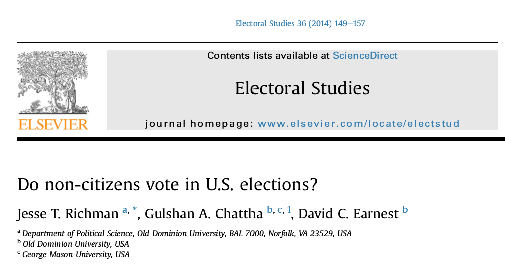
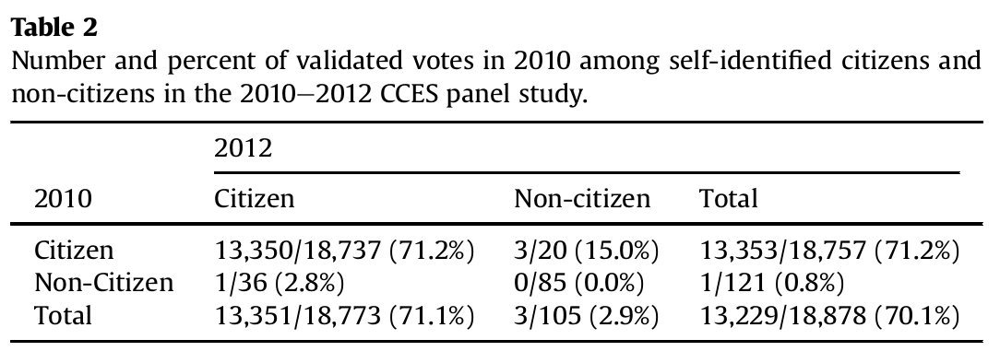
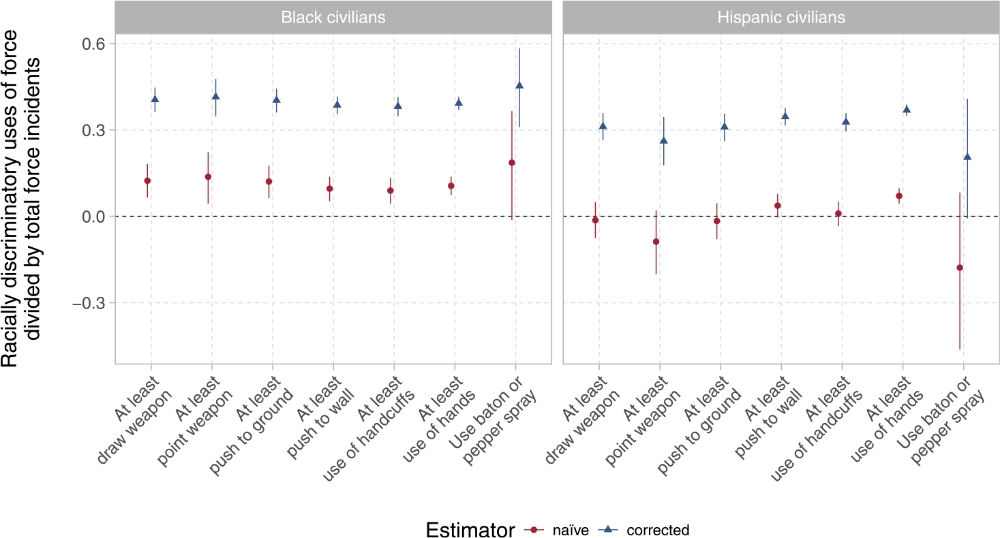

```{r setup, include=FALSE}
knitr::opts_chunk$set(echo = FALSE)
require(haven)
require(data.table)
require(ggplot2)
require(magrittr)
```

## Objectives

**Sampling Error**

- Review
- Sampling Error vs. Measurement Error
- Non-citizen Voting

**Example**

- Racial Discrimination in Police Shootings

# Sampling

## Sampling

### Key terms:

**population**: full set of cases (countries, individuals, etc.) we're interested in describing

**sample**: a *subset* of the population that we observe and measure

**inference**: description of the (unmeasured) **population** we make *based on the (measured) **sample***

and there is **uncertainty** about what is true about the population, because we **only measure a sample**

## Sampling

**random sampling**: sampling cases from the population in a manner that gives **all cases** an **equal probability** of being chosen.

This procedure creates **samples** that:

- give **unbiased** inferences about the population (**regardless of sample size**) (no sampling bias)
    - **unbiased** in that, across all samples, on average the sample averages are the same as the population average
- has **random sampling errors** with a known **size**: produces **known uncertainty** (described by the field of statistics)


## Example:

The **population**:

- All Canadian adults (18 years of age or older)

The **sample**: 

- $1009$ Canadians interviewed from **random digit dialing** of land lines and cell lines. Each line tried 5 times, between 5-9 pm on weekdays (12-6 pm on weekends). Weighted according to age, gender, and geographic region, as per 2021 Census.

The **inference**:

- 21% ($\pm 3.1$%) of Canadians say prefer Trudeau as Prime Minister 


>- Does random digit dialing ensure a random sample?

---

### **sampling error**:

The difference between the value of the measure for the sample and the true value of the measure for the population

$$\mathrm{Value}_{sample} - \mathrm{Value}_{population} \neq 0 \xrightarrow{then} \mathrm{sampling \ error}$$

>- Just like **measurement error**, there are two types: one that is **bias** and one that is **random**
>- Sampling error is a **kind of measurement error**. If our measure requires inference about a *population*, sampling error *is* measurement error.

---

### **sampling error**:

To understand **random sampling error** and **sampling bias**, it can be useful to understand...

the **sampling distribution**:

- the results from all possible samples we could get, using a given sampling procedure.
- we only ever get the result from the one sample we draw, but can **imagine** the results could have been different
- it is **not** actually knowable, except in simulations

---

### **Visualizing the Sampling Distribution**

Let's now imagine that the **population** is students in class last week who completed the survey on rent as percent of expenditures...

To illustrate different sampling errors: We can simulate taking **samples** of students in class and plot the **sampling distribution**

[See here](https://mdweaver.shinyapps.io/shiny_survey/)

histogram = Sampling distribution (the frequency of sample averages across different samples)

Blue line = Population Average (true in-class average)

Red line = Sampling Distribution Average (average of SAMPLE averages)


## Random Sampling Error

We want to know: what fraction of Canadian adults prefer Trudeau as PM?

There are ~31 million Canadians over the age of 18: assuming our sample is random, **about how many people ($n$) do you think we'd have to survey** to come up with sample mean and margin of error of $\pm 1$ points that includes the **population mean** with a probability of 99%?

>- $n \approx 16000$. It doesn't (particularly) matter how many Canadians there are. The size of the random error in the sampling distribution gets smaller by a factor of $\sqrt{n}$


## Sampling Error?


Each dot is the result of a survey of voters during the 2020 US Presidential Election. These surveys suggested that by election day voters preferred Biden to Trump by $8.4$ percent. Biden **actually** won by only $4.5$ points.

Is this **sampling error**? Is this a **random error** or a **bias**? 

## Sampling Error?

It depends: if this is going on, then sampling bias


## Sampling Error?

It depends: if this is going on, then sampling bias


## Sampling Error?

It depends: if there are "shy" Trump voters, then measurement bias.


# Non Citizen Voting

## Voter Fraud

<blockquote class="twitter-tweet" data-lang="en"><p lang="en" dir="ltr">In addition to winning the Electoral College in a landslide, I won the popular vote if you deduct the millions of people who voted illegally</p>&mdash; Donald J. Trump (@realDonaldTrump) <a href="https://twitter.com/realDonaldTrump/status/802972944532209664?ref_src=twsrc%5Etfw">November 27, 2016</a></blockquote>
  <script async src="https://platform.twitter.com/widgets.js" charset="utf-8"></script>
    
# {.centered}

<blockquote class="twitter-tweet"><p lang="en" dir="ltr">White House senior advisor doubles down on voter fraud claims: “Voter fraud is a serious problem in this country” <a href="https://t.co/DC6lVPQznz">pic.twitter.com/DC6lVPQznz</a></p>&mdash; ABC News (@ABC) <a href="https://twitter.com/ABC/status/830787890309369856?ref_src=twsrc%5Etfw">February 12, 2017</a></blockquote> <script async src="https://platform.twitter.com/widgets.js" charset="utf-8"></script>
    
## Voter Fraud

Claim: Widespread voter fraud: "14% of non-citizens voted"

### **Concept**

- Non-citizen; voter fraud $\xrightarrow{}$

### **Variable**(s)

- Fraction of non-citizens who voted $\xrightarrow{}$

### **Measure**(s)

- how do we measure non-citizen voting?  $\xrightarrow{}$

### Answer?    
    
## Voter Fraud



## Voter Fraud

Richman et al:

- two large, random sample of adult Americans in 2008, 2010 (~**33,000 and 55,400 people**)
- identify a **sample of non-citizens**: respondents who indicate on the survey that they are non-citizens ($N = 489$, or about $1\%$ of people in 2010) 
- count who among the "non-citizen sample" voted ($13$) (validated voting measure - matched to public voter file)
- conclude that 3.5% of non-citizens voted in 2010 (~700k), up to 14.7% in 2008 (~2.8 million people)

### So, was Trump right?

**Discuss: Do you find this persuasive? Why or why not?**

#

## Two Big Problems:

### Problem One: Individual Measurement Error

The political scientists who run the CCES survey point out: 

- Citizenship question suffers from (low) measurement error. 
- Those surveyed in both 2010 and 2012: $99.7\%$ gave the same answer on citizenship, $0.19\%$ went from "non-citizen" to "citizen" (maybe true), $0.11\%$ went from **"citizen" to "non-citizen" (definitely false)**
- **measurement error:** misclassifies $0.1\%$ of people (1 out of a 1000)

>- to the board

## Two Big Problems:

### Problem Two: Sampling Error

**measurement error** of individuals as citizens/non-citizens, leads Richman et al to sample of "non-citizens" that include **citizens** and non-citizens:

- citizens $\gg$ non-citizens $\to$ many more **citizens** who are **misclassified** as **"non-citizens"**
- We have **sampling error**... the sample does not reflect the population Richman et al want to make inferences about.
- It could be that the "non-citizen" voting is driven entirely by voting among citizens who clicked the wrong button on the survey.

## Two Big Problems:



Nobody who consistently reports being a non-citizen votes.

## Two Big Problems:

**Measurement Error** (of individuals' citizenship) 

$\Downarrow produces$

**Sampling Error** (sample that should be of **non-citizens** includes **citizens**)

$\Downarrow produces$

**Measurement Error** (about the *population of non-citizens*)

$\Downarrow$

authors make incorrect inference that hundreds of thousands of non-citizens vote illegally.


## In more detail:

1. Richman et al/ Trump want to make claims about the **population**  of all non-citizens. They use a **sample**.
2. The **sample** is generated based on individual survey responses to a questions that are **wrong** for $0.1\%$ of individuals (individual **measurement error**)
3. This generates **sampling bias** as the sample systematically includes **citizens** in sample of "non-citizens"
4. Because Richman et al/ Trump are using the sample to make inferences about the **population** of non-citizens, the **sampling bias** produces **measurement bias** (of population): systematically over-estimating non-citizen voting.

# Bring it all together

## Racial Bias in Policing

We've previously compared claims made:

1. alleging undocumented migrants of committing higher rates of violent crimes
2. alleging racial discrimination in police use of force

Evidence we have considered suggests (1) is likely untrue.

What about (2)?

---

<iframe loading="lazy" width="560" height="315" src="https://www.msnbc.com/msnbc/embedded-video/mmvo44060741959" scrolling="no" frameborder="0" allowfullscreen></iframe>

---

### **Do you find this evidence persuasive?**

Discuss with your neighbors: 

- **Why or why not?**
- **What else would you want to know?**

---

### Question/Claim $\xrightarrow{}$

### **Concept**

- transparent **definition**; which **observable** traits makes something an "X" $\xrightarrow{}$


### **Variable**(s)

- **observable** properties of cases that correspond to the concept $\xrightarrow{}$

### **Measure**(s)

- **procedure** to find the **values** variables take for *specific* cases  $\xrightarrow{}$

### "Answer"

---

Is there racial discrimination in police use of force? $\xrightarrow{}$

### **Concept**

- how do we define "racial discrimination"? $\xrightarrow{}$

### **Variable**(s)

- what are observable indicators of racial discrimination? $\xrightarrow{}$

### **Measure**(s)

- how do we measure these observable indicators of racial discrimination?  $\xrightarrow{}$

### Answer?

## Racial Discrimination: Concept

### How should we define of racial discrimination?

[Fryer (2019)](https://doi.org/10.1086/701423) defines racial discrimination as **differential treatment** of different racial groups attributable to "taste-based" (as opposed to "statistical") discrimination.

## Racial Discrimination: Concept

**statistical discrimination:**

inequality that exists between demographic groups even though economic agents (police, consumers, workers, employers, etc.) are rational and non-prejudiced. 

- Discrimination can be "rational" if individual attributes are hard to observe (e.g. propensity toward crime) while group membership is observable and different groups have different behaviors on average.
- Discrimination is "rational" if relevant considerations ('objective threat', criminal activity) objectively correlate with group membership


## Racial Discrimination: Concept

**taste-based discrimination:**

discrimination based on a preference to treat groups differently based solely on their membership in those groups

## Racial Discrimination: Concept

A focus on racial bias as **taste-based discrimination** leads social scientists to conceive of racial discrimination in policing as:

- when two people who are different races but have "all else equal" are treated differently by the police.

>- Do you agree with this conceptual definition of racial discrimination? Is there anything you think this definition **misses** that should count at "racial discrimination"?

## Racial Bias: Concept

[Lily Hu](https://www.phenomenalworld.org/analysis/direct-effects/) questions whether it makes sense to think of racial discrimination in this way:

> Given the legacy of slavery, explicit and sometimes state-sponsored  discrimination by race, there are large income and wealth disparities between Black and white Americans.

> Does it make sense to say: "People who are poorer are more likely to be killed by the police, regardless of race. Due to racial inequalities in wealth, a greater fraction of Black Americans are poor. Some portion of the gap in police killings of white and Black Americans is explained by these differences in wealth; and they are not 'racial discrimination'."?

## Racial Discrimination: Concept

While we might dispute whether Fryer's definition of racial discrimination **is correct**...

... we can still **use** his concept to test whether there is racial discrimination in police shootings, because it is a transparent and systematic definition.

---

Is there racial discrimination in police use of force? $\xrightarrow{}$

### **Concept**

- "taste based discrimination" $\xrightarrow{\text{disputed but usable definition!}}$

### **Variable**(s)

- what are observable indicators of "taste based discrimination"? $\xrightarrow{}$

### **Measure**(s)

- how do we measure these observable indicators of racial discrimination?  $\xrightarrow{}$

### Answer?

## Racial Discrimination: Variable

Fryer (2019) uses this variable to capture taste-based discrimination:

**racial differences in stop outcome**:  differences **by race** in the rate of police violence against people who have been **stopped by the police** and who are **otherwise similar on other attributes** (suspect demographics, officer demographics, circumstances of the stop). 

>- Does this variable have validity?

## Racial Discrimination: Validity?

[Knox et al (2020)](https://www.cambridge.org/core/journals/american-political-science-review/article/administrative-records-mask-racially-biased-policing/66BC0F9998543868BB20F241796B79B8) raise concerns that these variables lack validity:

- If there is **racial discrimination in police stops**, then this variable lacks validity. It will **underestimate** taste-based discrimination.

---

Is there racial discrimination in police use of force? $\xrightarrow{}$

### **Concept**

- "taste based discrimination" $\xrightarrow{\mathrm{disputed \ definition!}}$

### **Variable**(s)

- racial disparity in use of force among those who are stopped $\xrightarrow{\mathrm{underestimates \ discrimination}}$

### **Measure**(s)

- how do we measure these observable indicators of racial discrimination?  $\xrightarrow{}$

### Answer?

## Racial Discrimination: Measure

**Data sourced from police records**

- **Sample of Police Departments**:
  - solicited police reports on incidents when officers discharged their weapons from 20 departments (not chosen at random) 
  - only Houston, TX provided complete data on shootings and stops

## Racial Discrimination: Measure

**From police reports**

**Sample of 'Stops'**:

  - data on **all** Officer Involved Shootings in Houston (2000-2015)
  - but 16 million arrests in (2000-2015)
  - randomly sample arrests for "attempted murder of a public safety officer, aggravated assault on a public safety officer, resisting arrest, evading arrest, and interfering in an arrest."

Compare people shot by police to a sample of people who "could have been shot".

## Racial Discrimination: Measure

**Coded from sample of police reports**: to determine "otherwise similar encounters"

- Suspect characteristics: **race**, age, gender
- Suspect weapon: type of weapon suspect used or had in possession (including 'none')
- Officer characteristics: race of office/unit, gender of officers, years on force, on duty, number of officers present
- Officer response reason: reason why the officer was there (e.g. responding to robbery, suspicious activity) 
- Other encounter characteristics: daytime/nighttime, suspect attacked first, suspect drew (attempted to draw) weapon

## Racial Discrimination: Measure

Do we have any concerns about...

- sampling bias?
- measurement bias?

## Racial Discrimination: Measure

**Police reports as a source**: attributes of police encounter may be misreported

- incentive to misrepresent (increase) threat to justify use of force
- prejudiced perceptions (portray black civilians as more threatening) recorded in police reports
- e.g. police may search some groups for weapons/drugs more than others (may mis-measure "possession of a weapon")


Prejudiced perceptions $\to$ downward bias in racial prejudice in police shootings: biased toward finding no or "reverse" racial discrimination


## Racial Discrimination: Measure

**Sampling bias**:

- which cities share data on police shootings with researchers?
- which shooting reports do cities share?

Insofar as Fryer is interested in inferring racial bias in policing in across the United States, sample of cities may suffer from sampling bias.

- cities with more racial discrimination may be less willing to share

---

Is there racial bias in police use of force? $\xrightarrow{}$

### **Concept**

- "taste based discrimination" $\xrightarrow{\mathrm{problems!}}$

### **Variable**(s)

- racial disparity in use of force among those who are stopped $\xrightarrow{\mathrm{underestimates \ prejudice}}$

### **Measure**(s)

- police-generated data $\xrightarrow{\text{possible }\downarrow \text{ measurement bias}}$

Answer?

---



Knox et al show that addressing **validity** problem leads to large increase in estimated racial disparities in police use of force (excluding killings); likely true for shootings


# Conclusion

## Descriptive Claims

- Concept
- Variable/validity
- Measure/measurement error

<br>

Next is... Causality
