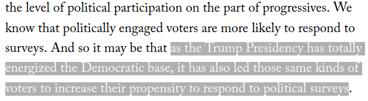
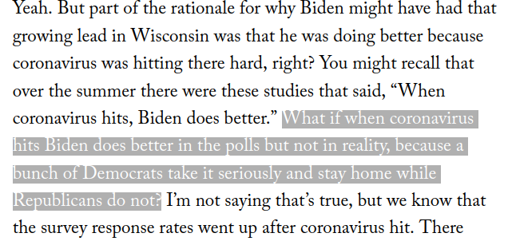

```{r setup, include=FALSE}
knitr::opts_chunk$set(echo = FALSE)
require(haven)
require(data.table)
require(ggplot2)
require(magrittr)
```

## Objectives

**Sampling Error**

- Review
- Random Sampling Error and Severity
- Sampling Error vs. Measurement Error
- Non-citizen Voting


# Example

---

### Was Charlie Kirk assassination a "wake-up call"?

>- Some claim that "concern about political violence among Americans **increased** after the assassination"


## Sampling

### Key terms:

**population**: full set of cases (countries, individuals, etc.) we're interested in describing

**sample**: a *subset* of the population that we observe and measure

**inference**: description of the (unmeasured) **population** we make *based on the (measured) **sample***

and there is **uncertainty** about what is true about the population, because we **only measure a sample**

## Example:

The **population**:

- All American adults (18 years of age or older)

The **sample**: 

- $1381$,$1477$ Americans 18 years of age and older were "contacted through a multi-mode design: By text or online. All potential respondents were screened for age. Probability-based sampling frames include random-digit-dialing cell phone sample plus cellphone sample based on billing address."

The **inference**:

Americans say politically-motivated violence is a major problem:

- 73% ($\pm 2.3$%) in June 2025
- 77% ($\pm 2.1$%)  in September 2025


## Sampling

**random sampling**: sampling cases from the population in a manner that gives **all cases** an **equal probability** of being chosen.

This procedure creates **samples** that:

- give **unbiased** inferences about the population (**regardless of sample size**) (no sampling bias)
    - **unbiased** in that, across all samples, on average the sample averages are the same as the population average
- has **random sampling errors** with a known **size**: produces **known uncertainty** (described by the field of statistics)

---

### **sampling error**:

The difference between the value of the measure for the sample and the true value of the measure for the population

$$\mathrm{Value}_{sample} - \mathrm{Value}_{population} \neq 0 \xrightarrow{then} \mathrm{sampling \ error}$$

>- Just like **measurement error**, there are two types: one that is **bias** and one that is **random**
>- Sampling error is a **kind of measurement error**. If our measure requires inference about a *population*, sampling error *is* measurement error.


---

### **sampling error**:

When thinking about **random sampling error** and **sampling bias**, we should think about...

the **sampling distribution**:

- the results (e.g., sample average) from all possible samples we **could have gotten**, using this sampling procedure.
- we only ever get the result from the **one sample** we draw, but can **imagine** the results could have been different (counter-factually)
- it is **not** something we **actually know**, except in simulations

(e.g., the percent of survey respondents who think political violence is a major problem across all possible samples of $1477$)

---

The **inference**:

Americans say politically-motivated violence is a major problem:

- 73% ($\pm 2.3$%) in June 2025
- 77% ($\pm 2.1$%)  in September 2025 (after Kirk assassination)


Can we say concern about politically-motivated violence has gone up?

>- What might a skeptic say? (What might make us see this increased concern, even if concern has not increased?)

---

If we **assume** random sampling, no **sampling bias** (or at least, the *same* sampling bias):


Skeptic might say:

> "It could be that concern about political violence remained at 73%, and the increase is due to random sampling error!"

**null hypothesis**: there has been NO increase in concern (claim of an increase is wrong)

---

**hypothesis test** asks: "how likely are we to see this evidence for the claim, **assuming** that the claim **is false**"

- we **assume** the null hypothesis is right $\to$ true concern is 73%
- we **assume** a random sampling procedure $\to$ take random samples of $1477$
- with these two assumptions, we "make" the **sampling distribution** (in stats, you plug into equations)


---

We can imagine truth is 73% concerned about political violence; generate thousands of samples of size $1477$; record the results

```{r}
k = 1000000
n = 1477
m = rbinom(k, n, prob = 0.73)/n
pdata = data.table(m = m*100, `Above 77%` = m >= 0.77)

ggplot(pdata, aes(x = m)) + 
  geom_histogram(bins = 31, position = 'identity') +
  geom_vline(xintercept = 73, linetype = 2) +
  annotate("text", x = 73, y = 50000, label = "Null Hypothesis: 73%", angle = 90, vjust = 1.2) +
  xlab("Political Violence a Major Problem (%)") +
  ylab("Number of Samples") +
  ggtitle("Imagined results of 1 million random samples") +
  theme_bw() 
```


---

```{r}

ggplot(pdata, aes(x = m, fill = `Above 77%`)) + 
  geom_histogram(bins = 31) +
  xlab("Political Violence a Major Problem (%)") +
  ylab("Number of Samples") +
  ggtitle("Imagined results of 1 million random samples") +
  geom_vline(xintercept = 73, linetype = 2) +
  annotate("text", x = 73, y = 50000, label = "Null Hypothesis: 73%", angle = 90, vjust = 1.2) +
  geom_vline(xintercept = 77) + 
  annotate("text", x = 77, y = 50000, label = "Observed Survey", angle = 90, vjust = 1.2) +
  theme_bw() 
```

If true concern about political violence is 73%, by chance we see 77% concern or more with probability of `r mean(m >= 0.77) %>% format(nsmall = 6)`.

---

**hypothesis test** asks: "how likely are we to see this evidence, **assuming** that the claim **is false**"

- **$p$-value**: probability of accepting claim (rejecting the null hypothesis) due to chance, if it were false
- probability of **incorrectly** concluding that concern about political violence increased, due to random sampling error. (error is `r mean(m >= 0.77)*100`% of the time)


---

$p$ values: 

- it is an **error probability** (probability of incorrectly accepting the claim) 
- it is **advertised** severity of evidence (against random sampling error)
- $p$ value of $< 0.05$ is not magic. $\to$ "could observe this 1 in 20 times if null hypothesis is true"
- only meaningful if assumptions are correct

---

If we **assume** random sampling, no **sampling bias** (or at least, the *same* sampling bias):

Skeptic might say:

> "It could be that concern about political violence remained at 73%, and the increase is due to random sampling error!"

**null hypothesis**: there has been NO increase in concern (claim is wrong)

But we can respond:

> "We saw 77% of people concerned about political violence. If you were right, we'd see this only `r mean(m >= 0.77)*100`% of the time


---

What *is* a **margin of error**/**confidence interval** then?

- We **choose** an error probability that is "acceptable" $\to$ say, 1% (how **severe** do we want our evidence to be?)
- Compare observed data (77% concerned about political violence) against **all possible** null hypotheses (0% to 100%). 

---

```{r}
k = 1000000
n = 1477
m = rbinom(k, n, prob = 0.75)/n
pdata = data.table(m = m*100, `Above 77%` = m >= 0.77)

ggplot(pdata, aes(x = m, fill = `Above 77%`)) + 
  geom_histogram(bins = 31) +
  xlab("Political Violence a Major Problem (%)") +
  ylab("Number of Samples") +
  ggtitle("Imagined results of 1 million random samples") +
  geom_vline(xintercept = 75, linetype = 2) +
  annotate("text", x = 75, y = 50000, label = "Null Hypothesis: 75%", angle = 90, vjust = 1.2) +
  geom_vline(xintercept = 77) + 
  annotate("text", x = 77, y = 50000, label = "Observed Survey", angle = 90, vjust = 1.2) +
  theme_bw() 
```

If true concern about political violence is 75%, by chance we see 77% concern or more with probability of `r mean(m >= 0.77)`. Error rate of  `r 100*mean(m >= 0.77)`$\%$ $> 1\%$ $\to$ cannot reject 75%.

---

What *is* a **margin of error**/**confidence interval** then?

- We **choose** an error probability that is "acceptable" $\to$ say, 1% (how **severe** do we want our evidence to be?)
- Compare observed data (77% concerned about political violence) against **all possible** null hypotheses (0% to 100%). 
- Range of values for "null hypotheses" we **cannot reject** with chosen error rate.
- Still assumes no sampling bias and use of random sampling

>- 77% concerned $\to$ reject truth being outside of range from 74.4% to 79.6% with error rate of 1% or less 

---

### Random Sampling Error and Severity

If we have **random sampling errors**:

- we can put a number on probability of making an error $\to$ quantify severity

If we have **sampling bias**...

- we'd need to think about: **direction** and **magnitude** to see if it could lead to weak severity

## Sampling Error?


Each dot is the result of a survey of voters during the 2020 US Presidential Election. These surveys suggested that by election day voters preferred Biden to Trump by $8.4$ percent. Biden **actually** won by only $4.5$ points.

Is this **sampling error**? Is this a **random error** or a **bias**? 

## Sampling Error?

It depends: if this is going on, then sampling bias



## Sampling Error?

It depends: if this is going on, then sampling bias



## Sampling Error?

It depends: if there are "shy" Trump voters, then measurement bias.

>- when is there sampling error vs measurement error?
>- what is sampling error a measurement error?

# Non Citizen Voting

## Voter Fraud

<blockquote class="twitter-tweet" data-lang="en"><p lang="en" dir="ltr">In addition to winning the Electoral College in a landslide, I won the popular vote if you deduct the millions of people who voted illegally</p>&mdash; Donald J. Trump (@realDonaldTrump) <a href="https://twitter.com/realDonaldTrump/status/802972944532209664?ref_src=twsrc%5Etfw">November 27, 2016</a></blockquote>
  <script async src="https://platform.twitter.com/widgets.js" charset="utf-8"></script>
    
# {.centered}

<blockquote class="twitter-tweet"><p lang="en" dir="ltr">White House senior advisor doubles down on voter fraud claims: “Voter fraud is a serious problem in this country” <a href="https://t.co/DC6lVPQznz">pic.twitter.com/DC6lVPQznz</a></p>&mdash; ABC News (@ABC) <a href="https://twitter.com/ABC/status/830787890309369856?ref_src=twsrc%5Etfw">February 12, 2017</a></blockquote> <script async src="https://platform.twitter.com/widgets.js" charset="utf-8"></script>
    
---

This "problem" used to justify policy changes:

- requirements to show proof of citizenship with ID when voting
- collect records on voter files at a national (not state) level
- federal investigations and prosecutions of alleged voter fraud   
- threats against voter turnout NGOs
    
## Voter Fraud

Claim: Widespread voter fraud: "14% of non-citizens voted"

### **Concept**

- Non-citizen; voter fraud $\xrightarrow{}$

### **Variable**(s)

- Fraction of non-citizens who voted $\xrightarrow{}$

### **Measure**(s)

- how do we measure non-citizen voting?  $\xrightarrow{}$

### Answer?    
    
## Voter Fraud


## Voter Fraud

Richman et al:

- two large, random sample of adult Americans in 2008, 2010 (~**33,000 and 55,400 people**)
- identify a **sample of non-citizens**: respondents who indicate on the survey that they are non-citizens ($N = 489$, or about $1\%$ of people in 2010) 


## Voter Fraud

Richman et al:

- two large, random sample of adult Americans in 2008, 2010 (~**33,000 and 55,400 people**)
- identify a **sample of non-citizens**: respondents who indicate on the survey that they are non-citizens ($N = 489$, or about $1\%$ of people in 2010) 
- count who among the "non-citizen sample" voted ($13$) (validated voting measure - matched to public voter file)
- conclude that 3.5% of non-citizens voted in 2010 (~700k), up to 14.7% in 2008 (~2.8 million people)

### So, was Trump right?

**Discuss: Do you find this persuasive? Why or why not?**

#

## Two Big Problems:

### Problem One: Individual Measurement Error

The political scientists who run the CCES survey point out: 

- Citizenship question suffers from (low) measurement error. 
- Those surveyed in both 2010 and 2012: $99.7\%$ gave the same answer on citizenship, $0.19\%$ went from "non-citizen" to "citizen" (maybe true), $0.11\%$ went from **"citizen" to "non-citizen" (definitely false)**
- **measurement error:** misclassifies $0.1\%$ of people (1 out of a 1000)

>- to the board

## Two Big Problems:

### Problem Two: Sampling Error

**measurement error** of individuals as citizens/non-citizens, leads Richman et al to sample of "non-citizens" that include **citizens** and non-citizens:

- citizens $\gg$ non-citizens $\to$ many more **citizens** who are **misclassified** as **"non-citizens"**
- We have **sampling error**... the sample does not reflect the population Richman et al want to make inferences about.
- It could be that the "non-citizen" voting is driven entirely by voting among citizens who clicked the wrong button on the survey.

## Two Big Problems:


Nobody who consistently reports being a non-citizen votes.

## Two Big Problems:

**Measurement Error** (of individuals' citizenship) 

$\Downarrow produces$

**Sampling Error** (sample that should be of **non-citizens** includes **citizens**)

$\Downarrow produces$

**Measurement Error** (about the *population of non-citizens*)

$\Downarrow$

authors make incorrect inference that hundreds of thousands of non-citizens vote illegally.


## In more detail:

1. Richman et al/ Trump want to make claims about the **population**  of all non-citizens. They use a **sample**.
2. The **sample** is generated based on individual survey responses to a questions that are **wrong** for $0.1\%$ of individuals (individual **measurement error**)
3. This generates **sampling bias** as the sample systematically includes **citizens** in sample of "non-citizens"
4. Because Richman et al/ Trump are using the sample to make inferences about the **population** of non-citizens, the **sampling bias** produces **measurement bias** (of population): systematically over-estimating non-citizen voting.

# Conclusion


## Descriptive Claims

People try to persuade you there is a problem in need of fixing:

- illegal actions by migrants
- increasing crime
- levels of political violence
- declines in democracy

Is this problem real?

## Descriptive Claims

- Concept $\to$ is definition systematic/transparent?
- Variable/validity $\to$ Does variable capture concept? Does choice of variable lead us to support claim even if it is false?
- Measure/measurement error $\to$ Do measurement strategies lead to error? What kind of error? Does this error lead us to support claim even if it is false?

## Causality comes next