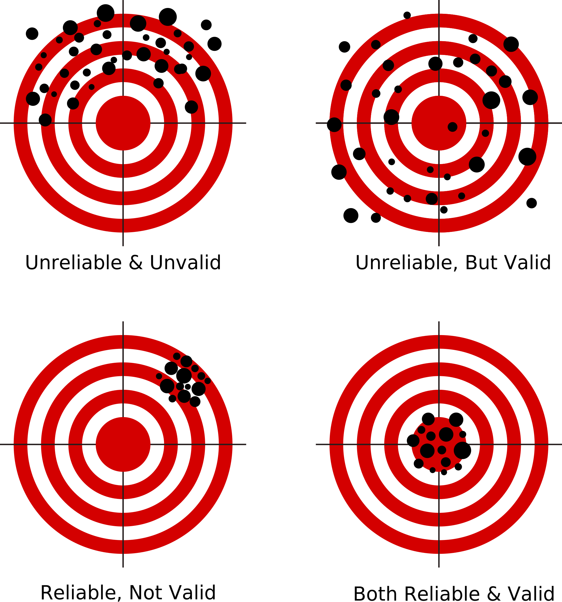

```{r setup, include=FALSE}
knitr::opts_chunk$set(echo = FALSE)
```

# Evaluating Descriptive Claims

## Plan for Today:

### **(1) Recap: Validity**

### **(2) Reliability**

### **(3) Reliability vs. Validity**

### **(4) Reliability/Validity vs. Measurement Error**


# Recap

## Measurement Trouble: Validity

#### **validity**: 

- Degree of **fit** between a **variables** or its **measure** and the **concept** the variable is intended to capture.
- When a variable and its measure "capture" or "map onto" the concept we are interested in, then we say they have "validity"
- When a variable and its measure "capture" or "map onto" other concepts we are not interested in, then we say they lack "validity"

### Validity is about relationship of **variable** or **measure** to the **concept**.

## Measurement Trouble: Validity

### **Threats to validity**

#### **Validity can break down in two places:**

1. Concept $\xleftarrow{Mismatch}$ Variable
  - e.g.: Political Corruption Prosecutions does not match "Political Corruption"

2. Variable $\xleftarrow{Mismatch}$ Measure
  - e.g. police reports may not accurately record physical threats
  
### One or both of these could happen.  
  
## **Threats to validity**

1. Measure/Variable does not cover **enough** of the concept:
    - Measure only captures some but not all relevant **dimensions** of the concept
2. Measure/Variable covers things **outside** the concept:
    - Could cover somethings inside the concept, or **nothing** inside the concept
    - e.g. fraction of politicians convicted of corruption 
    - e.g. survey of reported self-defense gun uses
3. Measure captures different things across units: **non-comparability**
  - e.g. police assessment of "objective threat" across races


## **Threats to validity**

**Concept**: Exposure to political information

**Variable**: Frequency of reading a newspaper

**Measure**: Survey of people asking for frequency with which they read a newspaper

### Does this capture **enough** of the concept?

- Newspapers once major source of information, but television and internet serve this role.

## **Validity**: Summary

### **Validity**

Pertains to the **quality** of the match between our **observations** and the **concept** we want those observations to capture.

- Can fail because we have chosen a **variable** that insufficiently captures the concept, maps onto other (unhelpful) concepts, or captures different things for different concepts.

- Can fail because our **measure** does not yield the correct values for our **variable** and instead reflects other concepts

- Lack validity when variables or measures **consistently** fail to capture the concept

# Reliability

## Measurement Trouble: Reliability

#### **reliability**

- How **consistent** is the fit between a **variable** or its **measure** and the **concept** the variable is intended to capture.
- When a variable and its measure capture **different** things each time we use them/ **do not** produce the **same result** when repeated for the same case, they **lack reliability**
- When a variable and its measure capture the **same thing** each time we use them/**produce** the **same result** when repeated for the same case, they **have reliability**

Like **validity**, **reliability** is about how well our variables/measures relate to the **concepts** we wish to observe.


## Measurement Trouble: Reliability

### **Threats to reliability**

#### **reliability can break down in two places:**

1. Concept $\xleftarrow{inconsistent}$ Variable

2. Variable $\xleftarrow{inconsistent}$ Measure

# Reliability: 

### Two Examples

## Example 1: Facebook and Hate Crime

### **Mueller and Schwarz (2018)** ask:

<br>

#### **Does social-media hate speech lead to real-world violence?**

- Anti-Refugee **content** on Facebook and Anti-Refugee **violence** in Germany

>- If anti-refugee sentiment **spreads through Facebook**, we would expect **hate crimes** to be **more likely** to occur in municipalities with **higher exposure to social media**

>- Need to measure "exposure to Facebook".

## Example 1: Facebook and Hate Crime

#### **concept**: "Exposure to Facebook": persons who have an active Facebook account

<br>

#### **variable**: (ideally) "Active Facebook users per capita"

<br>

#### **measure**: Only Facebook could link users to communities directly; won't share data

## Example 1: Facebook and Hate Crime

#### **concept**: "Exposure to Facebook": persons who have an active Facebook account

<br>

#### **variable**: (actually) "Followers of Nutella on Facebook per capita"

- Nutella is very popular in Germany, so variable captures Facebook usage, but not consistently. Sometimes captures **unrelated** concepts like "love of chocolate", "love of hazelnuts", "good taste"

#### **measure**: "Followers of Nutella on Facebook who share their location information on Facebook per capita"

- Captures Nutella followers, but not consistently. Also captures **arbitrary** decisions about sharing location information.


## Example 1: Facebook and Hate Crime

##### **Concept (FB Users) $\xleftarrow{inconsistent}$ Variable (Nutella Likers)**

<br>

##### **Variable (Nutella Likers) $\xleftarrow{inconsistent}$ Measure (Located Nutella Likers)**

## Example 2: Anti-Lynching Media

### **Weaver (Forthcoming)** asks:

### **How did lynching become publicly unacceptable?**

- New communication technologies gave nationwide publicity to lynching, generating criticism

>- If this is true, newspaper coverage **farther** from lynchings should be **more critical** of lynching

>- Need to measure "critical of lynching".


## Example 2: Anti-Lynching Media

#### **concept**: "Critical of lynching": presence of arguments and value judgments against lynching

<hr style="height:8px; visibility:hidden;" />


#### **variable**: (actually) "Number of anti-lynching keywords/phrases - Number of pro-lynching keywords/phrases" (on a newspaper page that mentions lynching)

- May not consistently capture the concept: Keywords used in different ways; Keywords may be refer to things other than lynching.

#### **measure**: Use computer vision to read pages, count number of keywords

- May not consistently capture the variable: Number of keywords could depend on the quality of the image, quality of computer vision algorithm

## Example 2: Anti-Lynching Media

##### **Concept (Lynching Criticism) $\xleftarrow{inconsistent}$ Variable (Keyword Count)**

<br>

##### **Variable (Keyword Count) $\xleftarrow{inconsistent}$ Measure (OCR keyword count)**

## Measurement Trouble: Reliability

### **Threats to reliability**

1. Room for researcher **interpretation**. **Imprecise** procedures for measurement
    - Expert Ratings (e.g. democracy)
    - Assessing intangibles (e.g. Physical threat in Police shootings)
2. **Instability**: variable/measurement may be unstable due to randomness, even when underlying concept is stable.
    - Survey responses can change due to "random" events, forgetfulness
    - **Random** things can affect liking of Nutella on FB, keyword counts from old newspapers

## **Reliability**: Summary

### **Reliability**

Pertains to the **consistency** of the match between our **observations** and the **concept** we want those observations to capture.

- Can fail because we have chosen a **variable** that is only inconsistently related to our **concept**.

- Can fail because our **measure** that is inconsistent in capturing the correct values of a **variable**

- Lack reliability when variables or measures are **inconsistent** in how they capture the concept of interest.

# Validity vs Reliability

## Validity vs Reliability

#### **Validity** and **Reliability** of variables/measures are independent of each other.

<hr style="height:8px; visibility:hidden;" />

#### **Lack of *Validity* and Lack of *Reliability***

- Lack of **validity** means **consistently/systematically** failing to capture the concept or capturing other concepts.
- Lack of **reliability** means failing to capture the concept/capturing other concepts in some **random**/**arbitrary** way.

If the **concept** is the signal we want to detect...

- Lack of **validity** means we pick up **the wrong signal**
- Lack of **reliability** means the signal we receive is **noisy**

## So, if the bullseye is the *concept*... {.centered}



## Reliability vs Validity

### Measuring Individual Income:

|               | **Less Valid**                             | **More Valid**                 |
|:-------------:|-----------------------------------------|-----------------------------|
| **Less Reliable** | Do you consider yourself upper, middle, or lower class?    | What is your annual income? |
| **More Reliable** | What is the make and model of your car? | Tax Records (T1 Forms)              |


# Measurement Error

## Measurement Error

#### **Validity** and **Reliability** are about link between variable/measure and **concept**

<hr style="height:8px; visibility:hidden;" />

#### **Measurement Error** refers to link between **measure** and **variable**.

<hr style="height:8px; visibility:hidden;" />

**measurement error:** occurs when a **measure** we use gives us **values** for cases that **do not** match the **true values**


## Measurement Error

### Two varieties of **measurement error**

- **bias**/**systematic measurement error**
- **random measurement error**

### **Measurement Errors** lead to **Validity/Reliability** problems

<hr style="height:8px; visibility:hidden;" />

**Validity**/**Reliability** can fail on **variable** $\leftarrow$ **measure** link

- if there is **bias**/**systematic measurement error** $\rightarrow$ we lack **validity**
- if there is **random measurement error** $\rightarrow$ we lack **reliability**
