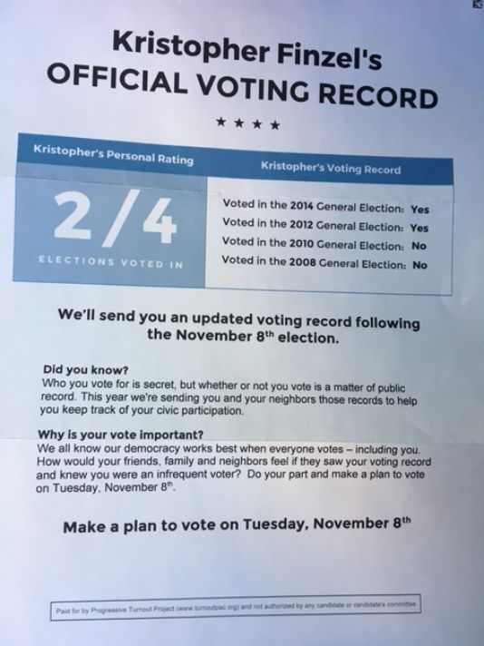

```{r setup, include=FALSE}
knitr::opts_chunk$set(echo = FALSE)
require(haven)
require(data.table)
require(ggplot2)
require(magrittr)
```

## Objectives


### **1. What is Causality**

- **Counterfactuals**
- **Potential Outcomes**

### **2. Types of causal claims**
  
- **deterministic** vs **probabilistic**
- varieties of **deterministic** causal claims


## A question for today:

From the midterm, and still a relevant policy consideration:

> Do public health polices that **require** individuals to wear face-masks in public indoor spaces **reduce** COVID transmission and mortality?

>- This is a **causal** question.

# What is causality?

## What is causality?

All **causal claims** are **counterfactual claims**:

That is: they imply two **descriptive claims** of a specific type

1. One descriptive claim about how the world <u>is</u> **factually**;
    - what is the factual exposure to the alleged "cause"
    - what is the factual outcome (the thing allegedly affected)
2. One descriptive claim about how the world <u>would be</u> **counterfactually**
    - what would the outcome be **if exposure to the alleged cause were different**
    
## Counterfactuals and Causality:

**counterfactuals**: are the way world **would be** if events had transpired differently (other than what actually took place).

- imagine an "alternate universe"

constrasts to what is **factual**: the way the world is, given the events that have taken place.

## Counterfactuals and Potential Outcomes

Counterfactuals imply **potential outcomes**:

If $X$ is a **variable** that corresponds to a possible cause and $Y$ is a **variable** for what is possibly affected, and $i$ indicates a specific case... 

then **potential outcomes** are the values of $Y_i$ a **specific case** would take for the different possible values of $X$ (both factual and counterfactual)

-  **potential** outcomes because they **could happen** but only one becomes factual, the others remain **counterfactual**.

## Counterfactuals and Potential Outcomes

$Y_i$ = COVID Deaths in a Canadian Province

$X$ = Mandatory Face-mask Policy (yes or no)

Only one policy will be implemented; COVID deaths in the alternate world remain counterfactual (what would have happened **absent** face-mask policy).

## Counterfactuals and Causality:

And we can say that $X$ **causes** $Y$ for case $i$ if $Y_i(X = 1) \neq Y_i(X = 0)$:

- $X$ causes $Y$: if case $i$ would have behaved ($Y$) differently (than it did factually) in the (counterfactual) alternate universe where **everything was the same** except  for $X$.

- Same as saying: $X$ causes $Y$ if the potential outcomes of $Y$ are different for different values of $X$

## Counterfactuals and Causality:

And we can say that $\mathrm{Face \ Mask \ Policy}$ **reduced** $\mathrm{COVID \ Deaths}$ for case $BC$ if

$\mathrm{COVID \ Deaths}_{BC}(\mathrm{Mask = Yes}) <$  $\mathrm{COVID \ Deaths}_{BC}(\mathrm{Mask = No})$:

## Counterfactuals and Causality:

All causal claims can be re-stated as **counterfactual claims**

- They contain a **conditional clause**, starting with "If" (always in the **subjunctive mood**)
- A "then" clause, stating what would happen if the **conditional**/**"If"** clause were true (always in the **conditional mood**)
- May be in past, present, or future tense.

## Counterfactuals and Causality:

### Example: Past

"BC's mask mandate reduced COVID fatalities."

$$\underbrace{If \ \  BC \ \ had \ \ not \ \ imposed \ \ a \ \ mask \ \ mandate}_{\text{If-clause in Subjunctive Mood}}, \\
\underbrace{there \ \ would \ \  have \ \ been \ \ more \ \ COVID \ \ deaths.}_{\text{Then-clause in Conditional Mood}}$$


## Counterfactuals and Causality:

### Example: Present

"The presence of greek organizations on campus increases rates of sexual assault."

$$\underbrace{If \ \  there \ \ were \ \ no \ \ greek \ \ organizations \ \ on \ \ campus}_{\text{If-clause in Subjunctive Mood}}, \\ \underbrace{there \ \ would \ \  be \ \ fewer \ \ sexual \ \ assaults.}_{\text{Then-clause in Conditional Mood}}$$

## Counterfactuals and Causality:

Note: **Counterfactual claims get increasingly complicated, the more complicated your causal claim is**

- On assignments, exam do not come up with overly complex causal claims.

## Two ways of asking causal questions

<h3><ol>
<li> What are the **causes** of **effects**?
</ol></h3>

Want to explain something specific that has happened/we observe (**the effect**). Seek to **attribute** a cause for something we observe. 

- **"Why has Quebec had the highest rate of COVID mortality among all provinces in Canada?"** 

## Two ways of asking causal questions

<h3><ol start=2>
<li> What are the **effects** of **causes**?
</ol></h3>

We want to know what happens if we do some action or some action (**the cause**) happens. (Could be a specific action or not) This is about the **contribution** of some cause to an effect.

- **What is the effect of the Canada Emergency Response Benefit (CERB) on consumer spending?**

---

### In groups

**1. Come up with two causal claims; one corresponding each of the preceding two questions**

**2. Restate each causal claim as a counterfactual claim.**

# Varieties of Causal Claims

## Two ways of asking causal questions

Usually... different kinds of causal questions are answered with **different kinds of causal claims**

1. **causes of effects** $\to$ **deterministic** causal claims
2. **effects of causes** $\to$ **probabilistic** causal claims

## Deterministic Causal Claims

**deterministic causal claims**

- claims about what happenens with **certainty** under specific causal conditions
- whenever some **cause** (or set of causes) is present, the **effect** <u>**always**</u> happens
  - if the cause is present the effect is **determined** (unavoidable)
- usually make these claims when we are interested in **causes of effects**

## Deterministic Causal Claims

There are several varieties **and** combinations

- **necessary** conditions
- **sufficient** conditions
- conjunctural/multiple causation (combinations of necessary/sufficiency conditions)

## Necessary Conditions

### **necessary conditions**

A causal claim that there is some cause $C$ **without which** the effect **cannot occur**

- A cause $C$ **must happen** in order for effect $E$ to happen.
- **Does not mean** if the cause $C$ is present, effect $E$ must happen, only **without** $C$, no $E$.

## Necessary Conditions: Example

A claim: "Without global air travel, a new infectious disease will not become a global pandemic."

Also can be stated: "Global air travel is a necessary condition for a new disease to become a pandemic."

## Map of Air Travel in 2015 {.centered}


POLL

## Necessary Conditions: Example

If this claim is true: "Global air travel is a necessary condition for a new disease to become a pandemic."...

Does the graph on preceding page imply that a new infectious disease will become a pandemic?

>- No. Presence of necessary condition $\not\to$ effect must happen. Instead, *absence* of necessary condition $\to$ effect does not happen

## Sufficient Conditions

(In contrast to **necessary conditions**)

### **sufficient conditions**

- cause $C$ **always** produces an effect $E$ when it is present
- do not depend on other factors being present; cause $C$ can produce $E$ **by itself**
- Sufficient conditions imply: every time $C$ is present, then $E$ will happen 

## Sufficient Conditions: Example

**"A military coup that overthrows a democratically elected government is a sufficient condition for large public protests."**

- This *might* be the case every time
- Does not appear to depend on other factors

#### Generally, single causes that are sufficient conditions are **rare** in social sciences

# Things are usually more complicated

---

### BC vs. Washington State

Since the pandemic has begun, BC has had a 27.4 COVID deaths per 100000 people. Washington State, directly across the US border to the south, has had 67.5 COVID deaths per 100000 people.

In your group, propose an answer: What caused BC to have a lower COVID death rate than Washington State?


## Complex Causality

Causality may be **deterministic**... there are exact conditions for when effect always/never happens.

But in reality, it is almost always **complex** 

- **multiple** factors might be necessary (conjunctural)
- different causes produce same effect (multiple)
- different groups of factors might, together be sufficient (multiple and conjunctural)
- (INUS/SUIN conditions: [see here](https://doi.org/10.1111/1468-4446.12340))

## Voting Experiment

### **Why do people vote?**

# {.centered}



## Voting Experiment

```{r,echo = F, message=F, warning=F}

dd = data.frame(h = c(29.7, 31.5, 34.5, 37.8),
                cond = factor(c("Control", "Civic Duty", "Self\nVote Record", "Share\nVote Record"), levels = c("Control", "Civic Duty", "Self\nVote Record", "Share\nVote Record"))
)
                
ggplot(dd, aes(x = cond, y = h)) + geom_bar(stat = "identity") + ylab("% Who Voted") + xlab("Mailing Treatments") + ggtitle("Voter Turnout by Experimental Group") + theme_bw() 

```

POLL

## Complex Causality

Does it make sense to say that "being shamed" is a **necessary condition** for voting?

>- No. Clearly some people voted in absence of shaming

Does it make sense to say that "being shamed" is a **sufficient condition** for voting?

>- No. Some people were shamed but did not vote.

>- It is simpler to state this probabilistically: being shamed increases likelihood of voting.


## Probabilistic Causal Claims

### **probabilistic causal claims**

are claims that the presence/absence of a cause $C$ makes an effect $E$ more or less likely to occur. Or cause $C$ increases/decreases effect $E$ **on average**

- In contrast to **deterministic causal claims** this implies
    - effect $E$ can happen when $C$ is absent
    - effect $E$ may not happen when $C$ is present
- **NOT** a claim that politics has some inherent randomness (e.g. quantum mechanics)
- Usually make these claims when interested in **effects of causes**

## Interlude: Coin flips:

<iframe src="https://www.youtube.com/embed/AYnJv68T3MM?start=10&end=171" width=100% frameborder="0" allow="autoplay; encrypted-media" allowfullscreen></iframe>

## Interlude: Coin flips:


## Probabilistic Causal Claims

### Why do we need **probabilistic claims**?

Causality is deterministic. 

But causality is also complex, and not fully known:

Cause $C$ might produce an effect $E$...

- only when multiple other necessary conditions are met (**conjunctural**)
- as only one of  **multiple** sufficient causes of the effect (**multiple**)
- in multiple conjunctural conditions.

$C$ appears to only cause a change in the **probability** or **likelihood** of seeing the effect $E$.


## Probabilistic Claims

Which are probabilistic causal claims?

#### **A) It's probably true that leftwing government reduce student tuition fees**

<hr style="height:8px; visibility:hidden;" />

#### **B) Electing a leftwing, rather than rightwing, government increases the likelihood that tuition fees wil be reduced**

<hr style="height:8px; visibility:hidden;" />

#### **C) Tuition fees are reduced more frequently under leftwing governments than rightwing governments**

POLL

## Examples

Which is a probabilistic causal claim?

#### ~~**A) It's probably true that leftwing government reduce student tuition fees**~~

<hr style="height:8px; visibility:hidden;" />

#### **B) Electing a leftwing, rather than rightwing, government increases the likelihood that tuition fees wil be reduced**

<hr style="height:8px; visibility:hidden;" />

#### ~~**C)  Tuition fees are reduced more frequently under leftwing governments than rightwing governments**~~
    
## Recognizing probabilistic causal claims

Not every probabilistic statement is **causal**

#### 1. ~~"Oppression is likely to cause a rebellion"~~

- Says oppression is probably a cause out rebellion
- Should say: cause $C$ **changes likelihood** of outcome $E$

#### 2. ~~"A rebellion is more likely to occur when the population is oppressed"~~

- Says we are more likely to **see** rebellion where population is oppressed
- Not clearly **causal**; just a descriptive claim.

# Conclusion

---

### **1. What is Causality**

- causality is **counterfactual**
- **Counterfactuals**
- **Potential Outcomes**

### **2. Types of causal claims**
  
- **deterministic** vs **probabilistic**
- varieties of **deterministic** causal claims

## Next time

How do we prove causality?