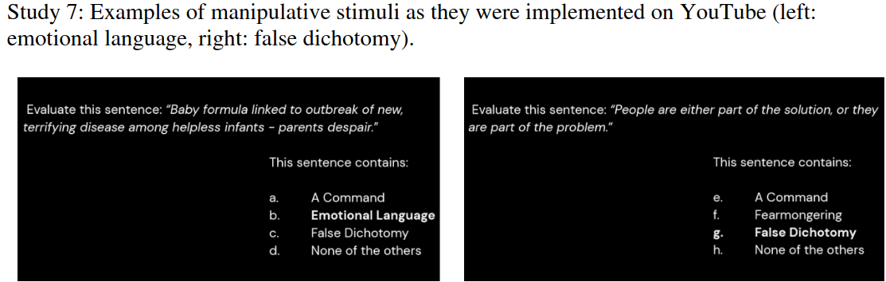

```{r setup, include=FALSE}
knitr::opts_chunk$set(echo = FALSE)
require(haven)
require(data.table)
require(ggplot2)
require(magrittr)
```

## Objectives


### **1. Review**
  
- causality as **counterfactual**
- **potential outcomes**


### **2. Types of Causal Claims**

- deterministic causal claims
- probabilistic causal claims

### **3. Testing Causal Claims**

- Fundamental Problem of Causal Inference

# Recap

---


[article here](https://www.nytimes.com/2025/10/30/style/lamp-club-luddites.html)

---


$S$cathing $H$atred of $I$nformation $T$echnology and the

 $P$assionate $H$emorrhaging of $O$ur $N$eo-liberal $E$xperience

---


Chanting: "We must free the iPad babies, even if it gives us rabies"

---

<video loop autoplay src="https://vp.nyt.com/video/2025/10/28/153054_1_29LAMP-CLUB-12936_wg_1080p.mp4" type="video/mp4" width=50%>


## Causal Claims

> "Exposure to absurdist neo-Luddite protest reduces average hours spent on smart devices."


<br> 

>- What are the two implied descriptive claims in this causal claim?


## Causality is Counterfactual

All causal claims are claims about how the world would be changed in an *alternate timeline* in which some thing (or things) were different than they actually are. 

These alternate timelines/universes are **counterfactuals**


## Counterfactual Claims:

It follows that, all causal claims can be re-stated as **counterfactual claims**

- They contain a **conditional clause**, starting with "If" (always in the **subjunctive mood**)
- A "then" clause, stating what would happen if the **conditional**/**"If"** clause were true (always in the **conditional mood**)
- May be in past, present, or future tense.

## Counterfactual Claims:

### Example:

"Exposure to absurdist neo-Luddite protest reduces average hours spent on smart devices."

$$\overbrace{\text{If people were not exposed to absurdist neo-Luddite protest}}^{\text{If-clause in Subjunctive Mood}}, \\ \underbrace{\text{then they would have spent more hours on smart devices.}}_{\text{Then-clause in Conditional Mood}}$$


## Counterfactual Claims:

Note: **Counterfactual claims get increasingly complicated, the more complicated your causal claim is**

- On assignments/final exam do not come up with overly complex causal claims.

## Practice:

With your neighbors: turn these causal claims into counterfactual claims.

1. "The rise of social media 'echo chambers' increased political polarization." 
2. "The purchase of 20% rental housing units by private equity firms has increased the cost of rent." 
3. "Remote learning during the pandemic increased mental health issues among students."


## Causality is Counterfactual

> "The expansion of NATO into Eastern Europe caused Russia to invade Ukraine"

implicitly claims that...

in the **counterfactual** world:

If NATO did not expand (the "cause" is not present), Russia would not have invaded Ukraine in February 2022 (the "effect" would be different).

>- we can translate the factual/counterfactual claims in causal claims into **potential outcomes**


---

### Potential Outcomes Describe Counterfactuals

**potential outcomes** are values for variables that describe the factual world (that has occurred) and counterfactual worlds (that have not). 

- a variable (labelled $Y$) corresponding to what is "affected" or the "**outcome**"
- a variable (labelled $X$) for the "cause"  $\to$ different **potential** "universes"  
- the **values** that $Y$ would take **for a particular case** $i$

Take the form of $Y_i(X)$ or $Outcome_{case}(Cause)$

## Potential Outcomes Describe Counterfactuals

> "The expansion of NATO into Eastern Europe caused Russia to invade Ukraine"

What are the potential outcomes this causal claim implies?

- What is the "outcome" variable?
- What is the "cause" variable? What different "universes" are possible?
- What is the case?

(TO THE BOARD)


---

### Potential Outcomes Describe Counterfactuals

Which of these potential outcomes is **factual**? **Counterfactual**?

$\mathrm{Russian \ Invasion}_{Ukr}(\mathrm{E. \ Europ. \ NATO \ Memb.} = 0) = ?$
$\mathrm{Russian \ Invasion}_{Ukr}(\mathrm{E. \ Europ. \ NATO \ Memb.} = 14) = ?$

---

### Potential Outcomes Describe Counterfactuals

(red indicates $\color{red}{\mathrm{counterfactual}}$)

$\color{red}{\mathrm{Russian \ Invasion}_{Ukr}(\mathrm{E. \ Europ. \ NATO \ Memb.} = 0) = ?}$
$\mathrm{Russian \ Invasion}_{Ukr}(\mathrm{E. \ Europ. \ NATO \ Memb.} = 14) = ?$

<br>

What are the values of these potential outcomes if the following claim is true?

> "The expansion of NATO into Eastern Europe caused Russia to invade Ukraine"

## Potential Outcomes Describe Counterfactuals

> "The expansion of NATO into Eastern Europe caused Russia to invade Ukraine"

If this causal claim were true: then it implies these potential outcomes:

$\color{red}{\mathrm{Russian \ Invasion}_{Ukr}(\mathrm{E. \ Europ. \ NATO \ Memb.} = 0) = \mathrm{No}}$
$\mathrm{Russian \ Invasion}_{Ukr}(\mathrm{E. \ Europ. \ NATO \ Memb.} = 14) = \mathrm{Yes}$


# Varieties of Causal Claims

## Two ways of making causal claims

Usually... different questions leads to **different kinds of causal claims** 

1. **causes of effects** $\to$ **deterministic** causal claims
2. **effects of causes** $\to$ **probabilistic** causal claims

And different types of causal claims imply:

- different counterfactuals/potential outcomes
- different forms of evidence.

## Deterministic Causal Claims

**deterministic causal claims**

claims about what happens with **certainty** under specific causal conditions

- whenever some **cause** (or set of causes) is present, the **effect** <u>**always**</u> happens
- or whenever some **cause** (or set of causes) is absent, the **effect** <u>**never**</u> happens
- usually make these claims when we are interested in **causes of effects**

## Deterministic Causal Claims

There are several varieties **and** combinations

- **necessary** conditions
- **sufficient** conditions
- conjunctural/multiple causation (combinations of multiple necessary/sufficiency conditions)

## Example

A claim: "If Germany had not had an economic collapse during the Great Depression, Hitler and the Nazi Party would not have come to power."

Head to [menti.com](menti.com) and use code $1587 \ 4520$

---

<div style='position: relative; padding-bottom: 56.25%; padding-top: 35px; height: 0; overflow: hidden;'><iframe sandbox='allow-scripts allow-same-origin allow-presentation' allowfullscreen='true' allowtransparency='true' frameborder='0' height='315' src='https://www.mentimeter.com/app/presentation/bc1597f5eddf982927631e3cc6c7f3c8/embed' style='position: absolute; top: 0; left: 0; width: 100%; height: 100%;' width='420'></iframe></div>

## Example

If this claim is true: "If Germany had not had an economic collapse during the Great Depression, Hitler and the Nazi Party would not have come to power."...

The fact that there was an economic collapse in Germany during the Great Depression **does not mean** that the the Nazi takeover was inevitable. 

>- This is a "necessary condition"
>- Presence of necessary condition $\not\to$ effect must happen. Instead, *absence* of necessary condition $\to$ effect does not happen


## Necessary Conditions

### **necessary conditions**

A causal claim that there is some cause $C$ **without which** the effect $E$ **cannot occur**

- A cause $C$ **must happen** in order for effect $E$ to happen.
- **Does not mean** if the cause $C$ is present, effect $E$ must happen


## Necessary Conditions: Potential Outcomes

Claims about necessary conditions have specific implications about potential outcomes:

If we say that: "The Great Depression was a necessary condition for the Nazis to take power in Germany."

<br>

What are the implied potential outcomes?

## Necessary Conditions: Potential Outcomes

Claims about necessary conditions have specific implications about potential outcomes:

If we say that: "The Great Depression was a necessary condition for the Nazis to take power in Germany."


What are the implied potential outcomes?

$\mathrm{Nazis}_{Germany} \ (\mathrm{Economic \ Crisis = No}) = \mathrm{No}$

$\mathrm{Nazis}_{Germany} \ (\mathrm{Economic \ Crisis = Yes}) = \mathrm{Yes} \ or \ \mathrm{No}$

Something else might have had to happen, in addition to economic crisis, for Nazis to take power.


## Sufficient Conditions

(In contrast to **necessary conditions**)

### **sufficient conditions**

- cause $C$ **always** produces an effect $E$ when it is present
- do not depend on other factors being present; cause $C$ can produce $E$ **by itself**
- but **other** causes of the effect may exist
- Sufficient conditions imply: every time $C$ is present, then $E$ will happen 


## Sufficient Conditions: Example

**"Doug Ford running ads criticizing tariffs was a sufficient condition for Trump to increase tariff on Canada by 10 percentage points."**

#### Generally, single causes that are sufficient conditions are **rare** in social sciences

## Sufficient Conditions: Example

Sufficient conditions also imply specific potential outcomes:

**"Doug Ford running ads criticizing tariffs was a sufficient condition for Trump to increase tariff on Canada by 10 percentage points."** implies:

$\mathrm{Raise \ Tariffs}_{Canada} \ (\mathrm{Reagan \ Ad = No}) = \mathrm{No \ or \ Yes}$

$\mathrm{Raise \ Tariffs}_{Canada} \ (\mathrm{Reagan \ Ad = Yes}) = \mathrm{Yes}$


>- Why?

## Misinformation Experiment

### **What can be done to limit the spread of misinformation on social media?**

>- Educating people about strategies used to spread misinformation  ("inoculation") may make them less susceptible to these techniques. 
>- Does showing people a short video explaining a misinformation tactic increase their ability to recognize the tactic?

# {.centered}

<iframe width="560" height="315" src="https://www.youtube.com/embed/ER64qa_qnWg?si=ErFDiltt1Df-0vOr" title="YouTube video player" frameborder="0" allow="accelerometer; autoplay; clipboard-write; encrypted-media; gyroscope; picture-in-picture; web-share" referrerpolicy="strict-origin-when-cross-origin" allowfullscreen></iframe>

## Misinformation Experiment

Aired this ad on YouTube and then surveyed people in "treatment" and "control" conditions  to see if they recognize the misinformation tactic



## Misinformation Experiment

```{r,echo = F, message=F, warning=F}

dd = data.frame(h = c(55.1, 52.5),
                cond = factor(c("Emotional Language Inoculation", "Control"), levels = c("Emotional Language Inoculation", "Control"))
)
                
ggplot(dd, aes(x = cond, y = h)) + geom_bar(stat = "identity") + ylab("% recognize Emotional Language") + xlab("Treatments") + ggtitle("Misinformation Recognition by Experimental Group") + theme_bw() 

```

[menti.com](menti.com) $4680 \ 9916$

---

<div style='position: relative; padding-bottom: 56.25%; padding-top: 35px; height: 0; overflow: hidden;'><iframe sandbox='allow-scripts allow-same-origin allow-presentation' allowfullscreen='true' allowtransparency='true' frameborder='0' height='315' src='https://www.mentimeter.com/app/presentation/ac3a397793c03a7da0fd73d7a2350faa/embed' style='position: absolute; top: 0; left: 0; width: 100%; height: 100%;' width='420'></iframe></div>

## Misinformation Experiment

Does it make sense to say that "being inoculated" is a **necessary condition** for spotting misinformation?

>- No. Clearly some people recognized misinformation without being inoculated.

Does it make sense to say that "being inoculated" is a **sufficient condition** for spotting misinformation?

>- No. Clearly some people were inoculated but did not recognize misinformation.


## Complex Causality

Causality may be **deterministic**... there are exact conditions for when effect always/never happens.

But in reality, it is almost always **complex** 

- **multiple** factors might be necessary (conjunctural causality)
- different causes produce same effect (multiple causality)
- different groups of factors might, together be sufficient (multiple and conjunctural)
- (INUS/SUIN conditions: [see here](https://doi.org/10.1111/1468-4446.12340))


---

Rather than spell out **complex** deterministic causal claims, easier to make

### **probabilistic causal claims**

are claims that the presence/absence of a cause $C$ makes an effect $E$ more or less likely to occur. Or cause $C$ increases/decreases effect $E$ **on average**

- In contrast to **deterministic causal claims** this implies
    - effect $E$ can happen when $C$ is absent
    - effect $E$ may not happen when $C$ is present
- **NOT** a claim that politics has some inherent randomness (e.g. quantum mechanics)
- Usually make these claims when interested in **effects of causes**


## Probabilistic Causal Claims

Because causality is complex, we do not fully know the deterministic rules...

$C$ appears to only cause a change in the **probability** or **likelihood** of seeing the effect $E$.

- e.g. [coin flips](https://www.youtube.com/watch?v=AYnJv68T3MM)


## Probabilistic Claims

Which are probabilistic causal claims?

#### **A) It's probably true that having a left-wing government causes public sector unions make demands for higher wages.**

<hr style="height:8px; visibility:hidden;" />

#### **B) Electing a left-wing, rather than right-wing, government increases the likelihood that public sector unions make demands for higher wages.**

<hr style="height:8px; visibility:hidden;" />

#### **C) Public sector unions make demands for higher wages more frequently under left-wing governments than right-wing governments.**


## Examples

Which is a probabilistic causal claim?

#### ~~**A) It's probably true that having a left-wing government causes public sector unions make demands for higher wages.**~~

<hr style="height:8px; visibility:hidden;" />

#### **B) Electing a left-wing, rather than right-wing, government increases the likelihood that public sector unions make demands for higher wages.**

<hr style="height:8px; visibility:hidden;" />

#### ~~**C) Public sector unions make demands for higher wages more frequently under left-wing governments than right-wing governments.**~~
    
## Recognizing probabilistic causal claims

Not every probabilistic statement is **causal**

#### 1. ~~"Oppression is likely to cause a rebellion"~~

- Says oppression is probably a cause of rebellion ("likely" qualifies confidence in our knowledge)
- Should say: cause $C$ **changes likelihood** of outcome $E$

#### 2. ~~"Rebellions are more likely to occur in places where the population is oppressed"~~

- Says we are more likely to **see** rebellion where population is oppressed
- Not clearly **causal**; just a descriptive claim.

# Evidence for Causal Claims

## Evidence for Causal Claims

In this course, we focus on how to provide evidence that that pertain to claims about **effects of causes** rather than **causes of effects**.

- difficult to provide evidence of **either**
- easier to address **effects of causes**
- this means we focus on evidence of **probabilistic** causal claims


## Evidence for Causal Claims

A claim for today:

> "Exposure to absurdist neo-Luddite protest reduces average hours spent on smart devices."

>- What kind of claim is this (deterministic or probabilistic)?
>- what kind of **empirical** evidence would help you decide whether this claim is true?

## Evidence for Causal Claims

**Causal claims** imply relationships between **potential outcomes**
 
$\text{Phone Hours}_{i}(\text{Luddites}) < \\ \color{red}{\text{Phone Hours}_{i}(\text{No Luddites})}$

$\mathrm{Black}$ indicates **factual** potential outcomes (we observe this state of the world)

$\color{red}{\mathrm{Red}}$ indicates **counter**factual potential outcomes (we do not observe this state of the world)

## Evidence for Causal Claims

Let's say that, in the week following the protest, those who witnessed it used their phones an average of 2 hours per day.

$\text{Phone Hours}_{Witnesses}(\text{Luddites}) = 2 \ hours$

$\color{red}{\text{Phone Hours}_{Witnesses}(\text{No Luddites})} = \ \mathbf{????}$:

>- How could we know what this is?
>- We can **never know** what their phone usage would have been, had they not witnessed the protest

## What is the problem here?

### **Fundamental Problem of Causal Inference**

1. For New Yorkers who saw the protest: we can **only** observe the potential outcome of $\text{Phone Hours}_{Witnesses}$ for where the value of $\text{Luddites} = Yes$: what **actually** happened to these people.

2. We can **never observe** the other, **counterfactual**, potential outcomes of $\color{red}{\text{Phone Hours}_{Witnesses}}$ where $\color{red}{\text{Luddites} = No}$, because that was not the actual policy.

3. We can never **empirically** observe, for those witnesses, whether the $\text{Luddite}$ protest caused $\downarrow \text{Phone Hours}$.

## What is the problem here?

### **Fundamental Problem of Causal Inference**

1. By definition, $X$ causes $Y$ if the potential outcomes of $Y_i(X)$ were different if we changed $X$ for the exact same case.

2. For a specific case, we can **only** observe the potential outcome of $Y$ for the value of $X$ it **actually takes**. 

3. We **never observe** the **counterfactual** potential outcomes of $Y$ for different possible values of $X$ that the case did not experience.

4. We can never **empirically** observe, for a specific case, whether $X$ causes $Y$.

#


## You might be asking...

**I thought evidence for empirical claims based on *observing the world*?!**

**If we can never see the counterfactual... does this mean that *all* evidence for causal claims fails *weak severity*?**

**Are there "solutions" to this fundamental problem?**

