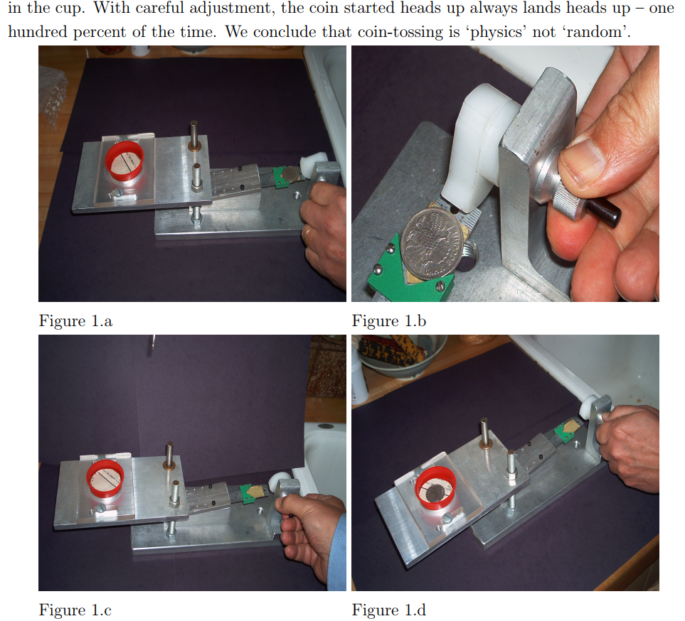

```{r setup, include=FALSE}
knitr::opts_chunk$set(echo = FALSE)
require(haven)
require(data.table)
require(ggplot2)
require(magrittr)
```

## Objectives


### **1. Types of causal claims**
  
  - varieties of **deterministic** causal claims
  - **complex** causality

### **2. Probabilistic causal claims**

- complexity $\to$ probabilistic claims
- recognizing probabilistic causal claims
- conditional effects

# Recap

## `menti.com 91 41 99`

### **"A person must see immigrants where they live and be exposed to anti-immigrant media in order to vote for an anti-immigration party."**

---

**"A person must see immigrants where they live and be exposed to anti-immigrant media in order to vote for an anti-immigration party."**

<div style='position: relative; padding-bottom: 56.25%; padding-top: 35px; height: 0; overflow: hidden;'><iframe sandbox='allow-scripts allow-same-origin' allowfullscreen='true' allowtransparency='true' frameborder='0' height='315' src='https://www.mentimeter.com/embed/bc1597f5eddf982927631e3cc6c7f3c8/07ca83474ebf' style='position: absolute; top: 0; left: 0; width: 100%; height: 100%;' width='420'></iframe></div>

## `menti.com 93 82 44`

### **"In India, Hindu-Muslim riots can only happen when the police stay on the sidelines."**

---

**"In India, Hindu-Muslim riots can only happen when the police stay on the sidelines."**

<div style='position: relative; padding-bottom: 56.25%; padding-top: 35px; height: 0; overflow: hidden;'><iframe sandbox='allow-scripts allow-same-origin' allowfullscreen='true' allowtransparency='true' frameborder='0' height='315' src='https://www.mentimeter.com/embed/ac3a397793c03a7da0fd73d7a2350faa/d6a3959cc789' style='position: absolute; top: 0; left: 0; width: 100%; height: 100%;' width='420'></iframe></div>

## `menti.com 83 16 22`

### **"Mass shootings lead to public demands for governments to make stricter gun ownership laws."**

---

**"Mass shootings lead to public demands for governments to make stricter gun ownership laws."**

<div style='position: relative; padding-bottom: 56.25%; padding-top: 35px; height: 0; overflow: hidden;'><iframe sandbox='allow-scripts allow-same-origin' allowfullscreen='true' allowtransparency='true' frameborder='0' height='315' src='https://www.mentimeter.com/embed/3467eefe70f2c678235c6aa075e76f2a/b94c7611e4c2' style='position: absolute; top: 0; left: 0; width: 100%; height: 100%;' width='420'></iframe></div>

## `menti.com 83 16 22`

### **"An electrical short circuit and wooden framing <u>OR</u> an open gas can next to a furnace can cause a house to catch fire."**

---

**"An electrical short circuit and wooden framing <u>OR</u> an open gas can next to a furnace can cause a house to catch fire."**

<div style='position: relative; padding-bottom: 56.25%; padding-top: 35px; height: 0; overflow: hidden;'><iframe sandbox='allow-scripts allow-same-origin' allowfullscreen='true' allowtransparency='true' frameborder='0' height='315' src='https://www.mentimeter.com/embed/bfa4ed0057bef4e0ac898f25d1d20a9e/d0950b376903' style='position: absolute; top: 0; left: 0; width: 100%; height: 100%;' width='420'></iframe></div>

## What is going on here?

Deterministic causal claims can get complicated:

**Conjunctural Condition 1:  electrical short circuit AND wooden framing** <u>OR</u> an open gas can 

**OR**

**Conjunctural Condition 2: open gas can AND a furnace**

<br>

**(Multiple) Conditions are SUFFICIENT to cause a house to catch fire."**

- Multiple sufficient causes of the same effect (house on fire)
- Each sufficient cause may be **conjunctural**

## Multiple and Conjunctural

### **Why do civil wars happen?**

- $C_1$: ethnic diversity **AND** $C_2$: political inequality between groups (e.g., Sri Lanka; Kurds in Turkey)

**OR**

- $C_3$: interference by foreign governments **AND** $C_4$: left-right ideological polarization (e.g., Nicaragua; Spain)

## Complex Causality

Causality may be **deterministic**... there are exact conditions for when effect always/never happens.

But in reality, it is almost always **complex** 

- multiple, conjunctural, multiple AND conjunctural
- (INUS/SUIN conditions: [see here](https://doi.org/10.1111/1468-4446.12340))

## Deterministic Causal Claims?

We are often unable to **fully describe** deterministic rules for what causes produce an effect

### Does it make sense to make **deterministic** claims?

- "Wood framing causes buildings to burn down (every time)?"
- "Short circuits cause buildings to burn down (every time)?"
- "Presence of indoor gas furnaces cause buildings to burn down (every time)?"

## Voting Experiment

### **Why do people vote?**

# {.centered}


## Voting Experiment

```{r,echo = F, message=F, warning=F}

dd = data.frame(h = c(29.7, 31.5, 34.5, 37.8),
                cond = factor(c("Control", "Civic Duty", "Self\nVote Record", "Share\nVote Record"), levels = c("Control", "Civic Duty", "Self\nVote Record", "Share\nVote Record"))
)
                
ggplot(dd, aes(x = cond, y = h)) + geom_bar(stat = "identity") + ylab("% Who Voted") + xlab("Mailing Treatments") + ggtitle("Voter Turnout by Experimental Group") + theme_bw() 

```

## Deterministic Causal Claims?

Does it make sense to say that "being shamed" is a **necessary condition** for voting?

Does it make sense to say that "being shamed" is a **sufficient condition** for voting?

>- It is simpler to state this probabilistically: being shamed increased likelihood of voting.

## Interlude: Coin flips:

<iframe src="https://www.youtube.com/embed/AYnJv68T3MM" width=100% frameborder="0" allow="autoplay; encrypted-media" allowfullscreen></iframe>

## Interlude: Coin flips:



## Probabilistic Causal Claims

When we are interested in **effects of causes**, we usually make **probabilistic causal claims**

### **probabilistic causal claims**

are claims that the presence of a cause $C$ makes an effect $E$ more or less **likely to occur** or to increase/decrease $E$ **on average.**

- In contrast to **deterministic causal claims** this implies
    - effect $E$ can happen when $C$ is absent
    - effect $E$ may not happen when $C$ is present
- **NOT** a claim that politics has some inherent randomness (not quantum mechanics)
    - recall, coin flips are **deterministic** but seem random.

## Probabilistic Causal Claims

### Why do we need **probabilistic claims**?

Causality is complex, but not fully known:

Cause $C$ might produce an effect $E$...

- only when multiple other necessary conditions are met (**conjunctural**)
- as only one of  **multiple** sufficient causes of the effect (**multiple**)
- in multiple conjunctural conditions.

$C$ appears to only cause a change in the **probability** or **likelihood** of seeing the effect $E$.

## Voting:

**Center of the Hall**: Conjunctural cause (w/ 3 necessary conditions) that is also **sufficient** for a person to vote. None of the 3 can include being shamed (as in the experiment)

**Sides of the Hall**: Conjunctural cause (w/ 3 necessary conditions) that is also **sufficient** for a person to vote. One of the 3 **must** be shaming (as in the experiment).

#

## `Menti.com 28 81 92`

Which are probabilistic causal claims?

#### **A) It's probably true that leftwing government reduce student tuition fees**

<hr style="height:8px; visibility:hidden;" />

#### **B) Electing a leftwing, rather than rightwing, government increases the likelihood that tuition fees wil be reduced**

<hr style="height:8px; visibility:hidden;" />

#### **C) Tuition fees are reduced more frequently under leftwing governments than rightwing governments**

---

<div style='position: relative; padding-bottom: 56.25%; padding-top: 35px; height: 0; overflow: hidden;'><iframe sandbox='allow-scripts allow-same-origin' allowfullscreen='true' allowtransparency='true' frameborder='0' height='315' src='https://www.mentimeter.com/embed/2638a643c6f2de7694f7ff9bfe7ba48d/2c268ec6cdae' style='position: absolute; top: 0; left: 0; width: 100%; height: 100%;' width='420'></iframe></div>

## Examples

Which is a probabilistic causal claim?

#### ~~**A) It's probably true that leftwing government reduce student tuition fees**~~

<hr style="height:8px; visibility:hidden;" />

#### **B) Electing a leftwing, rather than rightwing, government increases the likelihood that tuition fees wil be reduced**

<hr style="height:8px; visibility:hidden;" />

#### ~~**C)  Tuition fees are reduced more frequently under leftwing governments than rightwing governments**~~
    
## Recognizing probabilistic causal claims

Not every probabilistic statement is **causal**

#### 1. ~~"Oppression is likely to cause a rebellion"~~

- Says oppression is probably a cause out rebellion
- Should say: cause $C$ **changes likelihood** of outcome $E$

#### 2. ~~"A rebellion is more likely to occur when the population is oppressed"~~

- Says we are more likely to **see** rebellion where population is oppressed
- Not clearly **causal**; just a descriptive claim.


## Probabilistic Claims:

### **Conditional Effects**

Cause $C_1$'s effect on $E$ **differs** depending on some other factor $C_2$

- Exposure to Nazi Radio Propaganda ($C_1$) (in 1930s) 
    - in communities with **no medieval pogroms** ($C_2$) caused **decrease** in anti-Semitic violence on average ($E$).
    - in communities **with medieval pogroms** ($C_2$) caused **increase** in anti-Semitic violence on average ($E$).


## Testing Causal Claims

- Causality is **deterministic**.

- Causality is also **complex**.

- Our inability to master this complexity points toward **probabilistic causal claims**

**We focus on testing probabilistic causal claims (answering questions about effects of causes)**
