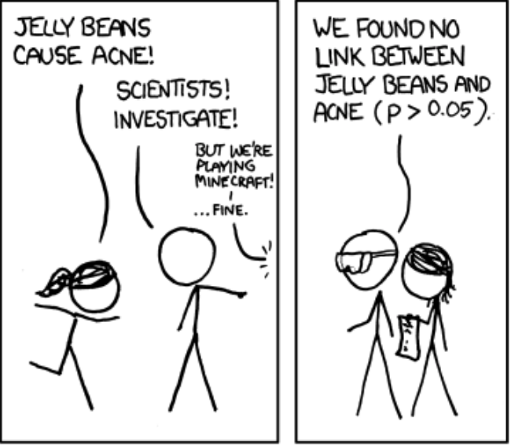
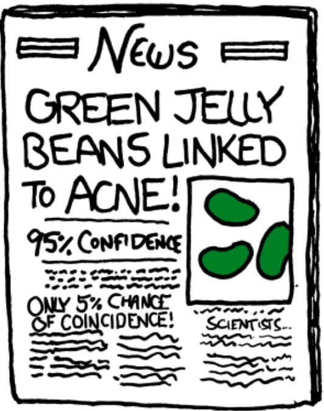
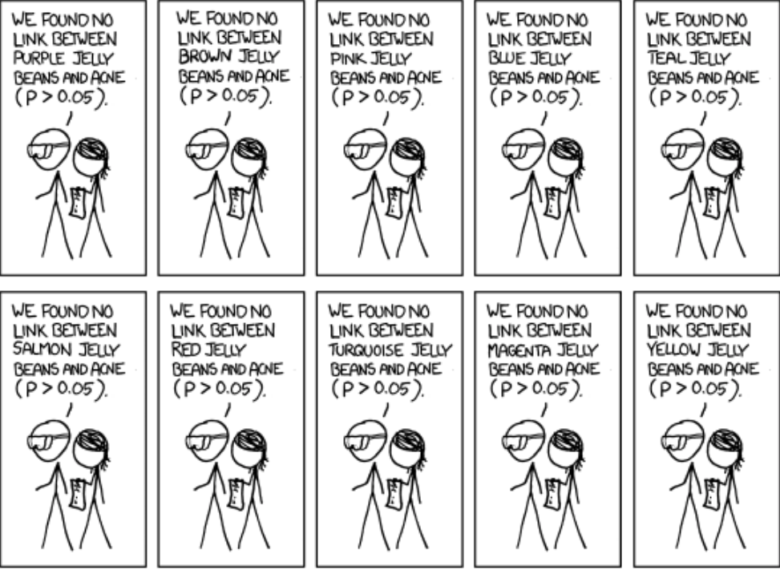

```{r setup, include=FALSE}
knitr::opts_chunk$set(echo = FALSE)
require(haven)
require(data.table)
require(ggplot2)
require(magrittr)
```

## Testing Causal Claims

### **1. Fundamental Problem of Causal Inference**

- causal hypotheses
- independent/dependent variables

### **2. Correlation**

- scatterplots
- problems with correlation


# Example

## Trump Rallies and Hate Crimes

In February 2019, Donald Trump held a rally in [El Paso, TX](https://www.npr.org/2019/02/12/693773455/trump-took-fight-for-border-wall-to-el-paso-where-orourke-was-ready-for-him). Argued that migrants were dangerous.

- "A wall is a very good thing, not a bad thing. It's a moral thing"
- "[reducing numbers of immigrants in detention would be] cutting loose dangerous criminals into our country."
- "The Democrat Party [is] becoming the party of socialism, late-term abortion, **open borders and crime.**"

## Trump Rallies and Hate Crimes

In August 2019, an armed man killed 22 people at a Walmart in El Paso, TX. In advance of his attack, he issued a manifesto that stated he was motivated in response to an alleged "Hispanic invasion of Texas."

>- [It has been suggested](https://abcnews.go.com/International/wireStory/trump-words-linked-hate-crime-experts-64836068) that there is a causal link between these events.

## Trump Rallies and Hate Crimes

A causal claim:

> "Trump's rally in El Paso increased the likelihood of hate crimes against immigrants."


- **Does the fact that a hate crime took place in El Paso after the rally prove this is true? Why or why not?**

## Trump Rallies and Hate Crimes

Causal claim implies...

**Counterfactual claim:**

> "If Trump had not held a rally in El Paso (in 2019), then there would have been fewer hate crimes against immigrants."

**Potential Outcomes:**

$\mathrm{Hate \ Crimes}_{El \ Paso}(\mathrm{Rally}) >$
$\color{red}{\mathrm{Hate \ Crimes}_{El \ Paso}(\mathrm{No \ Rally})}$

$\mathrm{Black}$ is factual; $\color{red}{\mathrm{Red}}$ is counterfactual

## Testing Causal Claims

We make causal claims testable by translating them into statements about **potential outcomes** / the relationship between **independent** (cause) and **dependent** (outcome) variables.

- these are statements about what we should **observe** if the causal claim is true.

For instance:

- If $X$ were present(absent), then $Y$ would be more(less) likely
- If $X$ were to increase(decrease), then $Y$ would increase(decrease)

## Independent/Dependent Variables

**Independent variable:**

The variable capturing the alleged cause in a causal claim.

- often called the “IV” or “X” or “right-hand variable”

**Dependent variable:**

The variable capturing the alleged outcome (what is affected) in a causal claim.

- often denoted as “DV” or “Y” or “left-hand variable”

**Potential Outcomes** are the values of **dependent variable** a case would take if exposed to different values of the **independent variable**

## Independent/Dependent Variables

> "Trump rallies in a community increase the likelihood of hate crimes against immigrants."

What could be an **independent variable** used to test this causal claim?

What could be a **dependent variable** used to test this causal claim?

## An Example:

| $\mathrm{City}_i$ | $\mathrm{Rally}_i$ | $\mathrm{Hate \  Crimes}_i(\mathrm{Rally})$ | $\mathrm{Hate \  Crimes}_i(\mathrm{No \ Rally})$  |
|---|---------|--------|-------|
| El Paso | **Yes** | **> 1** | **?** |

How would we find the "$?$"?

>- We can't know, because of the **Fundamental Problem of Causal Inference**

## FPCI

If Trump's rally caused  hate crimes to increase in El Paso, we would expect to see this:

$\mathrm{Hate \ Crimes}_{El \ Paso}(\mathrm{Rally}) >$
$\color{red}{\mathrm{Hate \ Crimes}_{El \ Paso}(\mathrm{No \ Rally})}$

While the value in $\mathrm{Black}$ is factual; The value in $\color{red}{\mathrm{Red}}$ is counterfactual and can **never** be known.

# Solving the FPCI

---

What behaviors cause a person to become wealthy?

<iframe width=560 height=349 src=https://player.cnbc.com/p/gZWlPC/cnbc_global?playertype=synd&byGuid=3000587544 frameborder=0 scrolling=no allowfullscreen webkitallowfullscreen mozallowfullscreen oallowfullscreen msallowfullscreen ></iframe>

Can we learn anything from this evidence?

## Solving the FPCI

We **cannot** say anything about causality if:

- we try to explain the cause of some effect by only looking at cases that experience that effect (**selection on dependent variable**)
- we try to explain the effect of some cause by only looking at cases that experience that cause (**causality is counterfactual**)

## Solving the FPCI

We **cannot observe**: $\color{red}{\mathrm{Hate \ Crimes}_{El \ Paso}(\mathrm{No \ Rally})}$

But we **can** observe, e.g.: $\mathrm{Hate \ Crimes}_{Austin}(\mathrm{No \ Rally})$

If we **assume**: $\mathrm{Hate \ Crimes}_{Austin}(\mathrm{No \ Rally})$ $=$
$\color{red}{\mathrm{Hate \ Crimes}_{El \ Paso}(\mathrm{No \ Rally})}$

Then, we can test our causal claim, to see if:

$\mathrm{Hate \ Crimes}_{El \ Paso}(\mathrm{Rally}) >$
$\mathrm{Hate \ Crimes}_{Austin}(\mathrm{No \ Rally})$

---

| $\mathrm{City}_i$ | $\mathrm{Rally}_i$ | $\mathrm{Hate \  Crimes}_i(\mathrm{Rally})$ | $\mathrm{Hate \  Crimes}_i(\mathrm{No \ Rally})$  |
|---|---------|:--------:|:-------:|
| El Paso | **Yes** | $\mathrm{Hate \ Crimes}_{El \ Paso}(\mathrm{Rally})$ | $\color{red}{\mathrm{Hate \ Crimes}_{El \ Paso}(\mathrm{No \ Rally})}$ |
| | | | $\mathbf{\Uparrow}$ |
| Austin | **No** | $\color{red}{\mathrm{Hate \ Crimes}_{Austin}(\mathrm{Rally})}$ | $\boxed{\mathrm{Hate \ Crimes}_{Austin}(\mathrm{No \ Rally})}$

---

| $\mathrm{City}_i$ | $\mathrm{Rally}_i$ | $\mathrm{Hate \  Crimes}_i(\mathrm{Rally})$ | $\mathrm{Hate \  Crimes}_i(\mathrm{No \ Rally})$  |
|---|---------|:--------:|:-------:|
| El Paso | **Yes** | $\mathrm{Hate \ Crimes}_{El \ Paso}(\mathrm{Rally})$ | $\boxed{\mathrm{Hate \ Crimes}_{Austin}(\mathrm{No \ Rally})}$ |
| | | | $\mathbf{\Uparrow}$ |
| Austin | **No** | $\color{red}{\mathrm{Hate \ Crimes}_{Austin}(\mathrm{Rally})}$ | $\mathrm{Hate \ Crimes}_{Austin}(\mathrm{No \ Rally})$

## Solving the FPCI

Every solution to the FPCI involves:

1. Comparing the **observed** values of outcome $Y$ in cases that **actually** have different values of cause $X$
      
2. Making assumptions that let us treat **factual** (observed) potential outcomes from some cases as equivalent to **counterfactual** (unobserved) potential outcomes of other cases.

>- The observed patterns of the association between the independent variable $X$ and dependent variable $Y$ are called **correlations**


## **Correlation**

**Correlation** is the degree of association/relationship between the **observed** values of $X$ (the independent variable) and $Y$ (the dependent variable)

- There are formal mathematical definitions. 
- We use the term loosely to describe the **observed relationship** between $X$ and $Y$

## **Correlation**

**All empirical evidence for causal claims** relies on **correlation** between the independent and dependent variables. 

But, you've all heard this:


## **Correlation**

How do we turn **correlation** into evidence of **causation**?

>- First, we need to know a bit more about **correlation**

## **Correlation**

Many different ways of assessing correlation.

- correlations have a **direction**:
    - positive: $X\uparrow$ , $Y\uparrow$ 
    - negative: $X\uparrow$, $Y\downarrow$ 
- correlations have **strength**:
    - **strong**: $X$ and $Y$ almost **always** move together 
    - **weak**: $X$ and $Y$ do not move together very much
- correlations have **effect size**: 
    - *how much* $Y$ changes with $X$ on average. 

---

```{r echo = F, message = F, warning = F}
data = fread('./trump_rally_data.csv') %>% 
        .[, list(trump_count = sum(trumprallycount), hate_crimes = sum(incidentcount), l_pop = log_pop[1]), by = fips]
data_g = data[, list(hate_crimes = mean(hate_crimes)), by = trump_count]

ggplot(data, aes(x = trump_count, y = hate_crimes)) + 
  geom_point(alpha = 0.2) + 
  xlab("Trump Rallies (Count): X") +
  ylab("Hate Crimes (Count): Y") +
  ggtitle("Trump Rallies and Hate Crimes by County (2016)") + 
  theme_bw()
```

---

```{r echo = F, message = F, warning = F}
data = fread('./trump_rally_data.csv') %>% 
        .[, list(trump_count = sum(trumprallycount), hate_crimes = sum(incidentcount), l_pop = log_pop[1]), by = fips]
data_g = data[, list(hate_crimes = mean(hate_crimes)), by = trump_count]

ggplot(data, aes(x = trump_count, y = hate_crimes)) + 
  geom_smooth(method = 'lm', se = F) +
  geom_jitter(alpha = 0.2, width = 0.5) + 
  xlab("Trump Rallies (Count): X") +
  ylab("Hate Crimes (Count): Y") +
  ggtitle("Trump Rallies and Hate Crimes by County (2016)") + 
  theme_bw()
```

data from [this paper](https://lmas.unt.edu/sites/lmas.unt.edu/files/lmas/Hate%20Incidents%20Spike_0.pdf)


## Correlation

### Formally...

**mathematically**: correlation is the degree of **linear** association between $X$ and $Y$

- Takes values between $-1$ and $1$
- Values close to $1$ or $-1$ suggest **strong** degree of *linear* association
- Values close to $0$ suggest **weak** degree of *linear* association
- Value of correlation does **not** tell us **how much** $Y$ changes with $X$

## Correlation

### What is it?

**negative correlation**:  ($< 0$) values of $X$ and $Y$ move in opposite direction:

- higher values of $X$ appear with lower values of $Y$
- lower values of $X$ appear with higher values of $Y$

**positive correlation**: ($> 0$) values of $X$ and $Y$ move in same direction:

- higher values of $X$ appear with higher values of $Y$
- lower values of $X$ appear with lower values of $Y$

## Correlation


## Correlation

- It is possible to see **perfect correlation** but small change in $Y$ across $X$

- It is possible to see **weak correlation** but large change in $Y$ across $X$

- It is possible to see **perfect nonlinear relationship** between $X$ and $Y$ with $0$ correlation

## Correlation:

**weak correlation**: values for $X$ and $Y$ do not cluster along line

**strong correlation**: values for $X$ and $Y$ cluster strongly along a line

**strength of correlation** does not determine the **slope** of line describing $X,Y$ relationship

**effect size**: this is the **slope** of the line describing the $X,Y$ relationship. The larger the effect, the steeper the slope

---

```{r echo = F, message = F, warning = F}
data[, any_trump := ifelse(trump_count >0, 1, 0)]
g_data = data[, list(hate_crimes = mean(hate_crimes)), by = any_trump]
ggplot(data, aes(x = any_trump, y = hate_crimes)) + 
  geom_smooth(method = 'lm', se = F) +
  geom_point(alpha = 0.1) + 
  xlab("Trump Rallies (Any): X") +
  ylab("Hate Crimes (Count): Y") +
  ggtitle("Trump Rallies and Hate Crimes by County (2016)") + 
  theme_bw()
```

Does this correlation prove that Trump rallies **caused** hate crimes? Why or why not?

---


```{r, echo = F, message = F}
cage_data = data.frame(cage_films = c(2,2,2,3,1,1,2,3,4,1,4),
                       pool_deaths = c(109, 102, 102, 98, 85, 95, 96, 98, 123, 94, 102))
require(ggplot2)
ggplot(cage_data, aes(x =cage_films, y = pool_deaths)) + 
  geom_point(position = position_jitter(w = 0, h = 1)) + 
  geom_smooth(method = 'lm', fullrange = T, se = F) +
  theme_bw() +
  ggtitle("Nick Cage films cause Pool Drownings") +
  xlab("Nick Cage Films per Year") + 
  ylab("Pool Drownings per Year (US)") + 
  theme(plot.title = element_text(size = 24, face = "bold"),
        axis.title=element_text(size=14,face="bold"))
```

Does this correlation prove that Nick Cage **caused** drownings? Why or why not?

## Correlation

### **Two types of problems**

- **random association**: correlations between $X$ and $Y$ occur **by chance** and do not reflect 

- **bias** (spurious correlation, **confounding**): $X$ and $Y$ are correlated but the correlation does not result from **causal relationship** between those variables

Solving these problems involves making **assumptions**: what are those assumptions? how plausible are they?

# Random Association 

## Correlation: Random association

<iframe width=100% src="https://www.youtube.com/embed/no_elVGGgW8?autoplay=0" frameborder="0" allowfullscreen></iframe>

## Correlation: Random association

Arbitrary processes can make seemingly-strong patterns.

If you look long enough at pure chaos, you might find a strong correlation

- But it could have happened by chance!
- So a correlation might not mean causality (e.g. Nick Cage)

[Arbitary Correlations](http://www.tylervigen.com/spurious-correlations)

## Random association: Statistics

To see that random patterns can emerge, I use random number generators to 

- **randomly** pick $5$ values of $X$
- **randomly** pick $5$ values of $Y$

We can imagine these are the observed $X$ and $Y$ for $5$ cases.

How **easy** is it to find a strong correlation?

## Random association: Statistics

```{r, echo = F}
c= 0
counter = 0
while (c < 0.9) {
  x = rnorm(5)
  y = rnorm(5)
  c = cor(x,y)
  counter = counter + 1
}

plot(x,y, main = "5 cases\nX and Y chosen randomly")
text(mean(x), mean(y), labels = paste0("Correlation: ", round(c, 2)), adj = 0.5)

```

## Random association: Statistics

```{r, echo = F}
plot(x,y, main = "5 cases\nX and Y chosen randomly")
text(mean(x), mean(y), labels = paste0("Correlation: ", round(c, 2)), adj = 0.5)
```

$\#$ Tries to get correlation $> 0.9$: `r counter`

## Random association

What do we do about this problem?

- We cannot **rule out** a chance correlation, but we can figure out **how likely** it is that the correlation occurred by chance.
- If chance correlation is very unlikely, then we set aside this concern

## Random association: Statistics

Field of statistics investigates properties of **chance** events:

- Probability theory tells us how likely events are to happen, given chance
- Tells us **how likely** correlation of a given strength is to happen by chance

## Random association: Statistics

### How?

1. Compute correlation of $X$ and $Y$
2. How **strong** is the correlation?
    - Patterns that are **stronger** are **less likely** to happen by chance
2. How many **cases** do we have?
    - Patterns with **many cases** are **less likely** to happen by chance
3. Assign a probability that the correlation we see would have happened by chance

## Random association: Statistics

This procedure works...

### **Assuming**...

we know the chance processes that could generate this correlation


## Random association: Statistics

```{r, echo = F}
c= 0
counter = 0
while (c < 0.9) {
  x = rnorm(10)
  y = rnorm(10)
  c = cor(x,y)
  counter = counter + 1
}

plot(x,y, main = "10 cases\nX and Y chosen randomly")
text(mean(x), mean(y), labels = paste0("Correlation: ", round(c, 2)), adj = 0.5)
```

Tries to get correlation $> 0.9$: `r counter `


## Random association: Statistics

```{r, echo = F}
c= 0
counter = 0
while (c < 0.9) {
  x = rnorm(15)
  y = rnorm(15)
  c = cor(x,y)
  counter = counter + 1
}

plot(x,y, main = "15 cases\nX and Y chosen randomly")
text(mean(x), mean(y), labels = paste0("Correlation: ", round(c, 2)), adj = 0.5)
```

Tries to get correlation $> 0.9$: `r sprintf("%.f",counter)`


## Random association: Statistics

```{r, echo = F}
c= 0
counter = 0
while (c < 0.45) {
  x = rnorm(15)
  y = rnorm(15)
  c = cor(x,y)
  counter = counter + 1
}

plot(x,y, main = "15 cases\nX and Y chosen randomly")
text(mean(x), mean(y), labels = paste0("Correlation: ", round(c, 2)), adj = 0.5)
```

Tries to get correlation $> 0.45$: `r counter`

## Random association: Statistics

**statistical significance**: 

> An indication of **how likely** it is that correlation we observe could have happened purely by chance.

> **higher** degree of statistical significance indicates correlation is **unlikely** to have happened by chance

## Random association: Statistics

$p$ **value**:

- A numerical measure of **statistical significance**. Puts a number on how likely observed correlation would have occurred by chance, **assuming** a we know the chance procedure and the truth is a $0$ correlation.

- It is a probability, so is between $0$ and $1$.

- **Lower** $p$-values indicate **greater** statistical significance

$p < 0.05$ often used as threshold for "significant" result. 

- but it is not a magic number
- Can observe $p < 0.05$ by chance ($\frac{1}{20}$)

## Random association: Statistics

$p$ **value**:

Be wary of "$p$-hacking"

- $p$ values become meaningless if we look at many associations, then only report the ones that are "significant".

### Why?

- low $p$-values occur by chance when we look at lots of associations

## Significant?



## Significant?


## Significant?


## What else do you want to know?



## We'd want to know this



## We'd want to know this


## Random assocation

1. Correlations can appear by chance
2. We can assess **probability** of chance correlation if we know:
    - **strength** of correlation (close to $1,-1$)
    - **size** of the sample ($N$)
    - we assume we know the **chance process** generating our observations
3. $p$-values:
    - Obtained using mathematical formulae
    - Given same $N$, stronger correlation has lower $p$
    - Given same strength, correlation with more $N$ has lower $p$
    
## Random assocation

### Recap:

| Statistical<br>Significance | $p$-value | By Chance? | Why? | "Real"? |
|:----------------------------:|:-----------------:|:----------:|:-------------------------------:|:----------------:|
| Low | High ($p > 0.05$) | Likely | small $N$<br>weak correlation | Probably **not** |
| High | Low ($p < 0.05$) | Unlikely | large $N$<br>strong correlation | Probably |

