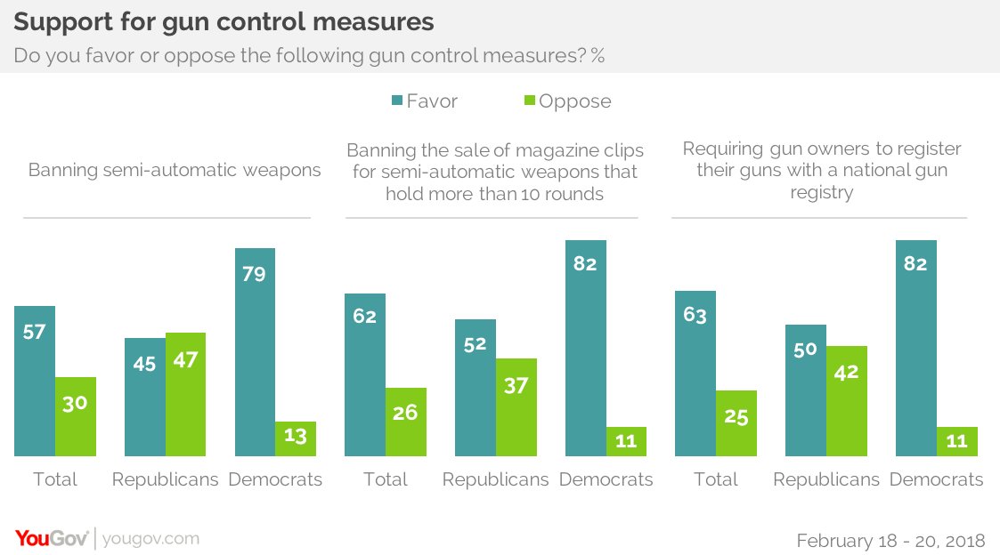
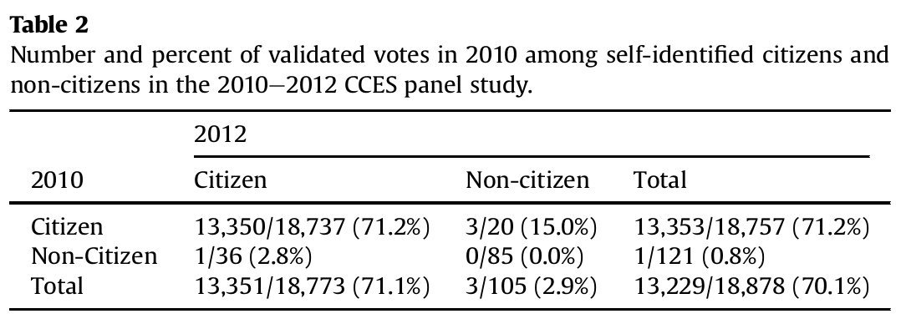

```{r setup, include=FALSE}
knitr::opts_chunk$set(echo = FALSE)
```

# Evaluating Descriptive Claims

## Plan for Today:

### **(1) Sampling Error**

- What is sampling
- Key terms related to sampling: population, sample, inference, sampling error, random sampling

### **(2) Sampling Error vs. Measurement Error**

# Sampling Error

## Sampling

### **Sometimes we cannot answer descriptive claims directly**


### For example:

**"Most Americans prefer a ban on semi-automatic firearms."**

We can't interview **all Americans**...

## Sampling

### So let's say we survey $1500$ people



## Sampling

### Key terms:

**population**: full set of cases (countries, individuals, etc.) we're interested in describing

**sample**: subset of the population that we observe and measure

**inference**: description of the population we make *based on a sample*, which must be, by its nature, uncertain

## Sampling: Example

Measuring attitudes on gun control in the US:

The **population**:

- All adults in the US

The **sample**: 

- 1500 people chosen **at random**

The **inference**:

- $57\%$ of Americans want ban on semi-automatic weapons, with some **uncertainty** due to sampling 
- in this case, the interval $(54.5\%,59.5\%)$ covers the true % with a probability of 0.95 

## Sampling Error:

Samples can lead us to make **incorrect** inferences

### **sampling error**:

The difference between the value of the measure for the sample and the true value of the measure for the population

$$Value_{Population} - Value_{Sample} \neq 0 \xrightarrow{then} sampling \ error$$

## Sampling Error: Two Varieties

**sampling bias**: samples generated by a sampling procedure deviate **systematically** from the population. Results from respondents/cases joining sample with **unequal probability** 

- e.g., certain respondents/cases choosing to be in/out of sample (who responds to surveys?)
- e.g., researcher selects cases out of convenience/observed traits

**random sampling error**: samples generated by sampling procedure deviate from population **by chance**.

- too many cases in a sample with high values or with low values (e.g. survey only people with long/short commutes). 
- because errors are **by chance**, errors cancel out and are **unbiased** in aggregate.

## Sampling

For **sampling** to let us draw valid **inferences** about the **population** of interest, we need to use a sampling procedure that 

#### 1. The **sample** that is an unbiased representation of the **population** (no **sampling bias**)

<hr style="height:8px; visibility:hidden;" />

#### 2. The level of **uncertainty** associated with our inference is **known** (known **random sampling error**)

<hr style="height:8px; visibility:hidden;" />

### What kind of procedure would do this?

## Sampling

**random sampling**: sampling cases from the population in a manner that gives **all cases** an **equal probability** of being chosen

- average from random sample permits **unbiased** inferences about the population average (regardless of sample size)
  - **unbiased** means that, on average, the sample mean will be identical with the population mean, not that it is exactly correct every time. 
- still permits **random sampling errors**, but because sampling is **random** and we can **describe** the chance of getting errors of different sizes (**known uncertainty**)

## Random Sampling:

You don't need to know this, but:

### Random Sampling with a sample size $N$ 

### $\xrightarrow{N\rightarrow\infty}$

### (1) Sample Mean $\approx$ Population Mean

### (2) Uncertainty of Sample Mean $\rightarrow 0$ at rate of $\frac{1}{\sqrt{N}}$

## Random Sampling: Example

If we wanted to know: what is the average commuting time to UBC for students in this course?

**population**: all students in this class

**sample**: students in this class who are present during the last 2 minutes of Friday's lecture

### Is this a random sample? Why or why not?

## Random Sampling: Example

If we wanted to know: what is the average GPA for students in this course?

**population**: all students in this class

**sample**: students in this class who are present in class on next Friday (after midterm, right before midterm break)

### Is this a random sample? Why or why not?

# Sampling Error vs. Measurement Error:

## Sampling Error vs. Measurement Error

### Be careful:

### **sampling error** can **sometimes** be **measurement error** ...

### ... but it may not **always** be **measurement error**.

## Sampling Error vs. Measurement Error

**Measurement Error**: 

- Incorrectly describe the world because you **incorrectly** observe values for the **case(s)** you study


$$Value_{Case \ Truth} - Value_{Case \ Obs.} \neq 0 \xrightarrow{then} measurement \ error$$

**Sampling Error**:

- Incorrectly describe the world because you sample **cases that are different** from the population you want to learn about

$$Value_{Population} - Value_{Sample} \neq 0 \xrightarrow{then} sampling \ error$$

## Sampling Error vs. Measurement Error

**Sampling error** is **measurement error** when you are evaluating descriptive claims **about the <u>population</u>** that you sample. 

- "Based on our sample, we estimate that 3.5% of non-citizens in the United States voted in 2010, implying 679,000 illegal votes."

**Sampling error** is not **measurement error** when you are evaluating claims **about the <u>cases</u>** that you sample. 

- "In our sample, Democrats prefer stricter gun control far more than Republicans"

- "Canvassing for transgender rights increased tolerance of transgender persons for survey respondents in our experiment"


## Sampling Error vs. Measurement Error

<blockquote class="twitter-tweet" data-lang="en"><p lang="en" dir="ltr">In addition to winning the Electoral College in a landslide, I won the popular vote if you deduct the millions of people who voted illegally</p>&mdash; Donald J. Trump (@realDonaldTrump) <a href="https://twitter.com/realDonaldTrump/status/802972944532209664?ref_src=twsrc%5Etfw">November 27, 2016</a></blockquote>
  <script async src="https://platform.twitter.com/widgets.js" charset="utf-8"></script>
    
    
<hr style="height:8px; visibility:hidden;" />
    
**Many people have argued there is no evidence for Trump's claims**  


## Sampling Error vs. Measurement Error


## Sampling Error vs. Measurement Error

### Using large election survey in 2010 (55,400 people)

- Using sample from large survey, 
- Select as their sample of "non-citizens" respondents who indicate they are non-citizens ($489$) 
- They then count who among those "non-citizens" voted ($13$)
- Conclude (with additional work) that 3.5% of non-citizens voted in 2010, up to 14.7% in 2008 (~2.8 million people)

### So, wait, is Trump right?

## Two Big Problems:

### Problem One: Measurement Error

The political scientists who oversee the survey point out:

- Citizenship question suffers from (low) measurement error. 
- Out of $18878$ surveyed in both 2010 and 2012, $99.7\%$ gave the same answer on citizenship, $0.19\%$ went from "non-citizen" to "citizen" (maybe true), $0.11\%$ went from **"citizen" to "non-citizen" (definitely false)**
- This question generates **measurement error** (misclassification of who is a citizen) for $0.1\%$ of people.
- Because there are so many more citizens than non-citizens, there are many more **citizens** who are **misclassified** as **"non-citizens"**

## Two Big Problems:

### Problem Two: Sampling Error

**measurement error** of individuals as citizens/non-citizens, leads to sample of "non-citizens" that include citizens (measurement error suggests about $18\%$ of "non-citizens" are citizens).

- We have **sampling error**... the sample does not reflect the population Richman et al/ Trump want to make inferences about.
- It could be that the "non-citizen" voting is driven by misclassified citizens.

## Two Big Problems:



## Two Big Problems:

### Overall Problem:

1. Richman et al/ Trump want to make claims about the **population**  of all non-citizens. They use a **sample**.
2. The **sample** is generated based on individual survey responses to a questions that are **wrong** for $0.1\%$ of individuals (**measurement error**)
3. This generates **sampling bias** as the sample systematically includes **citizens** who are treated as representative of "non-citizens"
4. Because Richman et al/ Trump are using the sample to support claims about the **population** the **sampling bias** counts as **measurement error**, particularly **bias**.

