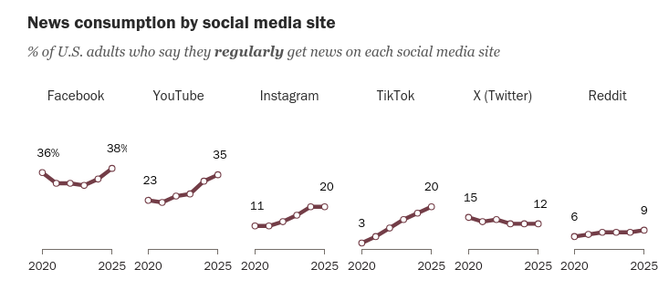

```{r setup, include=FALSE}
knitr::opts_chunk$set(echo = FALSE)
require(haven)
require(data.table)
require(ggplot2)
require(magrittr)
```

## Testing Causal Claims

### **1. Fundamental Problem of Causal Inference**

- independent/dependent variables
- solutions

### **2. Correlation**

- what is it?
- problems with correlation
- Random association


# An Example

---

<div class="centered">

</div>

If we identify polarization as a problem, addressing it requires understanding what are its causes.


---

<blockquote class="instagram-media" data-instgrm-permalink="https://www.instagram.com/reel/DPUw3cBDg7k/?utm_source=ig_embed&amp;utm_campaign=loading" data-instgrm-version="14" style=" background:#FFF; border:0; border-radius:3px; box-shadow:0 0 1px 0 rgba(0,0,0,0.5),0 1px 10px 0 rgba(0,0,0,0.15); margin: 1px; max-width:540px; min-width:326px; padding:0; width:99.375%; width:-webkit-calc(100% - 2px); width:calc(100% - 2px);"><div style="padding:16px;"> <a href="https://www.instagram.com/reel/DPUw3cBDg7k/?utm_source=ig_embed&amp;utm_campaign=loading" style=" background:#FFFFFF; line-height:0; padding:0 0; text-align:center; text-decoration:none; width:100%;" target="_blank"> <div style=" display: flex; flex-direction: row; align-items: center;"> <div style="background-color: #F4F4F4; border-radius: 50%; flex-grow: 0; height: 40px; margin-right: 14px; width: 40px;"></div> <div style="display: flex; flex-direction: column; flex-grow: 1; justify-content: center;"> <div style=" background-color: #F4F4F4; border-radius: 4px; flex-grow: 0; height: 14px; margin-bottom: 6px; width: 100px;"></div> <div style=" background-color: #F4F4F4; border-radius: 4px; flex-grow: 0; height: 14px; width: 60px;"></div></div></div><div style="padding: 19% 0;"></div> <div style="display:block; height:50px; margin:0 auto 12px; width:50px;"><svg width="50px" height="50px" viewBox="0 0 60 60" version="1.1" xmlns="https://www.w3.org/2000/svg" xmlns:xlink="https://www.w3.org/1999/xlink"><g stroke="none" stroke-width="1" fill="none" fill-rule="evenodd"><g transform="translate(-511.000000, -20.000000)" fill="#000000"><g><path d="M556.869,30.41 C554.814,30.41 553.148,32.076 553.148,34.131 C553.148,36.186 554.814,37.852 556.869,37.852 C558.924,37.852 560.59,36.186 560.59,34.131 C560.59,32.076 558.924,30.41 556.869,30.41 M541,60.657 C535.114,60.657 530.342,55.887 530.342,50 C530.342,44.114 535.114,39.342 541,39.342 C546.887,39.342 551.658,44.114 551.658,50 C551.658,55.887 546.887,60.657 541,60.657 M541,33.886 C532.1,33.886 524.886,41.1 524.886,50 C524.886,58.899 532.1,66.113 541,66.113 C549.9,66.113 557.115,58.899 557.115,50 C557.115,41.1 549.9,33.886 541,33.886 M565.378,62.101 C565.244,65.022 564.756,66.606 564.346,67.663 C563.803,69.06 563.154,70.057 562.106,71.106 C561.058,72.155 560.06,72.803 558.662,73.347 C557.607,73.757 556.021,74.244 553.102,74.378 C549.944,74.521 548.997,74.552 541,74.552 C533.003,74.552 532.056,74.521 528.898,74.378 C525.979,74.244 524.393,73.757 523.338,73.347 C521.94,72.803 520.942,72.155 519.894,71.106 C518.846,70.057 518.197,69.06 517.654,67.663 C517.244,66.606 516.755,65.022 516.623,62.101 C516.479,58.943 516.448,57.996 516.448,50 C516.448,42.003 516.479,41.056 516.623,37.899 C516.755,34.978 517.244,33.391 517.654,32.338 C518.197,30.938 518.846,29.942 519.894,28.894 C520.942,27.846 521.94,27.196 523.338,26.654 C524.393,26.244 525.979,25.756 528.898,25.623 C532.057,25.479 533.004,25.448 541,25.448 C548.997,25.448 549.943,25.479 553.102,25.623 C556.021,25.756 557.607,26.244 558.662,26.654 C560.06,27.196 561.058,27.846 562.106,28.894 C563.154,29.942 563.803,30.938 564.346,32.338 C564.756,33.391 565.244,34.978 565.378,37.899 C565.522,41.056 565.552,42.003 565.552,50 C565.552,57.996 565.522,58.943 565.378,62.101 M570.82,37.631 C570.674,34.438 570.167,32.258 569.425,30.349 C568.659,28.377 567.633,26.702 565.965,25.035 C564.297,23.368 562.623,22.342 560.652,21.575 C558.743,20.834 556.562,20.326 553.369,20.18 C550.169,20.033 549.148,20 541,20 C532.853,20 531.831,20.033 528.631,20.18 C525.438,20.326 523.257,20.834 521.349,21.575 C519.376,22.342 517.703,23.368 516.035,25.035 C514.368,26.702 513.342,28.377 512.574,30.349 C511.834,32.258 511.326,34.438 511.181,37.631 C511.035,40.831 511,41.851 511,50 C511,58.147 511.035,59.17 511.181,62.369 C511.326,65.562 511.834,67.743 512.574,69.651 C513.342,71.625 514.368,73.296 516.035,74.965 C517.703,76.634 519.376,77.658 521.349,78.425 C523.257,79.167 525.438,79.673 528.631,79.82 C531.831,79.965 532.853,80.001 541,80.001 C549.148,80.001 550.169,79.965 553.369,79.82 C556.562,79.673 558.743,79.167 560.652,78.425 C562.623,77.658 564.297,76.634 565.965,74.965 C567.633,73.296 568.659,71.625 569.425,69.651 C570.167,67.743 570.674,65.562 570.82,62.369 C570.966,59.17 571,58.147 571,50 C571,41.851 570.966,40.831 570.82,37.631"></path></g></g></g></svg></div><div style="padding-top: 8px;"> <div style=" color:#3897f0; font-family:Arial,sans-serif; font-size:14px; font-style:normal; font-weight:550; line-height:18px;">View this post on Instagram</div></div><div style="padding: 12.5% 0;"></div> <div style="display: flex; flex-direction: row; margin-bottom: 14px; align-items: center;"><div> <div style="background-color: #F4F4F4; border-radius: 50%; height: 12.5px; width: 12.5px; transform: translateX(0px) translateY(7px);"></div> <div style="background-color: #F4F4F4; height: 12.5px; transform: rotate(-45deg) translateX(3px) translateY(1px); width: 12.5px; flex-grow: 0; margin-right: 14px; margin-left: 2px;"></div> <div style="background-color: #F4F4F4; border-radius: 50%; height: 12.5px; width: 12.5px; transform: translateX(9px) translateY(-18px);"></div></div><div style="margin-left: 8px;"> <div style=" background-color: #F4F4F4; border-radius: 50%; flex-grow: 0; height: 20px; width: 20px;"></div> <div style=" width: 0; height: 0; border-top: 2px solid transparent; border-left: 6px solid #f4f4f4; border-bottom: 2px solid transparent; transform: translateX(16px) translateY(-4px) rotate(30deg)"></div></div><div style="margin-left: auto;"> <div style=" width: 0px; border-top: 8px solid #F4F4F4; border-right: 8px solid transparent; transform: translateY(16px);"></div> <div style=" background-color: #F4F4F4; flex-grow: 0; height: 12px; width: 16px; transform: translateY(-4px);"></div> <div style=" width: 0; height: 0; border-top: 8px solid #F4F4F4; border-left: 8px solid transparent; transform: translateY(-4px) translateX(8px);"></div></div></div> <div style="display: flex; flex-direction: column; flex-grow: 1; justify-content: center; margin-bottom: 24px;"> <div style=" background-color: #F4F4F4; border-radius: 4px; flex-grow: 0; height: 14px; margin-bottom: 6px; width: 224px;"></div> <div style=" background-color: #F4F4F4; border-radius: 4px; flex-grow: 0; height: 14px; width: 144px;"></div></div></a><p style=" color:#c9c8cd; font-family:Arial,sans-serif; font-size:14px; line-height:17px; margin-bottom:0; margin-top:8px; overflow:hidden; padding:8px 0 7px; text-align:center; text-overflow:ellipsis; white-space:nowrap;"><a href="https://www.instagram.com/reel/DPUw3cBDg7k/?utm_source=ig_embed&amp;utm_campaign=loading" style=" color:#c9c8cd; font-family:Arial,sans-serif; font-size:14px; font-style:normal; font-weight:normal; line-height:17px; text-decoration:none;" target="_blank">A post shared by Kate Snow (@tvkatesnow)</a></p></div></blockquote>
<script async src="//www.instagram.com/embed.js"></script>

---

### Social Media and Polarization:

**Claim:** "Getting political information social media increases political polarization."

<br>

Evidence for this claim?

>- outcome/dependent variable: US has affective polarization
>- independent variable: US has widespread social media news consumption

---

### Independent/Dependent Variables

**Independent variable:**

The variable capturing the alleged **cause** in a causal claim.

- often denoted as $X$

**Dependent variable:**

The variable capturing the alleged **outcome** (what is affected) in a causal claim.

- often denoted as $Y$

**Potential Outcomes** are the values of **dependent variable** a case would take if exposed to different values of the **independent variable**

---

**Dependent Variable:** Polarization

<div class="centered">

</div>


---

**Independent Variable:** Polarization



---

Even if social media use **didn't** increase polarization...

Could we see this evidence (US has both social media use and polarization)?

>- If we want to find the **cause** of polarization, starting from case of **high polarization** like the US is **selection on dependent variable**

---

### Selection on the Dependent Variable

when attempting to provide evidence for causal claims, **selectively** observing cases based on the **outcome** they experience

- two problems $\to$ absence of weak severity

---

### Selection on the Dependent Variable

**Problem 1**: creates opportunity for "Texas Sharpshooter Fallacy"


"Fence" is case with outcome "high polarization"; "bullet holes" are attributes of that case

- can point to *any* attribute of the US and highlight as the "cause" (paint a bulls-eye)

---


---

### Selection on the Dependent Variable

**Problem 2**: Causality is counterfactual. Outcome should be different when **independent variable** changes. Selecting on dependent variable: never observe outcome under different exposure to the "cause".

- **outcome** (polarization) could have occurred **without** the alleged "cause" (social media). Without observing the counterfactual, we can't rule this out.


---

### Evidence for Causality

Causality is counterfactual: Need to observe the **outcome**/dependent variable in a case at **different levels** of the **cause**/independent variable.

$$\text{Polarization}_{USA} (\text{High Social Media Use}) = High \\ \color{red}{\text{Polarization}_{USA} (\text{Low Social Media Use}) = ?} $$
but we can never observe the $\color{red}{\text{counterfactual}}$...
$\to$ **Fundamental Problem of Causal Inference**

---

### Solving the FPCI?

If getting news from social media increased polarization

$\color{red}{\mathrm{Polarization}_{USA}(\mathrm{Higher \ Social \ Media})} >$
$\mathrm{Polarization}_{USA}(\mathrm{High \ Social \ Media}) >$
$\color{red}{\mathrm{Polarization}_{USA}(\mathrm{Low \ Social \ Media})}$

<br>

In order to provide evidence for causal claims, we need to find ways around the FPCI:

- We need to find something we **can see** that can **stand in** for the missing **counterfactual**


---

### Social Media and Polarization

| $\mathrm{Country}_i$ | $\mathrm{Social \ Media}_i$ | $\mathrm{Polar.}_i(\mathrm{Low \ S.M.})$ | $\mathrm{Polar.}_i(\mathrm{High \ S.M.})$  |
|---|---------|--------|-------|
| USA | **High** | $\color{red}{\mathrm{Polar.}_{USA}(\mathrm{Low \ S.M.}) = ?}$ | $\mathrm{Polar.}_{USA}(\mathrm{High \ S.M.})$ |

How could we observe "$\color{red}{?}$", the unknown counterfactual?

>- We could to find **another country** where there **was lower social media use**

---

### Social Media and Polarization

We **cannot observe**: $\color{red}{\mathrm{Polar.}_{USA}(\mathrm{Low \ S. M.})}$

But we **can** observe, e.g.: $\mathrm{Polar.}_{Germany}(\mathrm{Low \ S. M.})$


---

| $\mathrm{Country}_i$ | $\mathrm{Social \ Media}_i$ | $\mathrm{Polar.}_i(\mathrm{Low \ S.M.})$ | $\mathrm{Polar.}_i(\mathrm{High \ S.M.})$  |
|---|---------|:--------:|:-------:|
| USA | **High** | $\color{red}{\mathrm{Polar.}_{USA}(\mathrm{Low \ S.M.})= ?}$ | $\mathrm{Polar.}_{USA}(\mathrm{High \ S.M.})$ |
| | | $\mathbf{\Uparrow}$ |  |
| Germany | **Low** | $\mathrm{Polar.}_{Germany}(\mathrm{Low \ S.M.})$ | $\color{red}{\mathrm{Polar.}_{Germany}(\mathrm{High \ S.M.})}$

---

If we **assume**:

$\mathrm{Polar.}_{Germany}(\mathrm{Low \ S.M.})$ $=$
$\color{red}{\mathrm{Polar.}_{USA}(\mathrm{Low \ S.M.})}$

Then, we can **empirically** test our causal claim

plugging in factual $Germany$ for the counterfactual $USA$

---

| $\mathrm{Country}_i$ | $\mathrm{Social \ Media}_i$ | $\mathrm{Polar.}_i(\mathrm{Low \ S.M.})$ | $\mathrm{Polar.}_i(\mathrm{High \ S.M.})$  |
|---|---------|:--------:|:-------:|
| USA | **High** | $\mathrm{Polar.}_{Germany}(\mathrm{Low \ S.M.})$  | $\mathrm{Polar.}_{USA}(\mathrm{High \ S.M.})$ |
| | | $\mathbf{\Uparrow}$ |  |
| Germany | **Low** | $\mathrm{Polar.}_{Germany}(\mathrm{Low \ S.M.})$ | $\color{red}{\mathrm{Polar.}_{Germany}(\mathrm{High \ S.M.})}$

---

```{r, echo = F, message = F, warning=F}
polarization = fread("./lecture-15-data.csv")
polarization[, state_use := state %>% stringr::str_replace("_", " ") %>% stringr::str_to_title()]
plot_order = c(12,6,1:5,7:11)

ggplot(polarization[plot_order[1]], aes(x = social_media, y = polarization, label = state_use)) +
  theme_bw() +
  geom_text() +
  xlim(c(20,60)) +
  ylim(c(25,60)) +
  xlab("X: % using Social Media for News") +
  ylab("Y: Affective Polarization")

```

48% of Americans report using social media for news.
$\mathrm{Polarization}_{USA}(\mathrm{Social \ Media \ News =48\% }) = 56$

---

```{r echo = F, message = F, warning=F}
ggplot(polarization[plot_order[1:2]], aes(x = social_media, y = polarization, label = state_use)) +
  theme_bw() +
  geom_text() +
  xlim(c(20,60)) +
  ylim(c(25,60)) +
  xlab("X: % using Social Media for News") +
  ylab("Y: Affective Polarization")

```

37% of Germans report using social media for news.
$\mathrm{Polarization}_{Germany}(\mathrm{Social \ Media \ News =37\% }) = 29$


---

```{r echo = F, message = F, warning=F}
ggplot(polarization[plot_order[1:3]], aes(x = social_media, y = polarization, label = state_use)) +
  theme_bw() +
  geom_text() +
  xlim(c(20,60)) +
  ylim(c(25,60)) +
  xlab("X: % using Social Media for News") +
  ylab("Y: Affective Polarization")

```

---

```{r echo = F, message = F, warning=F}
ggplot(polarization[plot_order[1:4]], aes(x = social_media, y = polarization, label = state_use)) +
  theme_bw() +
  geom_text() +
  xlim(c(20,60)) +
  ylim(c(25,60)) +
  xlab("X: % using Social Media for News") +
  ylab("Y: Affective Polarization")

```

---

```{r echo = F, message = F, warning=F}
ggplot(polarization[plot_order[1:5]], aes(x = social_media, y = polarization, label = state_use)) +
  theme_bw() +
  geom_text() +
  xlim(c(20,60)) +
  ylim(c(25,60)) +
  xlab("X: % using Social Media for News") +
  ylab("Y: Affective Polarization")

```

---

```{r echo = F, message = F, warning=F}
ggplot(polarization[plot_order[1:12]], aes(x = social_media, y = polarization, label = state_use)) +
  theme_bw() +
  geom_text() +
  xlim(c(20,60)) +
  ylim(c(25,60)) +
  xlab("X: % using Social Media for News") +
  ylab("Y: Affective Polarization") 

```

---

```{r echo = F, message = F, warning=F}
ggplot(polarization[plot_order[1:12]], aes(x = social_media, y = polarization, label = state_use)) +
  theme_bw() +
  geom_text() +
  xlim(c(20,60)) +
  ylim(c(25,60)) +
  xlab("X: % using Social Media for News") +
  ylab("Y: Affective Polarization") +
  geom_smooth(se = F, method = 'lm')

```


---

### Solving the FPCI

Every solution to the FPCI involves:

1. Comparing the **observed** values of outcome $Y$ in cases that **factually** have different values of cause $X$
      
2. Making assumption that **factual** (observed) potential outcomes from one case as *equivalent to* **counterfactual** (unobserved) potential outcomes of another case.

>- The **observed** patterns of the association between the independent variable $X$ and dependent variable $Y$ we call **correlations**

---

### **Correlation**

**Correlation** is the association/relationship between the **observed**/**factual** values of $X$ (the independent variable) and $Y$ (the dependent variable)

- loosely: describes the **observed relationship** between $X$ and $Y$.
- formally: mathematical definitions for specific kinds of associations.


---

### **Correlation**

**All empirical evidence for causal claims** relies on **correlation** between the independent and dependent variables. 

But, you've all heard this:


---

```{r echo = F, message = F, warning=F}
ggplot(polarization[plot_order[1:12]], aes(x = social_media, y = polarization, label = state_use)) +
  theme_bw() +
  geom_text() +
  xlim(c(20,60)) +
  ylim(c(25,60)) +
  xlab("X: % using Social Media for News") +
  ylab("Y: Affective Polarization") +
  geom_smooth(se = F, method = 'lm')

```

>- Think how we filled in the $\color{red}{\text{counterfactuals}}$ for the US: could anything go wrong?

# Correlation

---

### **Correlation**

Many different ways of assessing correlation, but shared attributes:

- correlations have a **direction**:
    - positive: $X\uparrow$, $Y\uparrow$ 
    - negative: $X\uparrow$, $Y\downarrow$ 
    
- correlations have **strength**:
    - **strong**: $X$ and $Y$ almost **always** move together 
    - **weak**: $X$ and $Y$ do not move together very much

---

Stronger 


---

Weaker

```{r echo = F, message = F, warning=F}
ggplot(polarization[plot_order[1:12]], aes(x = social_media, y = polarization, label = state_use)) +
  theme_bw() +
  geom_text() +
  xlim(c(20,60)) +
  ylim(c(25,60)) +
  xlab("X: % using Social Media for News") +
  ylab("Y: Affective Polarization")
```

---

### **Correlation**

Many different ways of assessing correlation, but shared attributes:

- correlations have a **direction**:
    - positive: $X\uparrow$, $Y\uparrow$ 
    - negative: $X\uparrow$, $Y\downarrow$ 
    
- correlations have **strength**:
    - **strong**: $X$ and $Y$ almost **always** move together 
    - **weak**: $X$ and $Y$ do not move together very much

- correlations have a **magnitude**: 
    - *how much* $Y$ changes with $X$. 

---

### **Correlation**

Many ways of examining correlations:

- scatterplots (plot each case on an x-y coordinates)
- bar plots 
- trends
- tables of coefficients

---

Scatterplot

```{r echo = F, message = F, warning=F}
ggplot(polarization[plot_order[1:12]], aes(x = social_media, y = polarization, label = state_use)) +
  theme_bw() +
  geom_text() +
  xlim(c(20,60)) +
  ylim(c(25,60)) +
  xlab("X: % using Social Media for News") +
  ylab("Y: Affective Polarization")

```

---

Bar plot

```{r echo = F, message = F, warning = F}
anes = fread("./anes_2024.csv")
ggplot(anes, aes(x = as.factor(social_media), y = affective_polarization_pid)) +
geom_bar(stat = 'summary', fun.y = 'mean') + 
  xlab("Consumption of Social Media News: X") +
  ylab("Mean Partisan Affective Polarization: Y") +
  ggtitle("Social Media and Polarization") + 
  theme_bw() + 
  coord_cartesian(ylim=c(40,60))

```

Individual data on social media use and affective polarization from ANES 2024

---

Trend lines


---

### **Correlation**

### Formally...

common **mathematical** definition: correlation is the degree of **linear** association between $X$ and $Y$

- Takes values between $-1$ and $1$
- Values close to $1$ or $-1$ suggest **strong** degree of *linear* association
- Values close to $0$ suggest **weak** degree of *linear* association
- Value of correlation does **not** tell us **how much** $Y$ changes with $X$ (no magnitude)

---

### **Correlation**

### What is it?

**negative correlation**:  ($< 0$) values of $X$ and $Y$ move in opposite direction:

- higher values of $X$ appear with lower values of $Y$
- lower values of $X$ appear with higher values of $Y$

**positive correlation**: ($> 0$) values of $X$ and $Y$ move in same direction:

- higher values of $X$ appear with higher values of $Y$
- lower values of $X$ appear with lower values of $Y$

---

### **Correlation**


---

### **Correlation**

- It is possible to see **perfect correlation** but small (magnitude) change in $Y$ across $X$

- It is possible to see **weak correlation** but large (magnitude) change in $Y$ across $X$

- It is possible to see **perfect nonlinear relationship** between $X$ and $Y$ with $0$ correlation

---

### **Correlation**

**weak correlation**: values for $X$ and $Y$ do not cluster along line

**strong correlation**: values for $X$ and $Y$ cluster strongly along a line

**strength of correlation** does not determine the **slope** of line describing $X,Y$ relationship

**magnitude**: this is the **slope** of the line describing the $X,Y$ relationship. The larger the effect, the steeper the slope

---

```{r echo = F, message = F, warning=F}
ggplot(polarization[plot_order[1:12]], aes(x = social_media, y = polarization, label = state_use)) +
  theme_bw() +
  geom_text() +
  xlim(c(20,60)) +
  ylim(c(25,60)) +
  xlab("X: % using Social Media for News") +
  ylab("Y: Affective Polarization")

```

Correlation: $0.25$, Magnitude: $0.23$. Does this correlation prove using social media for news **causes** polarization? Why or why not?

---


```{r echo = F, message = F, warning = F}
cage_data = data.frame(cage_films = c(2,2,2,3,1,1,2,3,4,1,4),
                       pool_deaths = c(109, 102, 102, 98, 85, 95, 96, 98, 123, 94, 102))
ggplot(cage_data, aes(x =cage_films, y = pool_deaths)) + 
  geom_point(position = position_jitter(w = 0, h = 1)) + 
  geom_smooth(method = 'lm', fullrange = T, se = F) +
  theme_bw() +
  ggtitle("Factor X causes Pool Drownings?") +
  xlab("X") + 
  ylab("Pool Drownings per Year (US)") + 
  theme(plot.title = element_text(size = 24, face = "bold"),
        axis.title=element_text(size=14,face="bold"))

rho = cor(cage_data)[1,2] %>% round(2)

beta.hat = lm(pool_deaths ~ cage_films, cage_data)$coefficients[2] %>% round(2)

```

Correlation: `r rho`, Magnitude: `r beta.hat`. Does this correlation prove that X **caused** drownings? Why or why not?

---

```{r, echo = F, message = F, warning = F}
ggplot(cage_data, aes(x =cage_films, y = pool_deaths)) + 
  geom_point(position = position_jitter(w = 0, h = 1)) + 
  geom_smooth(method = 'lm', fullrange = T, se = F) +
  theme_bw() +
  ggtitle("Nic Cage films cause Pool Drownings") +
  xlab("Nic Cage Films per Year") + 
  ylab("Pool Drownings per Year (US)") + 
  theme(plot.title = element_text(size = 24, face = "bold"),
        axis.title=element_text(size=14,face="bold"))

```

Correlation: `r rho`, Magnitude: `r beta.hat`. Does this correlation prove that Nic Cage films **caused** drownings? Why or why not?

## Correlation

### **Two types of problems**

- **random association**: correlations between $X$ and $Y$ occur **by chance** and do not reflect *any* systematic relationship between $X$ and $Y$. (In the extreme, absolutely no relationship between $X$ and $Y$)

- **bias** (spurious correlation, **confounding**): $X$ and $Y$ are correlated but the correlation does not result from **causal** relationship between those variables

Solving these problems involves making **assumptions**: what are those assumptions? how plausible are they?

# Random Association 

## Correlation: Random association

<iframe width="560" height="315" src="https://www.youtube.com/embed/no_elVGGgW8?si=IWCa44aalTeXcc5C" title="YouTube video player" frameborder="0" allow="accelerometer; autoplay; clipboard-write; encrypted-media; gyroscope; picture-in-picture; web-share" referrerpolicy="strict-origin-when-cross-origin" allowfullscreen></iframe>

## Correlation: Random association

Arbitrary processes can make seemingly-strong patterns.

If you look long enough at pure chaos, you might find a strong correlation

- It could have happened by chance!
- So an observed correlation might not mean **any** relationship (e.g. Nic Cage)

[Arbitary Correlations](http://www.tylervigen.com/spurious-correlations)

## Random association: Statistics

To see that random patterns can emerge, I use random number generators to 

- **randomly** pick $5$ values of $X$ out of a "hat"
- **randomly** pick $5$ values of $Y$ out of a different "hat"

We can imagine these are the observed $X$ and $Y$ for $5$ cases. 


## Random association: Statistics

```{r, echo = F}
c= 0
counter = 0
while (c < 0.9) {
  x = rnorm(5)
  y = rnorm(5)
  c = cor(x,y)
  counter = counter + 1
}

plot(x,y, main = "5 cases\nX and Y chosen randomly")
text(mean(x), mean(y), labels = paste0("Correlation: ", round(c, 2)), adj = 0.5)

```

## Random association: Statistics

Could we find a strong correlation between $X$ and $Y$ (even if $X$ and $Y$ totally unrelated)? 

- if it is easy, then evidence fails weak severity requirement
- if it is difficult, then it passes

## Random association: Statistics


```{r, echo = F}
plot(x,y, main = "5 cases\nX and Y chosen randomly")
text(mean(x), mean(y), labels = paste0("Correlation: ", round(c, 2)), adj = 0.5)
```

$\#$ Tries to get correlation $> 0.9$: `r counter`

## Random association

What do we do about this problem?

- We can **never rule out** a chance correlation
- We *can* figure out **how likely** correlation occurred by chance.
- If chance correlation is very unlikely, then we set aside this concern (or indicate the "false positive rate" for this analysis)

## Random association: Statistics

### How?

1. Compute correlation of $X$ and $Y$
2. How **strong** is the correlation?
    - Patterns that are **stronger** are **less likely** to happen by chance
2. How many **cases** do we have?
    - Patterns with **many cases** are **less likely** to happen by chance
3. Assign a probability that observed correlation would have happened by chance, **assuming claim is wrong (no correlation)**

## Random association: Statistics

This procedure works...

### **Assuming**...

1. we **correctly** describe the chance processes (save this for a stats class)
2. we don't misuse our statistical tests

## Random association: Statistics

```{r, echo = F}
c= 0
counter = 0
while (c < 0.9) {
  x = rnorm(10)
  y = rnorm(10)
  c = cor(x,y)
  counter = counter + 1
}

plot(x,y, main = "10 cases\nX and Y chosen randomly")
text(mean(x), mean(y), labels = paste0("Correlation: ", round(c, 2)), adj = 0.5)
```

Tries to get correlation $> 0.9$: `r counter `


## Random association: Statistics

```{r, echo = F}
c= 0
counter = 0
while (c < 0.9) {
  x = rnorm(15)
  y = rnorm(15)
  c = cor(x,y)
  counter = counter + 1
}

plot(x,y, main = "15 cases\nX and Y chosen randomly")
text(mean(x), mean(y), labels = paste0("Correlation: ", round(c, 2)), adj = 0.5)
```

Tries to get correlation $> 0.9$: `r sprintf("%.f",counter)`


## Random association: Statistics

```{r, echo = F}
c= 0
counter = 0
while (c < 0.45) {
  x = rnorm(15)
  y = rnorm(15)
  c = cor(x,y)
  counter = counter + 1
}

plot(x,y, main = "15 cases\nX and Y chosen randomly")
text(mean(x), mean(y), labels = paste0("Correlation: ", round(c, 2)), adj = 0.5)
```

Tries to get correlation $> 0.45$: `r counter`

## Random association: Statistics

**statistical significance**: 

> An indication of **how likely** it is that correlation we observe could have happened purely by chance.

> **higher** degree of statistical significance indicates correlation is **unlikely** to have happened by chance. (unlikely to observe evidence for the claim if claim is false)

## Random association: Statistics

$p$ **value**:

- probability of observing this correlation, **assuming** truth is a $0$ correlation between $X$ and $Y$.
- value between $0$ and $1$.
- **Lower** $p$-values indicate **greater** statistical significance

$p < 0.05$ often used as threshold for "significant" result. 

- but it is not a magic number
- we observe $p < 0.05$ by chance ($\frac{1}{20}$th of the time)
- even if significant, **magnitude** of effect may be small

## Random association: Statistics

$p$ **value**:

Advertised promise about weak severity: 

if we use this correlation as evidence in support of a claim, what is probability of accepting the claim **in error** (due to **random association**)?

>- only works if we don't abuse the tests

## Significant?


## Significant?


## Significant?


## What else do you want to know?


## Same interpretation?


## Same interpretation?


## Random association: Statistics

$p$ **value**:

Be wary of "$p$-hacking"/"snooping"

- $p$ values become meaningless if we look at many correlations, then only report the ones that are "significant".

### Why?

---

```{r, echo = F, message = F, message=F}
ggplot(cage_data, aes(x =cage_films, y = pool_deaths)) + 
  geom_point(position = position_jitter(w = 0, h = 1)) + 
  geom_smooth(method = 'lm', fullrange = T, se = F) +
  theme_bw() +
  ggtitle("Nic Cage films cause Pool Drownings") +
  xlab("Nic Cage Films per Year") + 
  ylab("Pool Drownings per Year (US)") + 
  theme(plot.title = element_text(size = 24, face = "bold"),
        axis.title=element_text(size=14,face="bold"))


p = cor.test(cage_data$cage_films, cage_data$pool_deaths)$p.value
```

Correlation: `r rho`, $p \le$ `r round(p,3)`: 1 in 40 chance is easy to find when you look at 25 thousand possible correlations.


## Random Association: Recap

1. Correlations can appear by chance
2. We can assess **probability** of observing correlation by chance if we know:
    - **strength** of correlation (close to $1,-1$)
    - **size** of the sample ($N$)
    - we assume we know the **chance process** generating our observations
3. $p$-values:
    - Obtained using mathematical formulae
    - Given same $N$, stronger correlation has lower $p$
    - Given same strength, correlation with more $N$ has lower $p$
    
## Random assocation: Recap

| Statistical<br>Significance | $p$-value | By Chance? | Why? | "Real"? |
|:----------------------------:|:-----------------:|:----------:|:-------------------------------:|:----------------:|
| Low | High $(p > 0.05)$ | Likely | small $N$<br>weak correlation | Probably **not** |
| High | Low $(p < 0.05)$ | Unlikely | large $N$<br>strong correlation | Possibly |


# Conclusion
    
---

```{r echo = F, message = F, warning = F}

ggplot(polarization[plot_order[1:12]], aes(x = social_media, y = polarization, label = state_use)) +
  theme_bw() +
  geom_text() +
  xlim(c(20,60)) +
  ylim(c(25,60)) +
  xlab("X: % using Social Media for News") +
  ylab("Y: Affective Polarization")

c_polarization = cor.test(polarization$social_media, polarization$polarization)


```

Correlation: `r c_polarization$estimate %>% round(2)`, $p \le$ `r c_polarization$p.value %>% round(3)`

Does social media used  **cause** polarization?

---

```{r echo = F, message = F, warning = F}
anes = fread("./anes_2024.csv")
ggplot(anes, aes(x = as.factor(social_media), y = affective_polarization_pid)) +
geom_bar(stat = 'summary', fun.y = 'mean') + 
  xlab("Consumption of Social Media News: X") +
  ylab("Mean Partisan Affective Polarization: Y") +
  ggtitle("Social Media and Polarization") + 
  theme_bw() + 
  coord_cartesian(ylim=c(40,60))

anes_polarization = cor.test(anes$social_media, anes$affective_polarization_pid)

```

Correlation: `r anes_polarization$estimate %>% round(2)`, $p \le$ `r anes_polarization$p.value %>% sprintf("%f0", .)`

Does social media used  **cause** polarization?

## Conclusion

$1.$ Correlation as "solution" to Fundamental Problem of Causal Inference

$2.$ Correlation suffers from two problems:

  - Random Association: assess $p$ values and statistical significance, based on assumptions about chance process
  - Bias: we call this "confounding", more on Thursday
    

