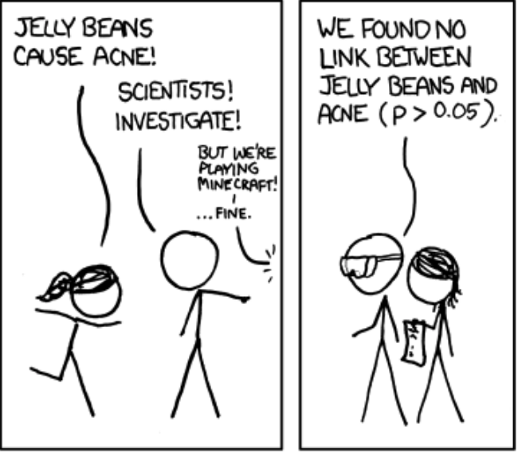
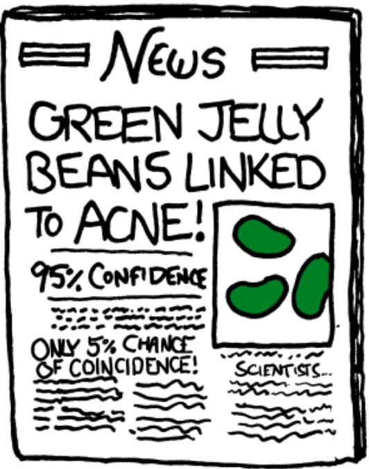
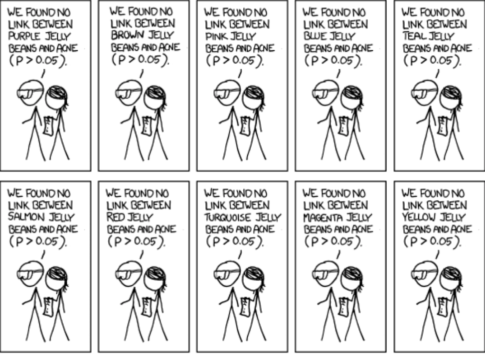
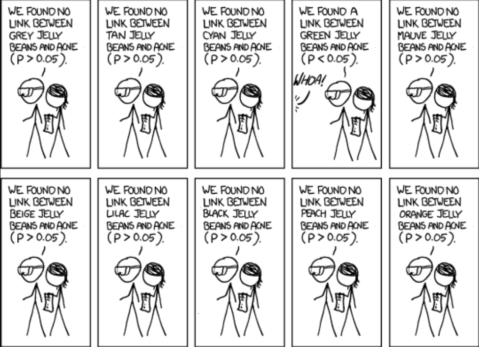

```{r setup, include=FALSE}
knitr::opts_chunk$set(echo = FALSE)
require(haven)
require(data.table)
require(ggplot2)
require(magrittr)
```

# Testing Causal Claims

## Last time we met...

We highlighted the difference between **deterministic** and **probabilistic** causal claims. 

**Probabilistic causal claims** are usually answers to questions about the **effects of causes**.

The events surrounding the ongoing COVID-19 pandemic have produced many questions about **effects of causes**.

[Stop here and read the New York Times article required for this module]

# You should be reading!

## Public Health Emergency

As in the US and elsewhere, the provincial and municipal governments in British Columbia have issued states of emergencies and many public health orders:

- Schools closed indefinitely
- Large gatherings banned
- Public facilities closed
- Self-quarantine rules
- Closing beaches and parks
- Removing logs from public beaches
- And more...

## Public Health Emergency

### **What are the effects of these public health emergency measures?** 

### **Will they achieve their desired effect and ["flatten the curve"](https://www.washingtonpost.com/graphics/2020/world/corona-simulator/)?**

- In these slides, we will outline how we begin to assess **effects of causes**.

## Outline

1. Causal claims must imply **empirical hypotheses** that we can test

2. But even if variables are observable, we can't observe **counterfactual** states of the world: **Fundamental Problem of Causal Inference**
3. One solution is to look at the observed pattern (or **correlation**) between the independent and dependent variables
4. Correlation can suffer from different problems
    - **Random error**: need to assess whether the pattern appeared **by chance**
    - **Bias**: the observed correlation is not the true causal relationship

# Causal Hypotheses

## Variables and Causal Claims:

Just like with **descriptive claims**, we need to convert concepts in **causal claims** into **variables**. 

### **Independent variable:**

The variable capturing the alleged **cause** in a causal claim.

- often called the "IV" or "X" or "right-hand variable"

### **Dependent variable:**

The variable capturing the alleged **outcome** (what is affected) in a causal claim.

- often denoted as "DV" or "Y" or "left-hand variable"

## Examples: (question)

**Do emergency public health orders "flatten the curve"?**

<u>Independent Variable</u>: ?

<u>Dependent Variable</u>: ?

## Examples: (answer)

**Do emergency public health orders to social distance "flatten the curve"?**

<u>Independent Variable</u> (X): E.g., the number of mandatory orders to impose social distancing Or, mandatory closure of public schools (yes or no)

<u>Dependent Variable</u> (Y): Highest weekly mortality rate per 100k over the course of an epidemic

## Hypotheses

We make causal claims testable by generating...


**hypotheses (or empirical predictions):**

these are statements about what we *should observe* if the causal claim is true. 

Hypotheses state the **expected** relationship between **independent** and **dependent** variables implied by the causal claim. For example:

- If $X$ were present(absent), then $Y$ would be present(absent)
- If $X$ were present(absent), then $Y$ would be more(less) likely
- If $X$ were to increase(decrease), then $Y$ would increase(decrease)

## Hypotheses

Causal **hypotheses** are, in principle, testable because they are stated in terms of **variables**.

But, remember: causality is **counterfactual**. 

So, causal **hypotheses** are statements about what values the <u>dependent variable</u> **would be** if the <u>independent variable</u> were at different values.

In other words: causal hypotheses are statements about what the [**potential outcomes**](http://mdweaver.github.io/poli110/lecture_13/#7) are, if the causal claim is true.


## Example:

**claim**: "Government mandated social distancing "flattens the curve"."

**independent variable**: number of government public health mandates issued in a place

**dependent variable**: Highest weekly mortality rate per 100k over the course of an epidemic

What is the empirical prediction/hypothesis?

## Example

**claim**: "Government mandated social distancing "flattens the curve"."

**independent variable (X)**: number of government public health mandates issued in a place

**dependent variable (Y)**: Highest weekly mortality rate per 100k over the course of an epidemic (peak mortality rate)

**hypothesis**: If the **government had issued more orders to social distance** (X) there would have been lower **peak mortality rates** (Y).

## What is the problem here?

Consider this hypothesis when applied to our current situation:

**If they government issued more orders to social distance, there would be lower peak mortality rates**

This implies this relationship between potential outcomes (link):

$$\begin{equation} 
\begin{split}
\mathrm{Peak \ Mortality \ Rate}_{BC}(\mathrm{More \ Social \ Distance}) < \\ \mathrm{Peak \ Mortality \ Rate}_{BC}(\mathrm{Same \ Social \ Distance})
\end{split}
\end{equation}$$

Let's assume that the government is likely to impose stricter rules and will probably issue a "shelter-in-place" order. If that happens, which of the above potential outcomes will we **not observe**?
Let's assume that the government is likely to impose stricter rules and will probably issue a "shelter-in-place" order. If that happens, which of the above potential outcomes will we **not observe**?

(press `p` for notes)

<div class="notes">
Recall that potential outcomes can be expressed in a quasi-mathematical notation like this:

$Y_i(X)$: Here $Y$ is the value of the dependent variable; $i$ refers to a specific case; $X$ is some value of the independent variable. We can read it as: the value of $Y$ that case $i$ would take if $X$ were to take on some specific value.

In the example in this slide, for instance: $\mathrm{Peak \ Mortality \ Rates}_{BC}(\mathrm{More \ Social \ Distance})$ can be read as: the Peak Mortality Rate  British Columbia would have if there were more social distancing measures mandated by the government.
</div>

## What is the problem here?

If, as is likely, the provincial government continues to impose stronger social distancing rules, then the result is:

$$\begin{equation} 
\begin{split}
\mathrm{Peak \ Mortality \ Rate}_{BC}(\mathrm{More \ Social \ Distance}) < \\ \color{red}{\mathrm{Peak \ Mortality \ Rate}_{BC}(\mathrm{Same \ Social \ Distance})}
\end{split}
\end{equation}$$

The potential outcome in $\color{red}{\mathrm{red}}$ (the peak mortality rate in BC that would occur if we kept the status quo and did not impose more social distancing measures) would **remain counterfactual**. 

We are **unable** to observe British Columbia in the alternate universe where no further social distancing orders are made. As a result, we cannot **directly** empirically test the claim that imposing these measures causes a flattening of the curve.

## What is the problem here?

This is not unique to public health measures during a pandemic. It is the:

### **Fundamental Problem of Causal Inference**

For any case, we can **only** observe the potential outcome of Y for the value of X that the case is actually exposed to. We can **never observe** the other, **counterfactual** potential outcomes of Y for different possible values of X that the case did not experience.

Because of the counterfactual definition of causality: for any specific case, we can never empirically observe whether X causes Y.

## Flattening the Curve

If we can't observe the counterfactual world in which fewer emergency public health orders to keep us socially distant, how do we know that the charts like this are correct?


## Flattening the Curve

If we **cannot** observe what would happen in the counterfactual world where fewer public health measures were taken, how can we respond to the doubters in the New York Times article or people who are not sure what to think about "flattening the curve"?

## Flattening the Curve

Even though the Fundamental Problem of Causal Inference limits our ability to **definitively** say the causal consequences of public health emergency actions in British Columbia, we can still present plausible evidence as to their effects.

But, if we don't have access to an alternate universe and thus can't observe the counterfactual British Columbia that has fewer public health measures: 

**What can we do?**

(press `p` for notes)

<div class="notes">
The simulated curves shown in many articles and a few slides back are one way to show causality. They involve establishing an understanding of the **causal mechanisms** by which disease can spread at the micro-level. Then, they make some assumptions about how humans interact and then simulate what happens under different kinds of interventions.

This approach, which requires diving into the specific mechanisms (or processes) by which social distancing might affect the spread of disease, is outside the scope of our course. But it is a valid and useful approach to investigating causal questions.
</div>

# An Example

## The 1918-1919 Spanish Flu Epidemic

For Background, read [this](https://virus.stanford.edu/uda/) and [this](https://virus.stanford.edu/uda/fluresponse.html)

## The 1918-1919 Spanish Flu Epidemic

Cities across the United States were exposed to the influenza epidemic at different times and reacted differently.

> **Philadelphia, PA**: The first case of "spanish flu" was reported on 17 September, 1918. Rather than reacting quickly, city officials "downplayed their significance and allowed large public gatherings, notably a city-wide parade on September 28, 1918" to raise war bonds. "School closures, bans on public gatherings, and other social distancing interventions were not implemented until October 3, when disease spread had already begun to overwhelm local medical and public health resources." - [Hatchett, et al 2007](https://www.pnas.org/content/104/18/7582)

## The 1918-1919 Spanish Flu Epidemic

Cities across the United States were exposed to the influenza epidemic at different times and reacted differently.

> **St. Louis, MO**: The first case of "spanish flu" was reported on October 5, and "authorities moved rapidly to introduce a broad series of measures designed to promote social distancing, implementing these on October 7." - [Hatchett, et al 2007](https://www.pnas.org/content/104/18/7582)

Compared to Philadelphia, which took more than 2 weeks to take action, St. Louis imposed strict social distancing measures only 2 days after the first cases appeared.

## The 1918-1919 Spanish Flu Epidemic

```{r echo=F, message=F, warning=F}
require(data.table)
require(ggplot2)
require(magrittr)
require(stringr)

phila = fread('philadelphia.csv') %>% .[!is.na(`Excess Death Rate`)]
stlo = fread('st_louis.csv') %>% .[!is.na(`Excess Death Rate`)]

phila[, City := 'Philadelphia']
stlo[, City := 'St. Louis']

plot_data = rbind(phila, stlo)

plot_data[, `Week Ending` := str_replace(`Week Ending`, "Sept.", "Sep.")]
plot_data[, date := `Week Ending` %>% str_remove("\\.")  %>% as.Date(. , "%b %d, %Y")]
plot_data[, mortality_rate := `Excess Death Rate` / 52]

ggplot(plot_data, aes(x = date, y = mortality_rate, group = City, colour = City)) + geom_line() + theme_bw() + xlab("Week (1918-1919)") + ylab("Weekly Deaths per 100k") + ggtitle("Spanish Flu Deaths in Two Cities") +  theme(legend.position="bottom") + scale_x_date(breaks = "months")

```

(press `p` for notes)

<div class="notes">

This plot shows the epidemic curve for both Philadelphia and St. Louis. The $x$-axis (horizontal) shows time, starting in September 1918.

The $y$-axis (vertical) shows the weekly death rate from influenza, per 100 thousand people. (For reference, there are 5.8 automobile-related fatalities per 100,000 in Canada each **year**). We use the mortality rate from influenza is used to approximate the infection rate, because we don't have reliable data on infections.

We can see a much steeper curve in Philadelphia: at the peak of the epidemic, far more people were dying of influenza each week.

</div>

## The 1918-1919 Spanish Flu Epidemic

Based on this plot, we can see that the "curve" was flatter in St. Louis than it was in Philadelphia.

What is **observable** here is that:

A city which rapidly implemented social distancing measures (**St. Louis**) had a relatively lower peak mortality rate (flatter curve) than another city (**Philadelphia**) which delayed in implementing social distancing measures.

We might be tempted to think: does this mean forced social distancing **causes** a flatter curve (lower peak mortality rates)?

# Correlation

## **Correlation**

In this example of St. Louis and Philadelphia, we have been looking at the **correlation** of public health interventions and influenza mortality rates

## **Correlation**

**Correlation** is the degree of association/relationship between the observed values of $X$ (the independent variable) and $Y$ (the dependent variable)

- In statistics courses, there are very specific mathematical definitions of correlation. Here, we will use the term as an umbrella category for many different techniques that examine whether there is a pattern in the relationship between independent and dependent variables.

## **Correlation**

**All empirical evidence for causal claims** relies on **correlation** between the independent and dependent variables. This is because never have direct access to counterfactuals.

But, you've probably all heard this:


## **Correlation**: Assumption

Whether or not we can treat correlation as evidence of causation depends on whether we believe one big assumption: (more on this next lecture)

**key assumption** for correlation to show causation: 

> The cases we observe  with different values of $X$ (independent variable) all have, either exactly or on average, the **same potential outcomes** of $Y$ (the dependent variable). In other words: the cases we **observe** (are **factual**) with different values of $X$ are, in essence, **like counterfactuals** for each other.

## **Correlation**: Assumption

To make sense of this assumption, let's consider what correlation means in the context of our comparison of Philadelphia and St. Louis.

We compare the two **factual**/**observed** potential outcomes: $\mathrm{Peak \ Mortality \ Rate}_{St. Louis}(\mathrm{More \ Social \ Distance})$ versus $\mathrm{Peak \ Mortality \ Rate}_{Philadelphia}(\mathrm{Less \ Social \ Distance})$. (We'll shorten Mortality Rate to MR, Social Distancing to SD)


## **Correlation**: Assumption

But the other potential outcomes (marked in $\color{red}{\mathrm{red}}$ ) are **unknown** because they are **counterfactual**. We don't know whether more social distancing causes lower peak mortality rates, because we don't observe these cities in the alternative universe where they adopted a different social distancing policy.


| City | Less SD | More SD |
|:-----|:----:|:---:|
| Philadelphia | $\mathrm{Peak \ MR_{Phil.}(Less \ SD)}$ | $\color{red}{\mathrm{Peak \ MR_{Phil.}(More \ SD)}}$ |
| | | |
| St. Louis | $\color{red}{\mathrm{Peak \ MR_{St. L.}(Less \ SD)}}$ | $\mathrm{Peak \ MR_{St. L.}(More \ SD)}$ |

## **Correlation**: Assumptions

For the correlation that we observe between more public health measures and lower peak mortality to imply causality, we need to assume that:

$1$. In the **counterfactual** world where Philadelphia had employed more social distancing, Philadelphia's peak influenza mortality ($\color{red}{\mathrm{Peak \ MR_{Phil.}(More \ SD)}}$) would have been the same as the peak influenza mortality in St. Louis, which **in reality** did employ more social distancing  ($\mathrm{Peak \ MR_{St. L.}(More \ SD)}$).


So we can let the mortality rate in a city with more social distancing we **can observe** ($\mathrm{Peak \ MR_{St. L.}(More \ SD)}$) stand in for the counterfactual mortality rate we **can't observe** ($\color{red}{\mathrm{Peak \ MR_{Phil.}(More \ SD)}}$)

## **Correlation**: Assumptions

| City | Less SD | More SD |
|:-----|:----:|:---:|
| Philadelphia | $\mathrm{Peak \ MR_{Phil.}(Less \ SD)}$ | $\color{red}{\boxed{\mathrm{Peak \ MR_{Phil.}(More \ SD)}}}$ |
| | | $\Uparrow$ |
| St. Louis | $\color{red}{\mathrm{Peak \ MR_{St. L.}(Less \ SD)}}$ | $\boxed{\mathrm{Peak \ MR_{St. L.}(More \ SD)}}$ |

## **Correlation**: Assumptions

| City | Less SD | More SD |
|:-----|:----:|:---:|
| Philadelphia | $\mathrm{Peak \ MR_{Phil.}(Less \ SD)}$ | $\boxed{\mathrm{Peak \ MR_{St. L.}(More \ SD)}}$ |
| | | $\Uparrow$ |
| St. Louis | $\color{red}{\mathrm{Peak \ MR_{St. L.}(Less \ SD)}}$ | $\boxed{\mathrm{Peak \ MR_{St. L.}(More \ SD)}}$ |

## **Correlation**: Assumptions

For the correlation that we observe between more public health measures and lower peak mortality to imply causality, we also need to assume that:

$2$. In the **counterfactual** world where St. Louis had employed less social distancing, St. Louis's peak influenza mortality ($\color{red}{\mathrm{Peak \ MR_{St. L.}(Less \ SD)}}$) would have been the same as the peak influenza mortality in Philadelphia, which **in reality** did employ less social distancing  ($\mathrm{Peak \ MR_{Phil.}(Less \ SD)}$).

So we can let the mortality rate we **can observe** ($\mathrm{Peak \ MR_{Phil.}(Less \ SD)}$) stand in for the counterfactual mortality rate we **can't observe** ($\color{red}{\mathrm{Peak \ MR_{St. L.}(Less \ SD)}}$)

## **Correlation**: Assumptions

| City | Less SD | More SD |
|:-----|:----:|:---:|
| Philadelphia | $\boxed{\mathrm{Peak \ MR_{Phil.}(Less \ SD)}}$ | $\boxed{\mathrm{Peak \ MR_{St. L.}(More \ SD)}}$ |
| | $\Downarrow$ | $\Uparrow$ |
| St. Louis | $\color{red}{\boxed{\mathrm{Peak \ MR_{St. L.}(Less \ SD)}}}$ | $\boxed{\mathrm{Peak \ MR_{St. L.}(More \ SD)}}$ |

## **Correlation**: Assumptions

| City | Less SD | More SD |
|:-----|:----:|:---:|
| Philadelphia | $\boxed{\mathrm{Peak \ MR_{Phil.}(Less \ SD)}}$ | $\boxed{\mathrm{Peak \ MR_{St. L.}(More \ SD)}}$ |
| | $\Downarrow$ | $\Uparrow$ |
| St. Louis | $\boxed{\mathrm{Peak \ MR_{Phil.}(Less \ SD)}}$ | $\boxed{\mathrm{Peak \ MR_{St. L.}(More \ SD)}}$ |

## **Correlation**: Assumptions

By <u>assuming</u> that we can slot in the **observed**/**factual** peak mortality rates from one city for the the **counterfactual** and thus **unobserved** peak mortality rates for the other city, we can make the jump from correlation to **causation**.

The goal of social science is to **strongly interrogate that assumption** to ensure that we have considered alternatives.

## More about **Correlation**

In many cases, the easiest way to investigate correlation is **visually**. Typically this is done through a  **scatterplot**.

**scatterplots** represent **cases** as points in a [two dimensional plane](https://en.wikipedia.org/wiki/Two-dimensional_space). 

- the $X$ axis position of the point reflects the observed value the case has on the **independent variable**
- the $Y$ axis position of the plot reflects the observed value the case has on the **dependent variable**

By looking at the point on the plot, you can read a case's value on both **independent** and **dependent** variables.

## More about **Correlation**

We can visualize the correlation between public health emergency measures and flattening the curve that we've been discussing on the following plot:

## More about **Correlation**

```{r, echo = F, message=F, warning=F}
ex_data = data.table(City = c("St. Louis", "Philadelphia"),
                     PH_count = c(8, 1),
                     peak_rate = c(32, 256)
)
 
ggplot(ex_data, aes(x = PH_count, y = peak_rate, label = City)) +
  geom_point() + geom_text(nudge_y = 10) + theme_bw() + xlab("Public Health Measures\n(w/in 1 week from first death)") +
  ylab("Peak Mortality Rate (per 100k)") + geom_hline(yintercept = 0) + geom_vline(xintercept = 0)  + scale_x_continuous(breaks = c(0:10), limits = c(0,10) ) + scale_y_continuous(breaks = seq(0,270,20), limits = c(0,280)) 


```

## More about **Correlation**

Read the point positions as the value: (X,Y). The red line traces this point back to the y-axis; the blue line traces the point to the x-axis.

## More about **Correlation**

```{r, echo = F, message=F, warning=F}
ex_data[, coord := paste0("(",PH_count, ", ", peak_rate, ")")]
seg = data.frame(x1 = c(0,0,8,1), x2 = c(8,1,8,1), y1 = c(32,256,0,0), y2=  c(32,256,32,256))
ggplot(ex_data, aes(x = PH_count, y = peak_rate, label = City)) +
  geom_point() + geom_text(nudge_y = 10) +
  geom_text(nudge_y = -10, aes(label = coord)) + theme_bw() +
  xlab("Public Health Measures\n(w/in 1 week from first death)") +
  ylab("Peak Mortality Rate (per 100k)") +
  geom_segment( aes(x = seg$x1[1:2], xend = seg$x2[1:2], y = seg$y1[1:2], yend = seg$y2[1:2]), colour = "red") + 
  geom_segment( aes(x = seg$x1[3:4], xend = seg$x2[3:4], y = seg$y1[3:4], yend = seg$y2[3:4]), colour = "blue") + 
  geom_hline(yintercept = 0) + geom_vline(xintercept = 0) + scale_x_continuous(breaks = c(0:10), limits = c(0,10) ) + scale_y_continuous(breaks = seq(0,270,20), limits = c(0,280)) 

```


## More about **Correlation**

As is visible in the preceding plot, it is possible to see patterns between independent and dependent variables using a scatterplot.

Correlations can be described in three ways:

- correlations have a **direction**:
    - positive: implies that as $X$ increases, $Y$ increases
    - negative: $X$ increases, $Y$ decreases
    

## More about **Correlation**

As is visible in the preceding plot, it is possible to see patterns between independent and dependent variables using a scatterplot.

Correlations can be described in three ways:
    
- correlations have **strength**:
    - **strong**: $X$ and $Y$ almost **always** move together (relationship between $X$ and $Y$ is nearly deterministic)
    - **weak**: $X$ and $Y$ do not move together very much (relationship between $X$ and $Y$ is very probabilistic and "noisy")


## More about **Correlation**

As is visible in the preceding plot, it is possible to see patterns between independent and dependent variables using a scatterplot.

Correlations can be described in three ways:

- correlations have a **magnitude**:
    - a **large magnitude** means that as $X$ changes, $Y$ changes by a large amount
    - a **small magnitude** means that as $X$ changes, $Y$ changes by a small amount

## More about **Correlation**


(press `p` for notes)

<div class='notes'>
We can see direction in the following examples:

- When Y increases as X increases (three leftmost scatterplots in top and middle rows) the correlation is **positive**
- When Y decreases as X increases (three rightmost scatterplots in top and middle rows) the correlation is **negative**
- When there is no pattern between X and Y (center scatterplot in top and middle rows), there is **no correlation**.
</div>


## More about **Correlation**


(press `p` for notes)

<div class='notes'>

We can see the strength of correlation in the following examples:

- All examples in the second row have exactly the same strength: Y always changes the same amount when X changes, so the relationship between X and Y is a straight line. These are perfectly **strong** correlations. Even though the slopes are different (which implies different **magnitudes**), the **strength** of the correlation is the same.

- In the top row, the strength of the correlation is strongest in the leftmost and rightmost scatterplots, because Y changes perfectly with X. The plots toward the middle of the top row have noisier correlations, and  are **weaker**.

</div>


## More about **Correlation**


(press `p` for notes)

<div class='notes'>

How to recognize magnitude. Assuming that the x and y axes of two scatterplots are the same scale:

- In the middle row, the leftmost and rightmost scatterplots have the greatest magnitude (Y changes by larger amounts when X changes: so the slope is steeper).
- In the middle row, towards the middle of the row, the scatterplots have lower magnitudes (Y changes very little or not at all when X changes).
</div>

## More about **Correlation**

```{r, echo = F, message = F, warning=F}

n = 100
p_data = data.table(g = 1, x = rnorm(n))
p_data = rbind(p_data, p_data)
p_data[, group := rep(c(1,2), each = n)]
test= T
while(test == T){
  p_data[group %in% 1, y := x * 0.5 + rnorm(n, sd = 1/3)]
  p_data[group %in% 2, y := x*0.5 + rnorm(n, sd = 1)]
  test = abs(lm(y ~ x, p_data[group %in% 1])$coefficients[2] - lm(y ~ x, p_data[group %in% 2])$coefficients[2]) > 0.01
}

ggplot(p_data, aes(x = x, y = y, group = group)) + geom_point() + geom_smooth(method = "lm", se =F)+ facet_wrap(. ~ group) + theme_bw() + ggtitle("How are these similar/different on the three aspects?")
```


## More about **Correlation**

- same **direction** (positive)
- same **magnitude** (slope of the line is the same)
- different **strength**: plot 1 has stronger correlation than plot 2.

## More about **Correlation**

```{r, echo = F, message = F, warning=F}

n = 100
p_data = data.table(g = 1, x = rnorm(n))
p_data = rbind(p_data, p_data)
p_data[, group := rep(c(1,2), each = n)]
test= T
while(test == T){
  p_data[group %in% 1, y := x * 0.5 + rnorm(n, sd = 1/3)]
  p_data[group %in% 2, y := x*-0.5 + rnorm(n, sd = 1/3)]
  test = (abs(cor(p_data[group %in% 1, list(x,y)])[1,2]) - abs(cor(p_data[group %in% 2, list(x,y)])[1,2])) > 0.01
}

ggplot(p_data, aes(x = x, y = y, group = group)) + geom_point() + geom_smooth(method = "lm", se =F)+ facet_wrap(. ~ group) + theme_bw()  + ggtitle("How are these similar/different on the three aspects?")
```

## More about **Correlation**

- different **direction**: plot 1 is positive, plot 2 is negative
- same **magnitude** (slopes are same but in opposite directions)
- same **strength** 

# Correlation Errors

## Correlation Errors

Just like with measurement and sampling, correlation can suffer from two types of errors:

- They are errors in this sense that $\mathrm{Causation(X,Y)_{True} - Correlation(X,Y)_{Observed}} \neq 0$: The **true** causal relationship between X and Y is different from the **observed** correlation between X and Y.

## Correlation Errors

Like with measurement errors and sampling errors, there are two kinds of correlation errors:

1. **random errors**: we observe patterns between X and Y that differ from the true causal relationship **by chance**
2. **bias**: there is a systematic process that means we **consistently** observe a correlation between X and Y that is different from the true causal effect of X on Y.

As with measurement and sampling error, it is easier to address problems of  **random** errors than it is to address bias.


## Correlation: Random Errors

```{r, echo = F}
p_data = data.table(year = 1999:2009,
                    nick_cage = c(2,2,2,3,1,1,2,3,4,1,4),
                    drownings = c(109,102,102,98, 85,95,96,98,123,94,102))

ggplot(p_data, aes(x = nick_cage, y = drownings, label = year)) + 
  geom_text() + 
  xlab("Nick Cage films per year") + 
  ylab("# deaths by falling into swimming pool") + 
  theme_bw() +
  geom_smooth(method = 'lm', se = F) +
  ggtitle("Nick Cage films cause pool drownings?")

```

(press `p` for notes)

<div class = "notes">

Clearly, Nick Cage films do not cause people to drown in pools. But, even entirely unrelated events every so often occur in a pattern, by chance.

In this case, [someone](https://www.tylervigen.com/spurious-correlations) combined thousands of variables and looked for these chance correlations.
</div>

## Correlation: Random Errors

<iframe width="560" height="315" src="https://www.youtube.com/embed/no_elVGGgW8" frameborder="0" allow="accelerometer; autoplay; encrypted-media; gyroscope; picture-in-picture" allowfullscreen></iframe>

press `p` for notes
<div class='notes'>

The idea that a thousand monkeys at typewriters typing at random will produce the works of Shakespeare illustrates this point: even randomly generated processes can sometimes produce seemingly non-random patterns. 

</div>

## Correlation: Random Errors

```{r}

ggplot(ex_data, aes(x = PH_count, y = peak_rate, label = City)) +
  geom_point() + geom_text(nudge_y = 10) + theme_bw() + xlab("Public Health Measures\n(w/in 1 week from first death)") +
  ylab("Peak Mortality Rate (per 100k)") + geom_hline(yintercept = 0) + geom_vline(xintercept = 0)  + scale_x_continuous(breaks = c(0:10), limits = c(0,10) ) + scale_y_continuous(breaks = seq(0,270,20), limits = c(0,280)) 


```

(press `p` for notes)

<div class='notes'>

In our example, we simply observe two cities, St. Louis and Philadephia, and their public health interventions and flu death rates.

It could easily be that, by chance, we looked at a city with many public health measures that just happened to have a low that the pattern we see occurred by chance.

Look at the **fabricated data** on the next slide: if 200 other cities showed no pattern relationship between X and Y... but we randomly chose to  observe St. Louis and Philadelphia, we would,  observe that more public health interventions lead to lower peak mortality by chance.
</div>

## Correlation: Random Errors

```{r, warning=F, message=F}

r = data.frame(x = rpois(200, 5), y = rnbinom(200,mu = 140, size = 5))
ggplot(ex_data, aes(x = PH_count, y = peak_rate, label = City)) +
  geom_point(colour = 'red') + geom_text(nudge_y = 10, colour = 'red') + theme_bw() + xlab("Public Health Measures\n(w/in 1 week from first death)") +
  ylab("Peak Mortality Rate (per 100k)") + geom_hline(yintercept = 0) + geom_vline(xintercept = 0)  + scale_x_continuous(breaks = c(0:10), limits = c(0,10) ) + scale_y_continuous(breaks = seq(0,270,20), limits = c(0,280)) +
  geom_point(data = r, aes(x = x, y = y, label = NULL)) + ggtitle("MADE UP DATA FOR ILLUSTRATION")

```

## Correlation: Random Errors

### **How do we address the problem of random errors in correlation?**

We use statistics to calculate: how likely is the pattern between X and Y to occur by chance.

Field of statistics investigates properties of **chance** events (stochastic processes):

- Probability theory tells us how likely events are to happen, given chance
- Can tell us how likely correlation of some value is to happen by chance


## Correlation: Random Errors

**How do we know how likely a correlation is to occur by chance?**

1. Compute correlation of $X$ and $Y$
    - **Stronger** correlations less likely to occur at random
2. How many **cases** do we have?
    - Patterns with **many cases** less likely to occur at random
3. Assign a probability that the correlation we see would have happened by chance

(press `p` for notes)

<div class = "notes">

In field of statistics, there are approaches to do this; all involve different assumptions about the math that describes the process by which patterns we observe are produced in the real world. To learn more, take a stats class.

</div>

## Correlation: Random Errors

On the following slides, I use a computer to randomly generate values of X and Y using **unrelated** processes. Any correlation between X and Y is thus entirely by chance.

I repeat this process until I find a **very strong** correlation between X and Y. Then I produce a scatterplot of the strong correlation **produced at random** and the **number of random tries** it took to get the strong correlation (by chance).

## Correlation: Random Errors


```{r, echo = F}
c= 0
counter = 0
while (c < 0.9) {
  x = rnorm(5)
  y = rnorm(5)
  c = cor(x,y)
  counter = counter + 1
}

plot(x,y, main = "5 cases, x and y unrelated")
text(mean(x) - sd(x),mean(y), labels = paste0("Correlation: ", round(c, 2)),pos =4 )

```

## Correlation: Random Errors

```{r, echo = F}
plot(x,y, main = "5 cases, x and y unrelated")
text(mean(x) - sd(x),mean(y), labels = paste0("Correlation: ", round(c, 2)), pos =4 )
text(mean(x) + sd(x),mean(y), labels = paste0("Tries: ", counter))
```


## Correlation: Random Errors

```{r, echo = F}
c= 0
counter = 0
while (c < 0.9) {
  x = rnorm(10)
  y = rnorm(10)
  c = cor(x,y)
  counter = counter + 1
}

plot(x,y, main = "10 cases, x and y unrelated")
text(mean(x) - sd(x),mean(y), labels = paste0("Correlation: ", round(c, 2)), pos =4)

```

## Correlation: Random Errors

```{r, echo = F}
plot(x,y, main = "10 cases, x and y unrelated")
text(mean(x) - sd(x),mean(y), labels = paste0("Correlation: ", round(c, 2)), pos =4)
text(mean(x) + sd(x),mean(y), labels = paste0("Tries: ", counter))
```

## Correlation: Random Errors

```{r, echo = F}
c= 0
counter = 0
while (c < 0.9) {
  x = rnorm(15)
  y = rnorm(15)
  c = cor(x,y)
  counter = counter + 1
}

plot(x,y, main = "15 cases, x and y unrelated")
text(mean(x) - sd(x),mean(y), labels = paste0("Correlation: ", round(c, 2)), pos =4)

```

## Correlation: Random Errors

```{r, echo = F}
plot(x,y, main = "15 cases, x and y unrelated")
text(mean(x) - sd(x),mean(y), labels = paste0("Correlation: ", round(c, 2)), pos =4)
text(mean(x) + sd(x),mean(y), labels = paste0("Tries: ", counter))
```


## Correlation: Random Errors

### Same Correlation, More cases

```{r, echo = F, message=F}
require(MASS)
par(mfrow = c(1,2))
b1 = mvrnorm(50, mu = c(0,0), Sigma = matrix(c(1,0.5,0.5,1), byrow = T, ncol = 2))
b2 = mvrnorm(500, mu = c(0,0), Sigma = matrix(c(1,0.5,0.5,1), byrow = T, ncol = 2))

plot(b1[,1], b1[,2], main = "Few => Possibly random", xlab = 'x', ylab = 'y',
     xlim = range(rbind(b1,b2)), ylim = range(rbind(b1,b2)))
abline(lm(b1[,2] ~ b1[,1]))
plot(b2[,1], b2[,2], main = "Many => Less likely to be random", xlab = 'x', ylab = 'y',
     xlim = range(rbind(b1,b2)), ylim = range(rbind(b1,b2)))
abline(lm(b2[,2] ~ b2[,1]))
par(mfrow = c(1,1))

```

## Correlation: Random Errors

**statistical significance**: 

> An indication of **how likely** correlation we observe could have happened purely by chance.

> **higher** degree of statistical significance indicates correlation is **less** likely to have happened by chance

## Correlation: Random Errors

$p$ **value**:

- A numerical measure of **statistical significance**. Puts a number on how likely observed correlation would have occurred by chance, **assuming** we know the chance procedure and the truth is no correlation between X and Y.

- It is a probability, so is between $0$ and $1$.

- **Lower** $p$-values indicate **greater** statistical significance. (Lower $p$ values for stronger correlations, more cases)


(press `p` for notes)

<div class='notes'>

What leads to lower $p$ values?

**stronger correlations**: There are far fewer possible combinations of cases that produce very strong correlation between X and Y. Thus it is less likely that we observe one by chance.

**more cases**: If there are more cases but a pattern persists between X and Y, then it is less likely to be by chance. In the examples I showed above, it was easy to create a strong correlation with 5 cases by chance; not so with 15 cases.

</div>

## Correlation: Random Errors

$p < 0.05$ often used as threshold for "significant" result. 

- but it is not a magic number
- Can observe $p < 0.05$ by chance ($\frac{1}{20}$th of the time)

## Correlation: Random Errors

$p$ **value**:

Be wary of "$p$-hacking"

- $p$ values become meaningless if we look at many associations, then only report the ones that are "significant".

### Why?

- low $p$-values still occur by chance
- when we look at lots of correlations, we **expect** to see some low $p$ values **by chance**.

## Significant?



## Significant? 


## Significant?


## What else do you want to know?



## We'd want to know this



## We'd want to know this



(press `p` for notes)

<div class='notes'>

In this case, researchers examined twenty colors of jelly beans and found a $p <= 0.05$ for one. Given that we expect to see correlations with a $p <= 0.05$ about one twentieth of the time by chance, **even when there is no real relationship between jelly bean colors and acne**.

</div>

## Correlation: Random Errors

### Recap:

1. Correlations can appear by chance
2. We can assess **probability** of chance correlation if we know:
    - **strength** of correlation 
    - **size** of the sample ($N$)
3. $p$-values:
    - Obtained using mathematical formula
    - Are **lower** when correlations are **stronger** or number of cases is **larger**.
    - **lower** $p$ values imply **statistical significance** (less likely to be by chance)
    
## Correlation: Random Errors

So, we can address random errors in correlation by assessing the $p$-value of the correlation. 

If $p$-value is low, we can conclude there is statistical significance (with caution) and that chance of random error driving our correlation is **low**.

To assess whether relationship between public health interventions and flattening the curve of the Spanish Flu pandemic is due to chance, we need to collect more data (do some extra credit!)

## Correlation: Random Errors

### Recap:

| Statistical<br>Significance | $p$-value | By Chance? | Why? | "Real"? |
|:----------------------------:|:-----------------:|:----------:|:-------------------------------:|:----------------:|
| Low | High ($p > 0.05$) | Likely | small $N$<br>weak correlation | Probably **not** |
| High | Low ($p < 0.05$) | Unlikely | large $N$<br>strong correlation | Probably |

## Correlation: Random Errors

When looking at public health interventions during the 1918-1919 Spanish Flu epidemic, [Hatchett et al](https://www.pnas.org/content/104/18/7582) find in a correlation that American cities with more interventions had lower peak mortality. And that this relationship would occur by chance about 0.2% of the time.

We can conclude that such a correlation is quite unlikely to be in error by chance.

In the next lecture we will consider whether this correlation might suffer from **bias**.


## Correlation: Bias

As with measurement bias and sampling bias, biases of correlation are more pernicious and hard to solve.

## Correlation: Bias

**Consider an example**:

> **Does wearing a surgical mask during everyday activities during cold and flu season reduce the risk of contracting a cold or flu?**

## Correlation: Bias

What if we observe this correlation:

> **people who wear masks have lower rates of cold and flu infection**

Can we conclude that masks **cause** them to have lower rates of infection?

## Correlation: Bias

There are good reasons to think **not**:

People who wear masks in everyday life might be more cautious about illness in other ways:

- practice more social distancing
- know and use better hand hygiene
- clean surfaces in their home more frequently
- avoid people who appear ill

This might be because they:

- have a weakened immune system
- have some sort of fear of illness or germs

## Correlation: Bias

Thus even if masks provide no benefit, people who wear masks might, due to their other practices, already be less likely to contract a respiratory illness than those who do not wear masks.

Thus we would **observer** a correlation between mask-wearing and lower rates of infection. But it might not be the TRUE causal effect of masks. The observed correlation could suffer from **bias**.

We will discuss this problem (also called confounding) in more detail in the next lecture.

# Internal / External Validity

## Internal / External Validity

Finally, when we use the correlation of X and Y to assess the causal effect of X on Y we must consider two aspects of **validity**:

**internal validity**: when a correlation has **internal validity**, it is unlikely that the correlation suffers from **bias**. It is likely the true causal relationship between X and Y.

**external validity**: when a correlation has **external validity**, it correctly describes the causal relationship between X and Y for all the cases in which we are interested.

## Internal / External Validity

### **An Example**

Consider these two studies in the context of the question: does wearing surgical masks during everyday activities reduce YOUR (you, specifically) risk of contracting a respiratory infection from a cold or flu virus?

## Internal / External Validity

#### [**Study 1**](https://www.journalofhospitalinfection.com/article/S0195-6701(13)00069-8/fulltext)

Researchers placed surgical masks on dummy heads and exposed them to aerosolized flu viruses.

They recorded the levels of live flu virus in the surrounding air and behind the mask.

They then correlated mask status (behind mask, not behind mask) with the level of live flu virus in the air.

The air behind the mask had, on average, a 6-fold reduction in the amoung of live flu virus.

## Internal / External Validity

#### [**Study 2**](https://journals.plos.org/plosone/article?id=10.1371/journal.pone.0029744)

Researchers at the University of Michigan assigned different floors of undergraduate dorms to receive one of three treatments: control (no intervention), face masks (students given masks, a guide to use, and asked to wear in dorms), face masks and hand hygiene (students given masks and hand sanitizer, guide to use, asked to use in dorms).

Students reported flu symptoms and were tested to confirm an influenza infection.

The researchers then correlated the use of masks with flu infection rates. The mask-only group contracted influenza at a rate 1.1 times higher than the control. (The mask and hand hygiene contracted influenza at a rate 0.75 times lower than the control.)

## Internal / External Validity

Keep in mind the question: does wearing surgical masks during everyday activities reduce YOUR risk of contracting a respiratory infection from a cold or flu virus?

Which of these two studies has **internal validity**?

Which of these two studies has **external validity**?

## Internal / External Validity

Keep in mind the question: does wearing surgical masks during everyday activities reduce YOUR risk of contracting a respiratory infection from a cold or flu virus?

Which of these two studies has **internal validity**?

Study 1 and Study 2

Which of these two studies has **external validity**?

Study 2

## Internal / External Validity

Both studies have strong **internal validity**: it is believable that the correlations used in the studies correctly recover the true causal relationship between the X (mask wearing) and Y. 

In study 1, it is hard to imagine what else other than the mask could reduce the flu virus near the mouth and nose of the dummies used.

In study 2, the use of a randomized experiment allows researchers to reduce or eliminate the possibility of bias. (More on this next lecture)

## Internal / External Validity

Only study 2 has strong **external validity**: Whereas study 1 shows that masks can reduce the amount of live flu virus that reaches the mouth and nose of the wearer; this was conducted in a laboratory using a dummy. It did not reflect real-world exposure to the virus nor the real-world usage of the masks.

Study 2 more directly assesses whether you would benefit from wearing a mask around in your daily activities. The masks were provided to actual students living in dorms; thus it reports the effects of masks for people like you. 

## Internal / External Validity

This is not trivial: even though Study 1 is believable in finding wearing a mask reduces exposure to live viruses, these effects in laboratories do not translate to the real-world context in which you would use a mask. Study 2, by contrast, assesses the effects of mask wearing on contracting the flu in the context you would use them. And it finds no effect of wearing masks.

(press `p` for notes)

<div class='notes'>
**Note:** I present these studies to show you that mask wearing has minimal effects for most people. In health-care contexts (doctors and nurses) or when you are caring for a person ill with a respiratory viral infection at home, masks have been shown to reduce the spread of infections. By contrast, good hand hygiene has been shown in experiments to reduce the risk of contracting respiratory viral illnesses in all contexts.
</div>