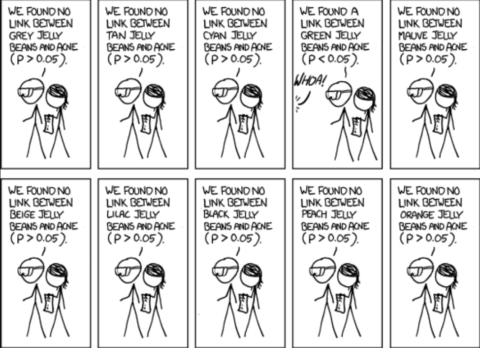

```{r setup, include=FALSE}
knitr::opts_chunk$set(echo = FALSE)
require(haven)
require(data.table)
require(ggplot2)
require(magrittr)
require(ggdag)

```

## Testing Causal Claims

### **1. Correlation: Recap**

- definition
- attributes
- problems

### **2. Problems with Correlation**

- Random correlation
- Bias in correlation (**confounding**)


# Recap

## Solving FPCI

The fundamental problem of causal inference is that:

for any one case, we cannot know whether some "cause" actually led to some "effect".

>- We can never know for sure what caused Putin to invade Ukraine: we can't replay history to see  counterfactual events if, e.g. NATO had acted differently after the Cold War.

## Solving FPCI

We solve the FPCI by comparing **factual** outcomes in **different cases** that have **different exposures** to the "cause"

- $\mathrm{Case \ A}$ is exposed to a "cause"
- $\mathrm{Case \ B}$ is **not** exposed to a "cause"
- We assume that $\mathrm{Case \ B}$ is the same as the counterfactual $\color{red}{\mathrm{Case \ A}}$ 


## **Correlation**

**Correlation** is the degree of association/relationship between the **observed** values of $X$ (the independent variable) and $Y$ (the dependent variable)

## **Correlation**

Correlations have

- **direction**:
    - positive: implies that as $X$ increases, $Y$ increases
    - negative: $X$ increases, $Y$ decreases
- **strength** (has nothing to do **size of effect**):
    - **strong**: $X$ and $Y$ almost **always** move together (near $1,-1$)
    - **weak**: $X$ and $Y$ do not move together very much (near $0$)
- **slope/effect size**: 
    - this is the how much $Y$ changes with $X$. 
    - The larger the effect of $X$ on $Y$, the steeper the slope

---


## Correlation


### **Two types of problems**

- **random association**: correlations between $X$ and $Y$ occur **by chance** and do not reflect causal relationship.

- **bias** (spurious correlation, **confounding**): $X$ and $Y$ are correlated but the correlation does not result from a **causal relationship** between those variables

---


```{r, echo = F, message = F}
cage_data = data.frame(cage_films = c(2,2,2,3,1,1,2,3,4,1,4),
                       pool_deaths = c(109, 102, 102, 98, 85, 95, 96, 98, 123, 94, 102))
require(ggplot2)
ggplot(cage_data, aes(x =cage_films, y = pool_deaths)) + 
  geom_point(position = position_jitter(w = 0, h = 1)) + 
  geom_smooth(method = 'lm', fullrange = T, se = F) +
  theme_bw() +
  ggtitle("Nick Cage films cause Pool Drownings") +
  xlab("Nick Cage Films per Year") + 
  ylab("Pool Drownings per Year (US)") + 
  theme(plot.title = element_text(size = 24, face = "bold"),
        axis.title=element_text(size=14,face="bold"))
```

## Random assocation

1. Correlations can appear by chance
2. We can assess **probability** of chance correlation if we know:
    - **strength** of correlation
    - **size** of the sample ($N$)
    - we assume we know the **chance process** generating our observations
3. $p$-values: probability of this correlation by chance
    - Obtained using mathematical formulae
    - Given same $N$, stronger correlation has lower $p$
    - Given same strength, correlation with more $N$ has lower $p$
    

## Random association: Statistics

### $p$ **values can be misleading**

Be wary of "$p$-hacking"

- $p$ values become meaningless if we look at many correlations, then only report the ones that are "significant".

### Why?

- even correlations with low $p$-values occur by chance: esp. when we look at many of correlations

## Significant?


## Significant?


## Significant?


## What else do you want to know?


## We'd want to know this


## We'd want to know this



# Example

## Trump's Twitter and Hate Crimes

[Mueller and Schwarz (2020)](https://papers.ssrn.com/sol3/papers.cfm?abstract_id=3149103) investigate:


During the period from 2015 to the end of 2017, Trump posted more than 300 messages that can be classified as "Anti-Muslim".


Did Trump's tweeting of anti-Muslim messages **increase** anti-Muslim hate crimes?


## Trump's Twitter and Hate Crimes

We can't observe the US in the absence of Trump tweeting against Muslims, so authors use correlation...

## Trump's Twitter and Hate Crimes

Trump's Twitter gained attention after he announced run for President (2015-2017)


## Trump's Twitter and Hate Crimes

When Trump gained prominence, anti-Muslim hate crimes increased


## Trump's Twitter and Hate Crimes

As Trump's Tweeting against Muslims reached more people (change in observed $X$), anti-Muslim hate crimes increased (change in $Y$)

In groups, discuss:

Does this correlation convince you that Trump's tweets **caused** anti-Muslim hate crimes?

Why or why not?


#

## Example:


**Why** doesn't correlation imply causation?

## Confounding

**confounding** is when there is a **systematic** observed correlation between $X$ and $Y$ that is does **NOT reflect** the causal effect of $X$ on $Y$.

- This is not a chance correlation. 
- Two ways to explain why this happens (different explanations, but two sides of the same coin)

## Confounding

### **Explanation 1**:

Confounding happens when cases with **different levels of $X$** have different (factual and counterfactual) potential outcomes of $Y$.

**In our example:**

In order for Mueller and Schwarz's correlation to imply causation, need to assume that:

$\color{red}{\mathrm{AntiMuslim \ Hate \ Crime_{USA \ 2015-17}(No \ Trump \ Tweets)}}$
$=$
$\mathrm{AntiMuslim \ Hate \ Crime_{USA \ 2010-14}(No \ Trump \ Tweets)}$

If this is wrong... comparison leads to confounding.

## Confounding

In correlation, Mueller and Schwarz assume that US (2015-17) without Trump tweets (counterfactual) is the same as US (2010-14) without Trump tweets (factual)


| Case | Tweets | No Tweets |
|:-----|:----:|:---:|
| USA 2015-17 | $\mathrm{Hate \ Crime_{USA \ 2015-17}(Trump \ Tweets)}$ | $\color{red}{\mathrm{Hate \ Crime_{USA \ 2015-17}(No \ Tweets)}}$ |
| | $\Downarrow{=}$ | $\Uparrow{=}$ |
| USA 2010-14 | $\color{red}{\mathrm{Hate \ Crime_{USA \ 2010-14}(Trump \ Tweets)}}$ | $\mathrm{Hate \ Crime_{USA \ 2010-14}(No \ Tweets)}$ |

## Confounding

If this substitution is **wrong**: USA in 2010-14 vs USA 2015-17 have **different** potential outcomes of hate crime, correlation is **biased**.

| Case | Tweets | No Tweets |
|:-----|:----:|:---:|
| USA 2015-17 | $\mathrm{Hate \ Crime_{USA \ 2015-17}(Trump \ Tweets)}$ | $\color{red}{\mathrm{Hate \ Crime_{USA \ 2015-17}(No \ Tweets)}}$ |
| | $\Downarrow{\neq}$ | $\Uparrow{\neq}$ |
| USA 2010-14 | $\color{red}{\mathrm{Hate \ Crime_{USA \ 2010-14}(Trump \ Tweets)}}$ | $\mathrm{Hate \ Crime_{USA \ 2010-14}(No \ Tweets)}$ |

## Confounding

**Why might the potential outcomes of hate crime (for Trump tweets) differ for the United States in two eras?**?

>- There **other differences** besides Trump tweeting...

## Confounding

### **Explanation 2**:

Confounding occurs when there are **other differences** between cases (call them variables, e.g. $W$, etc.) that **causally affect $X$ and **$Y$. 

The easiest way to understand this is **visually**. 


## Causal Graphs

Causal graphs represent a model of the **true causal relationships** between variables.

the **nodes** or **dots** correspond to **variables**

- can be labeled with generic names for independent/dependent variables ($X$, $Y$) or meaningful names (e.g. "Trump Tweets", "Hate Crimes")

the **arrows** convey the **direction** of **causality**

- $X \rightarrow Y$ means that $X$ causes changes in $Y$
- $X \leftarrow W$ means that $W$ causes changes in $X$

## Causal Graphs

### **For example**

Did Trump anti-Muslim tweets cause hate crimes?

Even if there is a correlation:

- Islamist terrorist attacks $\xrightarrow$ Trump anti-Muslim tweets
- Islamist terrorist attacks $\xrightarrow$
- News coverage $\xrightarrow$ anti-Muslim attitudes $\xrightarrow$ Hate crimes


---

```{r, echo = F}
dagify(
       tweet ~ terror,
       news ~ terror,
       hatecrime ~ tweet + news ,
       #mask ~ mandate,
       exposure = "tweet", 
       outcome = 'hatecrime',
       labels = c(
                  "terror" = "Islamist\nTerrorism",
                  "news" = "News\nCoverage",
                  "tweet" = "Trump\nTweets",
                  "hatecrime" = "Hate\nCrimes"
                  )
                  ) %>%
  tidy_dagitty(layout='tree') %>%
ggplot(aes(x = x, y = y, xend = xend, yend = yend)) +
  geom_dag_edges_link() +
  geom_dag_text(mapping = aes(label = label), colour = 'black') +
  theme_dag() +
  scale_adjusted()

```

## Causal Graphs

In a causal graph, there is **confounding** of correlation of $X$ and $Y$ if...

1. some variable $W$ has causal paths toward $X$ and $Y$
2. (equivalently) there is **backdoor** path or **non-causal** path from $X$ to $Y$
    - a chain of **two** or more arrows that follows arrows **backwards** out of $X$, changes direction **once** and follows arrows **toward** $Y$: $X \leftarrow W \leftarrow Z \rightarrow Y$ 

---

```{r, echo = F}
p = dagify(
       tweet ~ terror,
       news ~ terror,
       hatecrime ~ tweet + news ,
       #mask ~ mandate,
       exposure = "tweet", 
       outcome = 'hatecrime',
       labels = c(
                  "terror" = "Islamist\nTerrorism",
                  "news" = "News\nCoverage",
                  "tweet" = "Trump\nTweets",
                  "hatecrime" = "Hate\nCrimes"
                  )
                  ) %>%
ggdag_paths(layout = 'tree', text = F, text_col = 'black', shadow = T, node = F) + theme_dag() +
  geom_dag_text_repel(force = 0, aes(label = label)) +
  theme(legend.position = 'none')

p$data[11, c("direction", "to", "xend", "yend")] = as.list(rep(NA, 4))

p
```

## Causal Graphs: Confounding

In reality, we don't really **know** the variables and paths on these causal graphs.

Instead, these causal graphs help us think about **possible scenarios** that might produce **bias**/**confounding** of the correlation between $X$ and $Y$.


## Activity

In groups...

Imagine you want to know if mask mandates reduced COVID cases. To answer this question, you look at the correlation between mask mandates and COVID Cases across different Provincial Health Units...

Propose a causal graph that would imply that the correlation betwee mask mandates and COVID cases is biased by confounding.

# Share

## Confounding:
 
These examples illustrate the possibility that if causal graphs include variables **in addition** to the independent and dependent variables, there is a risk of confounding or bias.

Do **all** additional variables produce **confounding**?

**No...** We will discuss three different patterns of variables: some of which have confounding, some which do not.
