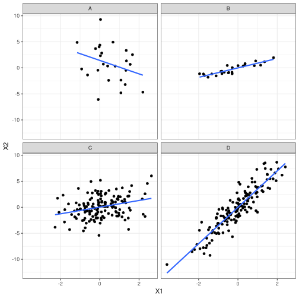
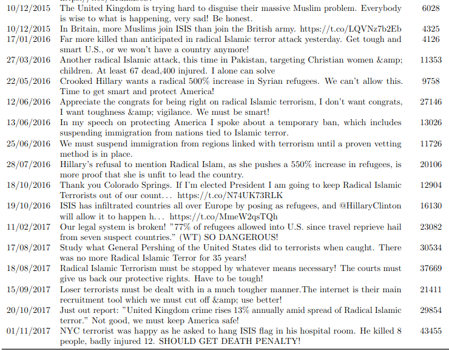
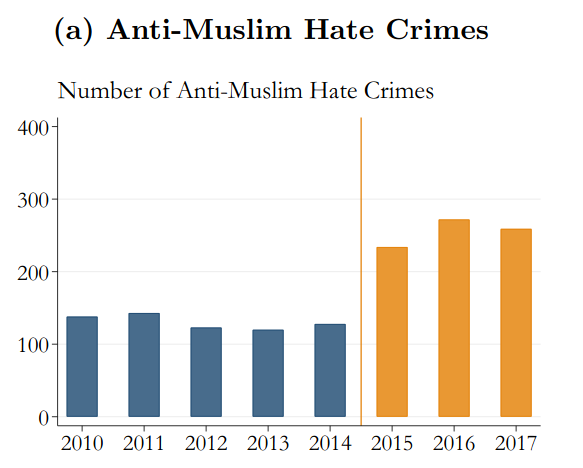

```{r setup, include=FALSE}
knitr::opts_chunk$set(echo = FALSE)
require(haven)
require(data.table)
require(ggplot2)
require(magrittr)
require(ggdag)

```

## Testing Causal Claims

### **1. Correlation: Recap**

- definition
- attributes
- problems

### **2. Problems with Correlation**

- Random correlation
- Bias in correlation (**confounding**)
- Today is a very good day to ask questions


# Recap

## Solving FPCI

We "solve" the FPCI by comparing **factual** outcomes in **different cases** that have **different exposures** to the "cause"

- $\mathrm{Case \ A}$ is exposed to a "cause"
- $\mathrm{Case \ B}$ is **not** exposed to a "cause"

This is **correlation**: the degree of association/relationship between the **observed** values of $X$ (the independent variable) and $Y$ (the dependent variable)

>- To *infer* causality, we assume that $\mathrm{Case \ B}$ is the same as the counterfactual $\color{red}{\mathrm{Case \ A}}$ 

## **Correlation**

Correlations have

- **direction**:
    - positive: implies that as $X$ increases, $Y$ increases
    - negative: $X$ increases, $Y$ decreases
- **strength** (has nothing to do **size of effect**):
    - **strong**: $X$ and $Y$ almost **always** move together (near $1,-1$)
    - **weak**: $X$ and $Y$ do not move together very much (near $0$)
- **magnitude**: 
    - this is the how much $Y$ changes with $X$. 
    - The larger the effect of $X$ on $Y$, the steeper the slope

---



## Correlation

### **Two types of problems**

- **random association**: correlations between $X$ and $Y$ occur **by chance** and do not reflect $X$ causing $Y$.

- **bias** (spurious correlation, **confounding**): $X$ and $Y$ are correlated but the correlation does not result from a **causal relationship** between those variables

---

```{r, echo = F, message = F}
cage_data = data.frame(cage_films = c(2,2,2,3,1,1,2,3,4,1,4),
                       pool_deaths = c(109, 102, 102, 98, 85, 95, 96, 98, 123, 94, 102))
require(ggplot2)
ggplot(cage_data, aes(x =cage_films, y = pool_deaths)) + 
  geom_point(position = position_jitter(w = 0, h = 1)) + 
  geom_smooth(method = 'lm', fullrange = T, se = F) +
  theme_bw() +
  ggtitle("Nick Cage films cause Pool Drownings") +
  xlab("Nick Cage Films per Year") + 
  ylab("Pool Drownings per Year (US)") + 
  theme(plot.title = element_text(size = 24, face = "bold"),
        axis.title=element_text(size=14,face="bold"))
```

## Random assocation

What is the **problem**?

If correlation can occur by chance: 

- we can observe a positive correlation between $X$ and $Y$ and conclude that $X$ causes $Y$, even if $X$ has no effect on $Y$
- failure of weak severity

## Random assocation

What is the **solution**?

2. Obtain **probability** of observing *this* correlation by chance:
    - **strength** of correlation
    - **size** of the sample ($N$)
    - assume we know the **random process** generating our observations
3. $p$-values: probability of *this* correlation by chance
    - Given same $N$, stronger correlation has lower $p$
    - Given same strength, correlation with more $N$ has lower $p$
    - probability we incorrectly infer a *real* relationship (due to chance), if used correctly
    
--- 

### $p$ hacking:

What is the problem with looking at many correlations and reporting only those that are "significant"? ($p < 0.05$)

- We [play a game](https://rolladie.net/roll-a-d20-die#!numbers=1&high=20&length=1&sets=&addfilters=&last_roll_only=true&totals_only=false) where you win if you roll "20" on a 20-sided die (probability is 1 in 20 ($0.05$)
- What is the probability you win if you roll once?
- What is the probability you win if you roll twenty times?

>- 64%! Looking at lots of correlations, you are likely to find at some "unlikely" correlations

---

| Statistical<br>Significance | $p$-value | By Chance? | Why? | "Real"? |
|:----------------------------:|:-----------------:|:----------:|:-------------------------------:|:----------------:|
| Low | High $(p > 0.05)$ | Likely | small $N$<br>weak correlation | Probably **not** |
| High | Low $(p < 0.05)$ | Unlikely | large $N$<br>strong correlation | Probably |
  
  
---

**Practice**


# Example

---

<iframe width="560" height="315" src="https://www.youtube.com/embed/QjYqhvo1vqs?si=bl-EpDMWqqcnTZjB" title="YouTube video player" frameborder="0" allow="accelerometer; autoplay; clipboard-write; encrypted-media; gyroscope; picture-in-picture; web-share" referrerpolicy="strict-origin-when-cross-origin" allowfullscreen></iframe>

---



## Trump's Twitter and Hate Crimes

[Mueller and Schwarz (2023)](https://www.aeaweb.org/articles?id=10.1257/app.20210211) investigate:

During the period from 2015 to the end of 2017, Trump posted more than 300 messages that can be classified as "Anti-Muslim".


Did Trump's tweeting of anti-Muslim messages on social media **increase** anti-Muslim hate crimes?


## Trump's Twitter and Hate Crimes

We can't observe the US in the absence of Trump tweeting against Muslims, so authors use correlation...

---

### Trump's Twitter and Hate Crimes

$X$ (Independent Variable): Trump's Twitter gained attention after he announced run for President (2015-2017)


### Trump's Twitter and Hate Crimes

$Y$ (Dependent variable): When Trump gained prominence, anti-Muslim hate crimes increased



## Trump's Twitter and Hate Crimes

As Trump's Tweeting against Muslims reached more people (change in observed $X$), anti-Muslim hate crimes increased (change in $Y$)

In groups, discuss:

Is this correlation be convincing that Trump's tweets **caused** anti-Muslim hate crimes?

Why or why not?


#

---

In this case, correlation "solves" FPCI by plugging in these factual potential outcomes

| Case | Tweets | No Tweets |
|:-----|:----:|:---:|
| USA 2015-17 | $\mathrm{Hate \ Crime_{USA \ 2015-17}(Trump \ Tweets)}$ | $\color{red}{\mathrm{Hate \ Crime_{USA \ 2015-17}(No \ Tweets)}}$ |
| |  $\Downarrow$ | $\Uparrow{}$ |
| USA 2010-14 | $\color{red}{\mathrm{Hate \ Crime_{USA \ 2010-14}(Trump \ Tweets)}}$ | $\mathrm{Hate \ Crime_{USA \ 2010-14}(No \ Tweets)}$ |


## Example:


**Why** doesn't correlation imply causation?

## Confounding

**confounding** is when there is a **systematic** observed correlation between $X$ and $Y$ that does **NOT reflect** the causal effect of $X$ on $Y$.

- This is **not** a chance correlation: if we looked at more data, relationship would persist
- Two ways to explain why this happens (different explanations, but two sides of the same coin)

## Confounding

Mueller and Schwarz look at the correlation of Trump's Twitter activity and Hate Crimes over time:

When Trump tweeted more (and had more followers) (2015-2017), hate crimes were higher than when Trump tweeted less (and had fewer followers) (2010-2014).

>- What do we have to **assume** in order for this correlation to imply causation? (HINT: Think about the potential outcomes we just looked at)


## Confounding

In order for Mueller and Schwarz's correlation to imply causation, need to assume that:

$\color{red}{\mathrm{AntiMuslim \ Hate \ Crime_{USA \ 2015-17}(No \ Trump \ Tweets)}}$
$=$
$\mathrm{AntiMuslim \ Hate \ Crime_{USA \ 2010-14}(No \ Trump \ Tweets)}$

If assumption is wrong...

and Anti-Muslim hate crimes in 2015-2017 would have been different from 2010-2014 even **without Trump's Tweets**...

...this comparison leads to confounding.

---

### Confounding

In correlation, Mueller and Schwarz assume that US (2015-17) without Trump tweets (counterfactual) is the same as US (2010-14) without Trump tweets (factual)

| Case | Tweets | No Tweets |
|:-----|:----:|:---:|
| USA 2015-17 | $\mathrm{Hate \ Crime_{USA \ 2015-17}(Trump \ Tweets)}$ | $\color{red}{\mathrm{Hate \ Crime_{USA \ 2015-17}(No \ Tweets)}}$ |
| | $\Downarrow{=}$ | $\Uparrow{=}$ |
| USA 2010-14 | $\color{red}{\mathrm{Hate \ Crime_{USA \ 2010-14}(Trump \ Tweets)}}$ | $\mathrm{Hate \ Crime_{USA \ 2010-14}(No \ Tweets)}$ |

---

### Confounding

If this substitution is **wrong**: USA in 2010-14 vs USA 2015-17 have **different** potential outcomes of hate crime, correlation is **biased**.

| Case | Tweets | No Tweets |
|:-----|:----:|:---:|
| USA 2015-17 | $\mathrm{Hate \ Crime_{USA \ 2015-17}(Trump \ Tweets)}$ | $\color{red}{\mathrm{Hate \ Crime_{USA \ 2015-17}(No \ Tweets)}}$ |
| | $\Downarrow{\neq}$ | $\Uparrow{\neq}$ |
| USA 2010-14 | $\color{red}{\mathrm{Hate \ Crime_{USA \ 2010-14}(Trump \ Tweets)}}$ | $\mathrm{Hate \ Crime_{USA \ 2010-14}(No \ Tweets)}$ |

Maybe $\mathrm{Hate \ Crime_{USA \ 2015-17}(Trump \ Tweets)} = \\ \color{red}{\mathrm{Hate \ Crime_{USA \ 2015-17}(No \ Tweets)}}$: hate crimes would have gone up ANYWAY

## Confounding

**Why does confounding happen?** 

### **Explanation 1**:

Confounding happens when cases that experience **different levels of $X$** have **systematically different** (factual and counterfactual) potential outcomes of $Y$.

Cases with different levels of cause $X$ 

- **systematically different** in their factual/counter-factual values of $Y$.

---

Does social media use cause increased polarization?

```{r echo = F, message = F, warning = F}
anes = fread("./anes_2024.csv")
ggplot(anes, aes(x = as.factor(social_media), y = affective_polarization_pid)) +
geom_bar(stat = 'summary', fun.y = 'mean') + 
  xlab("Consumption of Social Media News: X") +
  ylab("Mean Partisan Affective Polarization: Y") +
  ggtitle("Social Media and Polarization") + 
  theme_bw() + 
  coord_cartesian(ylim=c(40,60))

```

Individual data on social media use and affective polarization from ANES 2024

## Confounding

**Why does confounding happen?** 

### **Explanation 1**:

Confounding happens when cases that experience **different levels of $X$** have **systematically different** (factual and counterfactual) potential outcomes of $Y$.

What does that look like in the context of social media consumption and polarization?

::BOARD::

## Confounding

**Why does confounding happen?** 

### **Explanation 1**:

Confounding happens when cases that experience **different levels of $X$** have **systematically different** (factual and counterfactual) potential outcomes of $Y$.

Cases that actually receive cause $X$...

1. have a **different baseline** outcome (different $Y$ absent $X$): **selection bias**
2. **respond differently** to cause $X$: **heterogeneity bias**

... than cases **not** actually receiving $X$

## Confounding

### **Explanation 2**:

Confounding occurs when there are **other differences** between cases (call them variables, e.g. $W$, etc.) that **causally affect $X$ *and* $Y$**. 

The easiest way to understand this is **visually**. 

## Causal Graphs

Causal graphs represent a model of the **true causal relationships** between variables.

the **nodes** or **dots** correspond to **variables**

- can be labeled with generic names for independent/dependent variables ($X$, $Y$) or meaningful names (e.g. "Trump Tweets", "Hate Crimes")

the **arrows** convey the **direction** of the flow of **causality**

- $X \rightarrow Y$ means that $X$ causes changes in $Y$
- $X \leftarrow W$ means that $W$ causes changes in $X$

Arrows alone do not indicate whether $X$, e.g., increases or decreases $Y$.


## Causal Graphs

### **For example**

Did Trump anti-Muslim tweets cause hate crimes?

- Islamist terrorist attacks $\xrightarrow{}$ Trump anti-Muslim tweets
- Islamist terrorist attacks $\xrightarrow{}$ News Coverage
- News coverage $\xrightarrow{}$ anti-Muslim attitudes $\xrightarrow{}$ Hate crimes


---

Did Trump anti-Muslim tweets cause hate crimes?

Maybe...


```{r, echo = F}
dagify(
       tweet ~ terror,
       news ~ terror,
       prejudice ~ news,
       hatecrime ~ tweet + prejudice ,
       #mask ~ mandate,
       exposure = "tweet", 
       outcome = 'hatecrime',
       labels = c(
                  "terror" = "Islamist\nTerrorism",
                  "news" = "News\nCoverage",
                  "tweet" = "Trump\nTweets",
                  "hatecrime" = "Hate\nCrimes",
                  "prejudice" = "Anti-Muslim\nPrejudice"
                  )
                  ) %>%
  tidy_dagitty(layout='tree') %>%
ggplot(aes(x = x, y = y, xend = xend, yend = yend)) +
  geom_dag_edges_link() +
  geom_dag_text(mapping = aes(label = label), colour = 'black') +
  theme_dag() +
  scale_adjusted()

```


## Causal Graphs

In a causal graph, there is **confounding** of correlation of $X$ and $Y$ if...

1. any variable $W$ has a causal path (of any length) toward $X$ and $Y$
2. (equivalently) there is **backdoor** path or **non-causal** path from $X$ to $Y$
    - a chain of **two** or more arrows that follows arrows **backwards** from of $X$, changes direction **once** and follows arrows **toward** $Y$: $X \leftarrow W \leftarrow Z \rightarrow Y$ 

---

```{r, echo = F}
p = dagify(
       tweet ~ terror,
       news ~ terror,
       prejudice ~ news,
       hatecrime ~ tweet + prejudice ,
       #mask ~ mandate,
       exposure = "tweet", 
       outcome = 'hatecrime',
       labels = c(
                  "terror" = "Islamist\nTerrorism",
                  "news" = "News\nCoverage",
                  "tweet" = "Trump\nTweets",
                  "hatecrime" = "Hate\nCrimes",
                  "prejudice" = "Anti-Muslim\nPrejudice"
                  )
                  ) %>%
ggdag_paths(layout = 'tree', text = F, text_col = 'black', shadow = T, node = F) + theme_dag() +
  geom_dag_text_repel(force = 0, aes(label = label)) +
  theme(legend.position = 'none')

p$data[11, c("direction", "to", "xend", "yend")] = as.list(rep(NA, 4))

p
```


---

Does social media use cause increased polarization?

```{r echo = F, message = F, warning = F}
anes = fread("./anes_2024.csv")
ggplot(anes, aes(x = as.factor(social_media), y = affective_polarization_pid)) +
geom_bar(stat = 'summary', fun.y = 'mean') + 
  xlab("Consumption of Social Media News: X") +
  ylab("Mean Partisan Affective Polarization: Y") +
  ggtitle("Social Media and Polarization") + 
  theme_bw() + 
  coord_cartesian(ylim=c(40,60))

```

In groups: what other variables might affect social media use? polarization?

## Causal Graphs: Confounding

We don't know the **True** causal graph (if we did, we wouldn't need work so hard to evaluate causal claims)

Instead, these causal graphs help us think through **possible scenarios** that might produce **bias**/**confounding** of the correlation between $X$ and $Y$.

## Confounding
 
These examples illustrate the possibility that if causal graphs include variables **in addition** to the independent and dependent variables, there is a risk of confounding or bias.

Do **all** additional variables produce **confounding**?

**No...** We will discuss three different patterns of variables: some of which produce confounding, some which do not.

## Conclusion

The most serious threat to empirical evidence of causality is **confounding**:

- We can't observe causal effects of $X$ for individual cases (FPCI)
- Using correlation may lead us astray if other factors affect $X$ and $Y$
- (theories about) Confounding can be diagnosed visually 
