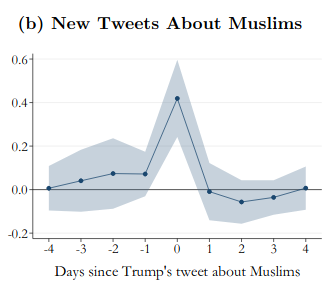

```{r setup, include=FALSE}
knitr::opts_chunk$set(echo = FALSE)
require(haven)
require(data.table)
require(ggplot2)
require(magrittr)
```

## Testing Causal Claims

### **1. Correlation: Review**

- definition
- attributes
- problems

### **2. Problems with Correlation**

- Random correlation
- Bias in correlation (**confounding**)


# Recap

## Solving FPCI

We solve the fundamental problem of causal inference by:

- comparing the values of the outcome ($Y$) across cases we can observe with different values of the cause ($X$)
- assuming that cases with different values of $X$ can stand in for the **same case** in the counterfactual world where its value of $X$ is different.

## **Correlation**

**Correlation** is the degree of association/relationship between the **observed** values of $X$ (the independent variable) and $Y$ (the dependent variable)

- There are formal mathematical definitions. 
- We use the term loosely to describe observed relationship between $X$ and $Y$

## **Correlation**

**All empirical evidence for causal claims** relies on **correlation** between the independent and dependent variables.

But, you've all heard this:


---

```{r, echo = F, message=F}
require(MASS)
require(ggplot2)
a1 = mvrnorm(150, mu = c(0,0), Sigma = matrix(c(1,0.9,0.9,1), byrow = T, ncol = 2))
a2 = mvrnorm(150, mu = c(0,0), Sigma = matrix(c(1,0.30,.3,1), byrow = T, ncol = 2))
a3 = mvrnorm(150, mu = c(0,0), Sigma = matrix(c(1,0.6,0.6,1), byrow = T, ncol = 2))
a4 = mvrnorm(150, mu = c(0,0), Sigma = matrix(c(1,0.3,0.3,1), byrow = T, ncol = 2))
a2[,2] = a2[,2] * -2
a3[,2] = a3[,2] * 3
a4[,2] = a4[,2] * -6

plot_data = data.frame(rbind(a1,a2,a3,a4), X3 = rep(LETTERS[1:4], c(150,150,150,150)))

ggplot(plot_data, aes(x = X1, y = X2)) + geom_point() + geom_smooth(method = 'lm', se = F) + facet_wrap(~ X3, nrow = 2, ncol = 2) + theme_bw()
```

POLL

## **Correlation**

Correlations have

- **direction**:
    - positive: implies that as $X$ increases, $Y$ increases
    - negative: $X$ increases, $Y$ decreases
- **strength** (has nothing to do **size of effect**):
    - **strong**: $X$ and $Y$ almost **always** move together (near $1,-1$)
    - **weak**: $X$ and $Y$ do not move together very much (near $0$)
- **slope/effect size**: 
    - this is the how much $Y$ changes with $X$. 
    - The larger the effect of $X$ on $Y$, the steeper the slope

## Correlation

What do we need to assume to use correlation as evidence of causation?

### **Two types of problems**

- **random association**: correlations between $X$ and $Y$ occur **by chance** and do not reflect causal relationship.

- **bias** (spurious correlation, **confounding**): $X$ and $Y$ are correlated but the correlation does not result from a **causal relationship** between those variables

---


```{r, echo = F, message = F}
cage_data = data.frame(cage_films = c(2,2,2,3,1,1,2,3,4,1,4),
                       pool_deaths = c(109, 102, 102, 98, 85, 95, 96, 98, 123, 94, 102))
require(ggplot2)
ggplot(cage_data, aes(x =cage_films, y = pool_deaths)) + 
  geom_point(position = position_jitter(w = 0, h = 1)) + 
  geom_smooth(method = 'lm', fullrange = T, se = F) +
  theme_bw() +
  ggtitle("Nick Cage films cause Pool Drownings") +
  xlab("Nick Cage Films per Year") + 
  ylab("Pool Drownings per Year (US)") + 
  theme(plot.title = element_text(size = 24, face = "bold"),
        axis.title=element_text(size=14,face="bold"))
```

# Random Association 

## Correlation: Random association

How do we know a correlation is **systematic**?

- How do we know that it is not simply a pattern by random chance?
- Apparent patterns can be produced by pure randomness

## Correlation: Random association

<iframe width=100% src="https://www.youtube.com/embed/no_elVGGgW8?autoplay=0" frameborder="0" allowfullscreen></iframe>

## Correlation: Random association

If you look at enough possible sets of variables, you might find a strong correlation

- But it could have happened by chance!
- So a correlation might not be meaningful (e.g. Nick Cage)

(Arbitary Correlations)[http://www.tylervigen.com/spurious-correlations]


## Random association: Statistics

To see that random patterns can emerge, I use random number generators to 

- **randomly** pick $5$ values of $X$
- **randomly** pick $5$ values of $Y$

We can imagine these are the observed $X$ and $Y$ for $5$ cases.

How easy is it to find a strong correlation?

## Random association: Statistics

```{r, echo = F}
c= 0
counter = 0
while (c < 0.9) {
  x = rnorm(5)
  y = rnorm(5)
  c = cor(x,y)
  counter = counter + 1
}

plot(x,y, main = "5 cases\nX and Y chosen randomly")
text(mean(x), mean(y), labels = paste0("Correlation: ", round(c, 2)), adj = 0.5)

```

## Random association: Statistics

```{r, echo = F}
plot(x,y, main = "5 cases\nX and Y chosen randomly")
text(mean(x), mean(y), labels = paste0("Correlation: ", round(c, 2)), adj = 0.5)
```

Tries to get correlation $> 0.9$: `r counter`

## Random association: Statistics

Field of statistics investigates properties of **chance** events (stochastic processes):

- Probability theory tells us how likely events are to happen, given chance
- Can tell us how likely correlation of some value is to happen by chance

## Random association: Statistics

### How?

1. Compute correlation of $X$ and $Y$
2. How **strong** is the correlation>
    - Patterns that are **stronger** are **less likely** to happen by chance
2. How many **cases** do we have?
    - Patterns with **many cases** are **less likely** to happen by chance
3. Assign a probability that the correlation we see would have happened by chance

## Random association: Statistics

This procedure works...

### **Assuming**...

we know the chance processes that might affect this correlation


## Random association: Statistics

```{r, echo = F}
c= 0
counter = 0
while (c < 0.9) {
  x = rnorm(10)
  y = rnorm(10)
  c = cor(x,y)
  counter = counter + 1
}

plot(x,y, main = "10 cases\nX and Y chosen randomly")
text(mean(x), mean(y), labels = paste0("Correlation: ", round(c, 2)), adj = 0.5)
```

Tries to get correlation $> 0.9$: `r counter `


## Random association: Statistics

```{r, echo = F}
c= 0
counter = 0
while (c < 0.9) {
  x = rnorm(15)
  y = rnorm(15)
  c = cor(x,y)
  counter = counter + 1
}

plot(x,y, main = "15 cases\nX and Y chosen randomly")
text(mean(x), mean(y), labels = paste0("Correlation: ", round(c, 2)), adj = 0.5)
```

Tries to get correlation $> 0.9$: `r sprintf("%.f",counter)`


## Random association: Statistics

```{r, echo = F}
c= 0
counter = 0
while (c < 0.45) {
  x = rnorm(15)
  y = rnorm(15)
  c = cor(x,y)
  counter = counter + 1
}

plot(x,y, main = "15 cases\nX and Y chosen randomly")
text(mean(x), mean(y), labels = paste0("Correlation: ", round(c, 2)), adj = 0.5)
```

Tries to get correlation $> 0.45$: `r counter`

## Random association: Statistics

**statistical significance**: 

> An indication of **how likely** correlation we observe could have happened purely by chance.

> **higher** degree of statistical significance indicates correlation is **unlikely** to have happened by chance

## Random association: Statistics

$p$ **value**:

- A numerical measure of **statistical significance**. Puts a number on how likely observed correlation would have occurred by chance, **assuming** a we know the chance procedure and the truth is a $0$ correlation.

- It is a probability, so is between $0$ and $1$.

- **Lower** $p$-values indicate **greater** statistical significance

$p < 0.05$ often used as threshold for "significant" result. 

- but it is not a magic number
- Can observe $p < 0.05$ by chance ($\frac{1}{20}$)

## Random association: Statistics

$p$ **value**:

Be wary of "$p$-hacking"

- $p$ values become meaningless if we look at many associations, then only report the ones that are "significant".

### Why?

- low $p$-values occur by chance when we look at lots of associations

## Significant?


## Significant?


## Significant?


## What else do you want to know?


## We'd want to know this


## We'd want to know this


## Random assocation

1. Correlations can appear by chance
2. We can assess **probability** of chance correlation if we know:
    - **strength** of correlation (close to $1,-1$)
    - **size** of the sample ($N$)
    - we assume we know the **chance process** generating our observations
3. $p$-values:
    - Obtained using mathematical formulae
    - Given same $N$, stronger correlation has lower $p$
    - Given same strength, correlation with more $N$ has lower $p$
    
## Random assocation

### Recap:

| Statistical<br>Significance | $p$-value | By Chance? | Why? | "Real"? |
|:----------------------------:|:-----------------:|:----------:|:-------------------------------:|:----------------:|
| Low | High ($p > 0.05$) | Likely | small $N$<br>weak correlation | Probably **not** |
| High | Low ($p < 0.05$) | Unlikely | large $N$<br>strong correlation | Probably |

# Example

## Trump's Twitter and Hate Crimes

[Mueller and Schwarz (2020)](https://papers.ssrn.com/sol3/papers.cfm?abstract_id=3149103) investigate:

Did Trump's tweeting of anti-Muslim messages **increase** anti-Muslim hate crimes?

## Trump's Twitter and Hate Crimes

We can't observe the US in the absence of Trump tweeting against Muslims, so authors use correlation...

## Trump's Twitter and Hate Crimes

Trump's Twitter gained attention as he ran for President.


## Trump's Twitter and Hate Crimes

Trump made nearly 300 negative tweets about Muslims.

Other people made more new negative tweets about Muslims when he did.



## Trump's Twitter and Hate Crimes

When Trump gained prominence, anti-Muslim hate crimes increased


## Trump's Twitter and Hate Crimes


## Trump's Twitter and Hate Crimes

In groups, discuss:

Do these correlations mean that Trump's tweets **caused** anti-Muslim hate crimes?

What are your reasons for your answer?

#


## Confounding

**confounding** is when there is a **systematic** observed correlation between $X$ and $Y$ that is does **NOT reflect** the causal effect of $X$ on $Y$.

- This is not a chance correlation. 
- Two ways to explain why this happens (different explanations, but two sides of the same coin)


## Confounding

### **Explanation 1**:

Confounding happens when cases with **different levels of $X$** have different (factual and counterfactual) potential outcomes of $Y$.

**In our example:**

Mueller and Schwarz had been assuming that in the counterfactual world where Trump didn't gain Twitter followers, anti-Muslim hate crimes in the US would have been the same as they were pre-2015:

$\color{red}{\mathrm{Muslim \ Hate \ Crime_{USA \ 2015-17}(No \ Trump \ Twitter)}}$ $=$

$\mathrm{Muslim \ Hate \ Crime_{USA \ 2010-14}(No \ Trump \ Twitter)}$ 

If this is wrong... comparison leads to confounding.

## Confounding

### **Explanation 2**:

Confounding occurs when there are **other differences** between cases (call them variables, e.g. $W$, $Z$, etc.) that **affect $X$** and **affect $Y$**. 
The easiest way to understand this is **visually**. 

- We can produce **graphs** of the causal relationships between variables
- We can figure out whether there is going to be **bias**/**confounding** in the correlation of $X$ and $Y$ by reading these graphs. 

## Confounding

Next week...

Everything you didn't want to know **Confounding**