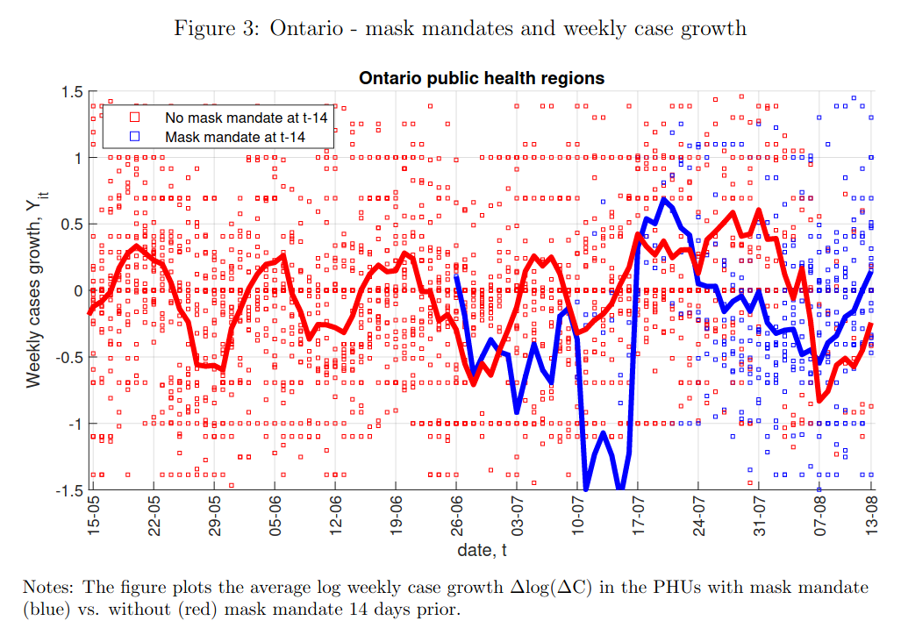

```{r setup, include=FALSE}
knitr::opts_chunk$set(echo = FALSE)
require(haven)
require(data.table)
require(ggplot2)
require(magrittr)
require(ggdag)
```

# Confounding

## Outline

1. Confounding
    - definition
    - sources of bias
    - graphs
    - when do we get confounding?
    - directiono of bias
    
## Example:

[Karaivanov et al (2020)](https://www.nber.org/system/files/working_papers/w27891/w27891.pdf), economists at SFU, investigate:

> Have indoor mask mandates reduced COVID cases, on average?

## Example:

They compare COVID cases in Ontario Public Health Units (PHU) with and without mask mandates

- Correlation of mask mandate and COVID cases

## Example:



# Confounding

## Confounding

**Correlation** suffers from two sources of error:

**random error**: we observe patterns in $X$ (independent variable) and $Y$ (dependent variable) by chance, when there is in fact no relationship.

**confounding (bias)**: the **observed pattern** between $X$ and $Y$ is not the **true causal relationship** between $X$ and $Y$.

## Confounding

**confounding** is when there is a **systematic** observed correlation between $X$ and $Y$ that  does **NOT reflect** the true causal effect of $X$ on $Y$.

- This is not a chance correlation. 
- Two ways to explain why this happens (different explanations, but two sides of the same coin)

---

It's summer of 2020:


<p><a href="https://commons.wikimedia.org/wiki/File:Toronto_Skyline_Summer_2020.jpg#/media/File:Toronto_Skyline_Summer_2020.jpg"></a><br></p>

Toronto's caseload in the counter-factual world where it didn't have a mask mandate...

---

Not the same as the **factual** caseload in North Bay, without a mask mandate


---


---

### **Another Explanation**:

Confounding occurs when these other differences between cases (third variables, e.g. $W$) **causally affect $X$ and $Y$**. 

This can be understood **visually**

## Causal Graphs

Causal graphs represent a model of the **true causal relationships** between variables.

the **nodes** or **dots** correspond to **variables**

- can be labeled with generic names for independent/dependent variables ($X$, $Y$) or meaningful names (e.g. "Mask Mandate", "COVID Cases")

the **arrows** convey the **direction** of **causality**

- $X \rightarrow Y$ means that $X$ causes changes in $Y$
- $X \leftarrow W$ means that $W$ causes changes in $X$

## Causal Graphs

### **For example**

PHU in Toronto (that had a mask mandate) may have a larger population of university educated adults than PHU in North Bay (no mask mandate).

- Unversity educated residents might be more likely to work from home $\xrightarrow{}$ mask mandate affects fewer people $\xrightarrow{}$ more likely to implement.
- Unversity educated residents $\xrightarrow{}$ work from home $\xrightarrow{}$ fewer contacts $\xrightarrow{}$ lower COVID cases

---

```{r, echo = F}
dagify(work_home ~ education,
       mandate ~ work_home,
       contact ~ work_home,
       covid ~ mask + contact ,
       mask ~ mandate,
       exposure = "mandate", 
       outcome = 'covid',
       labels = c("contact" = "Social\nContact",
                  "education" = "Univ. Educ.",
                  "mandate" = "Mask\n Mandate",
                  "work_home" = "Work from\nHome",
                  "covid" = "COVID\nCases",
                  'mask' = 'Wear\nMask')
                  ) %>%
  tidy_dagitty(layout='tree') %>%
ggplot(aes(x = x, y = y, xend = xend, yend = yend)) +
  geom_dag_edges_link() +
  geom_dag_text(mapping = aes(label = label), colour = 'black') +
  theme_dag() +
  scale_adjusted()

```

## Causal Graphs

In a causal graph, there is **confounding** of correlation of $X$ and $Y$ if...

1. some other variable $W$ has causal paths toward $X$ and $Y$
2. (equivalently) there is **backdoor** path or **non-causal** path from $X$ to $Y$
    - a chain of **two** or more arrows that follows arrows **backwards** out of $X$, changes direction **once** and follows arrows **toward** $Y$: $X \leftarrow W \leftarrow Z \rightarrow Y$ 

# 

<h1 style="color:white;">#NotAllVariables produce confounding</h1>
 

## Additional Variables: Patterns

- **antecedent variables**
    - sometimes confounding
    - sometimes no confounding
- **intervening variables**
    - no confounding
- **reverse causality**
    - yes, confounding.
      
    
## Antecedent Variables

**antecedent variable**: a variable that **affects** $X$

- e.g. in this path, $W \xrightarrow{} X \xrightarrow{} Y$, $W$ is an antecedent variable.

- antecedent variables ($W$) **do not** produce confounding if the **only causal path** from $W$ to $Y$ passes through $X$.
- antecedent variables **do** produce confounding if there is another **causal path** from $W$ to $Y$ that does **NOT** include $X$.


## Antecedent Variable: Confounding?

```{r, echo = F}

dagify(
       covid ~ mandate,
       mandate ~ positives ,
       exposure = "mandate", 
       outcome = 'covid',
       labels = c("mandate" = "Mask\nMandate",
                  "covid" = "COVID\nCases",
                  "positives" = "Test\nPositivity"
                  )
                  )  %>%
  tidy_dagitty(layout='auto') %>%
ggplot(aes(x = x, y = y, xend = xend, yend = yend)) +
  geom_dag_edges_link() +
  geom_dag_text(mapping = aes(label = label), colour = 'black') +
  theme_dag() +
  scale_adjusted()

```

>- No. No "backdoor" path.

## Antecedent Variable: Confounding?

```{r, echo = F}
dagify(
       covid ~ mandate,
       mandate ~ positives,
       test_no ~ positives,
       exposure = "mandate", 
       outcome = 'covid',
       labels = c("mandate" = "Mask\nMandate",
                  "covid" = "COVID\nCases",
                  "positives" = "Test\nPositivity",
                  'test_no' = "Number\nof Tests"
                  )
                  )  %>%
  tidy_dagitty(layout='auto') %>%
ggplot(aes(x = x, y = y, xend = xend, yend = yend)) +
  geom_dag_edges_link() +
  geom_dag_text(mapping = aes(label = label), colour = 'black') +
  theme_dag() +
  scale_adjusted()
```

>- No. No "backdoor" path.

## Antecedent Variable: Confounding?

```{r, echo = F}
dagify(
       covid ~ mandate + stay_home,
       mandate ~ positives,
       test_no ~ positives,
       stay_home ~ positives,
       exposure = "mandate", 
       outcome = 'covid',
       labels = c("mandate" = "Mask\nMandate",
                  "covid" = "COVID\nCases",
                  "positives" = "Test\nPositivity",
                  'test_no' = "Number\nof Tests", 
                  'stay_home' = "Stay\nHome"
                  )
                  )  %>%
  tidy_dagitty(layout='auto') %>%
ggplot(aes(x = x, y = y, xend = xend, yend = yend)) +
  geom_dag_edges_link() +
  geom_dag_text(mapping = aes(label = label), colour = 'black') +
  theme_dag() +
  scale_adjusted()

```

>- Yes. Mandate $\xleftarrow{}$ Positives $\xrightarrow{}$Stay Home$\xrightarrow{}$COVID Cases

## Antecedent Variable: Confounding?


```{r, echo = F}

dagify(
       covid ~ mandate + superspreader,
       mandate ~ positives,
       test_no ~ positives,
       test_no ~ superspreader,
       exposure = "mandate", 
       outcome = 'covid',
       labels = c("mandate" = "Mask\nMandate",
                  "covid" = "COVID\nCases",
                  "positives" = "Test\nPositivity",
                  'test_no' = "Number\nof Tests",
                  "superspreader" = "Super\nSpreader\nEvent"
                  )
                  )  %>%
  tidy_dagitty(layout='auto') %>%
ggplot(aes(x = x, y = y, xend = xend, yend = yend)) +
  geom_dag_edges_link() +
  geom_dag_text(mapping = aes(label = label), colour = 'black') +
  theme_dag() +
  scale_adjusted()

```

>- No. No "backdoor" path; apparent "backdoor" changes directions more than once.

## Intervening Variables

**intervening variable**: a variable that **affects** $Y$ and is **affected by** $X$. 

- e.g. in this path, $X \xrightarrow{} M \xrightarrow{} Y$, $M$ is an intervening variable.

- intervening variables ($M$) **do not** produce confounding because they are on the  **causal path** from $X$ to $Y$. They do not produce backdoor path.

## Intervening Variable

```{r, echo = F}
dagify(
       covid ~ positives,
       positives ~  mandate,
       exposure = "mandate", 
       outcome = 'covid',
       labels = c("mandate" = "Mask\nMandate",
                  "covid" = "COVID\nCases",
                  "positives" = "Mask\nWearing"
                  )
                  )  %>%
  tidy_dagitty(layout='auto') %>%
ggplot(aes(x = x, y = y, xend = xend, yend = yend)) +
  geom_dag_edges_link() +
  geom_dag_text(mapping = aes(label = label), colour = 'black') +
  theme_dag() +
  scale_adjusted()

```

- No backdoor path. Mask mandate affects COVID **through** mask wearing.


## Intervening Variable

```{r, echo = F}
dagify(
       covid ~ positives,
       positives ~  mandate + other_positives,
       other_positives ~  mandate,
       covid ~ other_positives,
       exposure = "mandate", 
       outcome = 'covid',
       labels = c("mandate" = "Mask\nMandate",
                  "covid" = "COVID\nCases",
                  "positives" = "Mask\nWearing",
                  "other_positives" = "Avoid\nIndoors"
                  )
                  )  %>%
  tidy_dagitty(layout='auto') %>%
ggplot(aes(x = x, y = y, xend = xend, yend = yend)) +
  geom_dag_edges_link() +
  geom_dag_text(mapping = aes(label = label), colour = 'black') +
  theme_dag() +
  scale_adjusted()

```

- No backdoor path. Mask mandate affects COVID **through** mask wearing, avoiding indoor spaces.

## Reverse Causality

**reverse causality** describes the situation where the **dependent variable** $Y$ actually causes the **independent variable** $X$. 

So while we use the correlation to describe the effect of $X$ on $Y$: $X \to Y$, the correlation in fact is the result of the effect of $Y$ on $X$: $Y \to X$. 

This is a special case of **bias** or **confounding**.

---

|  | Third Variable? | Key Attribute | Confounding? |
|--------------------------|-----------------|---|----------------------------|
| Antecedent Variables <br> ($W$) | Yes | $W \to X$ | If only **causal path** from $W$ to $Y$ contains $X$: No <br> If a **causal path** from $W$ to $Y$ excludes $X$: Yes |
| Intervening Variables ($M$) | Yes | $X \to M \to Y$ | No |
| Reverse Causality | No  | $Y \to X$ | Yes |

# Direction of Bias

---

<iframe width="560" height="315" src="https://www.youtube.com/embed/3jRJxpZ-FnA" title="YouTube video player" frameborder="0" allow="accelerometer; autoplay; clipboard-write; encrypted-media; gyroscope; picture-in-picture" allowfullscreen></iframe>

## Example:

Gun violence in Miami Beach has led to state of emergency and curfew during Spring Break.

> “We haven’t been able to figure out how to stop spring break from coming,” Mr. Gelber said. “We don’t want spring break here, but they keep coming.”

### **Does reducing the number of guns reduce firearms violence (deaths)?**

## Correlation: Guns and Gun Deaths

```{r, echo = F, message=F}
crime = fread('./crime.csv')
crime[, gun_ownership := as.numeric(gsub('%', '', gun_ownership))]
crime = crime[gun_murder_percapita<10,]
c = cor.test(crime$gun_ownership, crime$gun_murder_percapita)

ggplot(crime, aes(x = gun_ownership, y = gun_murder_percapita , label = State)) +
  geom_text() +
  xlab("Gun Owners (%)") +  ylab("Firearms Homicides Per Capita") + 
  ggtitle('No/Negative effect of gun ownership\n on Gun Homicide?') + 
  geom_smooth(method = 'lm', se = F) + 
  theme_bw()
```

Does gun ownership slightly **reduce** firearms deaths?

## Confounding?

```{r, echo = F, message = F}
dagify(guns ~ hunting,
       popden ~ rural,
       crime ~ popden,
       hunting ~ rural,
       crime ~ guns, 
       exposure = "guns", 
       outcome = 'crime',
       labels = c('guns' = "(X) Gun\nOwnership", 
                  'rural' = 'Rural\nPopulation',
                  'crime' = "(Y) Murder\nRate",
                  'hunting' = 'Hunting',
                  'popden' = 'Population\nDensity')) %>%
  tidy_dagitty(layout='tree') %>%
ggplot(aes(x = x, y = y, xend = xend, yend = yend)) +
  #geom_dag_node() +
  geom_dag_edges_link() +
  geom_dag_text(mapping = aes(label = label), colour = 'black') +
  theme_dag() +
  scale_adjusted()
#mapping = aes(label = c('downward bias', 'increases', 'increases', 'increases', 'decreases', '')),  angle_calc = "along", label_dodge = unit(c(1,-1,1,-1,1),'lines')
```

## Confounding?

Let's say Miami Beach is considering imposing gun control policies to reduce gun deaths during Spring Break.

How would the confounding of this correlation affect policy making... ?

- if the confounding induced an **upward** bias (correlation between gun ownership and firearms deaths **more positive** than true causal relationship)?
- if the confounding induced a **downward** bias (correlation between gun ownership and firearms deaths **more negative** than true causal relationship)?


## Upward or Downward bias?

```{r, echo = F, message = F}
dagify(guns ~ hunting,
       popden ~ rural,
       crime ~ popden,
       hunting ~ rural,
       crime ~~ guns, 
       exposure = "guns", 
       outcome = 'crime',
       labels = c('guns' = "(X) Gun\nOwnership", 
                  'rural' = 'Rural\nPopulation',
                  'crime' = "(Y) Murder\nRate",
                  'hunting' = 'Hunting',
                  'popden' = 'Population\nDensity')) %>%
  tidy_dagitty(layout='tree') %>%
ggplot(aes(x = x, y = y, xend = xend, yend = yend)) +
  #geom_dag_node() +
  geom_dag_edges_link(mapping = aes(label = c('bias direction?', 'increases', 'increases', 'increases', 'decreases', '')),  angle_calc = "along", label_dodge = unit(c(1,-1,1,-1,1),'lines')) +
  geom_dag_text(mapping = aes(label = label), colour = 'black') +
  theme_dag() +
  scale_adjusted()
```

## Confounding: Direction of Bias

**Product** of **signs** on causal path from $W \to X$ and $W \to Y$ gives us <u>**direction**</u> of **bias** created by **confounding**

|  | $W \xrightarrow{+} X$ | $W \xrightarrow{-} X$ |
|-----------------------|-------------------------------------|--------------------------------|
| $W \xrightarrow{+} Y$ | $Correlation(X,Y)$<br>Biased (+) | $Correlation(X,Y)$<br>Biased (-) |
| $W \xrightarrow{-} Y$ | $Correlation(X,Y)$<br>Biased (-) | $Correlation(X,Y)$<br>Biased (+) |


## Downward bias

```{r, echo = F, message = F}
dagify(guns ~ hunting,
       popden ~ rural,
       crime ~ popden,
       hunting ~ rural,
       crime ~ guns, 
       exposure = "guns", 
       outcome = 'crime',
       labels = c('guns' = "(X) Gun\nOwnership", 
                  'rural' = 'Rural\nPopulation',
                  'crime' = "(Y) Murder\nRate",
                  'hunting' = 'Hunting',
                  'popden' = 'Population\nDensity')) %>%
  tidy_dagitty(layout='tree') %>%
ggplot(aes(x = x, y = y, xend = xend, yend = yend)) +
  #geom_dag_node() +
  geom_dag_edges_link(mapping = aes(label = c('downward bias', 'increases', 'increases', 'increases', 'decreases', '')),  angle_calc = "along", label_dodge = unit(c(1,-1,1,-1,1),'lines')) +
  geom_dag_text(mapping = aes(label = label), colour = 'black') +
  theme_dag() +
  scale_adjusted()
```

## Confounding: Direction of Bias

```{r, echo = F}
dagify(x ~ w,
       y ~ w,
       y ~~ x,
       exposure = "x", 
       outcome = 'y'
       ) %>%
tidy_dagitty(layout='tree') %>%
ggplot(aes(x = x, y = y, xend = xend, yend = yend)) +
  geom_dag_node() +
  geom_dag_edges_link(mapping = aes(label = c('Decreases', 'Increases', 'Bias \n(?)', '')), 
                      angle_calc = "along", 
                      label_dodge = unit(c(-1,1,-1),'lines'), 
                      edge_linetype = rep(c(1,1,3), each = 100),
                      arrow = grid::arrow(length=grid::unit(c(10,10,0), 'pt'), type = 'closed')) +
  geom_dag_text(colour = 'white') +
  theme_dag() +
  scale_adjusted()
```

## Confounding: Direction of Bias

```{r, echo = F}
dagify(x ~ w,
       y ~ w,
       y ~~ x,
       exposure = "x", 
       outcome = 'y'
       ) %>%
tidy_dagitty(layout='tree') %>%
ggplot(aes(x = x, y = y, xend = xend, yend = yend)) +
  geom_dag_node() +
  geom_dag_edges_link(mapping = aes(label = c('Decreases', 'Increases', 'Bias \n(Downward)', '')), 
                      angle_calc = "along", 
                      label_dodge = unit(c(-1,1,-1),'lines'), 
                      edge_linetype = rep(c(1,1,3), each = 100),
                      arrow = grid::arrow(length=grid::unit(c(10,10,0), 'pt'), type = 'closed')) +
  geom_dag_text(colour = 'white') +
  theme_dag() +
  scale_adjusted()
```

## Confounding: Direction of Bias

```{r, echo = F}
dagify(x ~ w,
       y ~ w,
       y ~~ x,
       exposure = "x", 
       outcome = 'y'
       ) %>%
tidy_dagitty(layout='tree') %>%
ggplot(aes(x = x, y = y, xend = xend, yend = yend)) +
  geom_dag_node() +
  geom_dag_edges_link(mapping = aes(label = c('Decreases', 'Decreases', 'Bias \n(?)', '')), 
                      angle_calc = "along", 
                      label_dodge = unit(c(-1,1,-1),'lines'), 
                      edge_linetype = rep(c(1,1,3), each = 100),
                      arrow = grid::arrow(length=grid::unit(c(10,10,0), 'pt'), type = 'closed')) +
  geom_dag_text(colour = 'white') +
  theme_dag() +
  scale_adjusted()
```


## Confounding: Direction of Bias

```{r, echo = F}
dagify(x ~ w,
       y ~ w,
       y ~~ x,
       exposure = "x", 
       outcome = 'y'
       ) %>%
tidy_dagitty(layout='tree') %>%
ggplot(aes(x = x, y = y, xend = xend, yend = yend)) +
  geom_dag_node() +
  geom_dag_edges_link(mapping = aes(label = c('Decreases', 'Decreases', 'Bias \n(Upward)', '')), 
                      angle_calc = "along", 
                      label_dodge = unit(c(-1,1,-1),'lines'), 
                      edge_linetype = rep(c(1,1,3), each = 100),
                      arrow = grid::arrow(length=grid::unit(c(10,10,0), 'pt'), type = 'closed')) +
  geom_dag_text(colour = 'white') +
  theme_dag() +
  scale_adjusted()
```

## Confounding: Direction of Bias

```{r, echo = F}
dagify(x ~ w,
       y ~ w,
       y ~~ x,
       exposure = "x", 
       outcome = 'y'
       ) %>%
tidy_dagitty(layout='tree') %>%
ggplot(aes(x = x, y = y, xend = xend, yend = yend)) +
  geom_dag_node() +
  geom_dag_edges_link(mapping = aes(label = c('Increases', 'Increases', 'Bias \n(?)', '')), 
                      angle_calc = "along", 
                      label_dodge = unit(c(-1,1,-1),'lines'), 
                      edge_linetype = rep(c(1,1,3), each = 100),
                      arrow = grid::arrow(length=grid::unit(c(10,10,0), 'pt'), type = 'closed')) +
  geom_dag_text(colour = 'white') +
  theme_dag() +
  scale_adjusted()
```

## Confounding: Direction of Bias

```{r, echo = F}
dagify(x ~ w,
       y ~ w,
       y ~~ x,
       exposure = "x", 
       outcome = 'y'
       ) %>%
tidy_dagitty(layout='tree') %>%
ggplot(aes(x = x, y = y, xend = xend, yend = yend)) +
  geom_dag_node() +
  geom_dag_edges_link(mapping = aes(label = c('Increases', 'Increases', 'Bias \n(Upward)', '')), 
                      angle_calc = "along", 
                      label_dodge = unit(c(-1,1,-1),'lines'), 
                      edge_linetype = rep(c(1,1,3), each = 100),
                      arrow = grid::arrow(length=grid::unit(c(10,10,0), 'pt'), type = 'closed')) +
  geom_dag_text(colour = 'white') +
  theme_dag() +
  scale_adjusted()
```

## Confounding: Direction of Bias

```{r, echo = F, message = F}
dagify(guns ~ hunting,
       popden ~ rural,
       crime ~ popden,
       hunting ~ rural,
       crime ~ guns, 
       exposure = "guns", 
       outcome = 'crime',
       labels = c('guns' = "(X) Gun\nOwnership", 
                  'rural' = 'Illicit\nDrug Trade',
                  'crime' = "(Y) Murder\nRate",
                  'hunting' = 'Property\nCrime',
                  'popden' = 'Effective\nPolice')) %>%
  tidy_dagitty(layout='tree') %>%
ggplot(aes(x = x, y = y, xend = xend, yend = yend)) +
  #geom_dag_node() +
  geom_dag_edges_link(mapping = aes(label = c('? bias', 'increases', 'decreases', 'increases', 'decreases', '')),  angle_calc = "along", label_dodge = unit(c(1,-1,1,-1,1),'lines')) +
  geom_dag_text(mapping = aes(label = label), colour = 'black') +
  theme_dag() +
  scale_adjusted()
```

## Confounding: Direction of Bias

```{r, echo = F, message = F}
dagify(guns ~ hunting,
       popden ~ rural,
       crime ~ popden,
       hunting ~ rural,
       crime ~ guns, 
       exposure = "guns", 
       outcome = 'crime',
       labels = c('guns' = "(X) Gun\nOwnership", 
                  'rural' = 'Illicit\nDrug Trade',
                  'crime' = "(Y) Murder\nRate",
                  'hunting' = 'Property\nCrime',
                  'popden' = 'Effective\nPolice')) %>%
  tidy_dagitty(layout='tree') %>%
ggplot(aes(x = x, y = y, xend = xend, yend = yend)) +
  #geom_dag_node() +
  geom_dag_edges_link(mapping = aes(label = c('upward bias', 'increases', 'decreases', 'increases', 'decreases', '')),  angle_calc = "along", label_dodge = unit(c(1,-1,1,-1,1),'lines')) +
  geom_dag_text(mapping = aes(label = label), colour = 'black') +
  theme_dag() +
  scale_adjusted()
```

# Conclusion

## Conclusion

**Confounding**

1. **bias**: observed correlation $\neq$ true casual relationship
2. Why?
    - cases with different values of $X$, different in **other** ways
    - if "third" variable affects $X$, affects $Y$ $\to$ confounding.
3. Causal graphs help us diagnose possible sources of confounding.
4. Direction of bias


## Bullet-proof Solutions?

- Any way to **guarantee** no other variables affect both $X$ (cause) and $Y$ (outcome)?
- Any way to **guarantee** we can treat outcomes in cases with different exposure to the cause as counterfactuals for each other?
