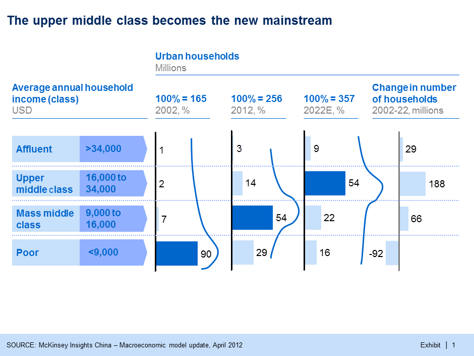

```{r setup, include=FALSE}
knitr::opts_chunk$set(echo = FALSE)
```

# Causal Claims

## Plan for Today:

### **(1) Causality and Counterfactuals**

- potential outcomes

### **(2) Deterministic Causal Claims**

- necessary conditions
- sufficient conditions
- conjunctural causation

# Causality and Counterfactuals

## Two ways of asking causal questions

<h3><ol>
<li> What are the **causes** of **effects**?
</ol></h3>

Usually to explain something specific that has happened/we observe (**the effect**). This is about **attributing** a cause for some observed outcome/"explaining" the outcome.

- Why did Donald Trump win the 2016 US election?
- Why are housing prices very high in Vancouver?
- Why did (a specific mass shooting) happen?

## Two ways of asking causal questions

<h3><ol start=2>
<li> What are the **effects** of **causes**?
</ol></h3>

We want to know what happens if we do some action or some action (**the cause**) happens. (Could be a specific action or not) This is about the **contribution** of some cause to an effect.

- Has Donald Trump's victory caused an increase in hate crimes? (specific cause)
- Has BC's housing speculation tax reduced housing prices? (specific cause)
- Does an increase in immigration cause an increase in violent crime? (general)
- What are the effects of restricting gun ownership on gun violence? (general)

## Counterfactuals and Causality:

If we say that $X$ is a cause of $Y$ for a **particular case**, when the following statements are **true**:

- If $X$ were to occur, then $Y$ would occur
- If $X$ were not to occur, then $Y$ would not occur.

**More generally**:

$X$ is a cause of $Y$ for some **specific case(s)**, if when $X$ changes and **everything is the same except** $X$, $Y$ changes.

## Counterfactuals and Potential Outcomes

### Why the name **counter**factual?

Counterfactual claims are about what would be the case for $Y$ if something else had happened (instead of what did happen) in terms of $X$. 

These "alternate universes" did not occur, they are not "factual", but "counterfactual".

## Counterfactuals and Potential Outcomes

Counterfactuals imply **potential outcomes**:

If $X$ is a **variable** for a possible cause and $Y$ is a **variable** for what is possibly affected... 

then **potential outcomes** for a **specific case** are the values of $Y$ for different values of $X$

## Counterfactuals and Potential Outcomes

In mathematical notation:

Where $i$ corresponds to a specific case, and $X$ can either by $1$ or $0$, then the potential outcomes of $Y_i$ are:

$$Y_i^{X = 1}, Y_i^{X = 0}$$

And we can say that $X$ **causes** a change in $Y_i$ if $Y_i^{X = 1} \neq Y_i^{X = 0}$

## Counterfactuals and Potential Outcomes

> "the other night I was in El Paso, we had a tremendous crowd, tremendous crowd, and I asked the people, many of whom were from El Paso, but they came from all over Texas, and I asked, them, I said, “Let me ask you as a crowd, when the wall went up, was it better?” You were there, some of you. It was not only better, it was like 100 percent better. You know what they did. But that’s only one example. There were so many examples. In El Paso, they have close to 2,000 murders right on the other side of the wall, and they have 23 murders. That’s a lot of murders, but it’s not close to 2,000 murders right on the other side of the wall in Mexico."
>
> - **Donald Trump, declaring a national emergency**

## Counterfactuals and Potential Outcomes

Trump's causal claim (implicitly): "The wall caused El Paso to have fewer murders".

Trump's counterfactual claim: "If there had been no wall, El Paso would have had (closer to) 2000 murders."

### Counterfactual claim implies two **potential outcomes**:

1. Number of murders in El Paso last year ($Y_i$) in the **presence** of the wall ($X = 1$), or $Murders_{El \ Paso}^{Wall = Yes}$
2. Number of murders in El Paso last year ($Y_i$) in the **absence** of the wall ($X = 0$), or $Murders_{El \ Paso}^{Wall = No}$

## Counterfactuals and Potential Outcomes

If Trump's causal claim is **true** ("The wall caused El Paso to have fewer murders"), then:

$$Murders_{El \ Paso}^{Wall = Yes}  < Murders_{El \ Paso}^{Wall = No}$$

Why might this be hard to prove?

# Deterministic Causal Claims

## Deterministic Causal Claims

**deterministic causal claims**

- these are claims about what will happen with **certainty** under specific causal conditions
- whenever some **cause** (or set of causes) is present, the **effect** <u>**always**</u> happens
  - if the cause is present the effect is **determined** (unavoidable)
- usually (but not always) make these claims when we are interested in **causes of effects**

## Necessary Conditions

### **necessary conditions**

A causal claim that there is some cause $C$ **without which** the effect **cannot occur**

- A cause $C$ **must happen** in order for effect $E$ to happen.
- **Does not mean** if the cause $C$ is present, effect $E$ must happen, only **without** $C$, no $E$.

## Necessary Conditions: Example

A claim: "Without a large middle class, China will not democratize."

Also can be stated: "A large middle class is a necessary condition for democratization in China."

## Economic Classes in China



## Economic Classes in China

If this claim is true: "A large middle class is a necessary condition for democratization in China."...

### Does the graph on preceding page imply that China will democratize in 2020s?

>- No. Presence of necessary condition $\not\to$ effect must happen

## Sufficient Conditions

(In contrast to **necessary condiitions**)

### **sufficient conditions**

- are causes $C$ that **always** produce an effect $E$ when they are present
- they do not depend on other factors being present; cause $C$ can produce $E$ **by itself**
- Sufficient conditions imply: every time $C$ is present, then $E$ will happen 

## Sufficient Conditions

**"Death of a country's political leader while in office is a sufficient condition for an increase in economic uncertainty."**

- This *might* be the case every time
- Does not appear to depend on other factors

#### Generally, single causes that are sufficient conditions are **rare** in social sciences

## Conjunctural Causation:

### Why has the Syrian Civil War been so long?

- Assad government/military tied to ethnic minority
- Assad backed by allies (Iran, Hezbollah, Russia)
- Insurgents fragmented by ethnicity, religion, ideology
- Insurgents backed by Gulf States, US
- Experienced fighters from Iraq
- Assad's opponents have conflictng goals

## Conjunctural Causation:

### Why has the Syrian Civil War been so long?

- Assad government/military tied to ethnic minority
- Assad backed by allies (Iran, Hezbollah, Russia)
- Insurgents fragmented by ethnicity, religion, ideology
- Insurgents backed by Gulf States, US
- Experienced fighters from Iraq
- Assad's opponents have conflictng goals

### ***many* necessary conditions**

## Conjunctural Causation:

### **conjunctural causation**: 

When an effect $E$ depends on a combination of causes $(C_1, C_2, \ldots, C_k)$

This can take two forms:


<h3><ol>
<li> **Multiple necessary conditions**
</ol></h3>

Effect $E$ only happens when some combination of causes $C_1, C_2$ is present

- plant growth requires **both** water and light are present
- mass shooting requires both motivated person **and** access to a firearm

## Conjunctural Causation:

<h3><ol start = 2>
<li> **Conditional Effects**
</ol></h3>

Effect $E$ of cause $C_1$ depends on some other factor $C_2$

- Hour of sunlight causes
    - 1 cm plant growth **without rain**
    - 2 cm plant growth **with rain**
- Exposure to Nazi Radio Propaganda (in 1930s) caused
    - increase in anti-Semitic violence in communities with **history of pogroms**
    - **decrease** in anti-Semitic violence in communities with **no history of pogroms**
    
## Wrap Up:

1. Remember causality is counterfactual
    - potential outcomes helpful to understand/test this
2. Deterministic causal claims usually about "causes of effects"
    - started "simple" with necessary/sufficient conditions
    - will get more complex with conjunctural causality, multiple causality


  
