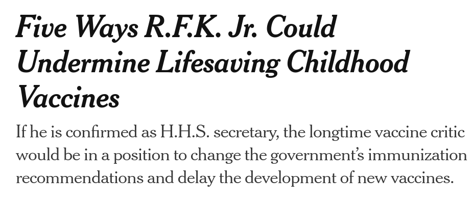
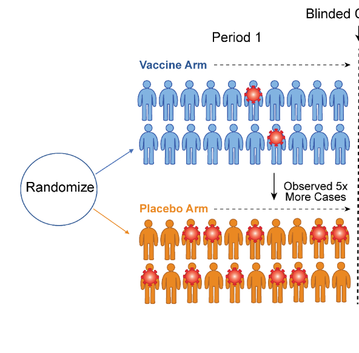
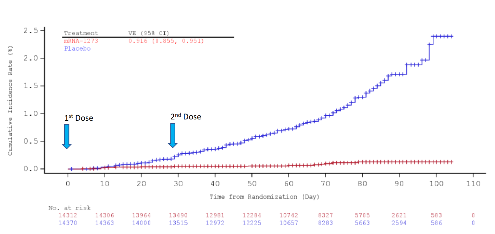

```{r setup, include=FALSE}
knitr::opts_chunk$set(echo = FALSE)
require(haven)
require(data.table)
require(ggplot2)
require(magrittr)
require(ggdag)
```

# Solutions to Confounding

## Outline

1. Confounding
2. Solutions to Confounding
  - Experiments
    - Assumptions
    - Limitations
  - Internal vs External Validity
    

# Confounding


## Confounding a Problem

- FPCI $\to$ we can't know whether some $X$ causes $Y$ to change for any individual case.

- Correlation as a solution is prone to a **bias**: confounding.

We can use correlation as evidence of **causality** and plausibly solve confounding, **if we make some assumptions**, and we can **defend those assumptions**.


# Example

---


## Vaccine Misinformation

Story above not false, but misleading:

- most widely shared story about COVID vaccine in 2021-2022
- $.0018\%$ of US vaccine recipients have died
- apprx. 8000 people die in the US die each day for other reasons.


## Vaccine Misinformation

Blatantly false or misleading information about COVID-19 and COVID vaccine circulated widely on social media [See here.](https://www.washingtonpost.com/technology/2020/12/18/faq-coronavirus-vaccine-misinformation/)

Even [public officials circulated misinformation.](https://www.ctvnews.ca/health/canadian-cardiologists-debunk-florida-covid-19-vaccine-claims-1.6312178)

Misleading information [can affect behavior](https://www.nber.org/system/files/working_papers/w27417/revisions/w27417.rev0.pdf), including reducing willingness to be vaccinated. 

## Vaccine Misinformation




## Vaccine Misinformation


Beyond changing policies, does giving a platform to vaccine skeptics make people less likely to be vaccinated?

## Vaccine Misinformation

What if we look at social media users:

- use social media usage history to see if they were exposed to vaccine misinformation on their feed
- survey them and ask whether they have they been vaccinated

>- Why might there be confounding here?


## Confounding a risk

```{r, echo = F, message=F, warning=F}
dagify(
       #flag ~ assign,
       #block ~  assign,
       fake ~ distrust,
       vaccine ~ fake + distrust,
       exposure = "fake", 
       outcome = 'vaccine',
       labels = c("fake" = "Consume\nMisinformation",
                  "distrust" = "Distrust\nExperts",
                  #"flag" = "Flag News\nas 'Fake'",
                  #'filter' = "Reveal\nCensoring",
                  "vaccine" = "Vaccination"
                  #"exp" = "Other\nStuff"
                  )
                  )  %>%
  tidy_dagitty(layout='auto') %>%
ggplot(aes(x = x, y = y, xend = xend, yend = yend)) +
  geom_dag_edges_link() +
  geom_dag_text(mapping = aes(label = label), colour = 'black') +
  theme_dag() +
  scale_adjusted()
```

## Confounding a risk

This is a common source of confounding:

- Cases **select themselves** into being exposed to a cause
- The cases that **select** the cause are already different than those that do not.

Sometimes confounding called "selection effects".

## A similar problem 

**Does knowing transgender people increase support for funding gender-affirming care?**

<br>

In the 2023 AMS election, UBC students were asked vote on whether to increase student fees by \$8 to cover gender-affirming care.

We imagined both potential outcomes in a prior lecture (and answered a survey about it!)

- If you had a friend on campus who was trans/non-binary, would you have voted "yes" or "no" on this measure?

- If you did not have a friend on campus who was trans/non-binary, would you have voted "yes" or "no" on this measure?

## A similar problem 

If we just examined the correlation between **having** trans/non-binary friends and support for increasing AMS fees for gender affirming care...

What could be a source of confounding?

## Confounding a risk

```{r, echo = F, message=F, warning=F}
dagify(
       #flag ~ assign,
       #block ~  assign,
       fake ~ distrust,
       vaccine ~ fake + distrust,
       exposure = "fake", 
       outcome = 'vaccine',
       labels = c("fake" = "Trans\nFriends",
                  "distrust" = "Drag Race fan",
                  #"flag" = "Flag News\nas 'Fake'",
                  #'filter' = "Reveal\nCensoring",
                  "vaccine" = "Support\nGender Care"
                  #"other" = "Other\nStuff"
                  )
                  )  %>%
  tidy_dagitty(layout='auto') %>%
ggplot(aes(x = x, y = y, xend = xend, yend = yend)) +
  geom_dag_edges_link() +
  geom_dag_text(mapping = aes(label = label), colour = 'black') +
  theme_dag() +
  scale_adjusted()
```

---

What if we could do this:

```{r, echo = F, message=F, warning=F}
dagify(
       #flag ~ assign,
       #block ~  assign,
       fake ~ other,
       vaccine ~ fake + distrust,
       exposure = "fake", 
       outcome = 'vaccine',
       labels = c("fake" = "Consume\nMisinformation",
                  "distrust" = "Distrust\nExperts",
                  #"flag" = "Flag News\nas 'Fake'",
                  #'filter' = "Reveal\nCensoring",
                  "vaccine" = "Vaccination",
                  "other" = "?"
                  )
                  )  %>%
  tidy_dagitty(layout='nicely') %>%
ggplot(aes(x = x, y = y, xend = xend, yend = yend)) +
  geom_dag_edges_link() +
  geom_dag_text(mapping = aes(label = label), colour = 'black') +
  theme_dag() +
  scale_adjusted()
```


## Vaccine Misinformation

What if Meta (the monopolist corporation formally known as Facebook) conducted a test of a new algorithm that classified vaccine misinformation in social media posts and shared links?

- for a **random** subset of users, this algorithm was used to **remove** misinformation from their Feed
- for a **random** subset of users, the algorithm was not used (so misinformation remained on their Feed)

>- This random assignment of the misinformation filtering **affects** misinformation
>- **Randomness** of misinformation means no other variables affect it

---

What if we could do this:

```{r, echo = F, message=F, warning=F}
dagify(
       #flag ~ assign,
       #block ~  assign,
       fake ~ other,
       vaccine ~ fake + distrust,
       exposure = "fake", 
       outcome = 'vaccine',
       labels = c("fake" = "Consume\nMisinformation",
                  "distrust" = "Distrust\nExperts",
                  #"flag" = "Flag News\nas 'Fake'",
                  #'filter' = "Reveal\nCensoring",
                  "vaccine" = "Vaccination",
                  "other" = "Random\nIntervention"
                  )
                  )  %>%
  tidy_dagitty(layout='nicely') %>%
ggplot(aes(x = x, y = y, xend = xend, yend = yend)) +
  geom_dag_edges_link() +
  geom_dag_text(mapping = aes(label = label), colour = 'black') +
  theme_dag() +
  scale_adjusted()
```

## Experiments

**FPCI:** We can **never** know the causal effect of $X$ on $Y$ for a specific case.

**Correlation** of $X$ and $Y$ for different cases may suffer from confounding

### **Experiments**  are one solution

Under certain assumptions, we can treat correlation as an **inference** (or **estimate** about) the **average** causal effect of $X$ on $Y$. 

- We can't know the causal effect for individual cases, but can make **unbiased** inferences about the **average effect** across all cases

## **Experiments**

Experiments give us **unbiased** (no confounding) **average** causal relationship between $X$ and $Y$, if two key **assumptions** are met:

1. **Random Assignment** to "Treatment" and "Control": all cases have **equal probability** of ending up in each "condition" (exposure to $X$)
2. **Exclusion Restriction**: (only one thing is changing: $X$)

<br>
<small>$^*$Technically, there are other assumptions, but not important for this class</small>

---

### **Randomization** solves Confounding

- Randomization ensures that cases in treatment and control have similar potential outcomes, on average
- Randomization balances cases with similar values of confounding variable $W$ in treatment and control 
- Randomization breaks the link $W \to X$


---

### **Randomization** solves Confounding

Cases in "treatment" and "control" are **the same** in terms of potential outcomes, on average:

  - average in control group is **observable** "counterfactual" for average in treatment group
  - average in treatment group is **observable** "counterfactual" for average in control group
  - EXACTLY the same as random sampling: [https://mdweaver.shinyapps.io/shiny_experiment/](https://mdweaver.shinyapps.io/shiny_experiment/)


---

### **Exclusion Restriction**  

assumption is that we aren't *adding* confounding in the design of the experiment

If in the Vaccine misinformation experiment, "Treatment" group

- had Vaccine misinformation blocked from their Meta platforms ($X$)
- the blocked posts were obscured with a warning that the content was misinformation ($W$)
- flagging content revealed that Meta is censoring ($V$)

Multiple differences between "treatment" and "control"

-  Does vaccination change because of (a) removal of misinformation or (b) the warning that content was flagged or (c) revealing that Meta censors?

## Exclusion Restriction

```{r, echo = F}
dagify(
       flag ~ assign,
       block ~  assign,
       filter ~ assign,
       vaccine ~ block + flag + filter + other,
       exposure = "assign", 
       outcome = 'vaccine',
       labels = c("assign" = "Random\nIntervention",
                  "block" = "Block\nFake News",
                  "flag" = "Flag News\nas 'Fake'",
                  'filter' = "Reveal\nCensoring",
                  "vaccine" = "Vaccination",
                  "other" = "Other\nStuff"
                  )
                  )  %>%
  tidy_dagitty(layout='auto') %>%
ggplot(aes(x = x, y = y, xend = xend, yend = yend)) +
  geom_dag_edges_link() +
  geom_dag_text(mapping = aes(label = label), colour = 'black') +
  theme_dag() +
  scale_adjusted()
```
  
  
## Gold Standard

Experiments are the **best** solution to confounding/FPCI

- If we can manipulate $X$ **at random**, we can find the unbiased **average** causal effect of $X$ on $Y$ (**no confounding**)
- If we manipulate $X$ **at random**, we also easily can calculate chance correlations (known risk of **random correlation**)


 **strong severity** says that evidence is convincing to extent assumptions are checked

- experiment assumptions are clear, easy to check

## Gold Standard?

But experiments have their limits:

- We can't always use them
- We make a trade-off by using experiments


# Experiments

## Example

### Recently dragged my children to receive booster of COVID vaccination

### But, we know about the fundamental problem of causal inference and about confounding...

>- How do we know that this vaccine actually **reduces** risk of infection?
>- How do we know that the vaccine **does not cause** adverse reactions?

## Vaccine Efficacy

BC CDC reports, e.g. hospitalization rates between those who are vaccinated vs. unvaccinated

- correlation between vaccination and COVID hospitalization

What could confound this correlation? (to the board)

## Vaccine Clinical Trials



## Vaccine Clinical Trials

Clinical trials are **experiments**. Correlation between treatment and health outcomes are **causal** (do not have confounding) **assuming** that...

- assignment to treatment is **random**
- the **only difference** between treatment and control is the actual content of the vaccine.

## Random Assignment

- Blocks confounding
- Balances potential outcomes

TO THE BOARD

## Exclusion Restriction

```{r, echo = F}
dagify(
       shot ~ assign,
       vaccine ~  assign,
       careworker ~ assign,
       covid ~ shot + vaccine + careworker + other,
       exposure = "vaccine", 
       outcome = 'covid',
       labels = c("assign" = "Random\nAssignment",
                  "vaccine" = "Receive\nVaccine",
                  "shot" = "Receive\nShot",
                  'careworker' = "Careworker\nBehavior",
                  "covid" = "Get COVID",
                  "other" = "Other\nStuff"
                  )
                  )  %>%
  tidy_dagitty(layout='auto') %>%
ggplot(aes(x = x, y = y, xend = xend, yend = yend)) +
  geom_dag_edges_link() +
  geom_dag_text(mapping = aes(label = label), colour = 'black') +
  theme_dag() +
  scale_adjusted()
```

## Exclusion Restriction

Why does it matter that clinical trials use placebos and are "double blind"?

Vaccine clinical trials...

- use placebos (control group receives a shot with no vaccine)
- "blind" treatment recipients to whether they receive vaccine or placebo
- "blind" care providers to whether they are injecting real vaccine or not


These **design** features of the experiment ensure that **only difference** between "assigned to treatment" and "assigned to control" is the vaccine.

## Vaccine Clinical Trials



## Vaccine Clinical Trials

We can know whether vaccination caused reduction in:

- COVID cases
- COVID hospitalization

or caused increase in:

- other health problems/adverse side effects

## Experiments

Might appear to be the only valid solution:

- if we don't know how cases would behave counterfactually (always the case)
- if we don't know what other causal factors affect X and Y (don't know the true causal graph)

Experiments, under easy-to-check assumptions, let us find an unbiased causal relationship between $X$ and $Y$ using correlation

- Experiments likely have "internal validity"

## Internal Validity

**Internal Validity**

A **research design** (choice of which cases to compare using correlation) has internal validity when the correlation of $X$ and $Y$ it finds is the true causal effect of $X$ on $Y$ / does not suffer from confounding. (unbiased FOR THOSE CASES)

- studies with strong internal validity imply that we have very good reason to believe that the correlation of $X$ and $Y$ we observe actually implies the causal effect of $X$ on $Y$.
- **because** we can easily believe/check the assumptions (e.g. randomization)

## Vaccines in the "real world"


**Does the efficacy of vaccines in clinical trials translate to real world use??**

>- How might people who enroll in clinical trials **be different**.
>- How might people **behave differently** in vaccine trials?


## Experiments: Limitations

**What can we manipulate?**

- economic growth? democracy? violence? hate speech?

**Who/what cases can we study?**

- who participates in psych labs? (UBC undergrads who want \$20?)
- is it ethical to experiment on people in developing countries?

>- Experiments have limited **external validity**

---

**External Validity**

is the degree to which the *causal relationship* we find *in a study* is relevant to the causal relationship in our causal question/claim

- Study has external validity if the relationship found is true for **the cases we are interested in**

    - is study has sampling bias (sample in study different from population of interest), may lack external validity
    - E.g. Transgender canvassing

- Study has external validity if the causal variable in the study **maps onto the concept/definition of the cause** in the causal claim.

    - E.g. Fox News media effects vs. Lab studies of media effects
    - example: hate speech

## Always a Trade-off:

More internal validity (unbiased estimate of causal effect) comes at the cost of external validity (relevance of study sample or cause to the theory)

- easier to experimentally manipulate **minor** causal forces for **small groups** of people/cases 
- hard/unethical to experimentally manipulate **important causal factors** in society **more broadly**


## Conclusion

- Experiments solve confounding:
  - assuming: Random Assignment
  - assuming: Exclusion Restriction
- Solutions to confounding:
  - require making assumptions
  - trade off between internal validity and external validity 
- Next week:
  - conditioning as a solution to confounding