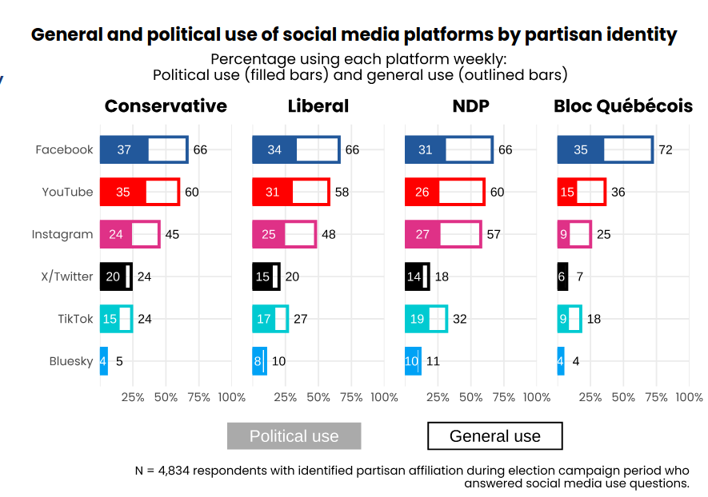
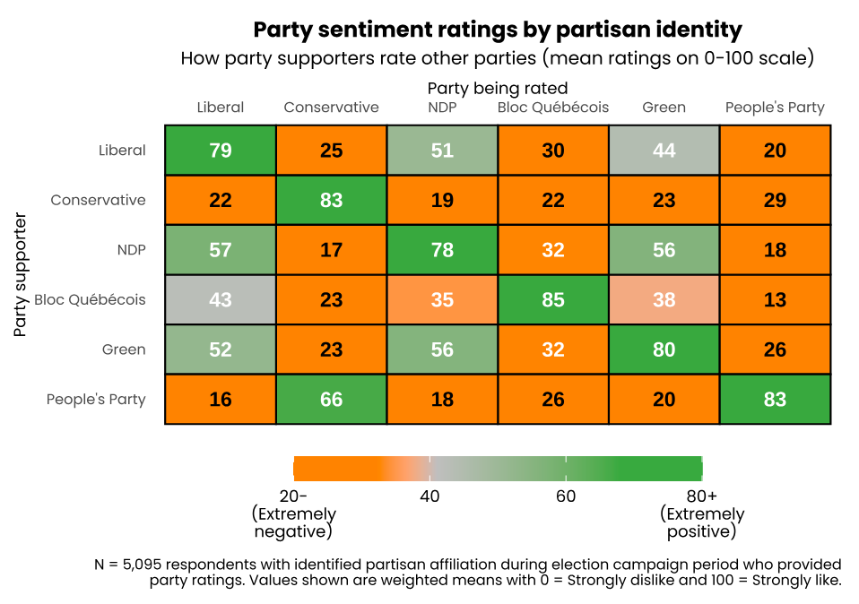
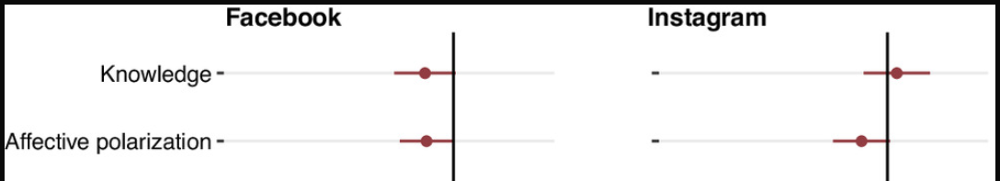
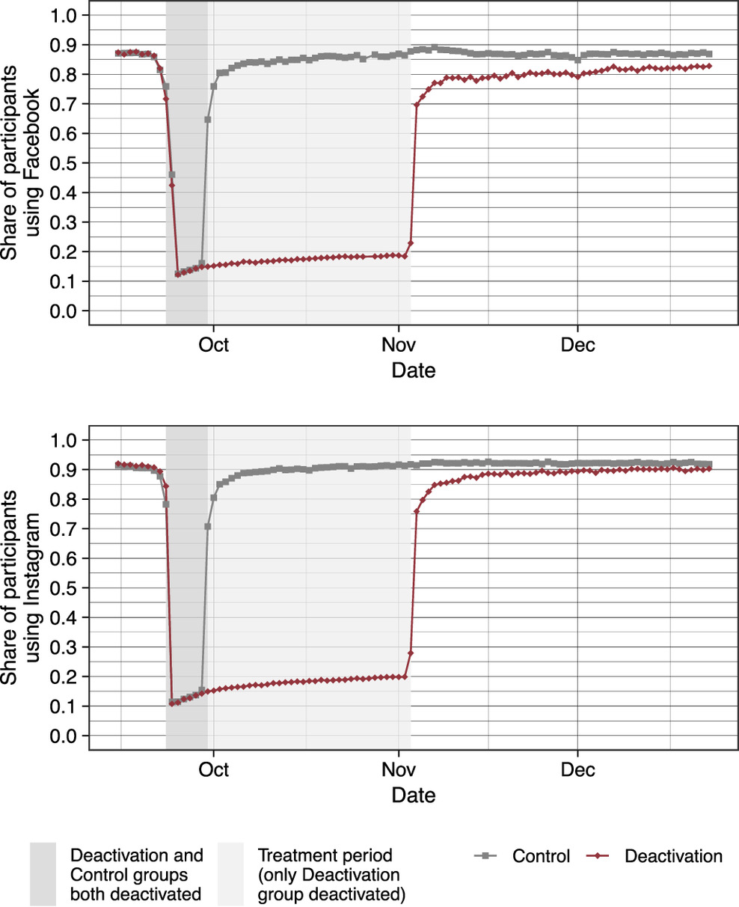
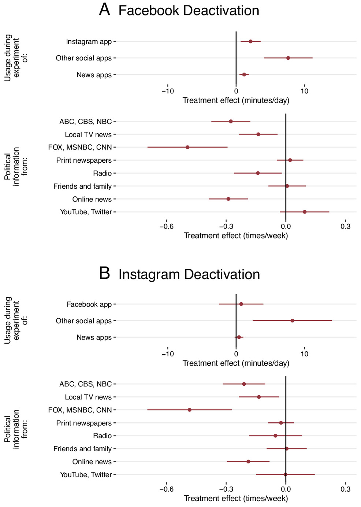
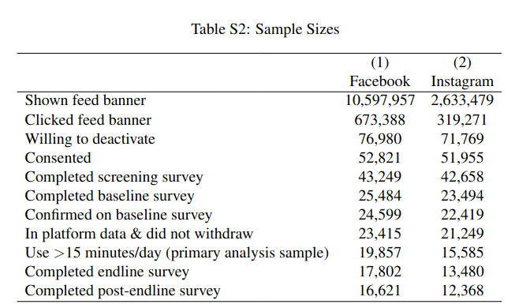
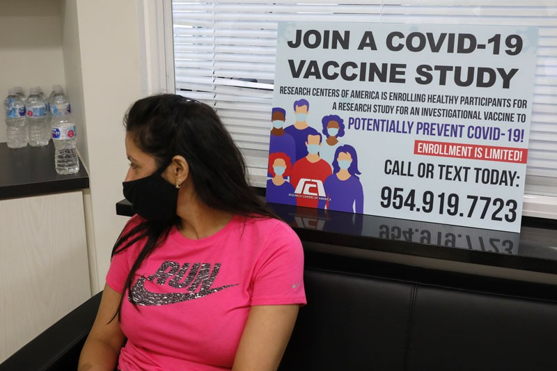

```{r setup, include=FALSE}
knitr::opts_chunk$set(echo = FALSE)
require(haven)
require(data.table)
require(ggplot2)
require(magrittr)
require(ggdag)
```

# Solutions to Confounding

## Outline

1. Example/Recap
2. Solutions to Confounding
  - Experiments
    - Assumptions
    - Limitations
  - Internal vs External Validity
    


# Example

---

<iframe width="560" height="315" src="https://www.youtube.com/embed/iTG5cGxwj60?si=S-SARyUwvXYok7ni" title="YouTube video player" frameborder="0" allow="accelerometer; autoplay; clipboard-write; encrypted-media; gyroscope; picture-in-picture; web-share" referrerpolicy="strict-origin-when-cross-origin" allowfullscreen></iframe>

---



---




---

Does social media use cause increased polarization?

```{r echo = F, message = F, warning = F}
anes = fread("./anes_2024.csv")
ggplot(anes, aes(x = as.factor(social_media), y = affective_polarization_pid)) +
geom_bar(stat = 'summary', fun.y = 'mean') + 
  xlab("Consumption of Social Media News: X") +
  ylab("Mean Partisan Affective Polarization: Y") +
  ggtitle("Social Media and Polarization") + 
  theme_bw() + 
  coord_cartesian(ylim=c(40,60))

```

We saw this correlation in the US...

---

### Social Media and Polarization

This correlation compares the levels of polarization for people using more and less social media.

What if we:

- use social media usage history to see if they were exposed to political content on their feed
- survey people and ask questions to measure affective polarization toward other political parties

>- Discuss: Why might there be confounding here? (Causes of $Y$, Causes of $X$)

---

Let's make a causal graph:

- which variables are confounders?
- direction of bias?

---

### Confounding a risk

```{r, echo = F, message=F, warning=F}
x_lab = "(X) Social\nMedia"
y_lab = "(Y) Polarization"
w1_lab = "Distrust\nNews"

dagify(
       #flag ~ assign,
       #block ~  assign,
       x ~ w1,
       y ~ x + w1,
       exposure = "x", 
       outcome = 'y',
       labels = c("x" = x_lab,
                  "w1" = w1_lab,
                  #"flag" = "Flag News\nas 'Fake'",
                  #'filter' = "Reveal\nCensoring",
                  "y" = y_lab
                  #"exp" = "Other\nStuff"
                  )
                  )  %>%
  tidy_dagitty(layout='auto') %>%
ggplot(aes(x = x, y = y, xend = xend, yend = yend)) +
  geom_dag_edges_link() +
  geom_dag_text(mapping = aes(label = label), colour = 'black') +
  theme_dag() +
  scale_adjusted()
```

---

### Confounding a risk

<br>

This is a common source of confounding:

- Cases **select themselves** into being exposed to a cause
- The cases that **select** the cause are already different than those that do not.


---

### A variation on this problem:

**"Exposure to social media increases political polarization."**

In the lead-up to the 2025 Canadian Election,  platforms owned by Meta (Facebook, Instagram, WhatsApp) blocked users access to content from Canadian news organizations while simultaneously ending fact-checking ([source](https://dfrlab.org/2025/04/29/how-social-media-shaped-the-2025-canadian-election/)). This "enabled hyper-partisan content to dominate in the absence of balanced media coverage."

"**causal variable**": exposure to social media during the election

**outcome variable**: political polarization $\to$ willingness to go on a date with someone who supports an opposing political party.

---

### We did an exercise 

**"Exposure to social media increases political polarization."**

### Think and write...


Imagine: If you used social media during the election, would you be willing to go on a date with someone who supported a rival political party?

Imagine: If you did not use social media during the election, would you go on a date with someone who supported a rival political party?

---

### A variation on this problem:

<br>


If we just examined the correlation between **using** social media and willingness to date across party lines...

What could be sources of confounding?

---


```{r, echo = F, message=F, warning=F}
x_lab = "(X) Social\nMedia"
y_lab = "(Y) Date\nOther Party"
w1_lab = "Strong\nOpinions"

dagify(
       #flag ~ assign,
       #block ~  assign,
       x ~ w1,
       y ~ x + w1,
       exposure = "x", 
       outcome = 'y',
       labels = c("x" = x_lab,
                  "w1" = w1_lab,
                  #"flag" = "Flag News\nas 'Fake'",
                  #'filter' = "Reveal\nCensoring",
                  "y" = y_lab
                  #"exp" = "Other\nStuff"
                  )
                  )  %>%
  tidy_dagitty(layout='auto') %>%
ggplot(aes(x = x, y = y, xend = xend, yend = yend)) +
  geom_dag_edges_link() +
  geom_dag_text(mapping = aes(label = label), colour = 'black') +
  theme_dag() +
  scale_adjusted()
```

# Solving Confounding


## Solutions to Confounding

Must ask...

- What **comparisons** between cases does it involve?
    - can you **recognize** this solution when it is described to you?
    - can you **describe** how to use this solution to test a particular causal claim?
- What **assumptions** are required for it to work?
- *How* does it "solve" confounding?
- What **trade offs** do we make?


---

What if we could do this?

```{r, echo = F, message=F, warning=F}
x_lab = "(X) Social\nMedia"
y_lab = "(Y) Polarization"
w1_lab = "Distrust\nNews"
z_lab = "????"

dagify(
       #flag ~ assign,
       #block ~  assign,
       x ~ z,
       y ~ x + w1,
       exposure = "x", 
       outcome = 'y',
       labels = c("x" = x_lab,
                  "w1" = w1_lab,
                  "y" = y_lab,
                  "z" = z_lab
                  )
                  )  %>%
  tidy_dagitty(layout='auto') %>%
ggplot(aes(x = x, y = y, xend = xend, yend = yend)) +
  geom_dag_edges_link() +
  geom_dag_text(mapping = aes(label = label), colour = 'black') +
  theme_dag() +
  scale_adjusted()
```

---

### Social Media and Polarization

What if Meta (the monopolist corporation formally known as Facebook) did the following:

- for a **random** subset of users, deactivate their accounts for one month prior to an election?
- for a different **random** subset of users, **did not** deactivate their accounts for one month prior to an election?

>- This **random assignment** of the account deactivation **affects** social media: $\text{random assigment} \to \text{social media use}$
>- **Randomness** of deactivation means no other variables affect it: $W \not\to \text{random assigment}$
>- Because Meta controls deactivation, and it is random no other variables affect social media use: $W \not\to \text{social media use}$

---

What if we could do this?

```{r, echo = F, message=F, warning=F}
x_lab = "(X) Social\nMedia"
y_lab = "(Y) Polarization"
w1_lab = "Distrust\nNews"
z_lab = "Random\nAssignment"

dagify(
       #flag ~ assign,
       #block ~  assign,
       x ~ z,
       y ~ x + w1,
       exposure = "x", 
       outcome = 'y',
       labels = c("x" = x_lab,
                  "w1" = w1_lab,
                  "y" = y_lab,
                  "z" = z_lab
                  )
                  )  %>%
  tidy_dagitty(layout='auto') %>%
ggplot(aes(x = x, y = y, xend = xend, yend = yend)) +
  geom_dag_edges_link() +
  geom_dag_text(mapping = aes(label = label), colour = 'black') +
  theme_dag() +
  scale_adjusted()
```


# Experiments

---

### Solution 1: **Experiments**

We can't know the causal effect for individual cases... but what would happen **on average** if we switched EVERYONE from "no social media" to "social media" exposure?


---

### Solution 1: **Experiments**

We would like to:

- Use the observed polarization ($Y$) for the **sample** of people using social media as an **inference** about the average polarization if EVERYONE used social media ($X = Yes$) (**population**)
- Use the observed  polarization ($Y$) for the **sample** of people NOT using social media as an **inference** about the average polarization if NO ONE used social media  ($X = No$) (**population**)

What permits us to use **sample** as **unbiased** **inference** about the **population**?

>- **random sampling**

---

### Solution 1: **Experiments**

What is an experiment?

**Experiment**:

- examine correlation between $X$ and $Y$ for cases where level of $X$ is **assigned at random**
- **compare** outcomes for cases with higher/lower values of $X$, *only* for cases where $X$ is assigned at random


---

### Solution 1: **Experiments**


Experiments give us **unbiased** (no confounding) correlation, if two key **assumptions** are met:

1. **Random Assignment** to "Treatment" ($X = yes$) and "Control" ($X = no$): all cases have **equal probability** of ending up in each "condition" (exposure to $X$)
- Must compare values of $Y$ across values of $X$ that are **randomly assigned**

$2$. **Exclusion Restriction**: only one thing is changing -- $X$

- Must carefully consider the experimental design

<br>
<small>$^*$Technically, there are other assumptions, but not important for this class</small>

---

### Solution 1: **Experiments**

How do experiments **solve** confounding? Three ways to think about it...

- Randomization ensures that cases in treatment and control have similar potential outcomes, on average
- Randomization balances cases with similar values of confounding variable $W$ in treatment and control 
- Randomization breaks the link $W \to X$

Removes **all** confounding: even from variables we have not thought of.

---

### **Randomization** solves Confounding

Cases in "treatment" and "control" are **the same** in terms of potential outcomes, on average:

  - average in control group is **observable** "counterfactual" for treatment group
  - average in treatment group is **observable** "counterfactual" for control group
  - EXACTLY the same logic as random sampling: [https://mdweaver.shinyapps.io/shiny_experiment/](https://mdweaver.shinyapps.io/shiny_experiment/)

---

### A Real Social Media Experiment:

[Allcott et al (2024)](https://www.pnas.org/doi/10.1073/pnas.2321584121) actually ran a social media deactivation experiment:

**Sample**: random sample of US adults active in previous month (Facebook or Instagram)

**Recruitment**: study invitation appeared on their feed. Asked if willing to deactivate for 1 week (for \$25) or 6 weeks (for \$150).

**Random Assignment**: of those willing to deactive (~20k FB, ~16K Insta), 27% given \$150 and deactivated for 6 weeks; 73% given \$25 and deactivated for 1 week.

**Outcome**: Surveyed on political polarization

---




Small reduction in affective polarization.

---

### A Real Social Media Experiment:

[Allcott et al (2024)](https://www.pnas.org/doi/10.1073/pnas.2321584121) actually ran a social media deactivation experiment:

**Sample**: random sample of US adults active in previous month (Facebook or Instagram)

**Recruitment**: study invitation appeared on their feed. Asked if willing to deactivate for 1 week (for \$25) or 6 weeks (for \$150).

**Random Assignment**: those willing to deactive: 27% given \$150 and deactivated for 6 weeks; 73% given \$25 and deactivated for 1 week.

**Outcome**: Surveyed on political polarization

>- Discuss: What questions/concerns do you have about this experiment that affect the credibility of this evidence?

---

### Assumption: **Random Assignment**?




---

### Assumption: **Random Assignment**?





---

### Assumption: **Exclusion Restriction** ? 

assumption is that we aren't *adding* confounding in the *design of the experiment*

But the "Treatment" group...

- Deactivated for longer ($X$)
- AND paid more money ($M$)

Multiple differences between "treatment" and "control"

-  Does polarization change because of (a) social media deactivation or (b) getting paid \$150?


---

### Exclusion Restriction

```{r, echo = F}
x_lab = "(X) Social\nMedia"
y_lab = "(Y) Polarization"
w1_lab = "Distrust\nNews"
z_lab = "Random\nAssignment"
m_lab = "(M) Cash"

dagify(
       #flag ~ assign,
       #block ~  assign,
       x ~ z ,
       m ~ z,
       y ~ x + m + w1,
       exposure = "x", 
       outcome = 'y',
       labels = c("x" = x_lab,
                  "w1" = w1_lab,
                  "y" = y_lab,
                  "z" = z_lab,
                  "m" = m_lab
                  )
                  )  %>%
  tidy_dagitty(layout='auto') %>%
ggplot(aes(x = x, y = y, xend = xend, yend = yend)) +
  geom_dag_edges_link() +
  geom_dag_text(mapping = aes(label = label), colour = 'black') +
  theme_dag() +
  scale_adjusted()
```


---

### Exclusion Restriction 


Vaccine clinical trials...

- use placebos (control group receives a shot with no vaccine)
- "blind" treatment recipients to whether they receive vaccine or placebo
- "blind" care providers to whether they are injecting real vaccine or not

Why does it matter that clinical trials use placebos and are "double blind"?


---

### Exclusion Restriction

Without placebo and double-blind...

```{r, echo = F}
dagify(
       shot ~ assign,
       vaccine ~  assign,
       careworker ~ assign,
       covid ~ shot + vaccine + careworker + other,
       exposure = "vaccine", 
       outcome = 'covid',
       labels = c("assign" = "Random\nAssignment",
                  "vaccine" = "Receive\nVaccine",
                  "shot" = "Receive\nShot",
                  'careworker' = "Careworker\nBehavior",
                  "covid" = "Get COVID",
                  "other" = "Other\nStuff"
                  )
                  )  %>%
  tidy_dagitty(layout='auto') %>%
ggplot(aes(x = x, y = y, xend = xend, yend = yend)) +
  geom_dag_edges_link() +
  geom_dag_text(mapping = aes(label = label), colour = 'black') +
  theme_dag() +
  scale_adjusted()
```


  
---

### Gold Standard

Experiments are the **best** solution to confounding/FPCI

- If we can manipulate $X$ **at random**, we can find the unbiased **average** causal effect of $X$ on $Y$ (**no confounding**)
- If we manipulate $X$ **at random**, we also easily can calculate chance correlations (known risk of **random correlation**)


**strong severity** says that evidence is convincing to extent assumptions are checked:

- **Random Assignment**: We can easily check... were people assigned at random? or did they have option to select themselves? did researchers compare randomly-assigned groups?
- **Exclusion Restriction**: we can check experimental design

---

### Gold Standard?

But experiments have their limits:

- We can't always use them


**All solutions to confounding** face a trade-off between **internal** and **external validity**

---

**Internal Validity**: is the extent to which the correlation of $X$ and $Y$ found in a research design is the true causal effect of $X$ on $Y$ / does not suffer from confounding. (unbiased FOR THOSE CASES)

- studies with strong internal validity imply that we have very good reason to believe that the correlation of $X$ and $Y$ we observe actually implies the causal effect of $X$ on $Y$ *for the cases we observe*.
- **because** we can easily believe/check the assumptions

---

**External Validity**: is the degree to which the *causal relationship* we find *in a study* is relevant to the causal relationship in our causal question/claim

- Study has external validity if it examines causal relationship for **the cases we are interested in**

    - if study has sampling bias (sample in study different from population of interest), may lack external validity

- Study has external validity if the causal variable in the study **maps onto the concept/definition of the cause** in the causal claim.
    
    - if the $X$ that is used in the study doesn't align with the causal claim, may lack external validity

---

### External Validity: Relevant Sample?



---

### External Validity: 



**Does the efficacy of vaccines in clinical trials translate to real world use??**

>- How might people who enroll in clinical trials **be different**. Relevant Sample?
>- How might people **behave differently** in vaccine trials? Relevant causal variable?

---

### Always a Trade-off:

More internal validity (unbiased estimate of causal effect) comes at the cost of external validity (relevance of study sample or cause to the theory)

- easier to experimentally manipulate **minor** causal factors for **small groups** of people/cases 
- hard/unethical to experimentally manipulate **important causal factors** in society **more broadly**

---

### Experiments: Limitations

**What can we manipulate?**

- economic growth? democracy? violence? hate speech?
- Can we experimentally examine the effects of political assassination on polarization?

**Who/what cases can we study?**

- who participates in psych labs? (UBC undergrads who want \$20?)
- is it ethical to experiment on people in developing countries?

>- Experiments have limited **external validity**


# Conclusion 

---


| Solution | How Confounding<br>Solved | Which Confounding<br>Removed | Assumes | Internal<br>Validity | External<br>Validity |
|--------------------|------------------------------|------------------------------------------------|---------|----------------------|----------------------|
| Experiment | Randomization<br>Breaks $W \rightarrow X$ link | **All** confounding variables | $X$ is random;<br> Change only $X$ | High | Low | 


## Conclusion

- Solutions to confounding:
  - [Key questions to ask](#18)
  - Trade off between internal validity and external validity 

- Experiments
  - Solve confounding
  - assuming: Random Assignment
  - assuming: Exclusion Restriction
  - High internal validity; low external validity
