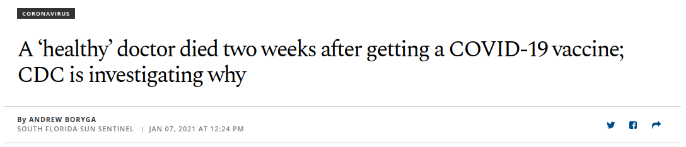

```{r setup, include=FALSE}
knitr::opts_chunk$set(echo = FALSE)
require(haven)
require(data.table)
require(ggplot2)
require(magrittr)
require(ggdag)
```

# Confounding

## Outline

1. Confounding
    - sources of bias
    - direction of bias
2. Solutions to Confounding
    

## Example:

Recent mass shooting in Boulder, CO has renewed calls in the United States to impose gun control legislation. 


### **Does reducing the number of guns reduce firearms deaths?**

## Correlation: Guns and Gun Deaths

```{r, echo = F, message=F}
crime = fread('./crime.csv')
crime[, gun_ownership := as.numeric(gsub('%', '', gun_ownership))]
crime = crime[gun_murder_percapita<10,]
c = cor.test(crime$gun_ownership, crime$gun_murder_percapita)

ggplot(crime, aes(x = gun_ownership, y = gun_murder_percapita , label = State)) +
  geom_text() +
  xlab("Gun Owners (%)") +  ylab("Firearms Homicides Per Capita") + 
  ggtitle('No/Negative effect of gun ownership\n on Gun Homicide?') + 
  geom_smooth(method = 'lm', se = F) + 
  theme_bw()
```

POLL

## Confounding?

```{r, echo = F, message = F}
dagify(guns ~ hunting,
       popden ~ rural,
       crime ~ popden,
       hunting ~ rural,
       crime ~ guns, 
       exposure = "guns", 
       outcome = 'crime',
       labels = c('guns' = "(X) Gun\nOwnership", 
                  'rural' = 'Rural\nPopulation',
                  'crime' = "(Y) Murder\nRate",
                  'hunting' = 'Hunting',
                  'popden' = 'Population\nDensity')) %>%
  tidy_dagitty(layout='tree') %>%
ggplot(aes(x = x, y = y, xend = xend, yend = yend)) +
  #geom_dag_node() +
  geom_dag_edges_link() +
  geom_dag_text(mapping = aes(label = label), colour = 'black') +
  theme_dag() +
  scale_adjusted()
#mapping = aes(label = c('downward bias', 'increases', 'increases', 'increases', 'decreases', '')),  angle_calc = "along", label_dodge = unit(c(1,-1,1,-1,1),'lines')
```

## Confounding:

Confounding occurs when these other differences between cases (third variables, e.g. $W$) **causally affect $X$ and $Y$**. 

In a causal graph, there is **confounding** of correlation of $X$ and $Y$ if...

1. some variable $W$ has causal paths toward $X$ and $Y$
2. (equivalently) there is **backdoor** path or **non-causal** path from $X$ to $Y$

## Confounding:

|  | Third Variable? | Key Attribute | Confounding? |
|--------------------------|-----------------|---|----------------------------|
| Antecedent Variables <br> ($W$) | Yes | $W \to X$ | If only **causal path** from $W$ to $Y$ contains $X$: No <br> If a **causal path** from $W$ to $Y$ excludes $X$: Yes |
| Intervening Variables<br>($M$) | Yes | $X \to M \to Y$ | No |
| Reverse Causality | No  | $Y \to X$ | Yes |

## Upward or Downward bias?

```{r, echo = F, message = F}
dagify(guns ~ hunting,
       popden ~ rural,
       crime ~ popden,
       hunting ~ rural,
       crime ~~ guns, 
       exposure = "guns", 
       outcome = 'crime',
       labels = c('guns' = "(X) Gun\nOwnership", 
                  'rural' = 'Rural\nPopulation',
                  'crime' = "(Y) Murder\nRate",
                  'hunting' = 'Hunting',
                  'popden' = 'Population\nDensity')) %>%
  tidy_dagitty(layout='tree') %>%
ggplot(aes(x = x, y = y, xend = xend, yend = yend)) +
  #geom_dag_node() +
  geom_dag_edges_link(mapping = aes(label = c('bias direction?', 'increases', 'increases', 'increases', 'decreases', '')),  angle_calc = "along", label_dodge = unit(c(1,-1,1,-1,1),'lines')) +
  geom_dag_text(mapping = aes(label = label), colour = 'black') +
  theme_dag() +
  scale_adjusted()
```

## Confounding: Direction of Bias

Product of **signs** on causal path from $W \to X$ and $W \to Y$ gives us <u>**direction**</u> of **bias** created by **confounding**

|  | $W \xrightarrow{+} X$ | $W \xrightarrow{-} X$ |
|-----------------------|-------------------------------------|--------------------------------|
| $W \xrightarrow{+} Y$ | $Correlation(X,Y)$<br>Biased (+) | $Correlation(X,Y)$<br>Biased (-) |
| $W \xrightarrow{-} Y$ | $Correlation(X,Y)$<br>Biased (-) | $Correlation(X,Y)$<br>Biased (+) |


## Downward bias

```{r, echo = F, message = F}
dagify(guns ~ hunting,
       popden ~ rural,
       crime ~ popden,
       hunting ~ rural,
       crime ~ guns, 
       exposure = "guns", 
       outcome = 'crime',
       labels = c('guns' = "(X) Gun\nOwnership", 
                  'rural' = 'Rural\nPopulation',
                  'crime' = "(Y) Murder\nRate",
                  'hunting' = 'Hunting',
                  'popden' = 'Population\nDensity')) %>%
  tidy_dagitty(layout='tree') %>%
ggplot(aes(x = x, y = y, xend = xend, yend = yend)) +
  #geom_dag_node() +
  geom_dag_edges_link(mapping = aes(label = c('downward bias', 'increases', 'increases', 'increases', 'decreases', '')),  angle_calc = "along", label_dodge = unit(c(1,-1,1,-1,1),'lines')) +
  geom_dag_text(mapping = aes(label = label), colour = 'black') +
  theme_dag() +
  scale_adjusted()
```

## Confounding: Direction of Bias

```{r, echo = F}
dagify(x ~ w,
       y ~ w,
       y ~~ x,
       exposure = "x", 
       outcome = 'y'
       ) %>%
tidy_dagitty(layout='tree') %>%
ggplot(aes(x = x, y = y, xend = xend, yend = yend)) +
  geom_dag_node() +
  geom_dag_edges_link(mapping = aes(label = c('Decreases', 'Increases', 'Bias \n(?)', '')), 
                      angle_calc = "along", 
                      label_dodge = unit(c(-1,1,-1),'lines'), 
                      edge_linetype = rep(c(1,1,3), each = 100),
                      arrow = grid::arrow(length=grid::unit(c(10,10,0), 'pt'), type = 'closed')) +
  geom_dag_text(colour = 'white') +
  theme_dag() +
  scale_adjusted()
```

## Confounding: Direction of Bias

```{r, echo = F}
dagify(x ~ w,
       y ~ w,
       y ~~ x,
       exposure = "x", 
       outcome = 'y'
       ) %>%
tidy_dagitty(layout='tree') %>%
ggplot(aes(x = x, y = y, xend = xend, yend = yend)) +
  geom_dag_node() +
  geom_dag_edges_link(mapping = aes(label = c('Decreases', 'Increases', 'Bias \n(Downward)', '')), 
                      angle_calc = "along", 
                      label_dodge = unit(c(-1,1,-1),'lines'), 
                      edge_linetype = rep(c(1,1,3), each = 100),
                      arrow = grid::arrow(length=grid::unit(c(10,10,0), 'pt'), type = 'closed')) +
  geom_dag_text(colour = 'white') +
  theme_dag() +
  scale_adjusted()
```

## Confounding: Direction of Bias

```{r, echo = F}
dagify(x ~ w,
       y ~ w,
       y ~~ x,
       exposure = "x", 
       outcome = 'y'
       ) %>%
tidy_dagitty(layout='tree') %>%
ggplot(aes(x = x, y = y, xend = xend, yend = yend)) +
  geom_dag_node() +
  geom_dag_edges_link(mapping = aes(label = c('Decreases', 'Decreases', 'Bias \n(?)', '')), 
                      angle_calc = "along", 
                      label_dodge = unit(c(-1,1,-1),'lines'), 
                      edge_linetype = rep(c(1,1,3), each = 100),
                      arrow = grid::arrow(length=grid::unit(c(10,10,0), 'pt'), type = 'closed')) +
  geom_dag_text(colour = 'white') +
  theme_dag() +
  scale_adjusted()
```


## Confounding: Direction of Bias

```{r, echo = F}
dagify(x ~ w,
       y ~ w,
       y ~~ x,
       exposure = "x", 
       outcome = 'y'
       ) %>%
tidy_dagitty(layout='tree') %>%
ggplot(aes(x = x, y = y, xend = xend, yend = yend)) +
  geom_dag_node() +
  geom_dag_edges_link(mapping = aes(label = c('Decreases', 'Decreases', 'Bias \n(Upward)', '')), 
                      angle_calc = "along", 
                      label_dodge = unit(c(-1,1,-1),'lines'), 
                      edge_linetype = rep(c(1,1,3), each = 100),
                      arrow = grid::arrow(length=grid::unit(c(10,10,0), 'pt'), type = 'closed')) +
  geom_dag_text(colour = 'white') +
  theme_dag() +
  scale_adjusted()
```

## Confounding: Direction of Bias

```{r, echo = F}
dagify(x ~ w,
       y ~ w,
       y ~~ x,
       exposure = "x", 
       outcome = 'y'
       ) %>%
tidy_dagitty(layout='tree') %>%
ggplot(aes(x = x, y = y, xend = xend, yend = yend)) +
  geom_dag_node() +
  geom_dag_edges_link(mapping = aes(label = c('Increases', 'Increases', 'Bias \n(?)', '')), 
                      angle_calc = "along", 
                      label_dodge = unit(c(-1,1,-1),'lines'), 
                      edge_linetype = rep(c(1,1,3), each = 100),
                      arrow = grid::arrow(length=grid::unit(c(10,10,0), 'pt'), type = 'closed')) +
  geom_dag_text(colour = 'white') +
  theme_dag() +
  scale_adjusted()
```

## Confounding: Direction of Bias

```{r, echo = F}
dagify(x ~ w,
       y ~ w,
       y ~~ x,
       exposure = "x", 
       outcome = 'y'
       ) %>%
tidy_dagitty(layout='tree') %>%
ggplot(aes(x = x, y = y, xend = xend, yend = yend)) +
  geom_dag_node() +
  geom_dag_edges_link(mapping = aes(label = c('Increases', 'Increases', 'Bias \n(Upward)', '')), 
                      angle_calc = "along", 
                      label_dodge = unit(c(-1,1,-1),'lines'), 
                      edge_linetype = rep(c(1,1,3), each = 100),
                      arrow = grid::arrow(length=grid::unit(c(10,10,0), 'pt'), type = 'closed')) +
  geom_dag_text(colour = 'white') +
  theme_dag() +
  scale_adjusted()
```

## Confounding: Direction of Bias

```{r, echo = F, message = F}
dagify(guns ~ hunting,
       popden ~ rural,
       crime ~ popden,
       hunting ~ rural,
       crime ~ guns, 
       exposure = "guns", 
       outcome = 'crime',
       labels = c('guns' = "(X) Gun\nOwnership", 
                  'rural' = 'Illicit\nDrug Trade',
                  'crime' = "(Y) Murder\nRate",
                  'hunting' = 'Property\nCrime',
                  'popden' = 'Effective\nPolice')) %>%
  tidy_dagitty(layout='tree') %>%
ggplot(aes(x = x, y = y, xend = xend, yend = yend)) +
  #geom_dag_node() +
  geom_dag_edges_link(mapping = aes(label = c('? bias', 'increases', 'decreases', 'increases', 'decreases', '')),  angle_calc = "along", label_dodge = unit(c(1,-1,1,-1,1),'lines')) +
  geom_dag_text(mapping = aes(label = label), colour = 'black') +
  theme_dag() +
  scale_adjusted()
```

## Confounding: Direction of Bias

```{r, echo = F, message = F}
dagify(guns ~ hunting,
       popden ~ rural,
       crime ~ popden,
       hunting ~ rural,
       crime ~ guns, 
       exposure = "guns", 
       outcome = 'crime',
       labels = c('guns' = "(X) Gun\nOwnership", 
                  'rural' = 'Illicit\nDrug Trade',
                  'crime' = "(Y) Murder\nRate",
                  'hunting' = 'Property\nCrime',
                  'popden' = 'Effective\nPolice')) %>%
  tidy_dagitty(layout='tree') %>%
ggplot(aes(x = x, y = y, xend = xend, yend = yend)) +
  #geom_dag_node() +
  geom_dag_edges_link(mapping = aes(label = c('upward bias', 'increases', 'decreases', 'increases', 'decreases', '')),  angle_calc = "along", label_dodge = unit(c(1,-1,1,-1,1),'lines')) +
  geom_dag_text(mapping = aes(label = label), colour = 'black') +
  theme_dag() +
  scale_adjusted()
```

# Fixing Confounding

---





POLL

## Pandemic Misinformation

Story above not false, but misleading:

- most widely shared story about the vaccine this year
- $.0018\%$ of US vaccine recipients have died
- apprx. 8000 people die in the US die each day for other reasons.


## Pandemic Misinformation

Blatantly false or misleading information about COVID-19 and COVID vaccine circulate widely on social media [https://www.washingtonpost.com/technology/2020/12/18/faq-coronavirus-vaccine-misinformation/](See here.)

Misleading information [can affect behavior](https://www.nber.org/system/files/working_papers/w27417/revisions/w27417.rev0.pdf), including reducing willingness to be vaccinated. 

## Pandemic Misinformation

What can be done to limit the negative effects of pandemic misinformation?

- Does **thinking about the accuracy of information** make people less likely to share misinformation?

## Pandemic Misinformation

What if we survey Facebook users:

- look at previous Facebook history to see if they shared vaccine misinformation
- ask them if they assess the accuracy of information before sharing links

Does a negative correlation imply causation?

>- What could we do to avoid confounding?

## Pandemic Misinformation

[Pennycook, et al (2020)](https://journals.sagepub.com/doi/full/10.1177/0956797620939054) run this experiment:

- Show people pandemic-related stories that have been independently evaluated as false or true
- "If you were to see the above on social media, how likely would you be to share it?"
- Randomly assign some to assess the accuracy of non-pandemic news before they look at pandemic news.

>- People "nudged" to think about accuracy 3.9 ppt more likely to share **true rather than false** stories

## Experiments

**FPCI:** We cannot know the causal effect of $X$ on $Y$ for a specific case.

**Correlation** of $X$ and $Y$ for different cases may suffer from confounding

### **Experiments**  are a solution

Allow us to treat correlation as an **estimate** (an **inference** about) the **average** causal effect of $X$ on $Y$. 

- We can't know the causal effect for individual cases, but can get the average causal effect across all cases

## **Experiments**

Experiments give us **unbiased** (no confounding) relationship between $X$ and $Y$, with **assumptions**:

1. **Random Assignment** to "Treatment" and "Control"
2. **Exclusion Restriction** (only one thing is changing: $X$)

<br>
<small>Technically, there are more assumptions, but not important for this class</small>

## Experiments

### Randomization solves Confounding

- Randomization balances cases with same potential outcomes in treatment and control
- Randomization balances cases with similar values of confounding variable $W$ in treatment and control (breaks the link $W \to X$)

Cases are **about the same** on average:
  - cases in control are **observable** "counterfactuals" for cases in treatment
  - EXACTLY like with random sampling (to the board)
  
## Experiments

### **Exclusion Restriction** means we don't *add* confounding

If in the COVID misinformation experiment, "Treatment" group ...

- Asked to assess the accuracy of information ($X$)
- Told that their social media shares were tracked by the government ($Z$)

Two things are different between treatment and control group; 

- we don't know which one does the work
  
  
## Experiments

Experiments are a solution to confounding/FPCI

>- We can't always use them
>- We make trade-offs by using experiments
>- What other options are there?

  