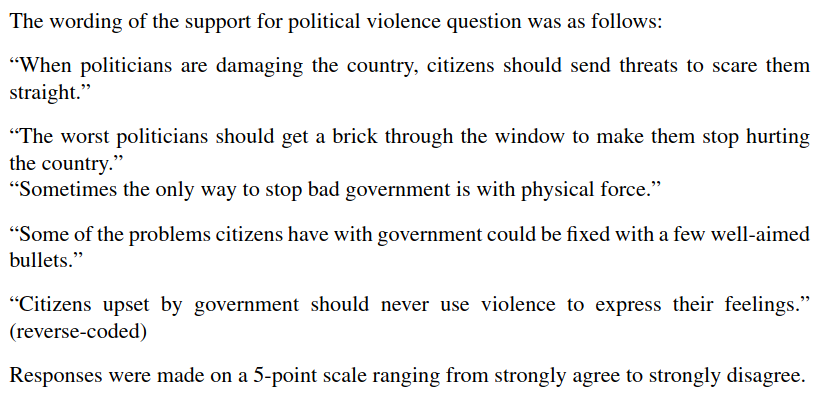

```{r setup, include=FALSE}
knitr::opts_chunk$set(echo = FALSE)
require(haven)
require(data.table)
require(ggplot2)
require(magrittr)
require(ggdag)
require(dplyr)
require(SnowData)
require(sf)

pumps_sf = pump_locations%>% st_as_sf(., coords = c("Easting", "Northing"), crs = "EPSG:27700") 
pumps_sf$name = ifelse(pumps_sf$id %in% 9 , "Broad Street\nPump", NA)
cholera_sf = cholera_cases %>% st_as_sf(., coords = c("Easting", "Northing"), crs = "EPSG:27700") 

street_sf = streets %>% as.data.table %>%
  melt(id_vars = "id", measure.vars = patterns(p = "_point$", lon = "_coord_east$", lat = "_coord_north$")) %>%
  setkey(., id, variable) %>%
  .[, c('lon', 'lat') := lapply(.SD, as.numeric), .SDcols = c('lon', 'lat')] %>%
  st_as_sf(., coords = c("lon", "lat"), crs = "EPSG:27700") %>%
  group_by(id) %>%
  summarize(do_union = F) %>%
  st_cast("LINESTRING")

cholera_sf$street_id = st_nearest_feature(cholera_sf, street_sf)

test = cholera_sf %>% as_tibble %>% group_by(street_id) %>% summarize(Count = sum(Count))  

use_snow = left_join(street_sf, test, by = join_by("id" == "street_id")) %>% 
  mutate(Count = ifelse(is.na(Count), 0, Count))
use_snow$pump_distance = st_distance(use_snow$geometry, pumps_sf$geometry[9])

```

# Correlation to Causation

## Solutions to Confounding

1. Recap
    - Solutions to confounding
    - Solutions involve trade-offs (internal vs external validity)
    - Experiments
2. Interlude: Cholera
3. Conditioning:
    - what is it?
    - how does it work?
    


# Example


---

<iframe width="560" height="315" src="https://www.youtube.com/embed/QjYqhvo1vqs?si=Xt6MawX0Ca9EidrN&amp;start=21" title="YouTube video player" frameborder="0" allow="accelerometer; autoplay; clipboard-write; encrypted-media; gyroscope; picture-in-picture; web-share" referrerpolicy="strict-origin-when-cross-origin" allowfullscreen></iframe>

---

<iframe width="640" height="360" src="https://abcnews.go.com/video/embed?id=71356414" allowfullscreen frameborder="0"></iframe>


## Incendiary Speech and Violence

Did Trump rallies cause an increase in hate crime?

> "A USA TODAY analysis of the 64 rallies Trump ... held [between] 2017 [and 2019] found that, when discussing immigration, the president has said 'invasion' at least 19 times. He has used the word 'animal' 34 times and the word 'killer' nearly three dozen times."

---

Rallies caused hate crimes?

```{r echo = F, message = F, warning = F}
data = fread('./trump_rally_data.csv') %>% 
        .[, list(trump_count = sum(trumprallycount), hate_crimes = sum(incidentcount), l_pop = log_pop[1], pop = censuspop10[1]), by = fips]
data[trump_count > 3, trump_count := 3]
#data_g = data[, list(hate_crimes = mean(hate_crimes)), by = trump_count]
data[, hc_p_c := (hate_crimes / pop)*100000]
data[, any_trump := ifelse(trump_count >0, 1, 0)]
#g_data = data[, list(hate_crimes = mean(hate_crimes)), by = any_trump]
ggplot(data, aes(x = as.factor(any_trump), y = hc_p_c)) + 
  geom_bar(stat = 'summary', fun.y = 'mean') + 
  xlab("Trump Rallies (Any): X") +
  ylab("Mean Hate Crimes (Per 100k): Y") +
  ggtitle("Trump Rallies and Hate Crimes by County (2016)") + 
  theme_bw()
```

data from [Feinberg, Branton, and Martinez-Ebers ](https://lmas.unt.edu/sites/lmas.unt.edu/files/lmas/Hate%20Incidents%20Spike_0.pdf)


## Solutions to Confounding

Must ask...

- What **comparisons** between cases does it involve?
    - can you **recognize** this solution when it is described to you?
    - can you **describe** how to use this solution to test a particular causal claim?
- What **assumptions** are required for it to work?
- *How* does it "solve" confounding?
- What **trade offs** do we make?

---

**Internal Validity**: is the extent to which the correlation of $X$ and $Y$ found in a research design is the true causal effect of $X$ on $Y$ (*does not suffer from confounding*). 

- studies with strong internal validity: we have very good reason to believe that the correlation of $X$ and $Y$ actually implies the causal effect of $X$ on $Y$ *for the cases we observe*.
- **because** we can easily believe/check the assumptions

---

**External Validity**: is the extent to which the *causal relationship* we find *in a study* is relevant to the causal relationship in our causal question/claim

- Study has external validity if it examines causal relationship for **the cases we are interested in**

    - if study has sampling bias (sample in study different from population of interest), may lack external validity

- Study has external validity if the causal variable in the study **maps onto the concept/definition of the cause** in the causal claim.
    
    - if the $X$ that is used in the study doesn't align with the causal claim, may lack external validity


## Always a Trade-off

But the choice of "solution" to confounding — or our **research design** — always involves a trade off:

Increasing confidence that correlation yields an **unbiased** estimate of the causal effect of $X$ on $Y$ (**internal validity**)...

...comes at the cost of limiting the cases we can examine and causal variables we can examine (**external validity**)


## Incendiary Speech and Violence

One way to solve confounding is to do an **experiment**: 

[Kalmoe (2014)](https://doi.org/10.1080/10584609.2013.852642) examines the effect of "aggressive" and "violent" language on **support** for political violence. 

- 512 survey respondents in random sample of US adults were **randomly assigned** to see two versions of campaign ad
- one used more aggressive words like "fight", the other less aggressive words.
- people report their support for violence on survey questions

---

**Treatment vs Control**


Why do both groups receive campaign ad text?

>- Exclusion restriction: only changing "aggressive language" ($X$)

---

**Outcomes**




## Incendiary Speech and Violence


[Kalmoe (2014)](https://doi.org/10.1080/10584609.2013.852642) finds that "aggressive" and "violent" language **increased** support for political violence.

- survey respondents were **randomly assigned** to see two versions of campaign ad
- one used more aggressive words like "fight", the other less aggressive words.
- people report their support for violence

>- do you believe the 'violent' ads **caused** people to support violence?
>- can this tell us about possible effects of Trump's speeches on violence?

(HANDS)

---

| Solution | How Confounding<br>Solved | Which Confounding<br>Removed | Assumes | Internal<br>Validity | External<br>Validity |
|--------------------|------------------------------|------------------------------------------------|---------|----------------------|----------------------|
| Experiment | Randomization<br>Breaks $W \rightarrow X$ link | **All** confounding variables | $X$ is random;<br> Change only $X$ | High | Low | 

[board to illustrate HOW]

# Interlude

Before we return to speech and hate crimes

## Imagine...

You live in mid-19th century London. 

- Every few years, hundreds to thousands of people are killed in cholera outbreaks
- To stop these deaths, you need to answer:

> What causes the spread of **cholera**?


## Cholera

Dominant view was that "miasmas" or "bad air" caused diseases like cholera

<div style="overflow:hidden"  height="100px">
<iframe style="border-radius:12px" src="https://open.spotify.com/embed/track/7Dbg5O9nNWu6SWxDjJ9qoq?utm_source=generator" width="100%" height="100%" frameBorder="0" allowfullscreen="" allow="autoplay; clipboard-write; encrypted-media" loading="lazy"></iframe>
</div>


## Broad Street Pump Outbreak (1854)

John Snow, MD suggested cholera transmitted as "germ" in water.

To provide evidence of his claim, Snow uses **correlation**: mapped cholera deaths of 1854 outbreak in SoHo.

- Broad Street Pump (source of drinking water) had "fouled" water (X)
- Examined mortality from cholera (Y)
- Proximity to the Broad Street Pump (C) correlated with mortality (Y)
- Proximity to **other** pumps not related to mortality

---

```{r, echo = F, warning=F, message=F, out.width="100%"}
ggplot() +
  geom_sf(data = street_sf, alpha = 0.2) +
  geom_sf(data = cholera_sf, aes(size = Count), color="black",  alpha = 0.8) +
  scale_size_area() +
  geom_sf(data = pumps_sf, color = "red", size = 3, pch = 8) +
  geom_sf_label(data = pumps_sf, aes(label = name), alpha = 0.5, fill = 'white') +
  theme_void() +
  theme(legend.position = "none") +
  ggtitle("Public Water Pumps and Cholera Deaths: London 1854")
```

>- Positive correlation


## Broad Street Pump Outbreak (1854) {.centered}

```{r, echo = F, warning=F, message=F}
ggplot(use_snow, aes(x = pump_distance %>% as.numeric, y = Count)) +
  geom_point() +
  theme_bw() +
  xlab("Distance to Broad St. Pump (m)") + 
  ylab("Number of Deaths") + 
  ggtitle("Street Distance to Broad St. Pump and Cholera Deaths: London 1854")
```

>- positive correlation (closer to pump $\to$ more cholera)

## Broad Street Pump Outbreak (1854)

Leading doctors rejected Snow's evidence:

- Houses near Broad Street Pump built on 1665 plague burial site. 
- Sewers produce foul odors from rotting material/human waste

Both might produce miasmas.

- maybe Plague cemetery/Sewer $\to$ Miasmas $\to$ Foul Water
- and  Miasmas $\to$ Cholera

<br>

>- So... Confounding.

---

<iframe width="560" height="315" src="https://www.youtube.com/embed/d44LyYL3GkY?si=Q7DCnSttwy0J7Ce0" title="YouTube video player" frameborder="0" allow="accelerometer; autoplay; clipboard-write; encrypted-media; gyroscope; picture-in-picture; web-share" referrerpolicy="strict-origin-when-cross-origin" allowfullscreen></iframe>

## No, *this* John Snow {.centered}


## Confounding

```{r, echo = F, message=F, warning=F}
dagify(cholera ~ water,
       water ~ miasma,
       miasma ~ plague + sewer,
       cholera ~ miasma,
       water ~ v_b,
       exposure = "water", 
       outcome = 'cholera',
       labels = c('water' = "(X)\nBad Water", 
                  'cholera' = "(Y)\nCholera",
                  'miasma' = 'Miasma',
                  "v_b" = "Vibrio\ncholerae",
                  'plague' = 'Plague\nCemetary',
                  'sewer' = "Sewers")) %>%
  tidy_dagitty(layout='circle') %>%
ggplot(aes(x = x, y = y, xend = xend, yend = yend)) +
  #geom_dag_node() +
  geom_dag_edges_link() +
  geom_dag_text(mapping = aes(label = label), colour = 'black') +
  theme_dag() +
  scale_adjusted()
```

## Broad Street Pump Outbreak (1854)

Snow's solution to confounding: compare people "near pump" w/ different water sources

|  | **Brewers** | **Broad St. Residents** |
|-------|------------|------------|
| **Water Source (X)** | **Brewery Well**/<br>**Beer** (Clean) | **Pump** (Contam.)|
| **Location** | Near pump | Near pump |
| **Timing** |  Aug. 1854 |  Aug. 1854 |
| **Miasmas (W)** | Yes | Yes |
| **Cholera (Y)** | **No** | **Yes** |

## Broad Street Pump Outbreak (1854)

Snow's solution to confounding: compare people "far from pump" w/ different water sources

|  | **Lady and Niece** | **West End Residents** |
|-------|------------|------------|
| **Water Source (X)** | **Broad Street Pump**<br>(Contam.) | **Another Pump**<br>(Clean) |
| **Location** | Mile from Broad St. | Mile from Broad St. |
| **Timing** |  Aug. 1854 |  Aug. 1854 |
| **Miasmas (W)** | No | No |
| **Cholera (Y)** | **Yes** | **No** |


## Broad Street Pump Outbreak (1854)

Discuss:

**do you find these comparisons more convincing than the simple correlation?**

**Why or why not?**

## Holding geography constant

```{r, echo = F, message=F, warning=F}
dagify(cholera ~ water,
       water ~ miasma,
       miasma ~ plague + sewer,
       cholera ~ miasma,
       water ~ v_b,
       exposure = "water", 
       outcome = 'cholera',
       labels = c('water' = "(X)\nBad Water", 
                  'cholera' = "(Y)\nCholera",
                  'miasma' = 'Miasma',
                  "v_b" = "Vibrio\ncholerae",
                  'plague' = 'Plague\nCemetary',
                  'sewer' = "Sewers")) %>%
  tidy_dagitty(layout='circle') %>%
ggplot(aes(x = x, y = y, xend = xend, yend = yend)) +
  #geom_dag_node() +
  geom_dag_edges_link(mapping = aes(label = c('held constant\n(link broken)', 'held constant\n(link broken)', 'held constant\n(link broken)', 'held constant\n(link broken)', 'held constant\n(link broken)', '','')),  
                                    angle_calc = "along", label_dodge = unit(c(1,-1,1,-1,-1,1),'lines'),
                                    edge_linetype = rep(c(2,2,2,2,1,1), each = 100),
                                    arrow = grid::arrow(length=grid::unit(c(0,0,0,0,10,10), 'pt'), type = 'closed')
                                    ) +
  geom_dag_text(mapping = aes(label = label), colour = 'black') +
  theme_dag() +
  scale_adjusted()
```

## Conditioning: What is it?

### **conditioning**

we observe $X$ and $Y$ for multiple cases, we examine the correlation of $X$ and $Y$ *within* groups of cases that are **the same**$^*$ on confounding variables $W, etc. \ldots$

*How* does conditioning solve the problem? 

- Cases compared have **same values** on confounding variable $W$ ("holding $W$ constant")
- In these groups, $W$ cannot affect $X$ or $Y$ (because $W$ is not moving, it can't move $X$ or $Y$)
- "Backdoor" path from $X$ to $Y$ is "blocked"

## Conditioning

In contrast to experiments, conditioning is possible for **any cases** and **for any possible-cause $X$**:

Conditioning has greater **external validity**.

- can observe any cases that we can measure
- can look at any causal variable that we can measure


# Conditioning, an Example

---

Correlation between Trump Rallies and Hate Crimes likely suffers from confounding

```{r echo = F, message = F, warning = F}
ggplot(data, aes(x = as.factor(any_trump), y = hc_p_c)) + 
  geom_bar(stat = 'summary', fun.y = 'mean') + 
  xlab("Trump Rallies (Any): X") +
  ylab("Mean Hate Crimes (Per 100k): Y") +
  ggtitle("Trump Rallies and Hate Crimes by County (2016)") + 
  theme_bw()
```

data from [Feinberg, Branton, and Martinez-Ebers ](https://lmas.unt.edu/sites/lmas.unt.edu/files/lmas/Hate%20Incidents%20Spike_0.pdf)


---

Possible confounders imagined by [Feinberg, Branton, and Martinez-Ebers ](https://lmas.unt.edu/sites/lmas.unt.edu/files/lmas/Hate%20Incidents%20Spike_0.pdf)

```{r, echo = F, warning = F, message = F}
dagify(hate_crime ~ rally + jewish + hate_group + crime + gop + univ + region,
      rally ~ jewish + hate_group + crime + gop + univ + region,
       exposure = "rally", 
       outcome = 'hate_crime',
       labels = c('rally' = "(X) Trump\nRally", 
                  'hate_crime' = "(Y) Hate Crimes",
                  'jewish' = '% Jewish',
                  'hate_group' = '# Hate\nGroups',
                  "crime" = "Crime Rate",
                  'gop' = 'Republican\nVoters',
                  'univ'= 'Univ.\nEducated',
                  'region' = "Region"
                  )) %>%
  tidy_dagitty(layout='circle') %>%
ggplot(aes(x = x, y = y, xend = xend, yend = yend)) +
  #geom_dag_node() +
  geom_dag_edges_link(mapping = aes(label = c(rep('',9), "?" ,rep('', 4))),
                      angle_calc = "along", label_dodge = unit(rep(1,15),'lines')) +
  geom_dag_text(mapping = aes(label = label), colour = 'black') +
  theme_dag() +
  scale_adjusted()
```

## Example: Conditioning:

[Feinberg, Branton, and Martinez-Ebers ](https://lmas.unt.edu/sites/lmas.unt.edu/files/lmas/Hate%20Incidents%20Spike_0.pdf) compare hate crimes in counties with and without Trump rallies, but condition on (hold constant$^*$):

- percent Jewish
- number of hate groups
- crime rate
- 2012 Republican vote share
- percent university educated
- region

---

Logic of Conditioning:

| County | HC(Yes) <br> Y | HC(No) <br> Y | Rally (X) | Jewish<br>% | Hate<br>Groups | Crime<br>Rate | Rep.<br>% | Univ.<br> % | Region |
|--------|---------|--------|-------|----------|-------------|------------|--------|---------|--------|
| a      | $More$    | $\color{red}{Fewer}$  | Yes   | 2        | 3           | 15         | 53     | 38      | South  |
|        |     $\Downarrow$    |    $\Uparrow$    |       |          |             |            |        |         |        |
| b      | $\color{red}{More}$    | $Fewer$   | No    | 2        | 3           | 15         | 53     | 38      | South  


---

```{r, echo = F, warning = F, message = F}
dagify(hate_crime ~ rally + jewish + hate_group + crime + gop + univ + region,
      rally ~ jewish + hate_group + crime + gop + univ + region,
       exposure = "rally", 
       outcome = 'hate_crime',
       labels = c('rally' = "(X) Trump\nRally", 
                  'hate_crime' = "(Y) Hate Crimes",
                  'jewish' = '% Jewish',
                  'hate_group' = '# Hate\nGroups',
                  "crime" = "Crime\nRate",
                  'gop' = 'GOP\nVoters',
                  'univ'= 'Univ.\nEducated',
                  'region' = "Region"
                  )) %>%
  tidy_dagitty(layout='circle') %>%
ggplot(aes(x = x, y = y, xend = xend, yend = yend)) +
  #geom_dag_node() +
  geom_dag_edges_link(mapping = aes(label = c(rep("held constant", 9), "", rep("held constant", 4)), label_size = 2),
                      angle_calc = "along", label_dodge = unit(rep(1,14),'lines'),
                      edge_linetype = rep(c(3,3,3,3,3,3,3,3,1,3,3,3,3), each = 100),
                      arrow = grid::arrow(length=grid::unit(c(0,0,0,0,0,0,0,0,10,0,0,0,0), 'pt'), type = 'closed')) + 
  geom_dag_text(mapping = aes(label = label), colour = 'black') +
  theme_dag() +
  scale_adjusted()
```

## Example: Conditioning

[Feinberg, Branton, and Martinez-Ebers ](https://lmas.unt.edu/sites/lmas.unt.edu/files/lmas/Hate%20Incidents%20Spike_0.pdf) find that, even after conditioning, Trump rallies increase the risk of hate crimes by 200%!

- Lots of news headlines [like this](https://www.vox.com/2019/3/24/18279807/trump-hate-crimes-study-white-nationalism)

>- Discuss: are you **convinced** that this correlation, after conditioning, shows rallies *caused* hate crimes?


---

Clinton Rallies and Hate Crimes

```{r echo = F, message = F, warning = F}
data = fread('./trump_rally_data.csv') %>% 
        .[, list(clinton_count = sum(clintonrallycount), hate_crimes = sum(incidentcount), l_pop = log_pop[1], pop = censuspop10[1]), by = fips]
#data_g = data[, list(hate_crimes = mean(hate_crimes)), by = trump_count]
data[, hc_p_c := (hate_crimes / pop)*100000]
data[, any_clinton := ifelse(clinton_count >0, 1, 0)]

ggplot(data, aes(x = as.factor(any_clinton), y = hc_p_c)) + geom_bar(stat = 'summary', fun.y = 'mean') + 
  xlab("Clinton Rallies (Any): X") +
  ylab("Hate Crimes (per 100k): Y") +
  ggtitle("Clinton Rallies and Hate Crimes by County (2016):\nCorrelation") + 
  theme_bw()

```

## Example: Conditioning

[Economics PhD Candidates](https://github.com/lilleymatthew/Trump_Rallies_Replication_Materials/blob/master/Trump_Rallies_and_Hate_Crimes.pdf) show that **conditioning on the same variables**...

- **Clinton rallies** increased hate crimes by **nearly 250%!!**


>- **What could be going on here? Do all political rallies cause hate crimes? Or is something else happening?**

---

Any confounding variables on the board that are missing from this causal graph?

```{r, echo = F, warning = F, message = F}
dagify(hate_crime ~ rally + jewish + hate_group + crime + gop + univ + region,
      rally ~ jewish + hate_group + crime + gop + univ + region,
       exposure = "rally", 
       outcome = 'hate_crime',
       labels = c('rally' = "(X) Trump\nRally", 
                  'hate_crime' = "(Y) Hate Crimes",
                  'jewish' = '% Jewish',
                  'hate_group' = '# Hate\nGroups',
                  "crime" = "Crime\nRate",
                  'gop' = 'GOP\nVoters',
                  'univ'= 'Univ.\nEducated',
                  'region' = "Region"
                  )) %>%
  tidy_dagitty(layout='circle') %>%
ggplot(aes(x = x, y = y, xend = xend, yend = yend)) +
  #geom_dag_node() +
  geom_dag_edges_link(mapping = aes(label = c(rep("held constant", 9), "", rep("held constant", 4)), label_size = 2),
                      angle_calc = "along", label_dodge = unit(rep(1,14),'lines'),
                      edge_linetype = rep(c(3,3,3,3,3,3,3,3,1,3,3,3,3), each = 100),
                      arrow = grid::arrow(length=grid::unit(c(0,0,0,0,0,0,0,0,10,0,0,0,0), 'pt'), type = 'closed')) + 
  geom_dag_text(mapping = aes(label = label), colour = 'black') +
  theme_dag() +
  scale_adjusted()
```


---


| County | HC(Yes) <br> Y | HC(No) <br> Y | Rally (X) | Jewish<br>% | Hate<br>Groups | Crime<br>Rate | Rep.<br>% | Univ.<br> % | Region |
|--------|---------|--------|-------|----------|-------------|------------|--------|---------|--------|
| a      | $More$    | $\color{red}{Fewer}$  | Yes   | 2        | 3           | 15         | 53     | 38      | South  |
|        |     $\Downarrow$    |    $\Uparrow$    |       |          |             |            |        |         |        |
| b      | $\color{red}{More}$    | $Fewer$   | No    | 2        | 3           | 15         | 53     | 38      | South  

<br>

>- How easily can we **measure** the presence of Hate groups?

<br>

>- How easily can we find counties that are identical on six attributes?


---


| Solution | How Confounding<br>Solved | Which Confounding<br>Removed | Assumes | Internal<br>Validity | External<br>Validity |
|--------------------|------------------------------|------------------------------------------------|---------|----------------------|----------------------|
| Experiment | Randomization<br>Breaks $W \rightarrow X$ link | **All** confounding variables | $X$ is random;<br> Change only $X$ | High | Low | 
| Conditioning | Hold confounders<br>constant | ? | ? | ? | High |


## Conclusion

**Conditioning**

- What is it?: Look at correlation between $X$ and $Y$, for cases with same value of $W$
- How does it solve confounding?: $W$ held constant, so correlation between $X$, $Y$ cannot be due to $\uparrow \downarrow W$ 
- What are the assumptions?: That is a *very good question* for next week
