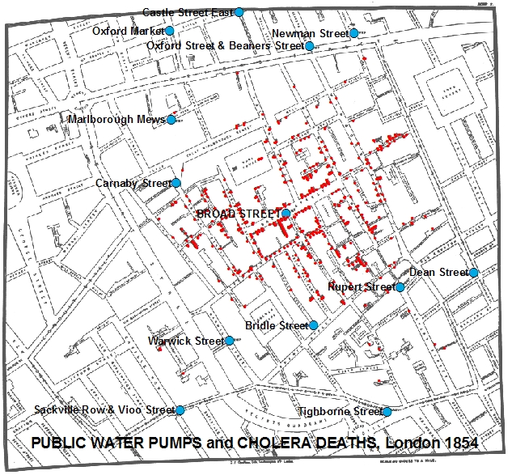

```{r setup, include=FALSE}
knitr::opts_chunk$set(echo = FALSE)
require(haven)
require(data.table)
require(ggplot2)
require(magrittr)
require(ggdag)
```

# Correlation to Causation

## Solutions to Confounding

1. Recap
    - Causation requires assumptions
    - Solutions involve trade-offs (internal vs external validity)
    - Experiments: assumptions?
2. Interlude: Cholera
3. Conditioning:
    - what is it?
    - what are the assumptions?
    

# Recap

## Solutions to Confounding

We want to use **correlation** to provide evidence of **causation**:

- but we know that confounding (a form of **bias**) can lead us astray.
- if we can reasonably *make some assumptions*, correlation can be *strong evidence of causality* without bias.

>- What **are** the assumptions needed to infer correlation $\to$ causation?
>- How can we check/interrogate those assumptions?

## Always a Trade-off

But the choice of "solution" to confounding — or our **research design** — always involves a trade off:

Increasing confidence that our correlation yield an unbiased estimate of the causal effect of $X$ on $Y$ (**internal validity**)...

...comes at the price of limiting the kinds of cases we can examine and the kinds of causal variables we can examine (**external validity**)

>- easier to carefully manipulate **less important** causal factors for **small groups** of people/cases
>- difficult, costly, and unethical to experimentally manipulate important causal factors for society more broadly


## Internal Validity

**Internal Validity**

A research design (choice of which cases to compare using correlation) has internal validity when the causal effect of X on Y it finds is not biased (systematically incorrect) / does not suffer from confounding.

- studies with strong internal validity imply that we have very good reason to believe that the correlation of X and Y we observe actually implies the causal effect of X on Y.
- we believe it is unbiased **because** we can believe the assumptions (e.g. randomization)

## External Validity

**External Validity**

is the degree to which the causal relationship we find in a study captures/is relevant to the causal relationship in our causal question/claim

- Study has external validity if the relationship found is true for **the cases we are interested in**

    - is study has sampling bias (sample in study different from population of interest), may lack external validity
    - E.g. Transgender canvassing

- Study has external validity if the causal variable in the study **maps onto the concept/definition of the cause** in the causal claim.

    - E.g. Fox News media effects vs lab experiments

## Speech and Hate Crimes

Did Trump rallies cause an increase in hate crime?

> "A USA TODAY analysis of the 64 rallies Trump ... held [between] 2017 [and 2019] found that, when discussing immigration, the president has said 'invasion' at least 19 times. He has used the word 'animal' 34 times and the word 'killer' nearly three dozen times."

---

```{r echo = F, message = F, warning = F}
rally_data = fread('./trump_rally_data.csv')

data = rally_data %>% 
        .[, list(rally = trumpeverrally[1], 
                 hate_crimes = ifelse(trumpeverrally[1] == 1,
                                      sum(incidentcount[trumprallyoccured == 1]) / sum(trumprallyoccured),
                                      sum(incidentcount)/length(incidentcount)
                                      )
                 ), by = fips]

ggplot(data, aes(x = rally, y = hate_crimes)) + geom_jitter(width = 0.1, alpha = 0.1) +  geom_smooth(method = lm, se = FALSE) + 
  xlab("Trump Rallies (Any)") +
  ylab("Hate Crimes (per month)") +
  ggtitle("Trump Rallies and Hate Crimes by County (2016):\nCorrelation") + 
  theme_bw()
```

data from [Feinberg, Branton, and Martinez-Ebers ](https://lmas.unt.edu/sites/lmas.unt.edu/files/lmas/Hate%20Incidents%20Spike_0.pdf)

## Speech and Hate Crimes

But as we discussed, this correlation might suffer from **confounding**: 

DISCUSS WITH NEIGHBORS: could there be *other factors* about communities that...

- caused rallies to occur there
- caused hate crimes to be higher


BOARD

## Speech and Hate Crimes

One way to do away with confounding is to do an **experiment**: 

[Kalmoe (2014)](https://doi.org/10.1080/10584609.2013.852642) examines the effect of "aggressive" and "violent" language on support for political violence.

- survey respondents were **randomly assigned** to see two versions of campaign ad
- one used more aggressive words like "fight", the other less aggressive words.
- people report their support for violence

---


---


## Speech and Hate Crimes

[Kalmoe (2014)](https://doi.org/10.1080/10584609.2013.852642) finds that "aggressive" and "violent" language **increased** support for political violence.

- survey respondents were **randomly assigned** to see two versions of campaign ad
- one used more aggressive words like "fight", the other less aggressive words.
- people report their support for violence

>- do you believe the 'violent' ads **caused** people to support violence?
>- can this tell us very much about the effects of Trump's speeches on hate crimes?

(GROUPS)

---

| Solution | How Bias<br>Solved | Which Bias<br>Removed | Assumes | Internal<br>Validity | External<br>Validity |
|--------------------|------------------------------|------------------------------------------------|---------|----------------------|----------------------|
| Experiment | Randomization<br>Breaks $W \rightarrow X$ link | **All** confounding variables | $X$ is random;<br> Change only $X$ | High | Low | 

# Interlude

Before we return to  speech and hate crimes

## Imagine...

You live in mid-19th century London. 

- Every few years, hundreds to thousands of people are killed in cholera outbreaks
- To stop these deaths, you need to answer:

> What causes the spread of **cholera**?


## Cholera

Dominant view was that "miasmas" or bad air caused diseases like cholera

- Wrong, yet it informed public health plans of the day

>- John Snow, MD suggested cholera transmitted as "germ" in water.


## Broad Street Pump Outbreak (1854)

Snow mapped cholera deaths of 1854 outbreak in SoHo.

- Broad Street Pump had fouled water (X)
- Proximity to the Broad Street Pump (water source) correlated with mortality (Y)
- Proximity to **other** pumps not related to mortality

## Broad Street Pump Outbreak (1854) {.centered}



>- confounding?

## Confounding?

Leading doctors rejected Snow's argument. Critics pointed out:

- Houses and sewers near Broad Street Pump built on 1665 plague burial site. 
- Sewers produce foul odors from rotting material/human waste

Both might produce miasmas.

- maybe Miasmas $\to$ Foul Water
- and Miasmas $\to$ Cholera


---

<iframe width=100% src="https://www.youtube.com/embed/d44LyYL3GkY?autoplay=0" frameborder="0" allowfullscreen></iframe>

## Sorry, *this* John Snow {.centered}


## Confounding

```{r, echo = F, message=F, warning=F}
dagify(cholera ~ water,
       water ~ miasma,
       miasma ~ plague + sewer,
       cholera ~ miasma,
       water ~ v_b,
       exposure = "water", 
       outcome = 'cholera',
       labels = c('water' = "(X)\nBad Water", 
                  'cholera' = "(Y)\nCholera",
                  'miasma' = 'Miasma',
                  "v_b" = "Vibrio cholerae",
                  'plague' = 'Plague\nCemetary',
                  'sewer' = "Sewers")) %>%
  tidy_dagitty(layout='circle') %>%
ggplot(aes(x = x, y = y, xend = xend, yend = yend)) +
  #geom_dag_node() +
  geom_dag_edges_link() +
  geom_dag_text(mapping = aes(label = label), colour = 'black') +
  theme_dag() +
  scale_adjusted()
```

## Broad Street Pump Outbreak (1854)

Snow's solution to confounding: compare people "near pump" w/ different water sources

|  | **Brewers** | **Broad St. Residents** |
|-------|------------|------------|
| **Water Source** | **Brewery Well**/<br>**Beer** (Clean) | **Pump** (Contam.)|
| **Location** | Near pump | Near pump |
| **Timing** |  Aug. 1854 |  Aug. 1854 |
| **Miasmas?** | Yes? | Yes? |
| **Cholera** | **No** | **Yes** |

## Broad Street Pump Outbreak (1854)

Snow's solution to confounding: compare people "far from pump" w/ different water sources

|  | **Lady and Niece** | **Non-Soho Residents** |
|-------|------------|------------|
| **Water Source** | **Broad Street Pump**<br>(Contam.) | **Another Pump**<br>(Clean) |
| **Location** | Far from Broad St. | Far from Broad St. |
| **Timing** |  Aug. 1854 |  Aug. 1854 |
| **Miasmas?** | No | No |
| **Cholera** | **Yes** | **No** |


## Broad Street Pump Outbreak (1854)

Discuss:

**do you find these comparisons convincing (as a way to prevent confounding)?**

**Why or why not?**

## Holding geography constant

```{r, echo = F, message=F, warning=F}
dagify(cholera ~ water,
       water ~ miasma,
       miasma ~ plague + sewer,
       cholera ~ miasma,
       water ~ v_b,
       exposure = "water", 
       outcome = 'cholera',
       labels = c('water' = "(X)\nBad Water", 
                  'cholera' = "(Y)\nCholera",
                  'miasma' = 'Miasma',
                  "v_b" = "Vibrio cholerae",
                  'plague' = 'Plague\nCemetary',
                  'sewer' = "Sewers")) %>%
  tidy_dagitty(layout='circle') %>%
ggplot(aes(x = x, y = y, xend = xend, yend = yend)) +
  #geom_dag_node() +
  geom_dag_edges_link(mapping = aes(label = c('held constant\n(link broken)', 'held constant\n(link broken)', 'held constant\n(link broken)', 'held constant\n(link broken)', '', '','')),  
                                    angle_calc = "along", label_dodge = unit(c(1,-1,1,-1,-1,1),'lines'),
                                    edge_linetype = rep(c(2,2,2,2,1,1), each = 100),
                                    arrow = grid::arrow(length=grid::unit(c(0,0,0,0,10,10), 'pt'), type = 'closed')
                                    ) +
  geom_dag_text(mapping = aes(label = label), colour = 'black') +
  theme_dag() +
  scale_adjusted()
```

## Conditioning

This solution to confounding is called...

### **conditioning**

when we observe $X$ and $Y$ for multiple cases, we examine the correlation of $X$ and $Y$ *within* groups of cases that are **the same** on confounding variables $W, etc. \ldots$

How does conditioning solve the problem? 

- Cases compared have **same values** on confounding variable $W$
- In these groups, $W$ cannot affect $X$ or $Y$ (because $W$ is not moving, it can't move $X$ or)
- "Backdoor" path from $X$ to $Y$ is "blocked"

## Conditioning

In contrast to experiments, conditioning is possible for **any cases** and **for any possible-cause $X$**:

Conditioning has greater **external validity**.

>- Let's revisit the effects of speech on hate crimes

# Conditioning, an Example

## Example: Conditioning

Earlier we asked: 

### **Did Trump rallies *increase* hate crimes?**

- inflammatory rhetoric $\xrightarrow{?}$ violence
- many argue there is a link
- but is there empirical evidence of causality?

## Conditioning: Example

```{r echo = F, message = F, warning = F}
rally_data = fread('./trump_rally_data.csv')

data = rally_data %>% 
        .[, list(rally = trumpeverrally[1], 
                 hate_crimes = ifelse(trumpeverrally[1] == 1,
                                      sum(incidentcount[trumprallyoccured ==1]) / sum(trumprallyoccured),
                                      sum(incidentcount)/length(incidentcount)
                                      )
                 ), by = fips]

ggplot(data, aes(x = rally, y = hate_crimes)) + geom_jitter(width = 0.1, alpha = 0.1) +  geom_smooth(method = lm, se = FALSE) + 
  xlab("Trump Rallies (Any)") +
  ylab("Hate Crimes (per month)") +
  ggtitle("Trump Rallies and Hate Crimes by County (2016):\nCorrelation") + 
  theme_bw()
```

data from [Feinberg, Branton, and Martinez-Ebers ](https://lmas.unt.edu/sites/lmas.unt.edu/files/lmas/Hate%20Incidents%20Spike_0.pdf)

## Conditioning: Example

Correlation between Trump Rallies and Hate Crimes likely suffers from confounding

- Return to possible confounders on the board

---

Compare against confounders imagined by [Feinberg, Branton, and Martinez-Ebers ](https://lmas.unt.edu/sites/lmas.unt.edu/files/lmas/Hate%20Incidents%20Spike_0.pdf)

```{r, echo = F, warning = F, message = F}
dagify(hate_crime ~ rally + jewish + hate_group + crime + gop + univ + region,
      rally ~ jewish + hate_group + crime + gop + univ + region,
       exposure = "rally", 
       outcome = 'hate_crime',
       labels = c('rally' = "(X) Trump\nRally", 
                  'hate_crime' = "(Y) Hate Crimes",
                  'jewish' = '% Jewish',
                  'hate_group' = '# Hate\nGroups',
                  "crime" = "Crime Rate",
                  'gop' = 'Republican\nVoters',
                  'univ'= 'Univ.\nEducated',
                  'region' = "Region"
                  )) %>%
  tidy_dagitty(layout='circle') %>%
ggplot(aes(x = x, y = y, xend = xend, yend = yend)) +
  #geom_dag_node() +
  geom_dag_edges_link(mapping = aes(label = c(rep('',8), "?" ,rep('', 5))),
                      angle_calc = "along", label_dodge = unit(rep(1,15),'lines')) +
  geom_dag_text(mapping = aes(label = label), colour = 'black') +
  theme_dag() +
  scale_adjusted()
```

## Example: Conditioning:

[Feinberg, Branton, and Martinez-Ebers ](https://lmas.unt.edu/sites/lmas.unt.edu/files/lmas/Hate%20Incidents%20Spike_0.pdf) compare hate crimes in counties with and without Trump rallies, but condition on (hold constant):

- percent Jewish
- number of hate groups
- crime rate
- 2012 Republican vote share
- percent university educated
- region

---

```{r, echo = F, warning = F, message = F}
dagify(hate_crime ~ rally + jewish + hate_group + crime + gop + univ + region,
      rally ~ jewish + hate_group + crime + gop + univ + region,
       exposure = "rally", 
       outcome = 'hate_crime',
       labels = c('rally' = "(X) Trump\nRally", 
                  'hate_crime' = "(Y) Hate Crimes",
                  'jewish' = '% Jewish',
                  'hate_group' = '# Hate\nGroups',
                  "crime" = "Crime\nRate",
                  'gop' = 'GOP\nVoters',
                  'univ'= 'Univ.\nEducated',
                  'region' = "Region"
                  )) %>%
  tidy_dagitty(layout='circle') %>%
ggplot(aes(x = x, y = y, xend = xend, yend = yend)) +
  #geom_dag_node() +
  geom_dag_edges_link(mapping = aes(label = c(rep('held constant',8), "" ,rep('held_constant', 5)), label_size = 2),
                      angle_calc = "along", label_dodge = unit(rep(1,14),'lines'),
                      edge_linetype = rep(c(3,3,3,3,3,3,3,3,1,3,3,3,3), each = 100),
                      arrow = grid::arrow(length=grid::unit(c(0,0,0,0,0,0,0,0,0,0,0,10), 'pt'), type = 'closed')) + 
  geom_dag_text(mapping = aes(label = label), colour = 'black') +
  theme_dag() +
  scale_adjusted()
```

## Example: Conditioning

[Feinberg, Branton, and Martinez-Ebers ](https://lmas.unt.edu/sites/lmas.unt.edu/files/lmas/Hate%20Incidents%20Spike_0.pdf) find that, even after conditioning, Trump rallies increase the risk of hate crimes by 200%!

- Lots of news headlines [like this](https://www.vox.com/2019/3/24/18279807/trump-hate-crimes-study-white-nationalism)

>- Discuss: are you **convinced** that this correlation, after conditioning, shows rallies *caused* hate crimes?


## Example: Conditioning

```{r echo = F, message = F, warning = F}
data = rally_data %>% 
        .[, list(rally = clintoneverrally[1], 
                 hate_crimes = ifelse(clintoneverrally[1] == 1,
                                      sum(incidentcount[clintonrallyoccured ==1]) / sum(clintonrallyoccured),
                                      sum(incidentcount)/length(incidentcount)
                                      )
                 ), by = fips]

ggplot(data, aes(x = rally, y = hate_crimes)) + geom_jitter(width = 0.1, alpha = 0.1) +  geom_smooth(method = lm, se = FALSE) + 
  xlab("Clinton Rallies (Any)") +
  ylab("Hate Crimes (per Month)") +
  ggtitle("Clinton Rallies and Hate Crimes by County (2016):\nCorrelation") + 
  theme_bw()
```

## Example: Conditioning

[Economics PhD Candidates](https://github.com/lilleymatthew/Trump_Rallies_Replication_Materials/blob/master/Trump_Rallies_and_Hate_Crimes.pdf) show that **conditioning on the same variables**...

- **Clinton rallies** increased hate crimes by **nearly 250%!!**


>- **What could be going on here? Do all political rallies cause hate crimes? Or is something else happening?**

---

Any confounding variables that are missing from this diagram?

```{r, echo = F, warning = F, message = F}
dagify(hate_crime ~ rally + jewish + hate_group + crime + gop + univ + region,
      rally ~ jewish + hate_group + crime + gop + univ + region,
       exposure = "rally", 
       outcome = 'hate_crime',
       labels = c('rally' = "(X) Trump\nRally", 
                  'hate_crime' = "(Y) Hate Crimes",
                  'jewish' = '% Jewish',
                  'hate_group' = '# Hate\nGroups',
                  "crime" = "Crime\nRate",
                  'gop' = 'GOP\nVoters',
                  'univ'= 'Univ.\nEducated',
                  'region' = "Region"
                  )) %>%
  tidy_dagitty(layout='circle') %>%
ggplot(aes(x = x, y = y, xend = xend, yend = yend)) +
  #geom_dag_node() +
  geom_dag_edges_link(mapping = aes(label = c(rep('held constant',8), "" ,rep('held_constant', 5)), label_size = 2),
                      angle_calc = "along", label_dodge = unit(rep(1,14),'lines'),
                      edge_linetype = rep(c(3,3,3,3,3,3,3,3,1,3,3,3,3), each = 100),
                      arrow = grid::arrow(length=grid::unit(c(0,0,0,0,0,0,0,0,0,0,0,10), 'pt'), type = 'closed')) + 
  geom_dag_text(mapping = aes(label = label), colour = 'black') +
  theme_dag() +
  scale_adjusted()
```


## Conclusion

**Conditioning**

- What is it?: Another way to "solve" confounding.
- How does it work?: Look at correlation between $X$ and $Y$, for cases with same value of $W$
- What are the assumptions?: That is a *very good question* for Wednesday
