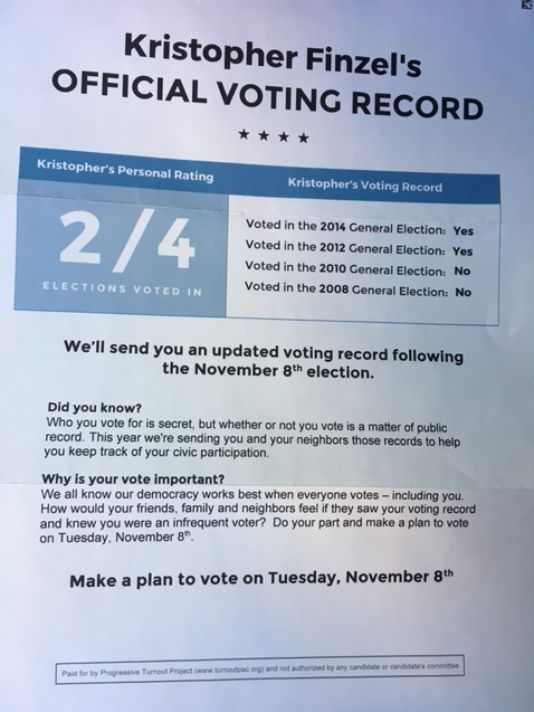

```{r setup, include=FALSE}
knitr::opts_chunk$set(echo = FALSE)
require(knitr)
```


<style>
div.footnotes {
  position: absolute;
  bottom: 0;
  margin-bottom: 10px;
  width: 80%;
  font-size: 0.6em;
}
</style>

<script src="https://ajax.googleapis.com/ajax/libs/jquery/3.1.1/jquery.min.js"></script>

<script>
  $(document).ready(function() {
    $('slide:not(.backdrop):not(.title-slide)').append('<div class=\"footnotes\">');

    $('footnote').each(function(index) {
      var text  = $(this).html();
      var fnNum = (index+1).toString().sup();
      $(this).html(text + fnNum);

      var footnote   = fnNum + ': ' + $(this).attr('content') + '<br/>';
      var oldContent = $(this).parents('slide').children('div.footnotes').html();
      var newContent = oldContent + footnote;
      $(this).parents('slide').children('div.footnotes').html(newContent);
    });
  });
</script>

# Causal Claims

## Plan for Today:

### **(1) Probabilistic Causal Claims**

Review:

- unknown deterministic processes
- recognizing probabilistic claims

### **(2) Types of Causes**

- "structural" causes
- "triggering" events
- "random" causes


# Probabilistic Causal Claims

## Probabilistic Causal Claims

When we seek to investigate **effects of causes** (we look at causes and what effects they produce), 

### does it make sense to speak **deterministically**?

e.g., does it make sense to claim:

- "Wood framing causes buildings to burn down (every time)?"
- "Short circuits cause buildings to burn down (every time)?"
- "Presence of indoor gas furnaces cause buildings to burn down (every time)?"

## Probabilistic Causal Claims

When we are interested in **effects of causes**, we usually make **probabilistic causal claims**

### **probabilistic causal claims**

are claims that the presence of a cause $C$ makes an effect $E$ more or less likely to occur.

- In contrast to **deterministic causal claims** this implies
    - effect $E$ can happen when $C$ is absent
    - effect $E$ may not happen when $C$ is present
- **NOT** a claim that politics has some inherent randomness (not quantum mechanics)
    - recall, coin flips are **deterministic** but seem random.
    
## Probabilistic Causal Claims

If the social/political world is actually **deterministic**, why do we need **probabilistic claims**?

Because causality is complex and not fully known:

Cause $C$ might produce an effect $E$...

- only when multiple other necessary conditions are met (**conjunctural**)
- that differs depending on other factors $C_2$ etc. (**conjunctural**: conditional)
- but so do **multiple** other sets of necessary conditions (**multiple** and **conjunctural**)

$C$ appears to only cause a change in the **probability** or **likelihood** of seeing the effect $E$.

## Probabilistic Causal Claims

If the causal relations were **inherently** probabilistic:

**the same exact cause happening to the same exact unit under exactly the same conditions would produce different results with some probability**

This seems unreasonable, except in quantum physics. 

Determinism may imply no free will (still an open debate in philosophy)

## Example: Probabilistic Claims

### **Voter turn out:**

- Low in many countries
- Low in many local, off-year elections.

### How can you get people to vote?

## Example: Probabilistic Claims




## Example: Probabilistic Claims

```{r,echo = F}

barplot(height = c(29.7, 31.5, 32.3, 34.5, 37.8),
        names.arg = c("Control", "Civic Duty", "Hawthorne", "Self\nVote Record", "Share\nVote Record"),
        ylab = "% Who Voted", ylim = c(0, 40), xlab = "Mailing Treatments",
        main = "An Experiment on Voter Turnout")

```

## Causes of voter turnout

Person|Shame|Vote?
-------+-----+-----
A|**Yes**|**Yes**
B|**Yes**|**Yes**
C|**Yes**|**No**
D|**No**|**No**
E|**No**|**No**
F|**No**|**No**

## Causes of voter turnout

Person|Shame|Degree|Vote?
  -------+-----+-------+-----
  A|**Yes**|**Yes**|**Yes**
B|**Yes**|**No**|**Yes**
C|**Yes**|**No**|**No**
D|**No**|**Yes**|**No**
E|**No**|**No**|**No**
F|**No**|**No**|**No**


## Causes of voter turnout

Person|Shame|Degree|Urban|Vote?
  -------+-----+-------+----+-----
  A|**Yes**|**Yes**|**No**|**Yes**
B|**Yes**|**No**|**Yes**|**Yes**
C|**Yes**|**No**|**No**|**No**
D|**No**|**Yes**|**No**|**No**
E|**No**|**No**|**Yes**|**No**
F|**No**|**No**|**No**|**No**

## Example: Probabilistic Claims

### Exposure "shame" increases probability of voting by 2/3

1. **because** multiple, conjunctural causation
    - (shame AND degree) OR (shame AND urban)
2. **because** necessary condtions present for only 2/3 of people.
    - some people both lack degree, live in rural area.
    
    
## Examples

Which is a probabilistic causal claim?

#### **A) It's probably true that leftwing government reduce student tuition fees**

<hr style="height:8px; visibility:hidden;" />

#### **B) Electing a leftwing, rather than rightwing, government increases the probability likely that tuition fees wil be reduced**

<hr style="height:8px; visibility:hidden;" />

#### **C) Tuition fees are reduced more frequently under leftwing governments than rightwing governments**

## Examples

Which is a probabilistic causal claim?

#### ~~**A) It's probably true that leftwing government reduce student tuition fees**~~

<hr style="height:8px; visibility:hidden;" />

#### **B) Electing a leftwing, rather than rightwing, government increases the probability likely that tuition fees wil be reduced**

<hr style="height:8px; visibility:hidden;" />

#### ~~**C)  Tuition fees are reduced more frequently under leftwing governments than rightwing governments**~~
    
## Recognizing probabilistic causal claims

Not every probabilistic statement is **causal**

#### 1. ~~"Oppression is likely to cause a rebellion"~~

- Says oppression is probably a cause out rebellion
- Should say: cause $C$ **changes likelihood** of outcome $E$

#### 2. ~~"A rebellion is more likely to occur if the population is oppressed"~~

- Says we are more likely to **see** rebellion where population is oppressed
- Not clearly **causal**; just a descriptive claim.

# Types of Causes

## Types of Causes

**probabilistic causal claims** follow from a focus on **effects of causes**

### Implies different "varieties" of causes
  
"**structural causes**" 

and

"**triggering events**" or "**triggers**"


## Types of Causes

### **structural causes**

From the perspective of complex causality (multiple and conjunctural), **structural causes** are those causes that

- are **necessary** in **many** sets of **sufficient conditions**
- thus, structural causes contributed to an effect/outcome under **many different conditions**

## Types of Causes

### **triggering events**

From the perspective of complex causality (multiple and conjunctural), **triggering events** are those causes that

- are only **necessary** in **one** or a **few** sets of **sufficient conditions**
- thus, they generate the outcome in combination with some **structural causes**
- thus, **triggering events** cause an effect/outcome under **highly specific conditions**
- triggers are substitutable: **some trigger needed**, **specific** trigger may not be
    - may fail to meet **counterfactual** definition of causality (I'm skeptical of this argument)

## Types of Causes: Example

Which are structural causes? Which are triggers?

### Global Financial Crisis of 2008

1. Growing Wealth Inequality

2. Weak Regulatory Structures

3. Slow Wage Growth

4. Collapse of Lehman Brothers investment bank

## Types of Causes: Example

Which are structural causes? Which are triggers?

### Global Financial Crisis of 2008

1. Growing Wealth Inequality (structural)

2. Weak Regulatory Structures (structural)

3. Slow Wage Growth (structural)

4. Collapse of Lehman Brothers investment bank (trigger)

## Which causes?

Social science **generally** interested in **structural causes**.

### We want **prediction**

- This requires finding patterns/regularities in different contexts
- **triggering events** may not be relevant across contexts
- **structural causes** are.

Want causal **patterns/regularities**

