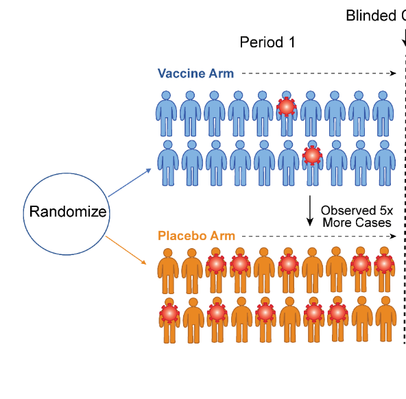
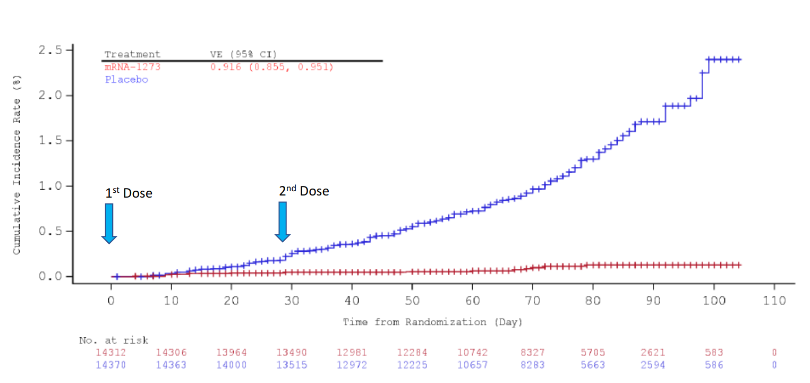
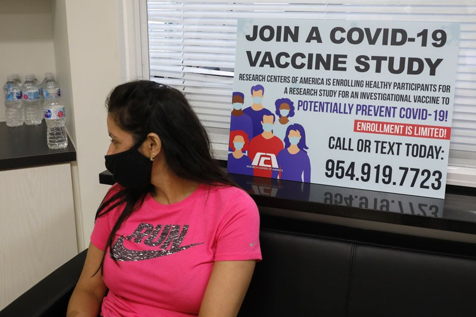
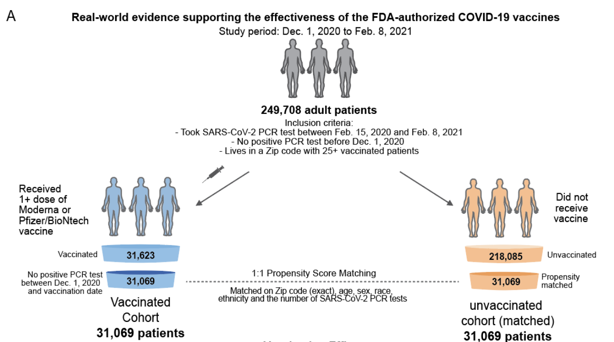

```{r setup, include=FALSE}
knitr::opts_chunk$set(echo = FALSE)
require(haven)
require(data.table)
require(ggplot2)
require(magrittr)
require(ggdag)
```

# Correlation to Causation

## Solutions to Confounding

1. Experiments
    - Solution to confounding
    - What are the assumptions?
2. Trade-offs
    - interal validity
    - external validity
3. Conditioning
    

# Experiments

## Example

### My wife just learned to will receive a COVID vaccination in the coming week

### But, we know about the fundamental problem of causal inference and about confounding...

>- How do we know that this vaccine actually **reduces** risk of infection?
>- How do we know that the vaccine **does not cause** adverse reactions?

## Vaccine Clinical Trials



## Vaccine Clinical Trials

Clinical trials are **experiments**. Correlation between treatment and health outcomes are **causal** (do not have confounding) **assuming** that...

- assignment to treatment is **random**
- the **only difference** between treatment and control is the actual content of the vaccine. (blind placebo)

TO THE BOARD

## Vaccine Clinical Trials



## Vaccines in the "real world"




**Does the efficacy of vaccines in clinical trials translate to real world use??**

POLL

>- How might people who enroll in clinical trials **be different**.
>- How might people **behave differently** in vaccine trials?


## Experiments

Might appear to be the only valid solution:

- if we don't know how cases would behave counterfactually
- if we don't know other causal factors affecting X and Y

Experiments, under weak assumptions, let us find an unbiased causal relationship between X and Y

- Experiments likely have "internal validity"

## Internal Validity

**Internal Validity**

A research design (choice of which cases to compare using correlation) has internal validity when the causal effect of X on Y it finds is not biased (systematically incorrect) / does not suffer from confounding.

- studies with strong internal validity imply that we have very good reason to believe that the correlation of X and Y we observe actually implies the causal effect of X on Y.
- **because** we can believe the assumptions (e.g. randomization)

## Experiments: Limitations

**What can we manipulate?**

- economic growth? democracy? violence? hate speech?

Who/what cases can we study? 

- who participates in psych labs? is it ethical to experiment on people in developing countries?

## External Validity

**External Validity**

is the degree to which the causal relationship we find in a study captures/is relevant to the causal relationship in our causal question/claim

- Study has external validity if the relationship found is true for **the cases we are interested in**

    - is study has sampling bias (sample in study different from population of interest), may lack external validity
    - E.g. Transgender canvassing

- Study has external validity if the causal variable in the study **maps onto the concept/definition of the cause** in the causal claim.

    - E.g. Fox News media effects

## Always a Trade-off:

More internal validity (unbiased calculation of causal effect) comes at the cost in external validity (relevance of study sample or cause to the theory)

- easier to experimentally manipulate unimportant causal factors for small groups of people
- hard/unethical to experimentally manipulate important causal factors for society more broadly

# Interlude

Before we return to vaccination

## Imagine...

You live in mid-19th century London. 

- Every few years, hundreds to thousands of people are killed in cholera outbreaks
- To stop these deaths, you need to answer:

> What causes the spread of **cholera**?


## Cholera

Dominant view was that "miasmas" or bad air caused diseases like cholera

- Wrong, yet it informed public health plans of the day

>- John Snow, MD suggested cholera transmitted as "germ" in water.
>- Leading doctors rejected Snow's argument

---

<iframe width=100% src="https://www.youtube.com/embed/d44LyYL3GkY?autoplay=0" frameborder="0" allowfullscreen></iframe>

## No, *this* John Snow {.centered}


## Broad Street Pump Outbreak (1854)

Snow mapped cholera deaths of 1854 outbreak in SoHo.

- Broad Street Pump had fouled water (X)
- Proximity to the Broad Street Pump (water source) correlated with mortality (Y)
- Proximity to **other** pumps not related to mortality

## Broad Street Pump Outbreak (1854) {.centered}


## Confounding?

Critics pointed out:

- Houses and sewers near Broad Street Pump built on 1665 plague burial site. 
- Sewers produce foul odors from rotting material/human waste

Both might produce miasmas.

- maybe Miasmas $\to$ Foul Water
- and Miasmas $\to$ Cholera

## Confounding

```{r, echo = F, message=F, warning=F}
dagify(cholera ~ water,
       water ~ miasma,
       miasma ~ plague + sewer,
       cholera ~ miasma,
       water ~ v_b,
       exposure = "water", 
       outcome = 'cholera',
       labels = c('water' = "(X)\nBad Water", 
                  'cholera' = "(Y)\nCholera",
                  'miasma' = 'Miasma',
                  "v_b" = "Vibrio cholerae",
                  'plague' = 'Plague\nCemetary',
                  'sewer' = "Sewers")) %>%
  tidy_dagitty(layout='circle') %>%
ggplot(aes(x = x, y = y, xend = xend, yend = yend)) +
  #geom_dag_node() +
  geom_dag_edges_link() +
  geom_dag_text(mapping = aes(label = label), colour = 'black') +
  theme_dag() +
  scale_adjusted()
```

## Broad Street Pump Outbreak (1854)

Snow's solution to confounding: compare people "near pump" w/ different water sources

|  | **Brewers** | **Broad St. Residents** |
|-------|------------|------------|
| **Water Source** | **Brewery Well**/<br>**Beer** (Clean) | **Pump** (Contam.)|
| **Location** | Near pump | Near pump |
| **Timing** |  Aug. 1854 |  Aug. 1854 |
| **Miasmas?** | Yes? | Yes? |
| **Cholera** | **No** | **Yes** |

## Broad Street Pump Outbreak (1854)


Snow's solution to confounding: compare people "far from pump" w/ different water sources

|  | **Lady and Niece** | **Non-Soho Residents** |
|-------|------------|------------|
| **Water Source** | **Broad Street Pump**<br>(Contam.) | **Another Pump**<br>(Clean) |
| **Location** | Far from Broad St. | Far from Broad St. |
| **Timing** |  Aug. 1854 |  Aug. 1854 |
| **Miasmas?** | No | No |
| **Cholera** | **Yes** | **No** |

## Holding geography constant

```{r, echo = F, message=F, warning=F}
dagify(cholera ~ water,
       water ~ miasma,
       miasma ~ plague + sewer,
       cholera ~ miasma,
       water ~ v_b,
       exposure = "water", 
       outcome = 'cholera',
       labels = c('water' = "(X)\nBad Water", 
                  'cholera' = "(Y)\nCholera",
                  'miasma' = 'Miasma',
                  "v_b" = "Vibrio cholerae",
                  'plague' = 'Plague\nCemetary',
                  'sewer' = "Sewers")) %>%
  tidy_dagitty(layout='circle') %>%
ggplot(aes(x = x, y = y, xend = xend, yend = yend)) +
  #geom_dag_node() +
  geom_dag_edges_link(mapping = aes(label = c('held constant\n(link broken)', 'held constant\n(link broken)', 'held constant\n(link broken)', 'held constant\n(link broken)', '', '','')),  
                                    angle_calc = "along", label_dodge = unit(c(1,-1,1,-1,-1,1),'lines'),
                                    edge_linetype = rep(c(2,2,2,2,1,1), each = 100),
                                    arrow = grid::arrow(length=grid::unit(c(0,0,0,0,10,10), 'pt'), type = 'closed')
                                    ) +
  geom_dag_text(mapping = aes(label = label), colour = 'black') +
  theme_dag() +
  scale_adjusted()
```

## Conditioning

This solution to confounding is called...

### **conditioning**

when we observe $X$ and $Y$ for multiple cases, we examine the correlation of $X$ and $Y$ *within* groups of cases that are **the same** on confounding variables $W, etc. \ldots$

How does conditioning solve the problem? 

- Cases compared have **same values** on confounding variable $W$
- In these groups, $W$ cannot affect $X$ or $Y$
- "Backdoor" path from $X$ to $Y$ is "blocked"


## Conditioning: Vaccines



## Conditioning: Vaccines

Compare COVID infections between vaccinated and un-vaccinated, identical on...

- Postal Code
- age, sex, race, ethnicity
- Number of previous COVID tests

## Conclusion

Confounding:

- What are the assumptions?
