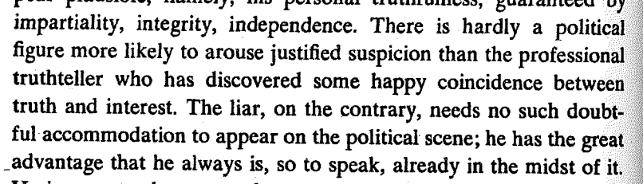
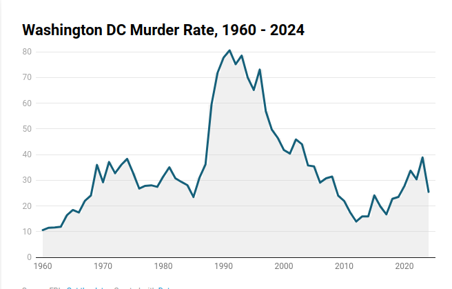
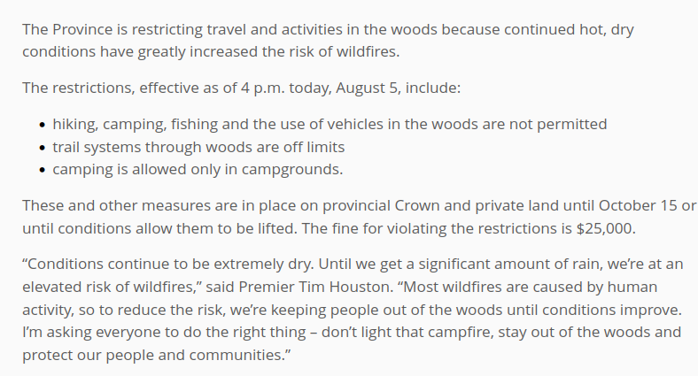
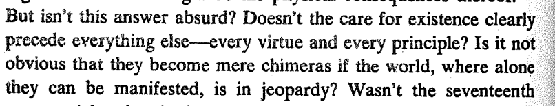
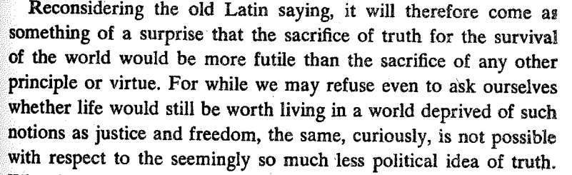
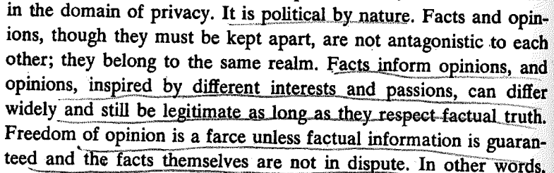
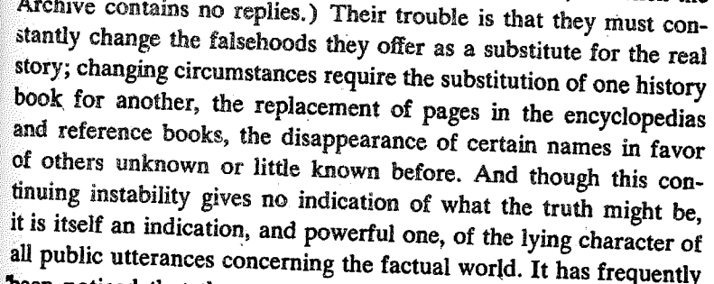

```{r setup, include=FALSE}
knitr::opts_chunk$set(echo = FALSE)
```

# Why Truth Matters in Politics

## Objectives

1. Why does truth face challenges in politics?
2. Three answers on why truth still matters
  - Weber
  - Forst
  - Arendt


# Truth does not sustain itself


## (1) Truth is Fragile

**Factual truth**:

- depends on something being witnessed
- witnesses may be wrong, disagree, misrepresent

---


## (1) Truth is Fragile


<iframe width="315" height="560"
src="https://youtube.com/embed/8VW2W0CWxbM?si=WzW1ZXfpKm5oaIn1"
title="YouTube video player"
frameborder="0"
allow="accelerometer; autoplay; clipboard-write; encrypted-media; gyroscope; picture-in-picture; web-share"
allowfullscreen></iframe>


## (2) Truthtellers are Unpopular

Arendt tells us in *Truth and Politics*



## (2) Truthtellers are Unpopular


<iframe width="315" height="560"
src="https://youtube.com/embed/4Ph4potRxkM"
title="YouTube video player"
frameborder="0"
allow="accelerometer; autoplay; clipboard-write; encrypted-media; gyroscope; picture-in-picture; web-share"
allowfullscreen></iframe>


## (2) Truthtellers are Unpopular


<iframe width="315" height="560"
src="https://youtube.com/embed/XhrwH17ploM"
title="YouTube video player"
frameborder="0"
allow="accelerometer; autoplay; clipboard-write; encrypted-media; gyroscope; picture-in-picture; web-share"
allowfullscreen></iframe>

## (3) Fiction/Lies are More Palatable

<iframe width="560" height="315" src="https://www.youtube.com/embed/qh9HCwvEDe8?si=bKISeKN9vFZd2xY6" title="YouTube video player" frameborder="0" allow="accelerometer; autoplay; clipboard-write; encrypted-media; gyroscope; picture-in-picture; web-share" referrerpolicy="strict-origin-when-cross-origin" allowfullscreen></iframe>


# Why does Truth matter in politics?


## Politics

For Aristotle and many others, the key question is:

How **should** we live together in communities? How **should** we organize our communities?

>- Not to mention: who or what should be considered a member of our community?

## What value does Truth have?

Three answers


# (1) Max Weber


## Weber on the Value of Science

Essay on "Science as a Vocation" ultimately takes up the question of "what is the value of science?"


>- Rejects several possible answers before giving his own.

## Weber on the Value of Science

### **Science can reveal something about God or Nature that unites what exists (what is) with what is right (what ought) and gives our lives *meaning*?**

>- **"Science is meaningless because it gives no answer to our question: the only question important for us: What shall we do and how shall we live?"** - Tolstoi 


## Weber on the Value of Science


### **Scientific knowledge and mastery over our lives leads to happiness?**


---


<iframe width="560" height="315" src="https://youtube.com/embed/_HIYaUSEt1g" title="YouTube video player" frameborder="0" allow="accelerometer; autoplay; clipboard-write; encrypted-media; gyroscope; picture-in-picture; web-share" referrerpolicy="strict-origin-when-cross-origin" allowfullscreen></iframe>


>- Weber throws serious shade :"Who believes this? Aside from a few big children in university chairs and editorial offices."


## Weber on the Value of Science


### **Science is valuable in itself because it increases objective knowledge?**

## {.centered}

<figure>

<figcaption>how, and why, wombats make cube-shaped faeces</figcaption>
</figure>

## {.centered}

<figure>

<figcaption>measuring scrotal temperature asymmetry in naked and clothed postmen in France</figcaption>
</figure>

## {.centered}

<figure>

<figcaption>measuring the amount of friction between a shoe and a banana skin, and between a banana skin and the floor, when a person steps on a banana skin that's on the floor</figcaption>
</figure>


## Weber on the Value of Science

Answer 1:

**instrumental rationality**: the alignment of our actions such that they attain our desired ends.

Science can inform us about the condition and behavior of people and things in our social and natural environment. Thus we can make better decisions about the actions we choose

Aligning the **means** (what we do) with the **ends** (what we intend to achieve)


---

<iframe width="560" height="315" src="https://www.youtube.com/embed/Uk3J7Rvsrv4?si=nWd7scln-pXyiIEZ" title="YouTube video player" frameborder="0" allow="accelerometer; autoplay; clipboard-write; encrypted-media; gyroscope; picture-in-picture; web-share" referrerpolicy="strict-origin-when-cross-origin" allowfullscreen></iframe>

- What are the "ends"? What are the "means"?
- What kinds of truths would tell us this if this is "instrumentally rational"? 

---

<iframe width="560" height="315" src="https://player.vimeo.com/video/1104510656?h=7d173d5e27&texttrack=en-x-autogen&autoplay=0&loop=0&title=1&byline=1&portrait=1&color&dnt=0" title="YouTube video player" frameborder="0" allow="accelerometer; autoplay; clipboard-write; encrypted-media; gyroscope; picture-in-picture; web-share" referrerpolicy="strict-origin-when-cross-origin" allowfullscreen></iframe>

- What do we do if we value both economic security for Canada and First Nations rights?


## Weber on the Value of Science

Answer 2: **clarity**

Science/truth can **clarify**: Are there unexpected consequences that place our values in conflict? What trade-offs do we have to make between the ends we desire.

Science/truth reveals *inconvenient facts*, where the world forces us to re-evaluate our value commitments.

## Clarity: an example

Libertarian utopian community in rural New Hampshire.

- Value 1: **Individual freedom from government regulation** (including waste disposal)
- Value 2: **Individual right to safety of person and property** 

>- Empirically, these were in contradiction...

---


# (2) Forst

## Forst: Truth and Freedom

Rainer Forst makes an argument drawing on Kant that pursuit of truth is essential for Freedom.


- What do we mean by freedom?
- When is power a restriction on freedom?
- How does truth foster freedom?


## Forst: Truth and Freedom

Forst takes a conception of **freedom as autonomy**:

- from the Greek: *autos* (self), *nomos* (law)
- freedom as living under one's own laws 

## Forst: Truth and Freedom

**power**:

is the capacity of (person) A to motivate (person) B to think or do something that B would otherwise not have thought or done.

Forst argues that **power** always gives **reasons** (justifications) to motivate action.

**reasons**:

- (explicit/implicit) assertions of what is good or desirable
- factual claims about the state of the world
- factual claims about what causes various phenomena


---

<blockquote class="tiktok-embed" cite="https://www.tiktok.com/@elle.cordova/video/7313013492691389739" data-video-id="7313013492691389739" style="max-width: 605px;min-width: 325px;" > <section> <a target="_blank" title="@elle.cordova" href="https://www.tiktok.com/@elle.cordova?refer=embed">@elle.cordova</a> <p>Seasons greetings from our little multinational empire 🎄</p> <a target="_blank" title="♬ original sound - Elle Cordova" href="https://www.tiktok.com/music/original-sound-7313013556759300906?refer=embed">♬ original sound - Elle Cordova</a> </section> </blockquote> <script async src="https://www.tiktok.com/embed.js"></script>


---

<iframe width="560" height="315" src="https://www.youtube.com/embed/Tfq_Syd9_Ik?si=VAiuDKIgaKvNZ2_1" title="YouTube video player" frameborder="0" allow="accelerometer; autoplay; clipboard-write; encrypted-media; gyroscope; picture-in-picture; web-share" referrerpolicy="strict-origin-when-cross-origin" allowfullscreen></iframe>

---

## Forst: Truth and Freedom

**power** can be compatible with freedom when we are given good **reasons**.

**power** becomes **domination**:

 when the power of A rests on either the threat of violence, controlling the information that B has, or denying B the opportunity to question or challenge the reasons given by A.
 
That is, either the **reasons** given are poor or the **process of giving reasons** is flawed

## Domination:

when reasons are "coercive": bodily, material, emotional threats


## Domination:

when reasons given to show there is "a problem" to be fixed are false or exclude other "problems" we might consider fixing:



## Domination:

when the proposed actions are known to not solve the "problem"

- during measles outbreak this year, HHS Secretary RFK, Jr. asked people to take vitamin A and cod liver oil, which do not prevent measles

## Domination:

- when reasons/our compliance with power depends on naturalizing something that is not natural

- when we are denied participation in questioning/challenging reasons


---

Are these "good" reasons?




## Forst: Truth and Freedom

Where does truth come in?

- if we don't have the truth, we are acting under false pretenses. We are not choosing for ourselves. (example, doctors and pharma)

In order for us to accept reasons as "good" and to change our minds or behaviors without domination... we must have access to truths about the world.

- think of this as "informed consent"


# (3) Arendt

## Arendt: Truth is Foundation of Politics

Arendt ponders the phrase "Let justice be done though the world may perish"



## Arendt: Truth is Foundation of Politics



## Arendt: Truth is Foundation of Politics

Arendt is concerned with **factual truth**:

- the details about events, circumstances of the world in which we live
- to paraphrase: "What ... will future historians think of this troublesome and controversial issue [the Ukraine war]? ... I know for certain they will not say [it started when] Ukraine invaded Russia"

## Arendt: Truth is Foundation of Politics

Contrast this with **rational truth**, such as mathematical theorems or laws of physics:

the details of **rational truths** are irrelevant to most politics (unless you're Galileo)




## Arendt: Truth is Foundation of Politics

For Arendt, the opposite of factual truth is **lying**. 

- lying is aimed to CHANGING reality.


## Arendt: Truth is Foundation of Politics

It is most dangerous when it is **organized lying**



## Arendt: Truth is Foundation of Politics

If we think everything is a lie, does the idea of truth matter?

- pick whatver lie you like, is loudest, is most recent

>- This incapacitates working toward something durable together: politics itself

## Arendt: Truth is Foundation of Politics

<iframe width="560" height="315" src="https://www.youtube.com/embed/7_omekVr9fE?si=lCt0ZOtJZrq3jnvH" title="YouTube video player" frameborder="0" allow="accelerometer; autoplay; clipboard-write; encrypted-media; gyroscope; picture-in-picture; web-share" referrerpolicy="strict-origin-when-cross-origin" allowfullscreen></iframe>

#

# Conclusion

## Conclusion

Three arguments for why the truth matters.

What do we mean by "truth"?

