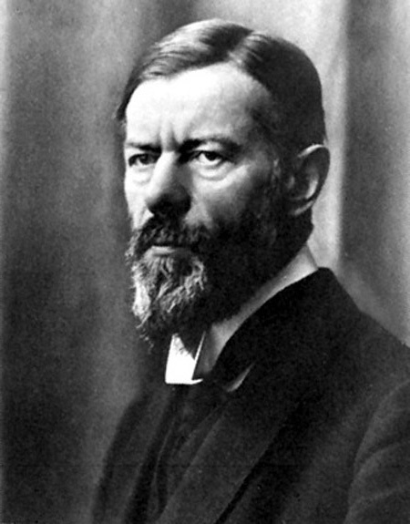
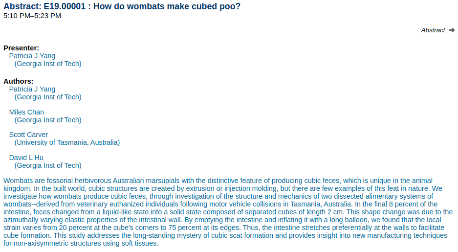
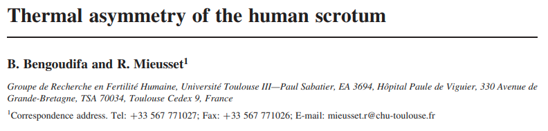
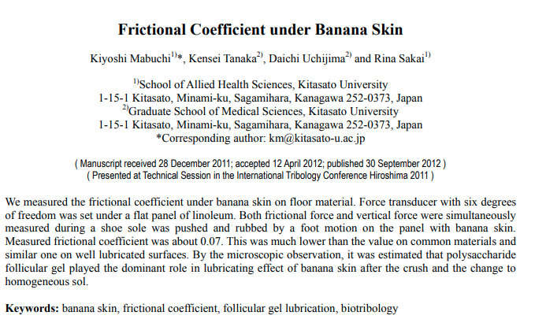

```{r setup, include=FALSE}
knitr::opts_chunk$set(echo = FALSE)
```

# What is the purpose of Science?

## {.centered}

<figure>

<figcaption>Max Weber. German. 1864-1920</figcaption>
</figure>


## Today's Agenda

### 1. Max Weber: What is the value of science?

- **Key insights** about science
- Weber's answer: **the value of science**


# Science as Vocation

# What is the value of science?

## Answer 1

### **Science can reveal (God(s), Nature, Truth) that unite what exists (what is) with what is right (what ought) and gives our lives meaning.**

<br> 

>- Weber says: "Nope."

## Insight 1

**Compared to "theology" (unscientific forms of thought), science only assumes that scientific, objective truth exists and is valid, but otherwise all knowledge or claims are open to scrutiny or challenge**

**In "theology"**: specific facts/values are taken as "revelation" or "faith" and not open to question

## Answer 2:

Ok. So maybe...

### **Scientific knowledge and mastery over our lives can increase happiness.**

<br>

>- Weber throws shade :"Who believes this? Aside from a few big children in university chairs and editorial offices."

# {.centered}


## Insight 2:

> **"Science is meaningless because it gives no answer to our question: the only question important for us: What shall we do and how shall we live?"** - Tolstoi 

<br> 

>- Weber means: science cannot resolve questions about **value**

# What is the best music?

# How would you prove it...<br>with science?

# What *can* science do?

## Insight 3

### **Science is a form of knowledge concerned with prediction**

>- It can tell us: if we/something take this action, what will happen

##  Answer 3: 

### **Science is valuable in itself because it increases objective knowledge**

<br>

>- Weber still says NO!

## Insight 4

### **Science is not "value-free". We use values to decide what is worthwhile to know about.**

<br> 

>- "More to know than can ever be known"
>- We might question whether these values/choices are correct.

## {.centered}

<figure>

<figcaption>how, and why, wombats make cube-shaped faeces</figcaption>
</figure>

## {.centered}

<figure>

<figcaption>measuring scrotal temperature asymmetry in naked and clothed postmen in France</figcaption>
</figure>


## {.centered}

<figure>

<figcaption>measuring the amount of friction between a shoe and a banana skin, and between a banana skin and the floor, when a person steps on a banana skin that's on the floor</figcaption>
</figure>

## Not always silly:

Discuss with your neighbors:

- **Who decides what is worth studying?** 
- **Who decides what research is funded?**

**Do you think this matters? Why/why not?**

# Do we *want* scientists <br> without values?

# So why do science?

## Weber's Answer:

**clarity**: We hold values that tell us what is desirable. Science can **clarify**:

1. What actions we should take to reach the desirable outcome?
2. Are there unexpected consequences that place our values in conflict?

## Weber's Answer:

In modern times, we have two choices:

1. go back to with faith and devotion to the old religions 
2. It is our **duty** to apply science to clarify our values and to inform our actions.

## In sum:

Using Weber's 4 insights we will:

- Derive attributes of scientific thinking
- Unscientific forms of thinking
- Identify types of questions science can/cannot answer

