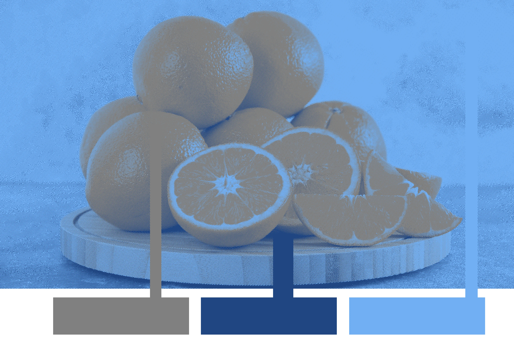

```{r setup, include=FALSE}
knitr::opts_chunk$set(echo = FALSE)
```

# Politics and Science

## Objectives

1. What is politics?
2. What is the big question in politics?
3. Forst on power and justification
4. Perception
5. The role of science?

# What is politics?

## Politics

Aristotle: how people live together in communities

## Politics

For Aristotle and many others, the key question is:

How **should** we live together in communities? How **should** we organize our communities?

>- Not to mention: who or what should be considered a member of our community?

## Politics

But Weber tells us that science cannot answer questions about value:

Science can only tell us about the **is**, not the **ought** or **should**.


## Politics


Is science irrelevant to politics?


# Power and Justification

## Power

Rainer Forst (reading for this week) argues:

- need not be a sharp divide between scientific investigation of politics and attempts to answer what we **should** do.

## Power and Justification

Forst's argument in brief:

1. Politics fundamentally about **power**
2. Power is fundamentally linked to **justification**
3. **Justification** brings together facts and values:
  - justifications always include some **should** (values)
  - moral intuitions to prefer "good" justification (values)
  - justifications rest on factual claims about the world ("is")
  - we can factually learn whether justifications are "good" ("is")
  
  
  
## Power

**power**: "is the capacity of A to motivate B to think or do something that
B would otherwise not have thought or done."

- motivation $\to$ "to have and exercise power means being able to influence, use, determine, occupy or even
seal off the space of reasons for others."

>- normatively neutral definition. Could be a "good" or "bad" thing.


## Power


## Power


## Power


## Power


## Justifications

**justification**: is a reason to motivate someone to adopt some behavior.

Justifications include key elements:

- a value or values about what is good or desirable
- factual claims about the state of the world

    - to show that values are relevant
    - to alter behavior

- factual claims about what causes various phenomena


## Justifications

**Values about what is desirable**: Catholic Church and the sale of indulgences.

- Medieval church cultivate belief in heaven, purgatory, hell; access to these places through **grace**
- "Excess Grace" could be acquired by donation to Church, monasteries, military orders
- Nobility of Europe endowed church with extensive resources.


## Justifications

**Factual claims to show values are relevant**:

> "You know, in New York, what’s happening with crime is it's through the roof, and it's called 'migrant' ... They beat up police officers. You've seen that they go in, they stab people, hurt people, shoot people. It's a whole new form, and they have gangs now that are making our gangs look like small potatoes."

---

<iframe width="560" height="315" src="https://www.youtube.com/embed/hzFMRetL-LY?si=yu8G8dVrWTHAYHNO" title="YouTube video player" frameborder="0" allow="accelerometer; autoplay; clipboard-write; encrypted-media; gyroscope; picture-in-picture; web-share" referrerpolicy="strict-origin-when-cross-origin" allowfullscreen></iframe>

## Justifications

Claims about migrant crime used to invoke values of security; also to motivate people to vote for Trump.

## Justifications

**factual claims to alter behavior**:

<iframe width="560" height="315" src="https://www.youtube.com/embed/nr-zxgOlSLg?si=_vM3ZLZC9QpX8awP" title="YouTube video player" frameborder="0" allow="accelerometer; autoplay; clipboard-write; encrypted-media; gyroscope; picture-in-picture; web-share" referrerpolicy="strict-origin-when-cross-origin" allowfullscreen></iframe>

## Justifications

**factual claims about causes**

- Carbon Tax in Canada
- Justification for taxing carbon emissions rests on claim that $\mathrm{CO_2}$ emissions drive climate change.


## Justifications and Power

**How are justifications linked to power**?

Power implicitly/explicitly involves justification to alter behavior.

---

Is armed robbery a use of power? What is the justification?


---

**Does the power in armed robbery depend on the gun?**


---

**What happens to power when threats of violence do not deter people?**


## Justification and Power

**violence** (for Forst) is when others are reduced to mere physical objects to be moved or
destroyed. Violence might used in justifications for **OTHERS** to behave in a certain way, but the use of violence shows that A no longer can motivate a change in the behavior of B. 

- When A no longer attempts to motivate B to do something, it reflect a loss of power of A over B

- the **material capability** for violence may be meaningless when it loses justification.

---

Bangladesh, August 2024


## Justifications and Values

In two ways, justifications connected to value:

1. Justifications invovle claims about values
2. We can develop a normative standard about good vs poor justifications

## Justifications and Values

Forst defines:

**domination**: when justifications for power are *hegemonic* (crowd out others) by  limiting the ability of others to question or challenge justifications by controlling information or using threats or violence.


## Justification and Values


**critical theory principle** (criteria for good vs. poor justifications):

>"the acceptance of a justification does not count if the acceptance itself is produced by the coercive power which is supposedly being justified."

If acceptance of justification is itself dependent on **domination** or using unjustified power, it is a poor justification.

- note: this does not specify the CONTENT of the justifications or what is justified, just the mode of justification

## Justification and Values:

**Values about what is desirable**: Catholic Church and the sale of indulgences.

- Critics of Catholic Church policy on accumulating wealth and indulgences deemed "heretics" 
- Excommunication and execution (violence)
- Ban on vernacular translations of the Bible (control over information)

## Justification and Values:

**Factual claims to show values are relevant**:

- Politicians in public eye use their power to push (possibly distorted) information about crime rates

## Justification and Values:

**factual claims to alter behavior**: use of threats to get participation in mass rallies, for the illusion of support


## Justification and Values:

**factual claims about causes**:

Petroleum companies spending money on sponsored research and advertising to undermine belief in climate change: uses power to secure acceptance of justification to not tax carbon


## Right to Justification

If **we** want to be given good justifications by others for power

- we don't want to accept under threat of violence
- we don't want to be duped/misled into acceptance based on misrepresentation

We should also give good justifications to others.

## Justification and Facts

If justification involves **values** and we have moral intuition that we deserve **good** justification... **what is the role of facts?**

## Justification and Facts

Facts are relevant to:

1. Claims about how the world is and what causes what. (interrogate justifications)
2. Claims about whether unjustified power acts on us to **secure our acceptance** to other uses of power. (interrogate the quality of justifications: good vs poor)

- how might power shape information we have? shape our perception? shape our values? 
- how might power be used to deny access to debates over justification?

# Politics and Science

## How do we evaluate facts?

If justifications can be factually interrogated for correctness and whether they are "proper" (good) justifications...

**How do we do that?**

**Why is *science* the way?**

## Plato's Allegory of the Cave


## Plato's Allegory of the Cave

We are not in a Cave.

We can certainly use our senses of perception.

# Detour

---

What color are these fruits?


---

What color are these fruits?



---


---

<iframe width="560" height="315" src="https://www.youtube.com/embed/af78RPi6ayE?si=m2x-1XvOq_nTq7WO&amp;start=1818" title="YouTube video player" frameborder="0" allow="accelerometer; autoplay; clipboard-write; encrypted-media; gyroscope; picture-in-picture; web-share" referrerpolicy="strict-origin-when-cross-origin" allowfullscreen></iframe>

---

What color are these chess pieces?


# A problem

## Politics and Science

Our vision can be tricked and manipulated.

We perceive even less about the political world in which we live:

- How much have you directly experienced: government, people from opposing political camps, specific political issues?
- How much of what you "know" comes from representations from others? Video? Social media?

Those who can shape **what** we see and **how** we see it have great power over us.

>- is "proper" justification even possible?

---


# Conclusion

## What is science?

What is science as a form of knowledge?

Can science help us learn about the world in a manner free from domination? How?