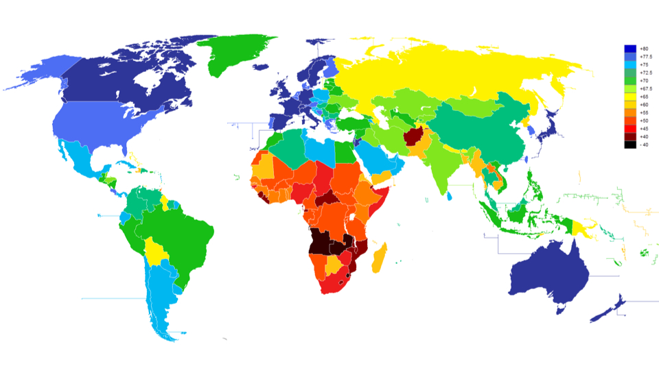
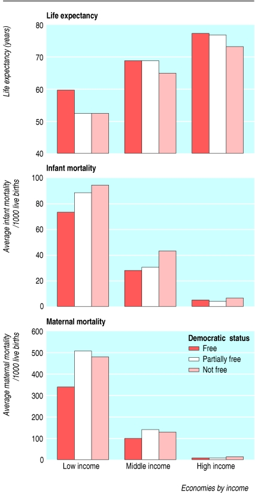

```{r setup, include=FALSE}
knitr::opts_chunk$set(echo = FALSE)
require(knitr)
```


<style>
div.footnotes {
  position: absolute;
  bottom: 0;
  margin-bottom: 10px;
  width: 80%;
  font-size: 0.6em;
}
</style>

<script src="https://ajax.googleapis.com/ajax/libs/jquery/3.1.1/jquery.min.js"></script>

<script>
  $(document).ready(function() {
    $('slide:not(.backdrop):not(.title-slide)').append('<div class=\"footnotes\">');

    $('footnote').each(function(index) {
      var text  = $(this).html();
      var fnNum = (index+1).toString().sup();
      $(this).html(text + fnNum);

      var footnote   = fnNum + ': ' + $(this).attr('content') + '<br/>';
      var oldContent = $(this).parents('slide').children('div.footnotes').html();
      var newContent = oldContent + footnote;
      $(this).parents('slide').children('div.footnotes').html(newContent);
    });
  });
</script>

# Causal Logics

## Plan for Today:

### **(1) Types of Causes**

Review:

- "structural" causes
- "triggering" events
- types of conjunctural claims

### **(1) Causal Theories**

- Causal Logics

## Types of Causes

### **structural causes**

Those causes that are **necessary** in **many** sets of **sufficient conditions**

- thus, structural causes contribute to an effect/outcome under **many different conditions**

### **triggering events**

**triggering events** are those causes that are only **necessary** in **one** or a **few** sets of **sufficient conditions**
- produce outcome only under **specific conditions** in combination with some **structural causes**
- substitutable (some trigger, not this specific trigger needed


## Types of Causes: Example

Which are structural causes? Which are triggers?

### Global Financial Crisis of 2008

1. Growing Wealth Inequality (structural)

2. Weak Regulatory Structures (structural)

3. Slow Wage Growth (structural)

4. Collapse of Lehman Brothers investment bank (trigger)

## Types of Causes: Example

Which are structural causes? Which are triggers?

### Voting

1. Level of education

2. Competitiveness of election

3. Income

4. Raining on election day


## Types of Causes: Example

Which are structural causes? Which are triggers?

### Voting / Not Voting

1. Level of education (structural)

2. Competitiveness of election (structural)

3. Income (structural)
 
4. Raining on election day (structural)

---

| Sufficient Causes | Effect |
|---------------|--------|
| **A & B & Z** |  E     |
| **A & B & Y** | E      |
| **A & B & X** | E      |
| **B & C & W** | E      |
| **C & D & V** | E      |
| **A & C & U** | E      |
| **A & D & T** | E      |

## Preceding Table:

In this table, causality of $E$ is **multiple** (7 different sufficient conditions) and **conjunctural** (each sufficient condition has **multiple necessary conditions**)

$A, B, C, D$ are "**structural causes**" per our definition, because they are **necessary** for **multiple** sufficient conditions

- of, $A$ is a cause under the MOST conditions (5), $D$ is a cause in the FEWEST conditions (2).

$T,U,V,W,X,Y,Z$ are all triggers. They are causes under one specific set of conditions

## Which causes?

Social science **generally** interested in **structural causes**.

### We want **prediction**

- This requires finding patterns/regularities in different contexts
- **triggering events** may not be relevant across contexts
- **structural causes** are.

Want causal **patterns/regularities**

## Review:

Which type of conjunctural causes?

1. Education has a positive effect on future earnings that is smaller for people who come from wealthy familities and larger for people from families with low or middle incomes.

2. Without an elite that is divided over economic policy and a growing middle class, countries will not transition from dictatorship to democracy


## Review:

Which type of conjunctural causes?

1. Education has a positive effect on future earnings that is smaller for people who come from wealthy familities and larger for people from families with low or middle incomes. (**Conditional Effect**)

2. Without an elite that is divided over economic policy and a growing middle class, countries will not transition from dictatorship to democracy. (**Multiple Necessary Conditions**)


# Causal Logics

## Causal Theory

A **causal theory** identifies **systematic**/**structural** causes that operate across space and time

- It is a kind of **general** knowledge
- **Patterns**/**regularities** within complexity
- Helps to **predict** what will happen
- Helps explain **specific** event

## Example: Democracy and Health



--- 


 
## Example: Democracy and Health

Might lead us to a **causal claim**:

> **"Democratizing causes countries to have better health outcomes on average."**
 
## Causal Logic says "why"

**More democracy** $\xrightarrow{}$

Voters can remove leaders $\xrightarrow{}$

Leaders try to make voters happy $\xrightarrow{}$

Governments spend more on improving citizen health $\xrightarrow{}$

**Better health for citizens**

## Causal Logic

### **causal logic**:

Is a set of statements about **how** and **why** a cause $C$ produces its (claimed) effect $E$.

- Causal logic gives a **causal chain** that logically connects cause $C$ to the effect $E$: $C \xrightarrow{} e_1 \xrightarrow{} e_2 \xrightarrow{} e_3 \xrightarrow{} E$
- Each step/mechanism is causal: $e_1$ is a cause of $e_2$

Assumptions/assertions

- Each step in the logic assumes a theory of how the world works/might work (why $e_1 \to e_2$)
- E.g.: do we believe this logic if we don't accept $e_2 \xrightarrow{} e_3$

## Making a causal logic

Causal logic for claim that $C \xrightarrow{causes} E$:

1. Must start with **cause** $C$, end with the **effect** $E$
2. Each step is related to the next through a **causal** relationship
3. **Not** a chronological list of specific events. It is a **general** sequence through which one things causes another (structural causes)

## Example: Democracy and Health

**More democracy $\xrightarrow{}$**

Voters can remove leaders $\not\xrightarrow{??}$

Leaders try to make voters happy $\xrightarrow{}$

Governments spend more on improving citizen health $\xrightarrow{}$

**Better health for citizens**

<hr style="height:8px; visibility:hidden;" />

#### **For "??" step to work, assume that:**

- Politicians motivated to stay in office

## Example: Democracy and Health

**More democracy $\xrightarrow{}$**

Voters can remove leaders $\xrightarrow{}$

Leaders try to make voters happy $\not\xrightarrow{??}$

Governments spend more on improving citizen health $\xrightarrow{}$

**Better health for citizens**

<hr style="height:8px; visibility:hidden;" />

#### **For "??" step to work, assume that:**

- Votes are cast based on health policy/outcomes

## Why causal logics?

### Tell us *how* and *when* cause creates effect

- this can help refine the **scope** (generality) of the causal claim
- link to structural causes and probabilistic causal claims
    
### Suggest *other* causes

- If $C_1 \xrightarrow{} e_1 \xrightarrow{} e_2 \xrightarrow{} e_3 \xrightarrow{} E$
- We can find a $C_2$ that causes $\to e_2 \to e_3 \to E$
    
### Improve prescriptive claims

- If we can't change $C$, can we change $e_2$?
- Policies require specifics: causal logics give us more specifics on **how**

## Competing Causal Logics

Wealthy countries are less likely to experience civil war. Why?

### Three different logics

1. Wealth $\xrightarrow{}$ Larger defense budget $\xrightarrow{}$ Rivals deterred $\xrightarrow{}$ Less civil war
2. Wealth $\xrightarrow{}$ Higher standard of living $\xrightarrow{}$ Fewer grievances $\xrightarrow{}$ Weak support for change $\xrightarrow{}$ Less civil war
2. Wealth $\xrightarrow{}$ Lots of job opportunities $\xrightarrow{}$ Fewer listless young men $\xrightarrow{}$ Fewer rebel recruits $\xrightarrow{}$ Less civil war


## Competing Causal Logics

If you were a rebel (trying to start a civil war), what would you do if 1 were true? 2? 3?

### Three different logics

1. Wealth $\xrightarrow{}$ Larger defense budget $\xrightarrow{}$ Rivals deterred $\xrightarrow{}$ Less civil war
2. Wealth $\xrightarrow{}$ Higher standard of living $\xrightarrow{}$ Fewer grievances $\xrightarrow{}$ Weak support for change $\xrightarrow{}$ Less civil war
3. Wealth $\xrightarrow{}$ Lots of job opportunities $\xrightarrow{}$ Fewer listless young men $\xrightarrow{}$ Fewer rebel recruits $\xrightarrow{}$ Less civil war


## Competing Causal Logics

If you were the ruler (trying to prevent a civil war), what would you do if 1 were true? 2? 3?

### Three different logics

1. Wealth $\xrightarrow{}$ Larger defense budget $\xrightarrow{}$ Rivals deterred $\xrightarrow{}$ Less civil war
2. Wealth $\xrightarrow{}$ Higher standard of living $\xrightarrow{}$ Fewer grievances $\xrightarrow{}$ Weak support for change $\xrightarrow{}$ Less civil war
2. Wealth $\xrightarrow{}$ Lots of job opportunities $\xrightarrow{}$ Fewer listless young men $\xrightarrow{}$ Fewer rebel recruits $\xrightarrow{}$ Less civil war

When will wealth cause lower chance of civil war?