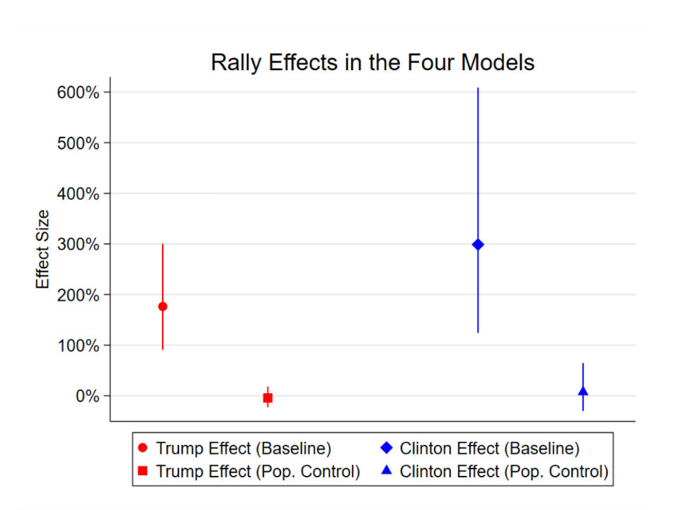

```{r setup, include=FALSE}
knitr::opts_chunk$set(echo = FALSE)
require(haven)
require(data.table)
require(ggplot2)
require(magrittr)
require(ggdag)
```

# Correlation to Causation

## Solutions to Confounding

1. Recap
2. Conditioning


# Recap

## Solutions to Confounding


## Solutions to Confounding

**Every way** of using correlation as evidence for causality **makes assumptions**

- FPCI cannot be solved without assumptions
- With assumptions, can say confounding/bias is not a problem

## Internal vs External Validity

**Every way** of using correlation as evidence for causality makes trade-off between:

- **internal validity**: how plausible are assumptions that set aside confounding?
- **external validity**: how much does this causal relationship speak to the causal claim/question of interest?

---

| Solution | How Bias<br>Solved | Which Bias<br>Removed | Assumes | Internal<br>Validity | External<br>Validity |
|--------------------|------------------------------|------------------------------------------------|---------|----------------------|----------------------|
| Experiment | Randomization<br>Breaks $W \rightarrow X$ link | **All** confounding variables | $X$ is random<br> Change only $X$ | High | Low | 
| Conditioning | Hold confounders<br>constant | ? | ? | Low | High |

# Conditioning

---

### **conditioning**

when we observe $X$ and $Y$ for multiple cases, we examine the correlation of $X$ and $Y$ *within* groups of cases that are **the same** on confounding variables $W, etc. \ldots$

How does conditioning solve confounding? 

- Cases compared have **same values** on confounding variable $W$
- In these groups, $W$ cannot affect $X$ or $Y$
- "Backdoor" path from $X$ to $Y$ is "blocked"

## Conditioning: Example

A few weeks back we asked:

### **Did Trump rallies *increase* hate crimes?**

- inflammatory rhetoric $\xrightarrow{?}$ violence
- many argue there is a link
- but is there empirical evidence of causality?

## Conditioning: Example

```{r echo = F, message = F, warning = F}
rally_data = fread('./trump_rally_data.csv')

data = rally_data %>% 
        .[, list(rally = trumpeverrally[1], 
                 hate_crimes = ifelse(trumpeverrally[1] == 1,
                                      sum(incidentcount[trumprallyoccured ==1]) / sum(trumprallyoccured),
                                      sum(incidentcount)/length(incidentcount)
                                      )
                 ), by = fips]

ggplot(data, aes(x = rally, y = hate_crimes)) + geom_jitter(width = 0.1, alpha = 0.1) +  geom_smooth(method = lm, se = FALSE) + 
  xlab("Trump Rallies (Any)") +
  ylab("Hate Crimes (per month)") +
  ggtitle("Trump Rallies and Hate Crimes by County (2016):\nCorrelation") + 
  theme_bw()
```

data from [Feinberg, Branton, and Martinez-Ebers ](https://lmas.unt.edu/sites/lmas.unt.edu/files/lmas/Hate%20Incidents%20Spike_0.pdf)

## Conditioning: Example

Correlation between Trump Rallies and Hate Crimes might suffer from confounding

- Places that Trump visits might be different than places he does not.
- These differences might be related to Hate Crimes.

---

```{r, echo = F, warning = F, message = F}
dagify(hate_crime ~ rally + jewish + hate_group + crime + gop + univ + region,
      rally ~ jewish + hate_group + crime + gop + univ + region,
       exposure = "rally", 
       outcome = 'hate_crime',
       labels = c('rally' = "(X) Trump\nRally", 
                  'hate_crime' = "(Y) Hate Crimes",
                  'jewish' = '% Jewish',
                  'hate_group' = '# Hate\nGroups',
                  "crime" = "Crime Rate",
                  'gop' = 'Republican\nVoters',
                  'univ'= 'Univ.\nEducated',
                  'region' = "Region"
                  )) %>%
  tidy_dagitty(layout='circle') %>%
ggplot(aes(x = x, y = y, xend = xend, yend = yend)) +
  #geom_dag_node() +
  geom_dag_edges_link(mapping = aes(label = c(rep('',8), "?" ,rep('', 5))),
                      angle_calc = "along", label_dodge = unit(rep(1,15),'lines')) +
  geom_dag_text(mapping = aes(label = label), colour = 'black') +
  theme_dag() +
  scale_adjusted()
```

## Example: Conditioning:

[Feinberg, Branton, and Martinez-Ebers ](https://lmas.unt.edu/sites/lmas.unt.edu/files/lmas/Hate%20Incidents%20Spike_0.pdf) compare hate crimes in counties with and without Trump rallies, but condition on (hold constant):

- percent Jewish
- number of hate groups
- crime rate
- 2012 Republican vote share
- percent university educated
- region

---

```{r, echo = F, warning = F, message = F}
dagify(hate_crime ~ rally + jewish + hate_group + crime + gop + univ + region,
      rally ~ jewish + hate_group + crime + gop + univ + region,
       exposure = "rally", 
       outcome = 'hate_crime',
       labels = c('rally' = "(X) Trump\nRally", 
                  'hate_crime' = "(Y) Hate Crimes",
                  'jewish' = '% Jewish',
                  'hate_group' = '# Hate\nGroups',
                  "crime" = "Crime\nRate",
                  'gop' = 'GOP\nVoters',
                  'univ'= 'Univ.\nEducated',
                  'region' = "Region"
                  )) %>%
  tidy_dagitty(layout='circle') %>%
ggplot(aes(x = x, y = y, xend = xend, yend = yend)) +
  #geom_dag_node() +
  geom_dag_edges_link(mapping = aes(label = c(rep('held constant',8), "" ,rep('held_constant', 5)), label_size = 2),
                      angle_calc = "along", label_dodge = unit(rep(1,14),'lines'),
                      edge_linetype = rep(c(3,3,3,3,3,3,3,3,1,3,3,3,3), each = 100),
                      arrow = grid::arrow(length=grid::unit(c(0,0,0,0,0,0,0,0,0,0,0,10), 'pt'), type = 'closed')) + 
  geom_dag_text(mapping = aes(label = label), colour = 'black') +
  theme_dag() +
  scale_adjusted()
```

## Example: Conditioning

[Feinberg, Branton, and Martinez-Ebers ](https://lmas.unt.edu/sites/lmas.unt.edu/files/lmas/Hate%20Incidents%20Spike_0.pdf) find that, even after conditioning, Trump rallies increase the risk of hate crimes by 200%!

- Lots of news headlines [like this](https://www.vox.com/2019/3/24/18279807/trump-hate-crimes-study-white-nationalism)

POLL

## Example: Conditioning

```{r echo = F, message = F, warning = F}
data = rally_data %>% 
        .[, list(rally = clintoneverrally[1], 
                 hate_crimes = ifelse(clintoneverrally[1] == 1,
                                      sum(incidentcount[clintonrallyoccured ==1]) / sum(clintonrallyoccured),
                                      sum(incidentcount)/length(incidentcount)
                                      )
                 ), by = fips]

ggplot(data, aes(x = rally, y = hate_crimes)) + geom_jitter(width = 0.1, alpha = 0.1) +  geom_smooth(method = lm, se = FALSE) + 
  xlab("Clinton Rallies (Any)") +
  ylab("Hate Crimes (per Month)") +
  ggtitle("Clinton Rallies and Hate Crimes by County (2016):\nCorrelation") + 
  theme_bw()
```

## Example: Conditioning

[Economics PhD Candidates](https://github.com/lilleymatthew/Trump_Rallies_Replication_Materials/blob/master/Trump_Rallies_and_Hate_Crimes.pdf) show that **conditioning on the same variables**...

- **Clinton rallies** increased hate crimes by **nearly 250%!!**

POLL

---

Any confounding variables that are missing from this diagram?

```{r, echo = F, warning = F, message = F}
dagify(hate_crime ~ rally + jewish + hate_group + crime + gop + univ + region,
      rally ~ jewish + hate_group + crime + gop + univ + region,
       exposure = "rally", 
       outcome = 'hate_crime',
       labels = c('rally' = "(X) Trump\nRally", 
                  'hate_crime' = "(Y) Hate Crimes",
                  'jewish' = '% Jewish',
                  'hate_group' = '# Hate\nGroups',
                  "crime" = "Crime\nRate",
                  'gop' = 'GOP\nVoters',
                  'univ'= 'Univ.\nEducated',
                  'region' = "Region"
                  )) %>%
  tidy_dagitty(layout='circle') %>%
ggplot(aes(x = x, y = y, xend = xend, yend = yend)) +
  #geom_dag_node() +
  geom_dag_edges_link(mapping = aes(label = c(rep('held constant',8), "" ,rep('held_constant', 5)), label_size = 2),
                      angle_calc = "along", label_dodge = unit(rep(1,14),'lines'),
                      edge_linetype = rep(c(3,3,3,3,3,3,3,3,1,3,3,3,3), each = 100),
                      arrow = grid::arrow(length=grid::unit(c(0,0,0,0,0,0,0,0,0,0,0,10), 'pt'), type = 'closed')) + 
  geom_dag_text(mapping = aes(label = label), colour = 'black') +
  theme_dag() +
  scale_adjusted()
```

---

```{r, echo = F, warning = F, message = F}
data = rally_data %>% 
        .[, list(rally_trump = trumpeverrally[1], 
                 hate_crimes_trump = ifelse(trumpeverrally[1] == 1,
                                      sum(incidentcount[trumprallyoccured ==1]) / sum(trumprallyoccured),
                                      sum(incidentcount)/length(incidentcount)
                                      ),
                 rally_clinton = clintoneverrally[1],
                 hate_crimes_clinton = ifelse(clintoneverrally[1] == 1,
                                      sum(incidentcount[clintonrallyoccured ==1]) / sum(clintonrallyoccured),
                                      sum(incidentcount)/length(incidentcount)
                                      ),
                 log_pop = log_pop[1]
                 ), by = fips] %>%
  melt.data.table(., id.vars = c('fips', 'log_pop'), 
                  measure = patterns("rally_", "hate_crimes_"), value.factor = F)
data[, Candidate := ifelse(variable %in% 1, 'Trump', 'Clinton')]  

ggplot(data, aes(x = log_pop, y = value1, color = Candidate )) + geom_jitter(height = 0.05, alpha = 0.1) +  geom_smooth(method = 'gam', se = FALSE) + 
  ylab("Trump Rallies (Any)") +
  xlab("Log population") +
  ggtitle("Population and Rallies by County (2016):\nCorrelation") + 
  theme_bw()
```

---

```{r, echo = F, warning = F, message = F}

ggplot(data, aes(x = log_pop, y = value2, color = Candidate )) + geom_jitter(height = 0.05, alpha = 0.1) +  geom_smooth(method = 'gam', se = FALSE) + 
  ylab("Hate Crimes (per Month)") +
  xlab("Log population") +
  ggtitle("Population and Hate Crimes by County (2016):\nCorrelation") + 
  theme_bw()
```

---


```{r, echo = F, warning = F, message = F}
dagify(hate_crime ~ rally + jewish + hate_group + crime + gop + univ + region+ pop,
      rally ~ jewish + hate_group + crime + gop + univ + region + pop,
       exposure = "rally", 
       outcome = 'hate_crime',
       labels = c('rally' = "(X) Trump\nRally", 
                  'hate_crime' = "(Y) Hate Crimes",
                  'jewish' = '% Jewish',
                  'hate_group' = '# Hate\nGroups',
                  "crime" = "Crime\nRate",
                  'gop' = 'GOP\nVoters',
                  'univ'= 'Univ.\nEducated',
                  'region' = "Region",
                  'pop' = 'Population'
                  )) %>%
  tidy_dagitty(layout='circle') %>%
ggplot(aes(x = x, y = y, xend = xend, yend = yend)) +
  #geom_dag_node() +
  geom_dag_edges_link(mapping = aes(label = c(rep('',8), "", "" ,"?",rep('', 5))),
                      angle_calc = "along", label_dodge = unit(rep(1,15),'lines'),
                      edge_linetype = rep(c(3,3,3,3,3,3,3,3,1,1,1,3,3,3,3), each = 100),
                      arrow = grid::arrow(length=grid::unit(c(0,0,0,0,0,0,0,0,0,0,0,0,0,10,10,10,10), 'pt'), type = 'closed')) + 
  geom_dag_text(mapping = aes(label = label), colour = 'black') +
  theme_dag() +
  scale_adjusted()
```


## Example: Conditioning

After conditioning on population (a confounder): no correlation.



## Conditioning Assumptions

In order to infer $X$ causes $Y$ if $X,Y$ correlated after conditioning

### **Must Assume**

1. There are **no other confounding variables** (that you have not conditioned on)
    - i.e. you have conditioned on ALL confounding variables
    - sometimes called "ignorability assumption": you assume you can "ignore" possible confounding

How do we **know** we have found and measured all confounding variables?


## Conditioning Assumptions

In order to infer $X$ causes $Y$ if $X,Y$ correlated after conditioning

### **Must Assume**

<ol start=2>
  <li> 
  **Variables used to condition** relationship between $X$ and $Y$ are **measured without error**.</li>
</ol>

- even **random measurement error** in confounding variables leads conditioning to fail.
- you are no longer comparing like-with-like.

## Conditioning: Limitations

In addition to assumptions: there are **other limitations**

We can only condition on so many variables. More possible confounding variables means...
    
- we need more cases
- less likely we find cases that exactly match
- may be harder to measure all confounding variables well

---


| Solution | How Bias<br>Solved | Which Bias<br>Removed | Assumes | Internal<br>Validity | External<br>Validity |
|--------------------|------------------------------|------------------------------------------------|---------|----------------------|----------------------|
| Experiment | Randomization<br>Breaks $W \rightarrow X$ link | **All** confounding variables | $X$ is random<br> Change only $X$ | High | Low | 
| Conditioning | Hold confounders<br>constant | Only variables <br> conditioned on | Condition on all confounders <br> Low measurement error | Low | High |

# Alternatives

## Alternatives

Can you think of a better comparison we can make to find out if Trump Rallies cause hate crimes?

Why would it be better?

