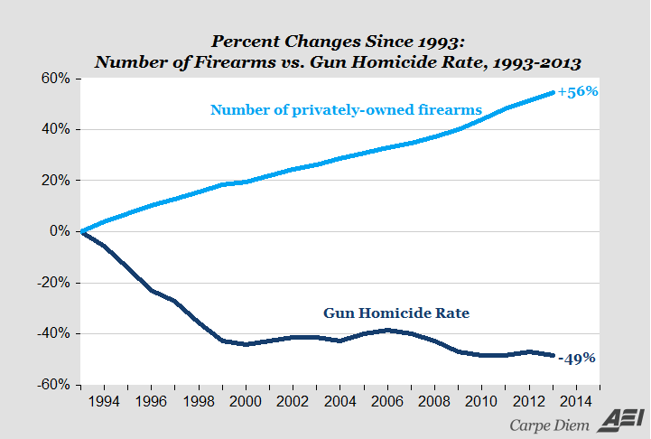
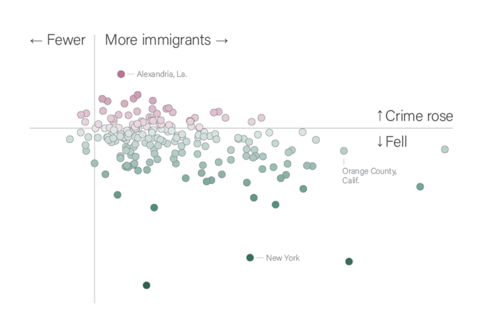

```{r setup, include=FALSE}
knitr::opts_chunk$set(echo = FALSE)
require(knitr)
```


<style>
div.footnotes {
  position: absolute;
  bottom: 0;
  margin-bottom: 10px;
  width: 80%;
  font-size: 0.6em;
}
</style>

<script src="https://ajax.googleapis.com/ajax/libs/jquery/3.1.1/jquery.min.js"></script>

<script>
  $(document).ready(function() {
    $('slide:not(.backdrop):not(.title-slide)').append('<div class=\"footnotes\">');

    $('footnote').each(function(index) {
      var text  = $(this).html();
      var fnNum = (index+1).toString().sup();
      $(this).html(text + fnNum);

      var footnote   = fnNum + ': ' + $(this).attr('content') + '<br/>';
      var oldContent = $(this).parents('slide').children('div.footnotes').html();
      var newContent = oldContent + footnote;
      $(this).parents('slide').children('div.footnotes').html(newContent);
    });
  });
</script>

# Causal Logics

## Plan for Today:

### **(1) Causal Theories**

- Causal Logics
- Independent/Dependent Variables

### **(2) Testing Causal Theories**

- hypotheses/empirical predictions
- fundamental problem of causal inference

# Causal Logics

## Causal Theory

To evaluate **causal claims**, we turn them into **causal theories**

A **causal theory** identifies **systematic**/**structural** causes that operate across space and time

- It is a kind of **general** knowledge
- **Patterns**/**regularities** within complexity
- **and it is testable**

## Causal Logics

One part of a causal theory is:

### **causal logic**:

Is a set of statements about **how** and **why** a cause $C$ produces its (claimed) effect $E$.

- **causal chain** connects cause $C$ to the effect $E$: $C \xrightarrow{} e_1 \xrightarrow{} e_2 \xrightarrow{} e_3 \xrightarrow{} E$
- Each step/mechanism is causal: $e_1$ is a cause of $e_2$

Assumptions/assertions

- Each step in the logic assumes a theory of how the world works/might work (why $e_1 \to e_2$)

## Making a causal logic

Causal logic for claim that $C \xrightarrow{causes} E$:

1. Must start with **cause** $C$, end with the **effect** $E$
2. Each step is related to the next through a **causal** relationship
3. **Not** a chronological list of specific events. It is a **general** sequence through which one things causes another (structural causes)

## Why causal logics?

1. **Tell us *how* and *when* cause creates effect**
    - this can help refine the **scope** (generality) of the causal claim
2. **Help us *test* causal claim**
    - we can test the main cause/effect, but also each step in the mechanism 
3. **Suggest *other* causes**
    - If $C_1 \to e_1 \to e_2 \to E$, then $C_2$ might $\to e_2 \to E$
4. **Improve prescriptive claims**
    - If we can't change $C$, can we change $e_2$?
    - Policies require specifics: causal logics more specific on **how**

## Causal Logics and "Scope"

**"Increasing wealth causes countries to be less likely to experience civil war."**

**Under what conditions?**

### A causal logic

1. **Wealth $\xrightarrow{}$ Larger defense budget $\xrightarrow{}$ Rivals deterred $\xrightarrow{}$ Less civil war**

## Causal Logics and "Testing"

**"Increasing wealth causes countries to be less likely to experience civil war."**

**What tests are there?**
 

### A different causal logic

1. **Wealth $\xrightarrow{}$ Higher standard of living $\xrightarrow{}$ Fewer grievances $\xrightarrow{}$ Weak support for change $\xrightarrow{}$ Less civil war**


## Causal Logics and "What to do"

You are a rebel (trying to start a civil war). You can't change the wealth of the country.

What would you do if 1 were true? 2? 3?

### Three competing causal logics

1. **Wealth $\xrightarrow{}$ Larger defense budget $\xrightarrow{}$ Rivals deterred $\xrightarrow{}$ Less civil war**
2. **Wealth $\xrightarrow{}$ Higher standard of living $\xrightarrow{}$ Fewer grievances $\xrightarrow{}$ Weak support for change $\xrightarrow{}$ Less civil war**
3. **Wealth $\xrightarrow{}$ Lots of job opportunities $\xrightarrow{}$ Fewer listless young men $\xrightarrow{}$ Fewer rebel recruits $\xrightarrow{}$ Less civil war**


## Causal Logics and "What to do"

You are the ruler (trying to prevent a civil war). You can't change the wealth of the country.

What would you do if 1 were true? 2? 3?

### Three competing causal logics

1. **Wealth $\xrightarrow{}$ Larger defense budget $\xrightarrow{}$ Rivals deterred $\xrightarrow{}$ Less civil war**
2. **Wealth $\xrightarrow{}$ Higher standard of living $\xrightarrow{}$ Fewer grievances $\xrightarrow{}$ Weak support for change $\xrightarrow{}$ Less civil war**
3. **Wealth $\xrightarrow{}$ Lots of job opportunities $\xrightarrow{}$ Fewer listless young men $\xrightarrow{}$ Fewer rebel recruits $\xrightarrow{}$ Less civil war**

## Causal Theories:

To turn a **causal claim** into a testable **causal theory**, we need:

1. **causal logic** connecting cause to effect: &#10003;
2. a statement of the **direction of the effect**: &#10003;
    - can't just say "$C$ affects $E$" without saying whether it causes it to/to not happen; more or less of something.
3. restate causal claim in terms of what is **observable**:
    - turn **concepts** into **variables** (exactly like with descriptive claims)
    - **independent variables**
    - **dependent variables**
    
## Variables and Causal Claims:

### **Independent variable**:

The variable capturing the purported **cause** in a causal claim.

- often denoted as "IV" or "$X$" or "right-hand variable"

### **Dependent variable**:

The variable capturing the purported **outcome** (what is *affected*) in a causal claim.

- often denoted as "DV" or "$Y$" or "left-hand variable"

### Why these terms?

Statistical/Mathematical expression: $Y = f(X)$ or $DV = f(IV)$


## Variables and Causal Claims:

### Causal Claim:

> "Guns don't kill people, people kill people"

Which implies: **"Increasing the prevalence of firearms in a region causes no change in human mortality"**

How would you turn this claim into something **observable**?

**Independent Variable** ($X$): ?

**Dependent Variable** ($Y$): ?

##  Variables and Causal Claims:

### Causal Claim: 

**"Exposure to anti-immigrant rhetoric on social media causes an increase in violence against immigrants"**

**Independent Variable** ($X$): ?

**Dependent Variable** ($Y$): ?

## Causal Theories:

To turn a **causal claim** into a testable **causal theory**, we need:

1. **causal logic** connecting cause to effect: &#10003;
2. a statement of the **direction of the effect**: &#10003;
    - can't just say "$C$ affects $E$" without saying whether it causes it to/to not happen; more or less of something.
3. restate causal claim in terms of what is **observable**: &#10003;
    - turn **concepts** into **variables** (exactly like with descriptive claims)
    - **independent variables**
    - **dependent variables**

# Testing Causal Theories

## Testing!

We turn **causal claims** into **causal theories** which are **testable**. We test causal theories by making...

### **hypotheses**/**empirical predictions**

these are statements about what we should **observe** if the causal claim is true.

- multiple **hypotheses** based on the overall causal claim **and** the causal logic
- Hypotheses state relationships between **variables**
    - When $X$ is present(absent), $Y$ is present(absent)
    - When $X$ is present(absent), $Y$ is more(less) likely
    - When $X$ increases(decreases), $Y$ increases(decreases)

## Testing!

### **Preceding definition of causal hypotheses is incomplete.**

<hr style="height:8px; visibility:hidden;" />

### **We will revisit this.**

## Examples:

claim: **"Ownership of firearms by citizens reduces crime"**


<hr style="height:8px; visibility:hidden;" />

**independent variable**: fraction of citizens owning firearms

**dependent variable**: crime victimization rate per 100 thousand 

<hr style="height:8px; visibility:hidden;" />

What is an **empirical prediction**/**hypothesis**?

## Examples:



## Examples:

claim: **"Increased immigration causes more crime"**

<hr style="height:8px; visibility:hidden;" />

**independent variable**: immigrant share of population

**dependent variable**: crime victimization rate per 100 thousand 

<hr style="height:8px; visibility:hidden;" />

What is an **empirical prediction**/**hypothesis**?

## Examples:



## Examples: What about this?

```{r, echo = F, message = F}
cage_data = data.frame(cage_films = c(2,2,2,3,1,1,2,3,4,1,4),
                       pool_deaths = c(109, 102, 102, 98, 85, 95, 96, 98, 123, 94, 102))
require(ggplot2)
ggplot(cage_data, aes(x =cage_films, y = pool_deaths)) + 
  geom_point(position = position_jitter(w = 0, h = 1)) + 
  geom_smooth(method = 'lm', fullrange = T, se = F) +
  theme_bw() +
  ggtitle("Do Nick Cage films cause Pool Drownings?") +
  xlab("Nick Cage Films per Year") + 
  ylab("Pool Drownings per Year (US)") + 
  theme(plot.title = element_text(size = 24, face = "bold"),
        axis.title=element_text(size=14,face="bold"))
```

## What are we missing?

###  Causality is **Counterfactual**

<hr style="height:8px; visibility:hidden;" />

If $X$ had been different for **the same case and the same time**, $Y$ would have been different

<hr style="height:8px; visibility:hidden;" />


#### **hypotheses** from causal theories must be about **potential outcomes**

- recall: **potential outcomes** are values the **dependent variable** $(Y)$ would take for a case under different values of the **independent variable** $(X)$

## New hypotheses:

### **Restate hypotheses in terms of counterfactuals**

<hr style="height:8px; visibility:hidden;" />

**If there were more guns (in a specific place,time), there would have been less crime**

<hr style="height:8px; visibility:hidden;" />

**If there were fewer immigrants (in a specific place, time), there would have been less crime**

<hr style="height:8px; visibility:hidden;" />

**If there were fewer Nick Cage films release (in a country, year), there would have been fewer pool drownings**


## A big problem

**Hypotheses** are **empirical predictions**: they are about what we should **observe** if $X$ causes $Y$.

The **counterfactual** approach to causality means: if $X$ causes $Y$ in some specific case, the **potential outcomes** of $Y$ are different across levels of $X$.

But for each case, only one **potential outcome** becomes "factual" and observable, the other(s) are **counterfactual** and **unobservable**

# Fundamental Problem of Causal Inference