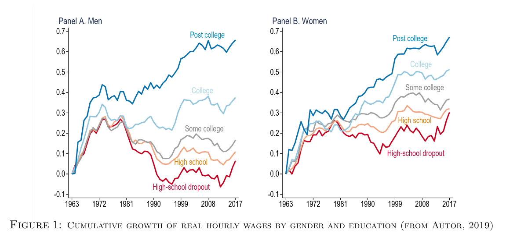
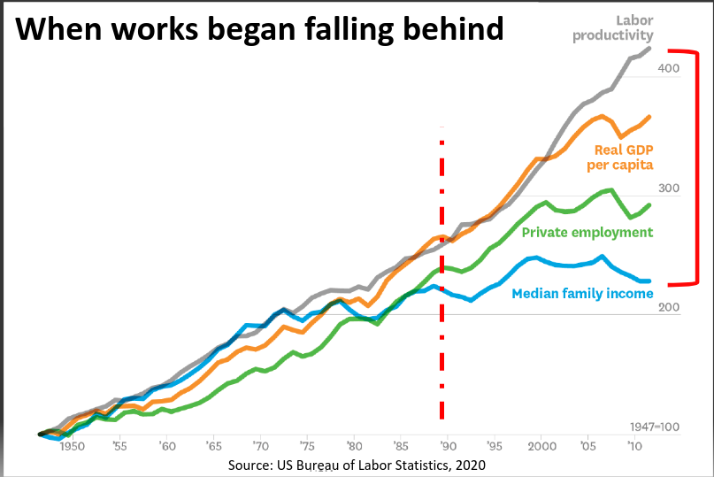

```{r setup, include=FALSE}
knitr::opts_chunk$set(echo = FALSE)
require(haven)
require(data.table)
require(ggplot2)
require(magrittr)
require(ggdag)
require(stringr)
```

# Correlation to Causation

## Solutions to Confounding

1. Recap
2. Before/After Comparisons

# Recap

## Solutions to Confounding

**Every way** of using correlation as evidence for causality **makes assumptions**

- FPCI cannot be solved without assumptions
- With assumptions, can say confounding/bias is not a problem


---

| Solution | How Bias<br>Solved | Which Bias<br>Removed | Assumes | Internal<br>Validity | External<br>Validity |
|--------------------|------------------------------|------------------------------------------------|---------|----------------------|----------------------|
| Experiment | Randomization<br>Breaks $W \rightarrow X$ link | **All** confounding variables | 1. $X$ is random<br> 2. Change only $X$ | High | Low | 
| Conditioning | Hold confounders<br>constant | Only confounders <br> conditioned on | 1. Condition on all confounders <br> 2. Low measurement error<br> 3. Cases similar in $W$ | Low | High |


## Conditioning

### **Did Trump rallies *increase* hate crimes?**

[Feinberg, Branton, and Martinez-Ebers ](https://lmas.unt.edu/sites/lmas.unt.edu/files/lmas/Hate%20Incidents%20Spike_0.pdf) compare hate crimes in counties with and without Trump rallies, **condition** on (hold constant):

- percent Jewish, number of hate groups, crime rate, 2012 Republican vote share, percent university educated, region

>- But they left out population, which confounded Trump rallies and Hate Crimes.
>- Difficult to find counties without rallies similar in many traits to counties **with** rallies

---

After conditioning on population (a confounder): no correlation.


## Limits of Conditioning:

### **Did Trump rallies *increase* hate crimes?**

1. If we know confounding variables, can we find cases *with* and *without* rallies that are **the same on *many* confounding variables**?

2. If we don't know or can't measure confounding variables, may **still be differences** between places with and without rallies that produce confounding.

>- What if we compare counties **before** and **after** rallies?

# Before and After

## Example: Before and After

Taking the same data from [Feinberg, Branton, and Martinez-Ebers ](https://lmas.unt.edu/sites/lmas.unt.edu/files/lmas/Hate%20Incidents%20Spike_0.pdf)...

- we focus **only** on counties that **ever had** a Trump (Clinton) rally
- compare the month **after** the rally to the month **before** the rally

---

```{r, echo = F, warning=F, message=F}
rally_data = fread('./trump_rally_data.csv')

#trump rallies
trump_rally = rally_data[trumpeverrally %in% 1]
trump_rally[, month_num := str_extract(monthyear, "\\d+$") %>% as.numeric]
trump_rally[, t_window := month_num - min(month_num[trumprallyoccured > 0]), by = fips]
trump_rally[, hc_per_capita := incidentcount/exp(log_pop)*100000]
trump_rally[, hc_per_capita_alt := hate_crimes/exp(log_pop)*100000]

trump_rally[, t_window_f := factor(t_window, levels = c(0, -4:-1, 1:4))]
trump_rally[, min_window := min(t_window), by = fips]
trump_rally[, max_window := max(t_window), by = fips]

#clinton rallies
clinton_rally = rally_data[clintoneverrally %in% 1]
clinton_rally[, month_num := str_extract(monthyear, "\\d+$") %>% as.numeric]
clinton_rally[, t_window := month_num - min(month_num[clintonrallyoccured > 0]), by = fips]
clinton_rally[, hc_per_capita := incidentcount/exp(log_pop)*100000]
clinton_rally[, hc_per_capita_alt := hate_crimes/exp(log_pop)*100000]
clinton_rally[, min_window := min(t_window), by = fips]
clinton_rally[, max_window := max(t_window), by = fips]

#Plot
ggplot(trump_rally[t_window %in% c(0,1) & min_window <= 0 & max_window >= 1], aes(x = factor(t_window, labels = c("Before", "After")), y = 1*(hc_per_capita))) +
  stat_summary(fun.data=mean_cl_normal, fun.args = list(mult=1), 
               geom="errorbar", color="black", width=0.2) +     
  stat_summary(fun=mean, geom="point", color="black") +
  geom_vline(xintercept = 1.5, colour = 'red', linetype = 'dashed') +
  geom_hline(yintercept = 0) +
  theme_bw() + 
  xlab("Time Since Rally (Month)") +
  ylab("Hate Crimes per Capita") +
  ggtitle("Hate Crimes in 195 Counties:\nBefore and After Trump Rallies") +
  coord_cartesian(ylim = c(0,0.1))
```

---

```{r, echo = F, warning=F, message=F}
#Plot
ggplot(clinton_rally[t_window %in% c(0,1) & min_window <= 0 & max_window >= 1], aes(x = factor(t_window, labels = c("Before", "After")), y = hc_per_capita )) +
  stat_summary(fun.data=mean_cl_normal, fun.args = list(mult=1), 
               geom="errorbar", color="black", width=0.2) +     
  stat_summary(fun=mean, geom="point", color="black") +
  geom_vline(xintercept = 1.5, colour = 'red', linetype = 'dashed') +
  geom_hline(yintercept = 0) +
  theme_bw() + 
  xlab("Time Since Rally (Month)") +
  ylab("Hate Crimes per Capita") +
  ggtitle("Hate Crimes in 40 Counties:\nBefore and After Clinton Rallies")+
  coord_cartesian(ylim = c(0,0.1))
```


## Before and After

DISCUSS 

If we compare counties to themselves **before** and **after** rallies... 


1. Which confounding variables are held constant?

2. What are confounding variables that might NOT be addressed in this comparison?

---

```{r, echo = F, warning=F, message=F}

#Plot
ggplot(trump_rally[t_window %in% c(0,1) & min_window <= 0 & max_window >= 1], aes(x = factor(t_window, labels = c("Before", "After")), y = 1*(hc_per_capita))) +
  stat_summary(fun.data=mean_cl_normal, fun.args = list(mult=1), 
               geom="errorbar", color="black", width=0.2) +     
  stat_summary(fun=mean, geom="point", color="black") +
  geom_vline(xintercept = 1.5, colour = 'red', linetype = 'dashed') +
  theme_bw() + 
  xlab("Time Since Rally") +
  ylab("Hate Crimes per Capita") +
  ggtitle("Hate Crimes in 195 Counties:\nBefore and After Trump Rallies")+
  coord_cartesian(ylim = c(0,0.1))
```

What kinds of confounding variables are held constant in this before/after comparison?


# Break


# Design Based Solutions


## Design Based Solutions

**Conditioning** removes confounding by:

- identifying possible confounding variables
- measuring confounding variables
- examine relationship b/t $X$ and $Y$ for cases with **similar value** of confounding variables $W$.


## Design Based Solutions

**Design-based** solutions remove confounding by:

- selecting cases for comparison in order to eliminate **many** known/unknown as well as measurable/unmeasurable confounding variables.
- the nature of the comparison holds constant **classes of confounding variables**, not  **specific** confounding variables.
- by a "class" we mean all confounding variables that share specific properties (e.g., unchanging over time)


## Example: Before and After


```{r, echo = F, warning = F, message = F}
dagify(hate_crime ~ rally + jewish + hate_group + crime + gop + univ + region + pop,
      rally ~ jewish + hate_group + crime + gop + univ + region + pop,
       exposure = "rally", 
       outcome = 'hate_crime',
       labels = c('rally' = "(X) Trump\nRally", 
                  'hate_crime' = "(Y) Hate Crimes",
                  'jewish' = '% Jewish',
                  'hate_group' = '# Hate\nGroups',
                  "crime" = "Crime\nRate",
                  'gop' = 'GOP\nVoters',
                  'univ'= 'Univ.\nEducated',
                  'region' = "Region",
                  "pop" = "Population"
                  )) %>%
  tidy_dagitty(layout='circle') %>%
  ggplot(aes(x = x, y = y, xend = xend, yend = yend)) +
  #geom_dag_node() +
  geom_dag_edges_link() +
  geom_dag_text(mapping = aes(label = label), colour = 'black') +
  theme_dag() +
  scale_adjusted()
  
```

Which of these possible confounders are held constant in a before-and-after comparison (month after vs month before rally)?

## Example: Before and After

```{r, echo = F, warning = F, message = F}
dagify(hate_crime ~ rally + unchanging + changing,
      rally ~ unchanging + changing,
       exposure = "rally", 
       outcome = 'hate_crime',
       labels = c('rally' = "(X) Trump\nRally", 
                  'hate_crime' = "(Y) Hate Crimes",
                  'changing' = 'Changing\nAttributes',
                  'unchanging' = 'Unchanging\nAttributes'
                  )) %>%
  tidy_dagitty(layout='circle') %>%
ggplot(aes(x = x, y = y, xend = xend, yend = yend)) +
  #geom_dag_node() +
  geom_dag_edges_link() +
  geom_dag_text(mapping = aes(label = label), colour = 'black') +
  theme_dag() +
  scale_adjusted()
```

## Example: Before and After

```{r, echo = F, warning = F, message = F}
dagify(hate_crime ~ rally + unchanging + changing,
      rally ~ unchanging + changing,
       exposure = "rally", 
       outcome = 'hate_crime',
       labels = c('rally' = "(X) Trump\nRally", 
                  'hate_crime' = "(Y) Hate Crimes",
                  'changing' = 'Changing\nAttributes',
                  'unchanging' = 'Unchanging\nAttributes'
                  )) %>%
  tidy_dagitty(layout='circle') %>%
ggplot(aes(x = x, y = y, xend = xend, yend = yend)) +
  #geom_dag_node() +
  geom_dag_edges_link(mapping = aes(label = c("","","","", "held constant\n(link broken)", "held constant\n(link broken)")),  
                                    angle_calc = "along", label_dodge = unit(c(1,-1,1,-1,-1),'lines'),
                                    edge_linetype = rep(c(1,1,1,2,2), each = 100),
                                    arrow = grid::arrow(length=grid::unit(c(10,10,10,0,0,0), 'pt'), type = 'closed')) +
  geom_dag_text(mapping = aes(label = label), colour = 'black') +
  theme_dag() +
  scale_adjusted()
```

## Example: Before and After

### **Confounding Solved?**...

**All** confounding variables (affect whether a rally occurs; affect hate crimes) that are **unchanging over time** are held constant.

- because held constant, cannot produce confounding
- e.g., demographic features, political leaning, location/geography, long-term economic trends, 8chan white nationalists
- any variable that **does not change *in the time period of the comparison* ** (in this case, two months) held constant
- does not matter if we can think of or even measure the confounders


## Design Based Solutions

**Before and after** comparisons are **design based**, because...

- they hold constant ALL **unchanging** confounding variables (a **class** of confounding variables).
- contrast to conditioning, only blocks specific variables/paths

And like all solutions to confounding: they make an **assumption**

## Design Based Solutions

Just like experiments and confounding, **Before and After** comparisons plug in for MISSING potential outcomes.

| County | Time   |  $Y:$ HC(Yes) | $Y:$ HC(No) | $X:$ Rally |
|--------|--------|:-------:|:------:|:-----:|
| $c$      | Before | $\color{red}{\text{Hate Crimes}_{c,Before}[\text{Rally}]}$    | $\color{black}{\text{Hate Crimes}_{c,Before}[\text{No Rally}]}$  | No    |
|        |        |         |   $\Downarrow$     |       |
| $c$    | After  | $\color{black}{\text{Hate Crimes}_{c,After}[\text{Rally}]}$    |  $\color{red}{\text{Hate Crimes}_{c,After}[\text{No Rally}]}$ | Yes   |

## Design Based Solutions

| County | Time   |  $Y:$ HC(Yes) | $Y:$ HC(No) | $X:$ Rally |
|--------|--------|:-------:|:------:|:-----:|
| $c$    | Before | $\color{red}{\text{Hate Crimes}_{c,Before}[\text{Rally}]}$    | $\color{black}{\text{Hate Crimes}_{c,Before}[\text{No Rally}]}$  | No    |
|        |        |         |   $\Downarrow$     |       |
| $c$    | After  | $\color{black}{\text{Hate Crimes}_{c,After}[\text{Rally}]}$    |  $\boxed{\color{black}{\text{Hate Crimes}_{c,Before}[\text{No Rally}]}}$ | Yes   |

We **assume** $\color{red}{\text{Hate Crimes}_{c,After}[\text{No Rally}]} = \\ \color{black}{\text{Hate Crimes}_{c,Before}[\text{No Rally}]}$

That is: if $X$ had not changed, $Y$ would not have changed.

## Before and After 

### Assumptions:

- assume that counterfactual potential outcomes of $Y$ without $X$ **after** $X$ happens, same as factual $Y$ without $X$ **before** $X$ happens
- equivalently: assume there are no variables $W$ that affect $Y$ and *change over time* with $X$.

Any $W$ that affects $Y$ and changes with $X$ will produce confounding **even if it does not *cause*** $X$.

- this is a *new* problem

## Example: Before and After

### **When does this assumption fail?**

- Did Trump rallies take place in places that are already **trending** toward having more hate crimes?
- Is it possible that Trump wanted to avoid controversy and waited to hold rallies in places until they had a month with a lower-than-usual number of hate crimes? (board)

>- We can address these concerns by looking at longer-term trends...


---

```{r, echo = F, warning=F, message=F}
l = -4
u = 2
#Plot
temp = trump_rally[t_window %in% c(l:u) & min_window <= l & max_window >= u]
u_c = temp$fips %>% unique %>% length
ggplot(temp, aes(x = as.factor(t_window), y = 1*(hc_per_capita ))) +
  stat_summary(fun.data=mean_cl_normal, fun.args = list(mult=1), 
               geom="errorbar", color="black", width=0.2) +     
  stat_summary(fun=mean, geom="point", color="black") +
  geom_vline(xintercept = 5.5, colour = 'red', linetype = 'dashed') +
  theme_bw() + 
  xlab("Time Since Rally") +
  ylab("Hate Crimes per capita") +
  ggtitle(paste0("Hate Crimes in ", u_c ," Counties:\nBefore and After Trump Rallies")) + 
  coord_cartesian(ylim = c(0,0.1))
```

---

```{r, echo = F, warning=F, message=F}

#Plot
l = -4
u = 2
#Plot
temp = clinton_rally[t_window %in% c(l:u) & min_window <= l & max_window >= u ]
u_c = temp$fips %>% unique %>% length

ggplot(temp, aes(x = as.factor(t_window), y = (hc_per_capita))) +
  stat_summary(fun.data=mean_cl_normal, fun.args = list(mult=1), 
               geom="errorbar", color="black", width=0.2) +     
  stat_summary(fun=mean, geom="point", color="black") +
  geom_vline(xintercept = 5.5, colour = 'red', linetype = 'dashed') +
  theme_bw() + 
  xlab("Time Since Rally") +
  ylab("Hate Crimes per Capita") +
  ggtitle(paste0("Hate Crimes in ", u_c ," Counties:\nBefore and After Clinton Rallies"))  +
  coord_cartesian(ylim = c(0,0.1))
```

Mostly constant upward trend; no change when rallies occur

## Example: Before and After

### **When does this assumption fail?**

**Over-time comparison**, we can **create** confounding from variables that do not **cause** $X$ to change, if they also **change with** $X$ over time...

- Does rally change **measurement**, but not **actual number** of hate crimes? (Measurement bias)

    - we can examine this concern by measuring hate crimes in other ways.
    
- Are there are other changes over the same time-frame (change at the same time as $X$, rallies)?

    - This is harder to solve. In the same situation as conditioning.
    - Less of a problem when comparing across very short time periods (fewer variables change)


---

```{r, echo = F, warning=F, message=F}

#Plot
l = -4
u = 2
#Plot
temp = trump_rally[t_window %in% c(l:u) & min_window <= l & max_window >= u]
u_c = temp$fips %>% unique %>% length
ggplot(temp, aes(x = as.factor(t_window), y = 1*(hc_per_capita_alt ))) +
  stat_summary(fun.data=mean_cl_normal, fun.args = list(mult=1), 
               geom="errorbar", color="black", width=0.2) +     
  stat_summary(fun=mean, geom="point", color="black") +
  geom_vline(xintercept = 5.5, colour = 'red', linetype = 'dashed') +
  theme_bw() + 
  xlab("Time Since Rally") +
  ylab("Hate Crimes per capita") +
  ggtitle(paste0("Hate Crimes in ", u_c ," Counties:\nBefore and After Trump Rallies\n FBI Hate Crime Data")) + 
  coord_cartesian(ylim = c(0,0.4))
```

---

```{r, echo = F, warning=F, message=F}

#Plot
l = -4
u = 2
#Plot
temp = clinton_rally[t_window %in% c(l:u) & min_window <= l & max_window >= u ]
u_c = temp$fips %>% unique %>% length

ggplot(temp, aes(x = as.factor(t_window), y = (hc_per_capita_alt))) +
  stat_summary(fun.data=mean_cl_normal, fun.args = list(mult=1), 
               geom="errorbar", color="black", width=0.2) +     
  stat_summary(fun=mean, geom="point", color="black") +
  geom_vline(xintercept = 5.5, colour = 'red', linetype = 'dashed') +
  theme_bw() + 
  xlab("Time Since Rally") +
  ylab("Hate Crimes per Capita") +
  ggtitle(paste0("Hate Crimes in ", u_c ," Counties:\nBefore and After Clinton Rallies\nFBI Hate Crime Data"))  +
  coord_cartesian(ylim = c(0,0.4))
```

## Example: Before and After

It may be that the effects are due to changes in **measurement**: Anti-Defamation League vs. FBI Hate Crimes give different results.

## Another Example:



Why have real wages stayed stagnant?

## Another Example:



Starting in the 1980s, automation via robotics/software started to grow.

## Another Example:

From "before" to "after" growth of automation, we see slowing or even reversal of growth in real wages:

- automation $\to$ inequality, worse job / health outcomes

---


Can we reasonably conclude the machines are to blame?

## Design: Before and After

### What is it?

Compare the same case to itself **before and after** change in $X$

### How does it work?

Holds constant all **unchanging attributes** of the case.

- any confounding variables that do not change over time cannot produce change in $Y$ with change in $X$


## Before and After: Assumptions

In order to infer $X$ causes $Y$ if $X,Y$ correlated in before/after comparison

### **Must Assume**

1. There are **no other variables** that affect $Y$ and *change* with $X$ over time (may be a causal or non-causal link of $W$ and $X$)

##  Before and After: Limitations

This assumption can be violated if...

- other variables that affect $Y$ change with $X$ over time.
- Value of $Y$ in cases has a long-term trend in one direction
- $X$ changes **in response** to extreme changes in $Y$ (e.g. gun laws respond to uptick in gun crimes)
- $X$ changes **measurement** of $Y$

---

| Solution | How Bias<br>Solved | Which Bias<br>Removed | Assumes | Internal<br>Validity | External<br>Validity |
|--------------------|------------------------------|------------------------------------------------|---------|----------------------|----------------------|
| Experiment | Randomization<br>Breaks $W \rightarrow X$ link | **All** confounding variables | 1. $X$ is random<br> 2. Change only $X$ | Highest | Lowest | 
| Conditioning | Hold confounders<br>constant | Only variables <br> conditioned on | 1. Condition on all confounders <br> 2. Low measurement error <br> 3. Cases same in $W$ | Lowest | Highest |
| Before and After | Hold confounders <br> constant | variables <br> unchanging <br> over time | 1. causes of $Y$ <br> do not change w/ $X$ | Lower | Higher | 

# Alternatives?
