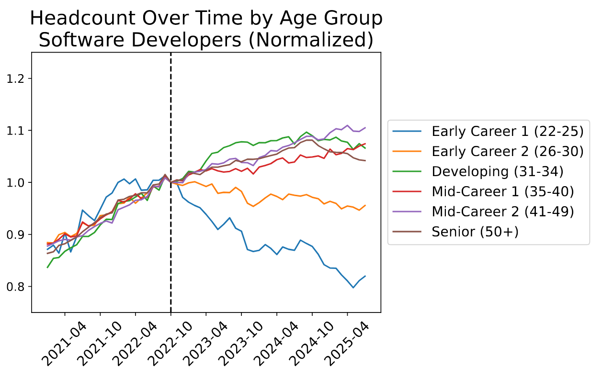
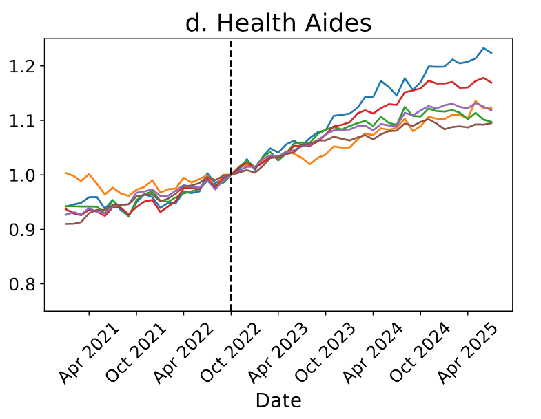
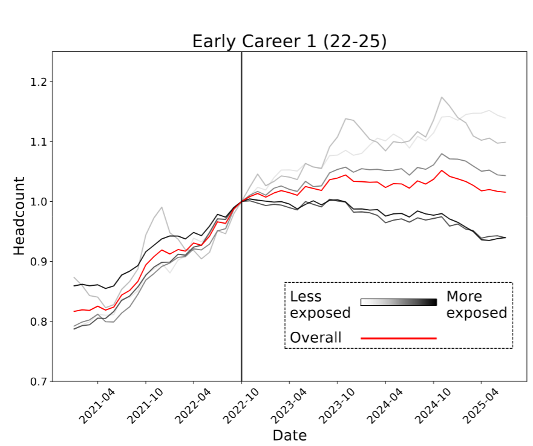
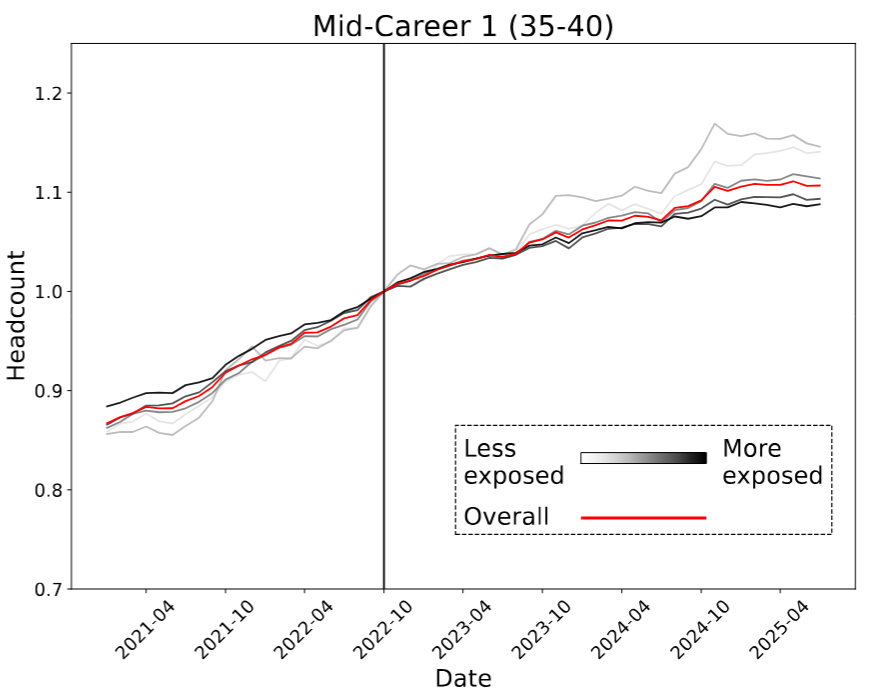
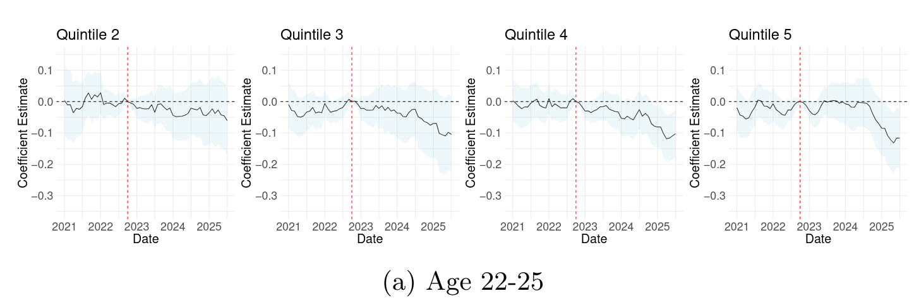
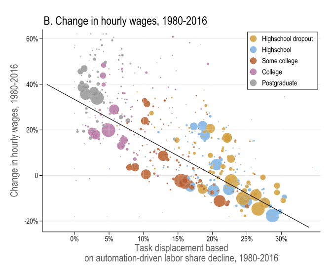
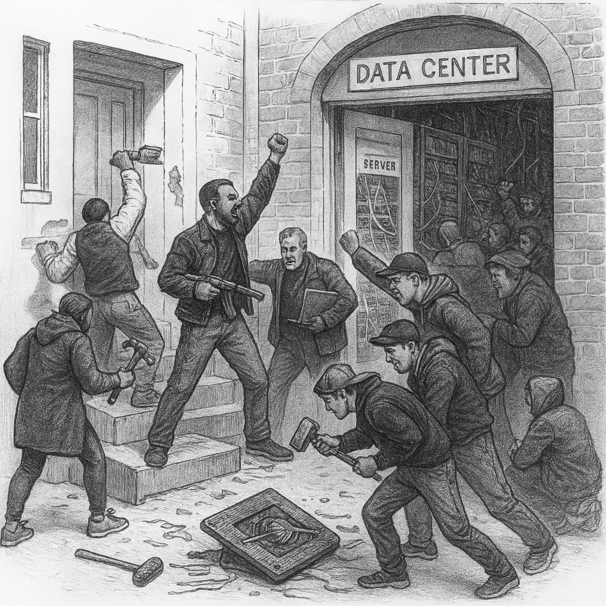

```{r setup, include=FALSE}
knitr::opts_chunk$set(echo = FALSE)
require(haven)
require(data.table)
require(ggplot2)
require(magrittr)
require(ggdag)
require(stringr)
require(ggpubr)

guns = fread('./results.csv', integer64 = 'double') %>%
       .[!is.na(Year)] 
guns[, gun_rate := as.numeric(`Age-Adjusted Rate`)]

border = c("Illinois", "Iowa", "Nebraska", "Kansas", "Oklahoma", "Arkansas", "Tennessee", "Kentucky")
guns_use = guns[State %in% c("Missouri", "Arkansas")]
guns_use[, States := ifelse(State %in% border, "Border", "Missouri")]
guns_all = guns_use
```

# Correlation to Causation

## Solutions to Confounding

1. Recap
    - Before and After
2. Differences in Differences
    - What is it?
    - How does it work?
    - Assumptions?
    - Example

# Recap


## Solutions to Confounding

**Every way** of using correlation as evidence for causality **makes assumptions**

- FPCI cannot be solved without assumptions
- With assumptions, can say confounding/bias is not a problem


---

<div style="position:relative; width:100%; padding-top:56.25%; padding-bottom:40px;"><iframe src="https://www.ispot.tv/share/6e6d" style="position:absolute; top:0; right:0; left:0; bottom:0; width:100%; height:100%;" frameborder="0" scrolling="no" allowfullscreen=""></iframe></div>

---

<blockquote class="tiktok-embed" cite="https://www.tiktok.com/@larreth/video/7506577859855830328" data-video-id="7506577859855830328" style="max-width: 605px;min-width: 325px;" > <section> <a target="_blank" title="@larreth" href="https://www.tiktok.com/@larreth?refer=embed">@larreth</a> These Jobs Will Fall First As AI Takes Over 🚨 My cousin just lost his data entry job in Bloemfontein. No warning, no ceremony.  The company replaced his entire team with an AI system that does all their work in just minutes. It’s the canary in the coal mine. If your job involves predictable patterns or repetitive tasks, you’re already on borrowed time. 🕰️ The pattern is clear: AI is replacing routine jobs first. But here’s the silver lining: jobs like prompt engineering didn’t even exist two years ago. The work isn’t disappearing—it’s changing. And those who adapt will thrive. The real challenge? The window to prepare is closing faster than we want to admit. Are you ready to pivot? The time to future-proof your career is NOW. <a title="ai" target="_blank" href="https://www.tiktok.com/tag/ai?refer=embed">#AI</a> <a title="artificialintelligence" target="_blank" href="https://www.tiktok.com/tag/artificialintelligence?refer=embed">#ArtificialIntelligence</a> <a title="futureofwork" target="_blank" href="https://www.tiktok.com/tag/futureofwork?refer=embed">#FutureOfWork</a> <a title="jobmarket" target="_blank" href="https://www.tiktok.com/tag/jobmarket?refer=embed">#JobMarket</a> <a title="careerchange" target="_blank" href="https://www.tiktok.com/tag/careerchange?refer=embed">#CareerChange</a> <a title="automation" target="_blank" href="https://www.tiktok.com/tag/automation?refer=embed">#Automation</a> <a title="techtrends" target="_blank" href="https://www.tiktok.com/tag/techtrends?refer=embed">#TechTrends</a> <a title="digitaltransformation" target="_blank" href="https://www.tiktok.com/tag/digitaltransformation?refer=embed">#DigitalTransformation</a> <a title="jobloss" target="_blank" href="https://www.tiktok.com/tag/jobloss?refer=embed">#JobLoss</a> <a title="airevolution" target="_blank" href="https://www.tiktok.com/tag/airevolution?refer=embed">#AIRevolution</a> <a title="innovation" target="_blank" href="https://www.tiktok.com/tag/innovation?refer=embed">#Innovation</a> <a title="futurejobs" target="_blank" href="https://www.tiktok.com/tag/futurejobs?refer=embed">#FutureJobs</a> <a title="adaptordie" target="_blank" href="https://www.tiktok.com/tag/adaptordie?refer=embed">#AdaptOrDie</a> <a title="reskilling" target="_blank" href="https://www.tiktok.com/tag/reskilling?refer=embed">#Reskilling</a> <a title="upskilling" target="_blank" href="https://www.tiktok.com/tag/upskilling?refer=embed">#Upskilling</a> <a title="techcareers" target="_blank" href="https://www.tiktok.com/tag/techcareers?refer=embed">#TechCareers</a> <a title="aiimpact" target="_blank" href="https://www.tiktok.com/tag/aiimpact?refer=embed">#AIImpact</a> <a title="worklife" target="_blank" href="https://www.tiktok.com/tag/worklife?refer=embed">#WorkLife</a> <a title="careerdevelopment" target="_blank" href="https://www.tiktok.com/tag/careerdevelopment?refer=embed">#CareerDevelopment</a> <a title="aijobs" target="_blank" href="https://www.tiktok.com/tag/aijobs?refer=embed">#AIJobs</a> <a title="jobsecurity" target="_blank" href="https://www.tiktok.com/tag/jobsecurity?refer=embed">#JobSecurity</a> <a title="aiinbusiness" target="_blank" href="https://www.tiktok.com/tag/aiinbusiness?refer=embed">#AIInBusiness</a> <a title="aichangeseverything" target="_blank" href="https://www.tiktok.com/tag/aichangeseverything?refer=embed">#AIChangesEverything</a> <a title="automationera" target="_blank" href="https://www.tiktok.com/tag/automationera?refer=embed">#AutomationEra</a> <a title="careergrowth" target="_blank" href="https://www.tiktok.com/tag/careergrowth?refer=embed">#CareerGrowth</a> <a title="techfuture" target="_blank" href="https://www.tiktok.com/tag/techfuture?refer=embed">#TechFuture</a> <a title="aiadvancements" target="_blank" href="https://www.tiktok.com/tag/aiadvancements?refer=embed">#AIAdvancements</a> <a title="workplacetrends" target="_blank" href="https://www.tiktok.com/tag/workplacetrends?refer=embed">#WorkplaceTrends</a> <a title="aiinnovation" target="_blank" href="https://www.tiktok.com/tag/aiinnovation?refer=embed">#AIInnovation</a> <a title="jobdisruption" target="_blank" href="https://www.tiktok.com/tag/jobdisruption?refer=embed">#JobDisruption</a> <a title="careertips" target="_blank" href="https://www.tiktok.com/tag/careertips?refer=embed">#careertips</a> <a target="_blank" title="♬ LEGACY 2 - Ogryzek" href="https://www.tiktok.com/music/LEGACY-2-7481320831231248401?refer=embed">♬ LEGACY 2 - Ogryzek</a> </section> </blockquote> <script async src="https://www.tiktok.com/embed.js"></script>

---


**What might be some confounding variables if...**


**we just compared the number of people employed in jobs are at risk /not at risk to AI replacement?**

---


---


---


>- What kind of Comparison is this?
>- What must we **assume** for this to show the effect of AI?

---

**What might be some confounding variables if ...**

**we just compared employment in jobs at risk of AI replacement before and after mass adoption of AI?**

---

| Solution | How Bias<br>Solved | Which Bias<br>Removed | Assumes | Internal<br>Validity | External<br>Validity |
|--------------------|------------------------------|------------------------------------------------|---------|----------------------|----------------------|
| Experiment | Randomization<br>Breaks $W \rightarrow X$ link | **All** confounding variables | 1. $X$ is random<br> 2. Change only $X$ | Highest | Lowest | 
| Conditioning | Hold confounders<br>constant | Only variables <br> conditioned on | 1. Condition on all confounders <br> 2. Low measurement error<br> 3. Cases similar in $W$ | Lowest | Highest |
| Before and After | Hold confounders <br> constant | variables <br> unchanging <br> over time | No causes of $Y$ <br> change w/ $X$ | Lower | Higher | 

# Before and After Limitations


## Example: Gun Laws

### **Does easing restrictions on gun laws increase murders committed using guns?**

- Some states in the US require all handgun purchasers to acquire a permit-to-purchase (PTP) license.
- Only persons with a permit may purchase firearms
- In late 2007, Missouri eliminated its PTP requirement

---

```{r, echo = F, warning = F, message = F}
dagify(murders ~ repeal + unchanging + changing,
      repeal ~ unchanging + changing,
       exposure = "repeal", 
       outcome = 'murders',
       labels = c('repeal' = "(X) PTP\nRepeal", 
                  'murders' = "(Y) Gun Murders",
                  'changing' = 'Changing\nAttributes',
                  'unchanging' = 'Unchanging\nAttributes'
                  )) %>%
  tidy_dagitty(layout='circle') %>%
ggplot(aes(x = x, y = y, xend = xend, yend = yend)) +
  #geom_dag_node() +
  geom_dag_edges_link(mapping = aes(label = c("","","", "","held constant\n(link broken)", "held constant\n(link broken)")),  
                                    angle_calc = "along", label_dodge = unit(c(1,-1,1,-1,-1),'lines'),
                                    edge_linetype = rep(c(1,1,1,2,2), each = 100),
                                    arrow = grid::arrow(length=grid::unit(c(10,10,10,0,0,0), 'pt'), type = 'closed')) +
  geom_dag_text(mapping = aes(label = label), colour = 'black') +
  theme_dag() +
  scale_adjusted()
```

## Example: Gun Laws

But, Before and After  **assumes** that there is nothing else about Missouri that

1. changed around the same time as  the PTP (gun control) repeal ($X$)
2. and affected Firearms Homicides ($Y$)

(or more technically, assume that $\color{red}{\text{Murders}_{MO,After}[\text{No Repeal}]} = \color{black}{\text{Murders}_{MO,Before}[\text{No Repeal}]}$)

No long-term trends, no effects on measurement, no changes in crimes $\to$ PTP repeal

---

```{r, echo = F, message=F, warning=F}
f_trends = guns_use[Year %in% 2007:2008 & State %in% c("Missouri")] %>% 
  .[, Trend := "Factual"]
y_cf = f_trends[Year %in% 2007, gun_rate]
cf1_trends = copy(f_trends) %>% 
              .[, State := "Missouri CF 3"] %>%
              .[Year %in% 2008, gun_rate := y_cf ] %>% 
  .[, Trend := "Assumed Counterfactual"]
plot_data = rbindlist(list(f_trends, cf1_trends))
plot_data[, Trend := factor(Trend, levels = c("Factual", "Assumed Counterfactual"))]
effects = data.table(Year = 2008, 
                     start = plot_data$gun_rate[c(4,6,8)],
                     end =  plot_data$gun_rate[2]
                     )

ggplot(guns_use[Year %in% 1999:2012 & State %in% "Missouri"], aes(x = Year, y = gun_rate)) +
  geom_line() +
  geom_point() +
  geom_vline(xintercept = 2007.5, linetype = 2, colour= 'gray30') +
  geom_segment(aes(x = 2007, xend = 2012, y = y_cf, yend = y_cf), colour = "red", linetype = 2) +
  theme_bw() +
  ylim(0,7) +
  scale_x_continuous(breaks=c(1999:2012)) + 
  ylab("Firearms Homicide Rate") +
  ggtitle("Firearms Homicide Rate:", subtitle = "Missouri, before and after PTP repeal")
```

## Example: Gun Laws

We want to compare the **actual trend** in Missouri:

$\begin{equation}\begin{split}\text{Trend}_{MO} ={} & \color{black}{\text{Murders}_{MO,After}[\text{Repeal}]} - \\ & \color{black}{\text{Murders}_{MO,Before}[\text{No Repeal}]}\end{split}\end{equation}$

against the **counterfactual trend** in Missouri:

$\begin{equation}\begin{split}\color{red}{\text{CF Trend}_{MO}} ={} & \color{red}{\text{Murders}_{MO,After}[\text{No Repeal}]} - \\ & \color{black}{\text{Murders}_{MO,Before}[\text{No Repeal}]}\end{split}\end{equation}$

---

$\small{\begin{equation}\begin{split} = {} & \overbrace{\{\text{Murders}_{MO,After}(\text{Repeal}) - \text{Murders}_{MO,Before}(\text{No Repeal})\}}^{\text{Missouri observed trend}} - \\ & \underbrace{\{\color{red}{\text{Murders}_{MO,After}(\text{No Repeal})} - \text{Murders}_{MO,Before}(\text{No Repeal})\}}_{\color{red}{\text{Missouri counterfactual trend}}}\end{split}\end{equation}}$

- Before and After assumes the **counterfactual trend** is always 0 (or continuation of linear trend)

---

```{r, echo = F, message=F, warning=F}

f_trends = guns_use[Year %in% 1999:2008 & State %in% c("Missouri")] %>% 
  .[, Trend := "Factual"]
cf1_trends = copy(f_trends[Year %in% 2007:2008]) %>% 
              .[, State := "Missouri CF 1"] %>%
              .[Year %in% 2008, gun_rate := 4.599769 + 3] %>% 
  .[, Trend := "Counterfactual?"]
cf2_trends = copy(f_trends[Year %in% 2007:2008])  %>% 
              .[, State := "Missouri CF 2"] %>%
              .[Year %in% 2008, gun_rate := 4.599769 - 2] %>% 
  .[, Trend := "Counterfactual?"]
cf3_trends = copy(f_trends[Year %in% 2007:2008]) %>% 
              .[, State := "Missouri CF 3"] %>%
              .[Year %in% 2008, gun_rate := 4.599769 ] %>% 
  .[, Trend := "Counterfactual?"]
plot_data = rbindlist(list(f_trends, cf1_trends, cf2_trends, cf3_trends))
plot_data[, Trend := factor(Trend, levels = c("Factual", "Counterfactual?"))]
plot_data = plot_data[Year >= 2003]
effects = data.table(Year = 2008, 
                     start = plot_data[Year %in% 2008 & Trend %in% "Counterfactual?", gun_rate],
                     end =  plot_data[Year %in% 2008 & Trend %in% "Factual", gun_rate]
                     )

ggplot(data = plot_data, aes(x = Year, y = gun_rate, linetype = Trend, colour = Trend, group = State)) +
  geom_line() +
  geom_point() +
  geom_vline(xintercept = 2007.5, linetype = 2, colour= 'black') +
  theme_bw() +
  ylim(0,8) +
  scale_x_continuous(breaks=c(1999:2008)) + 
  scale_color_manual(values=c("black", "red")) + 
  scale_linetype_manual(values=c("solid", "longdash")) +
  ylab("Firearms Homicide Rate") + 
  ggtitle("Firearms Homicide Rate:", subtitle = "Missouri Trends, factual and possible counterfactuals") + 
  theme(legend.position = 'bottom') + 
  theme(text = element_text(size = 15))  
```

Many possible counterfactual trends... 

---

```{r, echo = F, message=F, warning=F}


ggplot(data = plot_data, aes(x = Year, y = gun_rate, linetype = Trend, colour = Trend, group = State)) +
  geom_line() +
  geom_point() +
  geom_vline(xintercept = 2007.5, linetype = 2, colour= 'black') +
  theme_bw() +
  ylim(0,8) +
  scale_x_continuous(breaks=c(1999:2008)) + 
  scale_color_manual(values=c("black", "red")) + 
  scale_linetype_manual(values=c("solid", "longdash")) +
  ylab("Firearms Homicide Rate") +
  geom_segment(data = effects[1], aes(x = Year, 
                   xend = Year, 
                   y = start,
                   yend = end,
                   linetype = NULL,
                   colour = NULL,
                   group = NULL
                   ),
                  show.legend = FALSE,
                  linewidth = 1,
                  arrow = arrow(length = unit(0.25, "cm")),
               color = c("#F8766D")) + 
  ggtitle("Firearms Homicide Rate:", subtitle = "Missouri Trends, factual and possible counterfactuals") + 
  theme(legend.position = 'bottom') + 
  theme(text = element_text(size = 15))  
```

Which counterfactual trend is right?

---

```{r, echo = F, message=F, warning=F}


ggplot(data = plot_data, aes(x = Year, y = gun_rate, linetype = Trend, colour = Trend, group = State)) +
  geom_line() +
  geom_point() +
  geom_vline(xintercept = 2007.5, linetype = 2, colour= 'black') +
  theme_bw() +
  ylim(0,8) +
  scale_x_continuous(breaks=c(2007:2008)) + 
  scale_color_manual(values=c("black", "red")) + 
  scale_linetype_manual(values=c("solid", "longdash")) +
  ylab("Firearms Homicide Rate") +
  geom_segment(data = effects[1:2], aes(x = Year, 
                   xend = Year, 
                   y = start,
                   yend = end,
                   linetype = NULL,
                   colour = NULL,
                   group = NULL
                   ),
                  show.legend = FALSE,
                  linewidth = 1,
                  arrow = arrow(length = unit(0.25, "cm")),
               color = c("#F8766D", '#619CFF')) + 
  ggtitle("Firearms Homicide Rate:", subtitle = "Missouri Trends, factual and counterfactual") + 
  theme(legend.position = 'bottom') + 
  theme(text = element_text(size = 15))  
```

Which counterfactual trend is right?

---


>- What should the counterfactual trend be here? 

## Example: Gun Laws

We can't know the counterfactual trend in Missouri...

but we **can observe** the trends in **other states** that **did not change** their gun purchasing laws (no change in Gun Control, $X$).

>- We can plug in the $\text{factual TREND}$ in an "untreated" case (no change in $X$) for the $\color{red}{\text{counterfactual TREND}}$ in the "treated" case (where $X$ did change).

---

Then, we can plug in

$\small{\begin{equation}\begin{split} = {} & \overbrace{\{\text{Murders}_{MO,After}(\text{Repeal}) - \text{Murders}_{MO,Before}(\text{No Repeal})\}}^{\text{Missouri observed trend}} - \\ & \{\underbrace{\text{Murders}_{AR,After}(\text{No Repeal}) - \text{Murders}_{AR,Before}(\text{No Repeal})\}}_{\text{Arkansas observed trend}}\end{split}\end{equation}}$

---

```{r, echo = F, message=F, warning=F}

p_data = guns_use[Year %in% 1999:2012 & State %in% c("Missouri", "Arkansas"), list(State, Year, gun_rate, Trend = 'factual')]

cf_data = guns_use[Year %in% 2007:2012 & State %in% c("Missouri"), list(State, Year, gun_rate, Trend = 'assumed\ncounterfactual')]
ar_diff = p_data[, gun_rate[9:14] - gun_rate[9]]
mo_2007 = p_data[, gun_rate[23]]
#mo_post = p_data[, gun_rate[4]]

cf_data[, gun_rate := mo_2007 + ar_diff]

plot_data = rbind(p_data, cf_data[State %in% "Missouri"])
plot_data[, Trend := factor(Trend, levels = c("factual", "assumed\ncounterfactual"))]
ggplot(plot_data, aes(x = Year, y = gun_rate, color = State, linetype = Trend)) +
  geom_line() +
  geom_point() +
  geom_vline(xintercept = 2007.5, linetype = 2, colour= 'red') +
  theme_bw() +
  ylim(0,7) +
  scale_x_continuous(breaks=c(1999:2012)) + 
  ylab("Firearms Homicide Rate") +
  ggtitle("Firearms Homicide Rate:", subtitle = "Missouri and Arkansas, before and after Missouri PTP repeal") + 
  theme(legend.position = 'bottom')
```

---


How can we apply the same idea here?

# Differences in Differences

## Design Based Solution:

Like **before and after**, **differences in differences** comparisons are **design** based:

By comparing changes over time in "treated" ($X$ changes) **and "untreated"** ($X$ does not change) cases:

- hold constant **all unchanging** confounding variables in both treated and untreated cases
- hold constant **all *similarly* changing** confounding variables across treated and untreated cases

Regardless of whether we have thought of those variables, whether we can measure those variables.

## Design: Difference in Differences

**What is it?**

- Compare changes in "treated" cases before and after "treatment" to before and after changes in "untreated" cases (always two or more groups)

**How does it work?**

- Hold constant **unchanging** attributes of cases (compare same case before and after "treatment")
- Hold constant variables that **change together** over time in both "treated" and "untreated" cases

## AI and Employment

[Brynjolfsson et al 2025](https://digitaleconomy.stanford.edu/wp-content/uploads/2025/08/Canaries_BrynjolfssonChandarChen.pdf)

- Some jobs are more or less exposed to AI replacement ($X$)
- Compare employment ($Y$) in high and low AI exposure jobs **before and after** widespread AI adoption
- Examine differences across working-age cohorts (entry-level hires vs others)

## AI and Employment

Measuring AI exposure:

- Human and LLM ratings of whether AI can perform occupational tasks more quickly [(Eloundou et al 2024)](https://arxiv.org/pdf/2303.10130)
- Mapping of AI use data (from Claude) to occupational tasks [(Handa et al 2025)](https://arxiv.org/pdf/2503.04761)

AI Exposure ($X$):  degree to which job-specific tasks are replaceable with AI, by job category

- quintiles (top to bottom fifth of exposure)

## AI and Employment

Measuring Employment:

- Company payroll data 
- Firms recording employee pay from 2021 to 2025, job descriptions
- 3.5-5 million workers per month

---



---



## Design: Difference in Differences

Why is it called **difference** in **differences**?

$\small{\begin{equation}\begin{split} = {} & \overbrace{\{\text{Jobs}_{High \ AI,After}(\text{AI}) - \text{Jobs}_{High \ AI,Before}(\text{No AI})\}}^{\text{High AI Exposure observed trend}} - \\ & \{\underbrace{\text{Jobs}_{Low \ AI,After}(\text{No AI}) - \text{Jobs}_{Low \ AI, Before}(\text{No AI})\}}_{\text{Low AI Exposure observed trend}}\end{split}\end{equation}}$

## Design: Difference in Difference

So:

- $\mathrm{Difference \ 1} = Employment_{After} - Employment_{Before}$ gives us trend in employment in a high vs. low AI exposed $Occupations$...
    - holding **unchanging attributes of occupations** constant (*difference over time*)
- $\mathrm{Difference \ 2} = \mathrm{Difference \ 1}_{High \ AI} - \mathrm{Difference \ 1}_{Low \ AI}$ gives us change in employment in $Treated$ over time, compared to trend in $Control$
    - holds **changing attributes of both groups** constant (*difference in trends*)


## Design: Difference in Differences

### **Confounding Solved**...

All confounding variables (affect employment, affect AI exposure) that are **unchanging over time** are held constant 

- By comparing change over time with-in the same case

All confounding variables that **change the similarly** in "treated" and "untreated" cases are held constant.

- By comparing change over time in "treated" to change over time in "control"

---

```{r, echo = F, warning = F, message = F}
dagify(murders ~ repeal + unchanging + sim_changing + diff_changing,
      repeal ~ unchanging + sim_changing + diff_changing,
       exposure = "repeal", 
       outcome = 'murders',
       labels = c('repeal' = "(X) AI Exposure", 
                  'murders' = "(Y) Employment",
                  'sim_changing' = 'Similarly\nChanging\nAttributes',
                  'diff_changing' = "Differently\nChanging\nAttributes",
                  'unchanging' = 'Unchanging\nAttributes'
                  )) %>%
  tidy_dagitty(layout='circle') %>%
ggplot(aes(x = x, y = y, xend = xend, yend = yend)) +
  #geom_dag_node() +
  geom_dag_edges_link(mapping = aes(label = c("","","","", "held constant\n(link broken)", "held constant\n(link broken)", "held constant\n(link broken)", "held constant\n(link broken)")),  
                                    angle_calc = "along", label_dodge = unit(c(1,-1,1,-1,-1),'lines'),
                                    edge_linetype = rep(c(1,1,1,2,2,2,2), each = 100),
                                    arrow = grid::arrow(length=grid::unit(c(10,10,10,0,0,0,0), 'pt'), type = 'closed')) +
  geom_dag_text(mapping = aes(label = label), colour = 'black') +
  theme_dag() +
  scale_adjusted()
```

In groups: examples of variables in the "held constant" categories?

## Design: Difference in Differences

### **Assumption**

Assumed the observed **trend** in $Y$ for "untreated" cases (low AI exposure) is **equal to** the "counterfactual trend" in $Y$ for the "treated" cases (High AI exposure, absent AI).

- Equivalently: "treated" and "untreated" have the "parallel trends" in $Y$, absent change in $X$.
- Equivalently: **no variables** that affect $Y$ and **change over time differently** in "treated" and "untreated" cases


---

Should we believe assumption of "parallel trends"? 

that... Counterfactual trend (without AI) in High-AI exposure jobs  same as factual trend (with AI) in Low-AI exposure jobs?

---


```{r, echo = F, warning = F, message = F}
dagify(murders ~ repeal + unchanging + sim_changing + diff_changing,
      repeal ~ unchanging + sim_changing + diff_changing,
       exposure = "repeal", 
       outcome = 'murders',
       labels = c('repeal' = "(X) AI Exposure", 
                  'murders' = "(Y) Employment",
                  'sim_changing' = 'Similarly\nChanging\nAttributes',
                  'diff_changing' = "Differently\nChanging\nAttributes",
                  'unchanging' = 'Unchanging\nAttributes'
                  )) %>%
  tidy_dagitty(layout='circle') %>%
ggplot(aes(x = x, y = y, xend = xend, yend = yend)) +
  #geom_dag_node() +
  geom_dag_edges_link(mapping = aes(label = c("","","","", "held constant\n(link broken)", "held constant\n(link broken)", "held constant\n(link broken)", "held constant\n(link broken)")),  
                                    angle_calc = "along", label_dodge = unit(c(1,-1,1,-1,-1),'lines'),
                                    edge_linetype = rep(c(1,1,1,2,2,2,2), each = 100),
                                    arrow = grid::arrow(length=grid::unit(c(10,10,10,0,0,0,0), 'pt'), type = 'closed')) +
  geom_dag_text(mapping = aes(label = label), colour = 'black') +
  theme_dag() +
  scale_adjusted()
```

In groups: examples of variables in that **change differently** over time in low and high-AI exposure and affect employment?


## Design: Difference in Differences

When is the "parallel trends" assumption plausible?

- Do the treated and untreated cases have parallel trends **before** treatment?


---

```{r echo = F, warning = F, message = F}

plot_data = rbind(p_data, cf_data[State %in% "Missouri"])
plot_data[, Trend := factor(Trend, levels = c("factual", "assumed\ncounterfactual"))]
ggplot(plot_data, aes(x = Year, y = gun_rate, color = State, linetype = Trend)) +
  geom_line() +
  geom_point() +
  geom_vline(xintercept = 2007.5, linetype = 2, colour= 'red') +
  theme_bw() +
  ylim(0,7) +
  scale_x_continuous(breaks=c(1999:2012)) + 
  ylab("Firearms Homicide Rate") +
  ggtitle("Firearms Homicide Rate:", subtitle = "Missouri and Arkansas, before and after Missouri PTP repeal") + 
  theme(legend.position = 'bottom')

```

---



Bad news for younger workers

---



No news for mid-career workers


## Design: Difference in Differences

When is the "parallel trends" assumption plausible?

- Do the treated and untreated cases have parallel trends **before** treatment?
    
    - does not prove they would have shared trends **after** treatment (something else might have changed... differently in treated group)
    
- Are we comparing cases that experience many similar changes over time? 

    - e.g. software development vs. home-nursing firms may experienced different economic shocks

---



Comparing jobs *within* firms (difference in jobs b/t quintile $q$ vs quintile $1$)

---

| Solution | How Bias<br>Solved | Which Bias<br>Removed | Assumes | Internal<br>Validity | External<br>Validity |
|--------------------|------------------------------|------------------------------------------------|---------|----------------------|----------------------|
| Experiment | Randomization<br>Breaks $W \rightarrow X$ link | **All** confounding variables | 1. $X$ is random<br> 2. Change only $X$ | Highest | Lowest | 
| Conditioning | Hold confounders<br>constant | Only variables <br> conditioned on | see above  | Lowest | Highest |
| Before and After | Hold confounders <br> constant | variables <br> unchanging <br> over time | No causes of $Y$ <br> change w/ $X$ | Lower | Higher | 
| Diff in Diff | Hold confounders <br> constant | unchanging and <br> similarly changing | Parallel trends | Higher | Lower | 


## AI and Employment

Results point to:

- lower hiring for your age group

>- fortunately, effects less pronounced in occupations with more university-degree holders

>- no meaningful effect on wages/compensation

# Application

## Automation and Wages

[Acemoglu and Restrepo (2022)](https://economics.mit.edu/sites/default/files/2022-10/Tasks%20Automation%20and%20the%20Rise%20in%20US%20Wage%20Inequality.pdf) investigate:

Has automation of work helped or hurt workers?

## Automation and Wages

Data:

- **Exposure to automation** ($X$): industry-level investment in robotics and software and  adoption of these technologies outside the US
- **Wages** ($Y$): Hourly Real Wages for workers.

"Cases": 

- Demographic groups defined by race, age, gender, education levels
- For each group, calculate "exposure to automation" based on the industries they work in
- For each group, calculate hourly real wages


## Automation and Wages

Rather than looking at wages in industries with more automation, or change in wages in the US over time, use a **difference in differences**: 

They compare:

- Change in real wages for demographic groups with **high exposure** to automation between 1980 and 2016 (change in $Y$ for group where $X$ changes)

- Change in real wages for demographic groups with **low/no exposure** to automation between 1980 and 2016 (change in $Y$ for group where $X$ **does not change**)

Assume that **counterfactual trend** in wages for workers exposed to automation **SAME** as **factual trend** in wages for workers **not exposed** to automation.

---



For groups with greater increase in automation exposure, greater decline in wages

## Automation and Wages

Correlation suggestions Automation $\xrightarrow{causes}$ declining wages 

- Can't be confounding due to **unchanging** differences b/t demographic groups, industries
- Can't be confounding due to factors **similarly affecting** all groups (e.g. national/global changes)

For this to be the causal effect of automation, need to believe that wages for workers exposed / not exposed to automation would have been similar without automation...


---


No differences in wage trends **before** automation.

## Automation and Wages

It still could be that **other things** that affect wages changed **differently** for workers exposed to automation than for those who were not.

- Read the paper to see how authors rule out alternatives (e.g. moving manufacturing jobs elsewhere due to trade competition)

---

> "capital takes what it will in the absence of constraints and **technology is a tool that can be used for good or for ill**... Yes, [**during the Industrial Revolution** of the 19th Century] **you got progress**, but you **also had costs** that were huge and very long-lasting. A hundred years of much harsher conditions for working people, lower real wages, much worse health and living conditions, less autonomy, greater hierarchy.  And the reason that we came out of it wasn't some law of economics, but rather a grass roots social struggle in which unions, more progressive politics and, ultimately, better institutions played a key role — and a redirection of technological change away from pure automation also contributed importantly."

- Daron Acemoglu

---

Luddites?

<center></center>


---

Yes... Luddites.

<center></center>

---

Yes... Luddites.

<center></center>


## Conclusion
