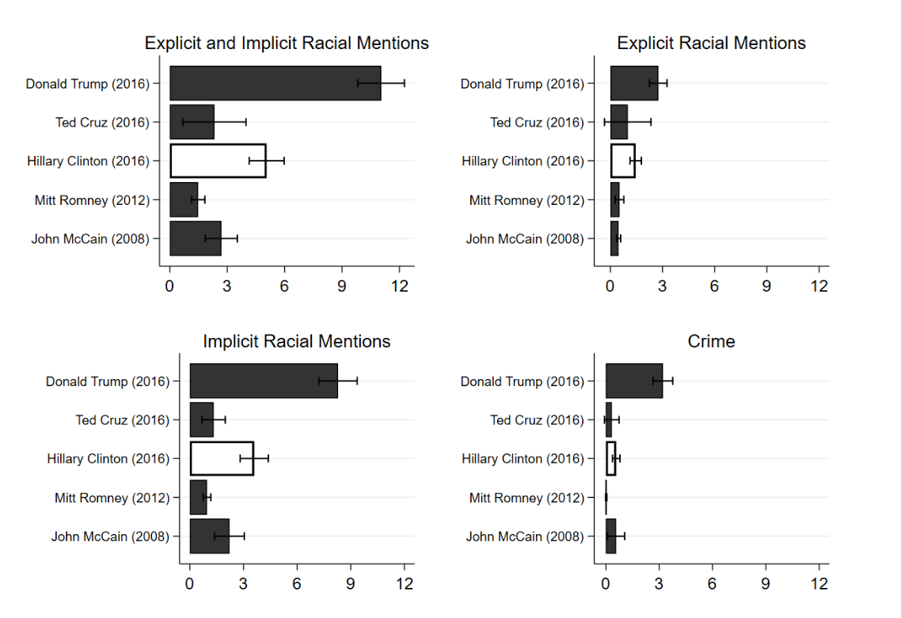

```{r setup, include=FALSE}
knitr::opts_chunk$set(echo = FALSE)
require(haven)
require(data.table)
require(ggplot2)
require(magrittr)
require(ggdag)
require(stringr)
require(ggpubr)
```

# Correlation to Causation

## Solutions to Confounding

1. Recap
2. Differences in Differences

  - What is it?
  - How does it work?
  - Assumptions?
  - Examples

# Recap


## Solutions to Confounding

**Every way** of using correlation as evidence for causality **makes assumptions**

- FPCI cannot be solved without assumptions
- With assumptions, can say confounding/bias is not a problem

---

| Solution | How Bias<br>Solved | Which Bias<br>Removed | Assumes | Internal<br>Validity | External<br>Validity |
|--------------------|------------------------------|------------------------------------------------|---------|----------------------|----------------------|
| Experiment | Randomization<br>Breaks $W \rightarrow X$ link | **All** confounding variables | 1. $X$ is random<br> 2. Change only $X$ | Highest | Lowest | 
| Conditioning | Hold confounders<br>constant | Only variables <br> conditioned on | 1. Condition on all confounders <br> 2. Low measurement error<br> 3. Cases similar in $W$ | Lowest | Highest |
| Before and After | Hold confounders <br> constant | variables <br> unchanging <br> over time | No confounders <br> change w/ $X$ | Lower | Higher | 

## Example: Gun Laws

### **Does easing restrictions on gun laws increase murders committed using guns?**

- Some states in the US require all handgun purchasers to acquire a permit-to-purchase (PTP) license.
- Only persons with a permit may purchase firearms
- In late 2007, Missouri eliminated its PTP requirement

## Example: Gun Laws

[Webster et al (2014)](https://link.springer.com/article/10.1007/s11524-014-9865-8) investigate:

- Did the removal of the PTP law **increase** firearms homicides in Missouri?

>- Conditioning?: Lots of unique features of Missouri; no "otherwise similar" state.
>- Easy comparison is Before and After

---

```{r, echo = F, message=F, warning=F}
guns = fread('./results.csv', integer64 = 'double') %>%
       .[!is.na(Year)] 
guns[, gun_rate := as.numeric(`Age-Adjusted Rate`)]

border = c("Illinois", "Iowa", "Nebraska", "Kansas", "Oklahoma", "Arkansas", "Tennessee", "Kentucky")
guns_use = guns[State %in% c("Missouri", "Arkansas")]
guns_use[, States := ifelse(State %in% border, "Border", "Missouri")]
guns_all = guns_use[, list(gun_rate = mean(gun_rate)), by = list(States, Year)]
#guns_use = guns_use[, list(gun_rate = mean(gun_rate)), by = list(States, Year)]
ggplot(guns_use[Year %in% 2007:2008 & State %in% "Missouri"], aes(x = Year, y = gun_rate)) +
  geom_line() +
  geom_point() +
  geom_vline(xintercept = 2007.5, linetype = 2, colour= 'red') +
  theme_bw() +
  ylim(0,7) +
  scale_x_continuous(breaks=c(2007,2008)) + 
  ylab("Firearms Homicide Rate") +
  ggtitle("Firearms Homicide Rate:", subtitle = "Missouri, before and after PTP repeal")
```

Head to [menti.com](https://www.menti.com) and enter code $8518 \ 3260$

---

<div style='position: relative; padding-bottom: 56.25%; padding-top: 35px; height: 0; overflow: hidden;'><iframe sandbox='allow-scripts allow-same-origin allow-presentation' allowfullscreen='true' allowtransparency='true' frameborder='0' height='315' src='https://www.mentimeter.com/app/presentation/alhc5rjpjqda6zkuwuowhnvgb8hx1e2e/embed' style='position: absolute; top: 0; left: 0; width: 100%; height: 100%;' width='420'></iframe></div>

---

```{r, echo = F, warning = F, message = F}
dagify(murders ~ repeal + unchanging + changing,
      repeal ~ unchanging + changing,
       exposure = "repeal", 
       outcome = 'murders',
       labels = c('repeal' = "(X) PTP\nRepeal", 
                  'murders' = "(Y) Gun Murders",
                  'changing' = 'Changing\nAttributes',
                  'unchanging' = 'Unchanging\nAttributes'
                  )) %>%
  tidy_dagitty(layout='circle') %>%
ggplot(aes(x = x, y = y, xend = xend, yend = yend)) +
  #geom_dag_node() +
  geom_dag_edges_link() +
  geom_dag_text(mapping = aes(label = label), colour = 'black') +
  theme_dag() +
  scale_adjusted()
```

## Example: Gun Laws

Holds all unique, **unchanging** characteristics of Missouri constant...


---

```{r, echo = F, warning = F, message = F}
dagify(murders ~ repeal + unchanging + changing,
      repeal ~ unchanging + changing,
       exposure = "repeal", 
       outcome = 'murders',
       labels = c('repeal' = "(X) PTP\nRepeal", 
                  'murders' = "(Y) Gun Murders",
                  'changing' = 'Changing\nAttributes',
                  'unchanging' = 'Unchanging\nAttributes'
                  )) %>%
  tidy_dagitty(layout='circle') %>%
ggplot(aes(x = x, y = y, xend = xend, yend = yend)) +
  #geom_dag_node() +
  geom_dag_edges_link(mapping = aes(label = c("","","","held constant\n(link broken)", "held constant\n(link broken)", "")),  
                                    angle_calc = "along", label_dodge = unit(c(1,-1,1,-1,-1),'lines'),
                                    edge_linetype = rep(c(1,1,1,2,2), each = 100),
                                    arrow = grid::arrow(length=grid::unit(c(10,10,10,0,0,0), 'pt'), type = 'closed')) +
  geom_dag_text(mapping = aes(label = label), colour = 'black') +
  theme_dag() +
  scale_adjusted()
```

## Example: Gun Laws

But, we have to **assume** that there is nothing else about Missouri that

1. changed around the same time as the PTP repeal
2. and affected Firearms Homicides

No long-term trends, no effects on measurement, no changes in crimes $\to$ PTP repeal

---

```{r, echo = F, message=F, warning=F}

ggplot(guns_use[Year %in% 1999:2012 & State %in% "Missouri"], aes(x = Year, y = gun_rate)) +
  geom_line() +
  geom_point() +
  geom_vline(xintercept = 2007.5, linetype = 2, colour= 'red') +
  theme_bw() +
  ylim(0,7) +
  scale_x_continuous(breaks=c(1999:2012)) + 
  ylab("Firearms Homicide Rate") +
  ggtitle("Firearms Homicide Rate:", subtitle = "Missouri, before and after PTP repeal")
```

Does this plot make it easier/harder to believe PTP repeal caused more murders? (DISCUSS)

## Example: Gun Laws

- Maybe an upward trend in long term?
- Maybe 2006-2007 was aberration, 2008 a return to trend?
- What else happened in 2008?

Could be that **other things were changing between 2007-2008** that confound relationship between PTP and Murders

## Example: Gun Laws

| State | Time   | Murder(Yes) | Murder(No) | Repeal |
|--------|--------|:-------:|:------:|:-----:|
| Missouri | Before | $\color{red}{\text{Murders}_{MO,Before}[\text{Repeal}]}$    | $\color{black}{\text{Murders}_{MO,Before}[\text{No Repeal}]}$  | No    |
|        |        |         |   $\neq\not\Downarrow$     |       |
| Missouri | After  | $\color{black}{\text{Murders}_{MO,After}[\text{Repeal}]}$    |  $\color{red}{\text{Murders}_{MO,After}[\text{No Repeal}]}$ | Yes   |

<br> 

It appears that $\color{red}{\text{Murders}_{MO,After}[\text{No Repeal}]} \neq \\  \color{black}{\text{Murders}_{MO,Before}[\text{No Repeal}]}$

Because other factors **changing murders**, regardless of repeal

## Example: Gun Laws

What can we do to remove confounding from other variables that **change over time**, like...

- weather patterns (hot weather $\to$ murders)
- global financial crises/economic shocks
- political events

>- Another way to put this question is: what would the trend in gun murders in Missouri have been **had there been no PTP repeal**? What was the **counterfactual trend**?

## Example: Gun Laws

We want to compare the **actual trend** in Missouri:

$\begin{equation}\begin{split}\text{Trend}_{MO} ={} & \color{black}{\text{Murders}_{MO,After}[\text{Repeal}]} - \\ & \color{black}{\text{Murders}_{MO,Before}[\text{No Repeal}]}\end{split}\end{equation}$

against the **counterfactual trend** in Missouri:

$\begin{equation}\begin{split}\color{red}{\text{CF Trend}_{MO}} ={} & \color{red}{\text{Murders}_{MO,After}[\text{No Repeal}]} - \\ & \color{black}{\text{Murders}_{MO,Before}[\text{No Repeal}]}\end{split}\end{equation}$

---

$\small{\begin{equation}\begin{split} = {} & \overbrace{\{\text{Murders}_{MO,After}(\text{Repeal}) - \text{Murders}_{MO,Before}(\text{No Repeal})\}}^{\text{Missouri observed trend}} - \\ & \underbrace{\{\color{red}{\text{Murders}_{MO,After}(\text{No Repeal})} - \text{Murders}_{MO,Before}(\text{No Repeal})\}}_{\color{red}{\text{Missouri counterfactual trend}}}\end{split}\end{equation}}$

---

```{r, echo = F, message=F, warning=F}

f_trends = guns_use[Year %in% 2007:2008 & State %in% c("Missouri")] %>% 
  .[, Trend := "Factual"]
cf1_trends = copy(f_trends) %>% 
              .[, State := "Missouri CF 1"] %>%
              .[Year %in% 2008, gun_rate := 4.599769 + 3] %>% 
  .[, Trend := "Counterfactual"]
cf2_trends = copy(f_trends) %>% 
              .[, State := "Missouri CF 2"] %>%
              .[Year %in% 2008, gun_rate := 4.599769 - 3] %>% 
  .[, Trend := "Counterfactual"]
cf3_trends = copy(f_trends) %>% 
              .[, State := "Missouri CF 3"] %>%
              .[Year %in% 2008, gun_rate := 4.599769 ] %>% 
  .[, Trend := "Counterfactual"]
plot_data = rbindlist(list(f_trends, cf1_trends, cf2_trends, cf3_trends))
plot_data[, Trend := factor(Trend, levels = c("Factual", "Counterfactual"))]
effects = data.table(Year = 2008, 
                     start = plot_data$gun_rate[c(4,6,8)],
                     end =  plot_data$gun_rate[2]
                     )

ggplot(data = plot_data, aes(x = Year, y = gun_rate, linetype = Trend, colour = Trend, group = State)) +
  geom_line() +
  geom_point() +
  geom_vline(xintercept = 2007.5, linetype = 2, colour= 'black') +
  theme_bw() +
  ylim(0,8) +
  scale_x_continuous(breaks=c(2007:2008)) + 
  scale_color_manual(values=c("black", "red")) + 
  scale_linetype_manual(values=c("solid", "longdash")) +
  ylab("Firearms Homicide Rate") + 
  ggtitle("Firearms Homicide Rate:", subtitle = "Missouri Trends, factual and counterfactual") + 
  theme(legend.position = 'bottom') + 
  theme(text = element_text(size = 15))  
```

Many possible counterfactual trends...

---

```{r, echo = F, message=F, warning=F}


ggplot(data = plot_data, aes(x = Year, y = gun_rate, linetype = Trend, colour = Trend, group = State)) +
  geom_line() +
  geom_point() +
  geom_vline(xintercept = 2007.5, linetype = 2, colour= 'black') +
  theme_bw() +
  ylim(0,8) +
  scale_x_continuous(breaks=c(2007:2008)) + 
  scale_color_manual(values=c("black", "red")) + 
  scale_linetype_manual(values=c("solid", "longdash")) +
  ylab("Firearms Homicide Rate") +
  geom_segment(data = effects[1], aes(x = Year, 
                   xend = Year, 
                   y = start,
                   yend = end,
                   linetype = NULL,
                   colour = NULL,
                   group = NULL
                   ),
                  show.legend = FALSE,
                  arrow = arrow(length = unit(0.5, "cm")),
               color = c("#F8766D")) + 
  ggtitle("Firearms Homicide Rate:", subtitle = "Missouri Trends, factual and counterfactual") + 
  theme(legend.position = 'bottom') + 
  theme(text = element_text(size = 15))  
```

Which counterfactual is right?

---

```{r, echo = F, message=F, warning=F}


ggplot(data = plot_data, aes(x = Year, y = gun_rate, linetype = Trend, colour = Trend, group = State)) +
  geom_line() +
  geom_point() +
  geom_vline(xintercept = 2007.5, linetype = 2, colour= 'black') +
  theme_bw() +
  ylim(0,8) +
  scale_x_continuous(breaks=c(2007:2008)) + 
  scale_color_manual(values=c("black", "red")) + 
  scale_linetype_manual(values=c("solid", "longdash")) +
  ylab("Firearms Homicide Rate") +
  geom_segment(data = effects[1:2], aes(x = Year, 
                   xend = Year, 
                   y = start,
                   yend = end,
                   linetype = NULL,
                   colour = NULL,
                   group = NULL
                   ),
                  show.legend = FALSE,
                  arrow = arrow(length = unit(0.5, "cm")),
               color = c("#F8766D", '#619CFF')) + 
  ggtitle("Firearms Homicide Rate:", subtitle = "Missouri Trends, factual and counterfactual") + 
  theme(legend.position = 'bottom') + 
  theme(text = element_text(size = 15))  
```

Which counterfactual is right?

## Example: Gun Laws

We can't know the counterfactual trend in Missouri...

but we can observe the trends in **other states** that **did not change** their gun purchasing laws.

>- We can plug in the $\text{factual TREND}$ in an "untreated" case for the $\color{red}{\text{counterfactual TREND}}$ in the "treated" case.

---


Arkansas has a different history that Missouri, so there are differences that are unchanging between them. 

But, if Arkansas experiences same regional economic, political, cultural, weather trends as Missouri, they might have the **same trends over time**.

---

Then, we can plug in

$\small{\begin{equation}\begin{split} = {} & \overbrace{\{\text{Murders}_{MO,After}(\text{Repeal}) - \text{Murders}_{MO,Before}(\text{No Repeal})\}}^{\text{Missouri observed trend}} - \\ & \{\underbrace{\text{Murders}_{AR,After}(\text{No Repeal}) - \text{Murders}_{AR,Before}(\text{No Repeal})\}}_{\text{Arkansas observed trend}}\end{split}\end{equation}}$

---

```{r, echo = F, message=F, warning=F}

ggplot(guns_use[Year %in% 2007:2008 & State %in% c("Missouri", "Arkansas")], aes(x = Year, y = gun_rate, color = State)) +
  geom_line() +
  geom_point() +
  geom_vline(xintercept = 2007.5, linetype = 2, colour= 'red') +
  theme_bw() +
  ylim(0,7) +
  scale_x_continuous(breaks=c(2007:2008)) + 
  ylab("Firearms Homicide Rate") +
  ggtitle("Firearms Homicide Rate:", subtitle = "Missouri and Arkansas, before and after Missouri PTP repeal") + 
  theme(legend.position = 'bottom') + 
  theme(text = element_text(size = 15))  
```

Missouri/Arkansas different in 2007, but if Missouri had same trend (counterfactually) as Arkansas, what would we expect Murders to have done in 2008 w/out the repeal?

---

```{r, echo = F, message=F, warning=F}

p_data = guns_use[Year %in% 2007:2008 & State %in% c("Missouri", "Arkansas"), list(State, Year, gun_rate, Trend = 'Factual')]

cf_data = guns_use[Year %in% 2007:2008 & State %in% c("Missouri", "Arkansas"), list(State, Year, gun_rate, Trend = 'Counterfactual')]
ar_diff = p_data[, gun_rate[2] - gun_rate[1]]
mo_2007 = p_data[, gun_rate[3]]
mo_2008 = p_data[, gun_rate[4]]

cf_data[Year %in% 2008 & State %in% c("Missouri"), gun_rate := mo_2007 + ar_diff]

plot_data = rbind(p_data, cf_data[State %in% "Missouri"])
plot_data[, Trend := factor(Trend, levels = c("Factual", "Counterfactual"))]
ggplot(plot_data, aes(x = Year, y = gun_rate, color = State, linetype = Trend)) +
  geom_line() +
  geom_point() +
  geom_vline(xintercept = 2007.5, linetype = 2, colour= 'black') +
  geom_segment(y = mo_2007 + ar_diff, yend= mo_2008, x = 2008, xend = 2008, colour = 'black', arrow = arrow(length = unit(0.5, "cm")), show.legend = F) +
  theme_bw() +
  ylim(0,7) +
  scale_linetype_manual(values=c("solid", "longdash")) +
  scale_x_continuous(breaks=c(2007:2008)) + 
  ylab("Firearms Homicide Rate") +
  ggtitle("Firearms Homicide Rate:", subtitle = "Missouri and Arkansas, before and after Missouri PTP repeal") + 
  theme(legend.position = 'bottom') + 
  theme(text = element_text(size = 15))  
```

Missouri's counterfactual trend is **parallel** / same as Arkansas's factual trend

---

```{r, echo = F, message=F, warning=F}

p_data = guns_use[Year %in% 2007:2008 & State %in% c("Missouri", "Arkansas"), list(State, Year, gun_rate, Trend = 'Factual')]

cf_data = guns_use[Year %in% 2007:2008 & State %in% c("Missouri", "Arkansas"), list(State, Year, gun_rate, Trend = 'Counterfactual')]
ar_diff = p_data[, gun_rate[2] - gun_rate[1]]
mo_2007 = p_data[, gun_rate[3]]
mo_2008 = p_data[, gun_rate[4]]

cf_data[Year %in% 2008 & State %in% c("Missouri"), gun_rate := mo_2007 + ar_diff]

plot_data = rbind(p_data, cf_data[State %in% "Missouri"])
plot_data[, Trend := factor(Trend, levels = c("Factual", "Counterfactual"))]
ggplot(plot_data, aes(x = Year, y = gun_rate, color = State, linetype = Trend)) +
  geom_line() +
  geom_point() +
  geom_vline(xintercept = 2007.5, linetype = 2, colour= 'black') +
  geom_segment(y = mo_2007 + ar_diff, yend= mo_2008, x = 2008, xend = 2008, colour = 'black', arrow = arrow(length = unit(0.5, "cm")), show.legend = F) +
  theme_bw() +
  ylim(0,7) +
  scale_linetype_manual(values=c("solid", "longdash")) +
  scale_x_continuous(breaks=c(2007:2008)) + 
  ylab("Firearms Homicide Rate") +
  ggtitle("Firearms Homicide Rate:", subtitle = "Missouri and Arkansas, before and after Missouri PTP repeal") + 
  theme(legend.position = 'bottom') + 
  theme(text = element_text(size = 15))  
```

With your neighbors, discuss: Do you believe this is evidence of **causality**? What confounding does this address? What confounding does it not address?

# Difference in Differences

## Design Based Solution:

Like **before and after**, **difference in differences** comparisons are **design** based:

By comparing changes over time in "treated" **and "untreated"** cases:

- hold constant **all unchanging** confounding variables in both treated and untreated cases
- hold constant **all *similarly* changing** confounding variables across treated and untreated cases

Regardless of whether we have thought of those variables, whether we can measure those variables.

## Design: Difference in Differences

**What is it?**

- Compare changes in "treated" cases before and after "treatment" to before and after changes in "untreated" cases

**How does it work?**

- Hold constant **unchanging** attributes of cases (compare same case before and after "treatment")
- Hold constant variables that **change together** over time in both "treated" and "untreated" cases

## Design: Difference in Differences

Why is it called **difference** in **differences**?

$\small{\begin{equation}\begin{split} = {} & \overbrace{\{\text{Murders}_{MO,After}(\text{Repeal}) - \text{Murders}_{MO,Before}(\text{No Repeal})\}}^{\text{Missouri observed trend}} - \\ & \{\underbrace{\text{Murders}_{AR,After}(\text{No Repeal}) - \text{Murders}_{AR,Before}(\text{No Repeal})\}}_{\text{Arkansas observed trend}}\end{split}\end{equation}}$

## Design: Difference in Difference

So:

- $\mathrm{Difference \ 1} = Murders_{After} - Murders_{Before}$ gives us trend in murders in a $State$...
    - holding **unchanging attributes of state** constant (*difference over time*)
- $\mathrm{Difference \ 2} = \mathrm{Difference \ 1}_{Missouri} - \mathrm{Difference \ 1}_{Arkansas}$ gives us change in murders in $Treated$ over time, compared to trend in $Control$
    - holds **changing attributes of both states** constant (*difference in trends*)

## Design: Difference in Difference

|                   | $Murder_{Before}$ | $Murder_{After}$ | **First Difference** |
|-------------------|:--------:|:--------:|:----------------:|
| $\mathrm{Missouri}$         |   $4.6$  |   $6.2$  |       $1.6$      |
| $\mathrm{Arkansas}$         |   $5.6$  |   $5.4$  |       $-0.2$      |
| **Second Difference** |          |          |      $1.8$      |


## Design: Difference in Differences

### **Confounding Solved**...

All confounding variables (affect whether a PTP repealed; affect firearms homicides) that are **unchanging over time** are held constant 

- comparing change over time with-in the same case

All confounding variables that **change the similarly** in "treated" and "untreated" case are held constant.

- By comparing change over time in "treated" to change over time in "control"

---

```{r, echo = F, warning = F, message = F}
dagify(murders ~ repeal + unchanging + sim_changing + diff_changing,
      repeal ~ unchanging + sim_changing + diff_changing,
       exposure = "repeal", 
       outcome = 'murders',
       labels = c('repeal' = "(X) PTP\nRepeal", 
                  'murders' = "(Y) Gun Murders",
                  'sim_changing' = 'Similarly\nChanging\nAttributes',
                  'diff_changing' = "Differently\nChanging\nAttributes",
                  'unchanging' = 'Unchanging\nAttributes'
                  )) %>%
  tidy_dagitty(layout='circle') %>%
ggplot(aes(x = x, y = y, xend = xend, yend = yend)) +
  #geom_dag_node() +
  geom_dag_edges_link(mapping = aes(label = c("","","","held constant\n(link broken)", "held constant\n(link broken)", "held constant\n(link broken)", "held constant\n(link broken)", "")),  
                                    angle_calc = "along", label_dodge = unit(c(1,-1,1,-1,-1),'lines'),
                                    edge_linetype = rep(c(1,1,1,2,2,2,2), each = 100),
                                    arrow = grid::arrow(length=grid::unit(c(10,10,10,0,0,0), 'pt'), type = 'closed')) +
  geom_dag_text(mapping = aes(label = label), colour = 'black') +
  theme_dag() +
  scale_adjusted()
```


## Design: Difference in Differences

In order to infer $X$ causes $Y$ if $X,Y$ correlated in difference-in-differences comparison...

### **Assumption**

- we assume the observed **trend** in $Y$ for "untreated" case is **equal to** the "counterfactual trend" in $Y$ for the "treated" case.
- Equivalently: we assume "treated" and "untreated" have the "parallel trends" in $Y$.
- Equivalently: **no variables** that affect $Y$ and **change over time differently** in "treated" and "untreated" cases

---

```{r, echo = F, message=F, warning=F}

p_data = guns_use[Year %in% 1999:2012 & State %in% c("Missouri", "Arkansas"), list(State, Year, gun_rate, Trend = 'factual')]

cf_data = guns_use[Year %in% 2007:2012 & State %in% c("Missouri"), list(State, Year, gun_rate, Trend = 'counterfactual')]
ar_diff = p_data[, gun_rate[9:14] - gun_rate[9]]
mo_2007 = p_data[, gun_rate[23]]
#mo_post = p_data[, gun_rate[4]]

cf_data[, gun_rate := mo_2007 + ar_diff]

plot_data = rbind(p_data, cf_data[State %in% "Missouri"])
plot_data[, Trend := factor(Trend, levels = c("factual", "counterfactual"))]
ggplot(plot_data, aes(x = Year, y = gun_rate, color = State, linetype = Trend)) +
  geom_line() +
  geom_point() +
  geom_vline(xintercept = 2007.5, linetype = 2, colour= 'red') +
  theme_bw() +
  ylim(0,7) +
  scale_x_continuous(breaks=c(1999:2012)) + 
  ylab("Firearms Homicide Rate") +
  ggtitle("Firearms Homicide Rate:", subtitle = "Missouri and Arkansas, before and after Missouri PTP repeal") + 
  theme(legend.position = 'bottom')
```

Do you believe assumption of parallel trends?

## Design: Difference in Differences

### **Confounding UNSolved**...

- Arkansas and Missouri murder rates mostly move together before 2007. 
- But large change in AR in 2001/2002 not in MO
- But in 2007, before law took effect, murders dipped

<br>

Perhaps there is some things that affect murder rates that change differently in these two states.

## Design: Difference in Differences

When is the assumption plausible?

- We can check to see if cases share trends **before** treatment, but does not prove they would have shared trends **after** treatment
- We should compare cases that experience many similar changes over time: comparing Missouri to British Columbia may not be helpful.

---

| Solution | How Bias<br>Solved | Which Bias<br>Removed | Assumes | Internal<br>Validity | External<br>Validity |
|--------------------|------------------------------|------------------------------------------------|---------|----------------------|----------------------|
| Experiment | Randomization<br>Breaks $W \rightarrow X$ link | **All** confounding variables | 1. $X$ is random<br> 2. Change only $X$ | Highest | Lowest | 
| Conditioning | Hold confounders<br>constant | Only variables <br> conditioned on | see above  | Lowest | Highest |
| Before and After | Hold confounders <br> constant | variables <br> unchanging <br> over time | No confounders <br> change w/ $X$ | Lower | Higher | 
| Diff in Diff | Hold confounders <br> constant | unchanging and <br> similarly changing | Parallel trends /<br> no differently <br> changing | Higher | Lower | 

# Application

## Trump Rallies and Police Bias

[Grosjean et al (2023)](https://doi.org/10.1093/qje/qjac037) investigate:

Did Trump's messaging at rallies affect police discrimination against racial minorities?

---




## Trump Rallies and Police Bias

Data:

- ~35 million police stops between 2015-2017 in 1474 counties, including race of person stopped
  - racial bias measured as different rate of stopping racial minorities vs whites
- Campaign rally location and dates


## Trump Rallies and Police Bias {.build}

**What might be some confounding variables if we just compared police bias in counties with rallies vs. no rallies?**

**What might be some confounding variables if we just compared police bias in counties before and after rallies?**

## Trump Rallies and Police Bias 

Authors can solve these problem using a **difference-in-differences**:

- were the changes in police discrimination **greater** in places with **Trump Rallies** ("treated") than in places without **without Rallies** ("untreated")

## Trump Rallies and Police Bias 


Comparing $\text{Rallies} - \text{No Rallies}$


## Trump Rallies and Police Bias 

- Can't be confounding due to unchanging differences b/t places visited/not visited by Trump
- Can't be confounding due to changing national events (compare rally/no rally places on the same dates)
- Can't be confounding due to changing behavior of minorities (show no changes)

With reasonable assumptions (no different trends over a few weeks in places with rallies and without rallies), rallies cause police discrimination.